# Nebula Measurement Results Calendar Week 42

## General Information

The measurements were conducted on the following machine:

- `vCPU` - `4`
- `RAM` - `8GB`
- `Disk` - `160GB`
- `Datacenter` - `nbg1-dc3`
- `Country` - `Germany`
- `City` - `Nuremberg`

The following results show measurement data that was collected in calendar week 42 from 2021-10-18 to 2021-10-25 in 2021.

- Number of crawls `336`
- Number of visits `8,532,595` ([what is a visit?](#terminology))
- Number of unique peer IDs visited `59,083`
- Number of unique IP addresses found `128,620`

Timestamps are in UTC if not mentioned otherwise.

### Agent Versions

Newly discovered agent versions:

- `go-ipfs/0.10.0/b5b5f09b6-dirty` (2021-10-17 23:32:14)
- `go-ipfs/0.9.1/d841f42bb` (2021-10-18 10:01:34)
- `go-open-p2p` (2021-10-18 13:04:45)
- `RendezvousRAT/server` (2021-10-19 11:31:46)
- `go-ipfs/0.9.1/1b6fb661c` (2021-10-20 07:30:56)
- `go-ipfs/0.11.0-dev/5a61bed` (2021-10-20 17:01:03)
- `go-ipfs/0.11.0-dev/5a61bedef` (2021-10-21 10:32:45)
- `github.com/adlrocha/ipfs-lite` (2021-10-22 21:00:10)
- `go-ipfs/0.11.0-dev/23442df` (2021-10-23 11:03:07)

### Protocols

Newly discovered protocols:

- `/lilu.red/op/1/text` (2021-10-18 13:04:45)
- `/lilu.red/op/1/file` (2021-10-18 13:04:45)

### Classification

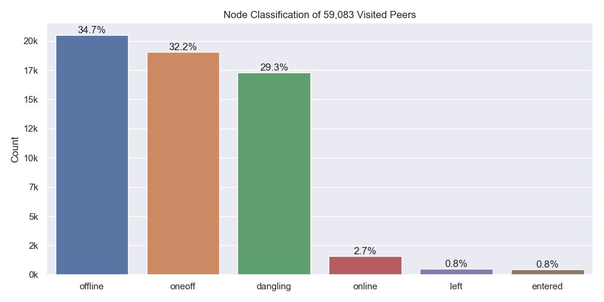

Node classification:

- `offline` - A peer that was never seen online during the measurement period (always offline) but found in the DHT
- `dangling` - A peer that was seen going offline and online multiple times during the measurement period
- `oneoff` - A peer that was seen coming online and then going offline **only once** during the measurement period
- `online` - A peer that was not seen offline at all during the measurement period (always online)
- `left` - A peer that was online at the beginning of the measurement period, did go offline and didn't come back online
- `entered` - A peer that was offline at the beginning of the measurement period but appeared within and didn't go offline since then

### Top 10 Rotating Hosts

| IP-Address     | Country | Unique Peer IDs | Agent Versions                                  |
| :------------- | :------ | --------------: | :---------------------------------------------- |
| 165.227.24.133 | US      |            5340 | ['hydra-booster/0.7.4', None]                   |
| 82.165.18.239  | DE      |            1609 | ['go-ipfs/0.4.22/', None]                       |
| 159.65.71.229  | US      |             400 | [None]                                          |
| 138.197.207.75 | US      |             301 | [None]                                          |
| 159.65.110.234 | US      |             300 | [None]                                          |
| 159.65.108.245 | US      |             300 | [None]                                          |
| 159.203.76.161 | US      |             274 | ['github.com/ipfs-shipyard/ipfs-counter', None] |
| 138.68.47.189  | US      |             200 | [None]                                          |
| 138.68.45.10   | US      |             200 | [None]                                          |
| 116.202.229.43 | DE      |             195 | ['hydra-booster/0.7.4', None]                   |

### Crawl Time Series

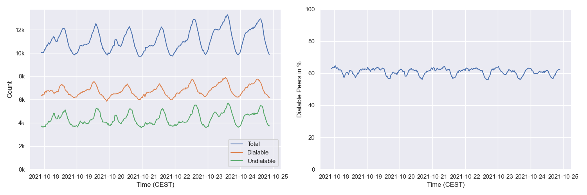

#### By Agent Version (selection)

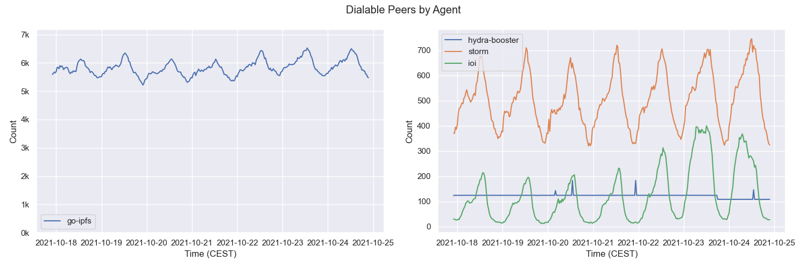

## Churn

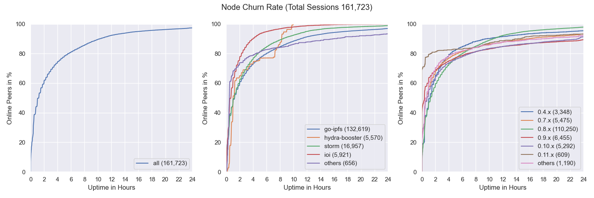

## Inter Arrival Time

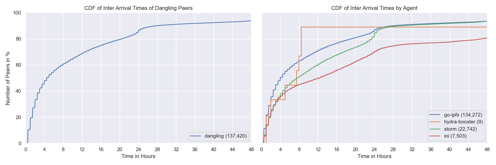

## Agent Version Analysis

### Overall

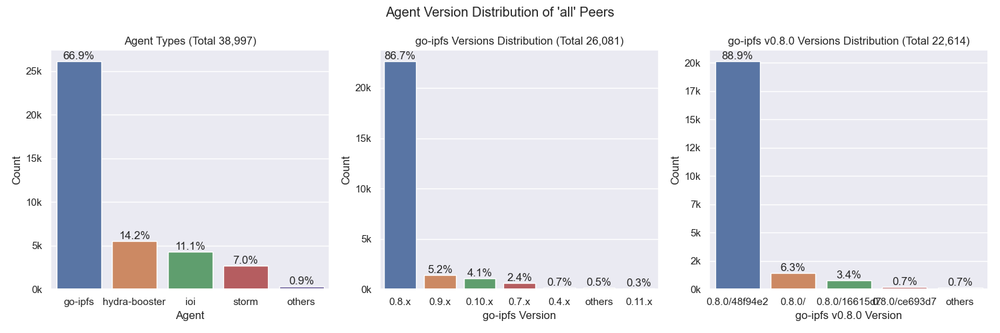

Includes all peers that the crawler was able to connect to at least once (`dangling`, `online`, `oneoff`, `entered`)

### Dangling Nodes Only

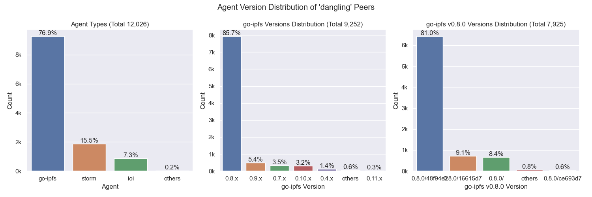

Includes all peers that were seen going offline and online multiple times during the measurement.

### Online Nodes Only

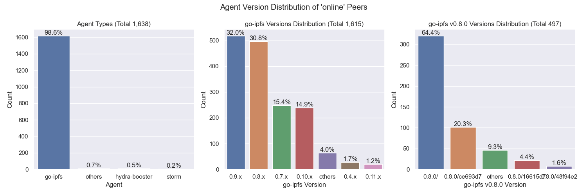

Includes all peers that were not seen offline at all during the measurement period (always online).

### Oneoff Nodes Only

Includes all peers that were seen coming online and then going offline **only once** during the measurement period

### Entered Nodes Only

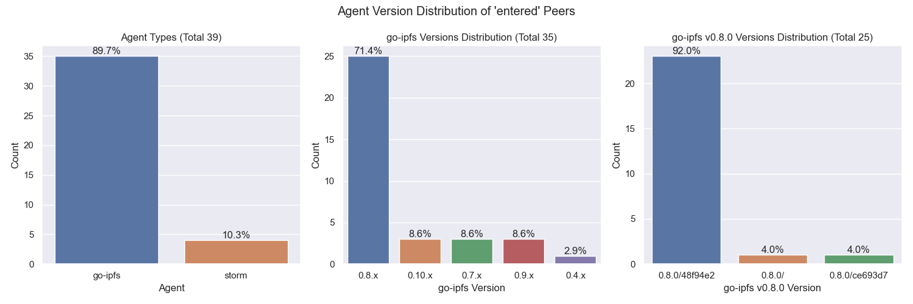

Includes all peers that were offline at the beginning of the measurement period but appeared within and didn't go offline since then.

## Geo location

### Resolution Statistics

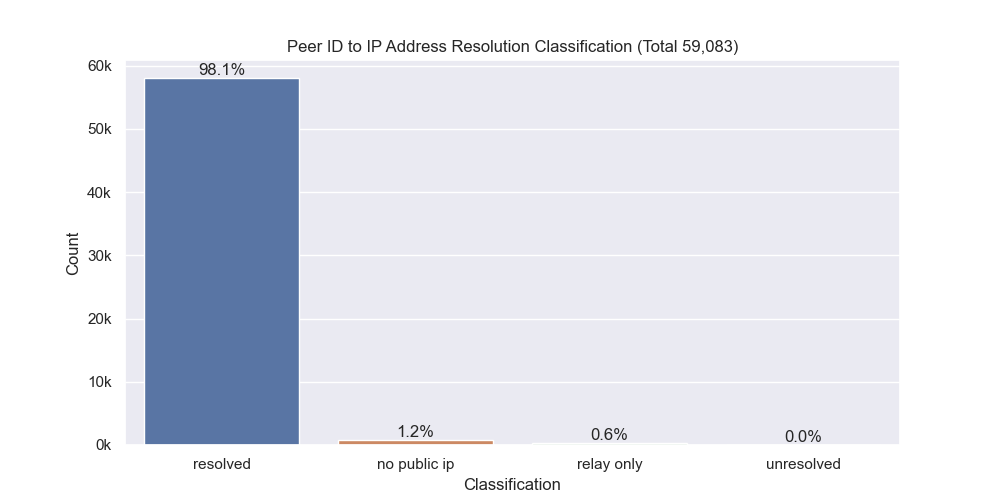

Resolution Classification:

- `resolved` - The number of peer IDs that could be resolved to at least one IP address (excludes peers that are only reachable via circuit-relays)
- `unresolved` - The number of peer IDs that could not or just were not yet resolved to at least one IP address
- `no public ip` - The number of peer IDs that were found in the DHT but didn't have a public IP address
- `relay` - The number of peer IDs that were only reachable by circuit relays

### Unique IP Addresses

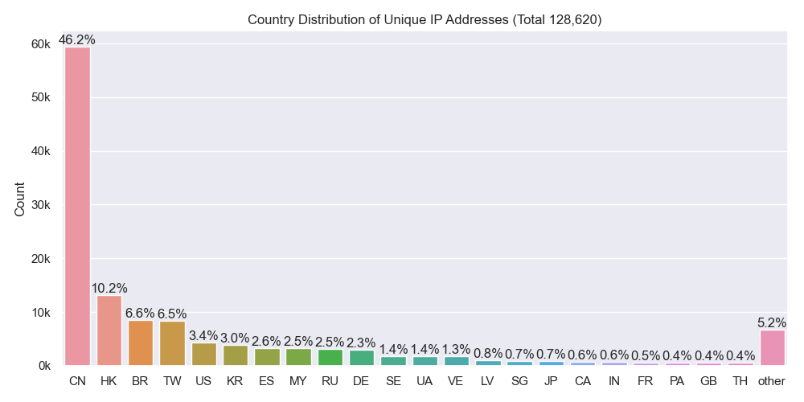

### Classification

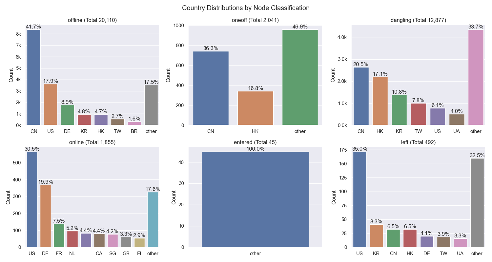

### Agents

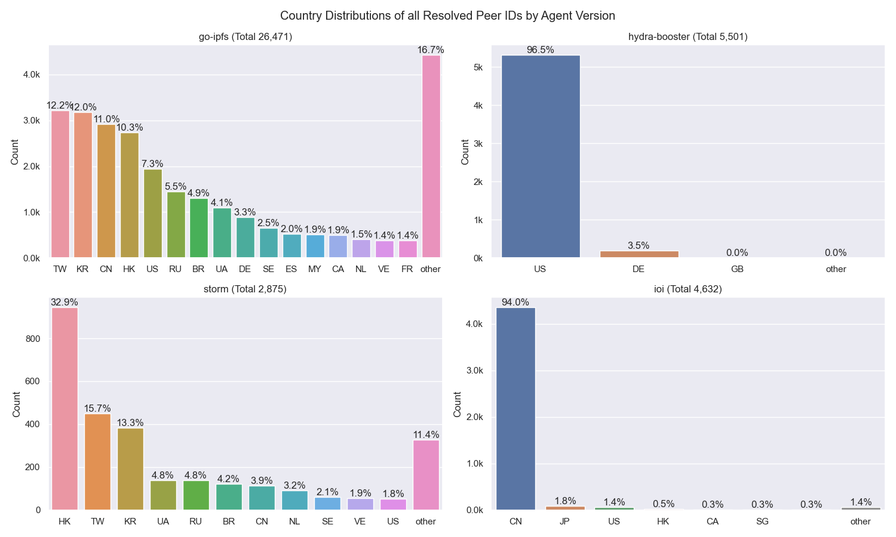

## Latencies

### Overall

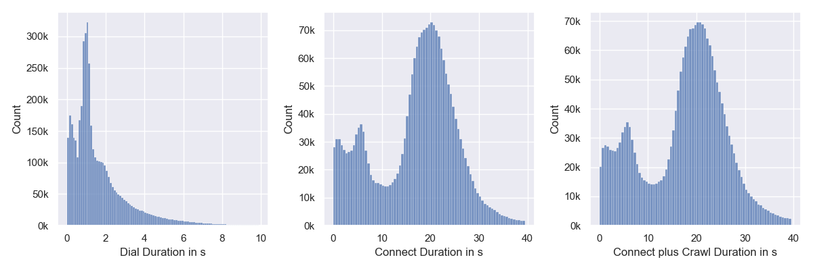

`Connect` measures the time it takes for the `libp2p` `host.Connect` call to return.

`Connect plus Crawl` includes the time of dialing, connecting and crawling the peer. `Crawling` means the time it takes for the FIND_NODE RPCs to resolve. Nebula is sending 15 of those with increasing common prefix lengths (CPLs) to the remote peer in parallel. 

### By Continent

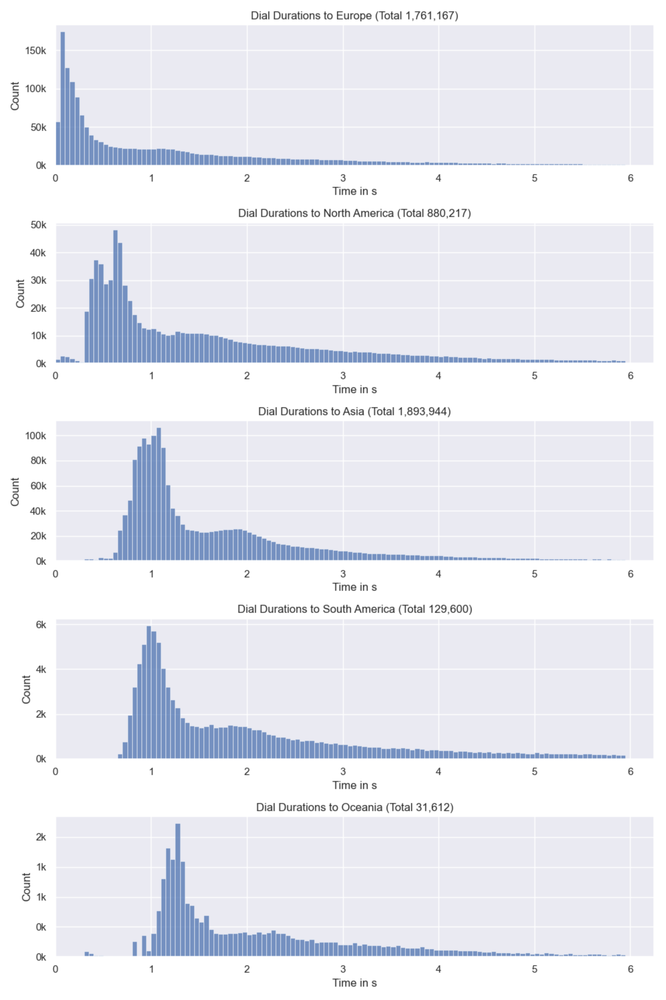

## Cloud

The number next to `Total` indicates the number of unique IP addresses that went into this calculation.

### All

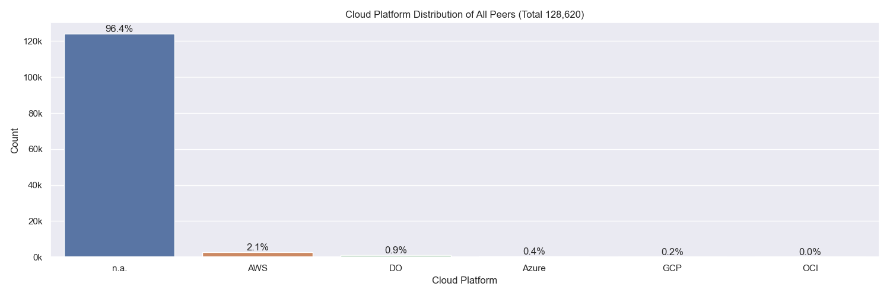

### Classification

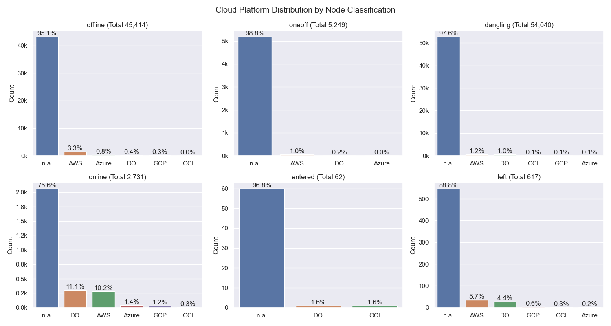

### Agents

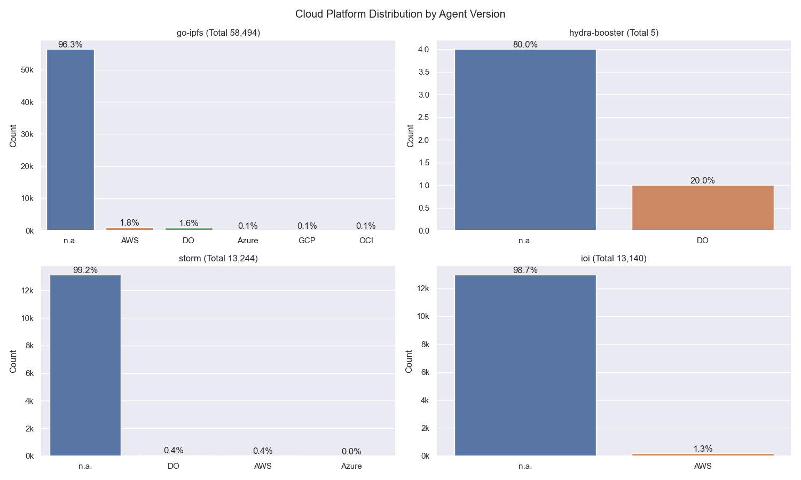

## Top Updating Peers

| Peer ID               | Final AV                     | # Transitions | Distinct AVs                                         | # Distinct AVs |
| :-------------------- | :--------------------------- | ------------- | :--------------------------------------------------- | -------------- |
| `12D3KooWQcDBKQcu...` | `go-ipfs/0.9.1/`             | 176           | go-ipfs/0.8.0/ go-ipfs/0.9.1/                    | 2              |
| `12D3KooWK6aUYpst...` | `go-ipfs/0.7.0/`             | 147           | go-ipfs/0.7.0/ go-ipfs/0.8.0/                    | 2              |
| `12D3KooWP8Kn2f8J...` | `go-ipfs/0.8.0-rc2/`         | 130           | go-ipfs/0.8.0/ go-ipfs/0.8.0-rc2/                | 2              |
| `12D3KooWHy8L7J7W...` | `go-ipfs/0.11.0-dev/5a61bed` | 120           | go-ipfs/0.11.0-dev/65d570c go-ipfs/0.9.1/dc2715a | 2              |
| `12D3KooWDCimcERh...` | `go-ipfs/0.8.0/`             | 109           | go-ipfs/0.8.0/ go-ipfs/0.9.1/                    | 2              |
| `12D3KooWNgxATDv4...` | `go-ipfs/0.10.0/`            | 101           | go-ipfs/0.10.0/ go-ipfs/0.8.0/                   | 2              |
| `12D3KooWBTPdtYzR...` | `go-ipfs/0.8.0-rc2/`         | 54            | go-ipfs/0.8.0/ go-ipfs/0.8.0-rc2/                | 2              |
| `12D3KooWJyhcTeMd...` | `go-ipfs/0.10.0/64b532f`     | 8             | go-ipfs/0.10.0/64b532f go-ipfs/0.8.0-rc1/02d15ac | 2              |
| `12D3KooWAuvjpgxA...` | `go-ipfs/0.9.1/`             | 6             | go-ipfs/0.8.0/ go-ipfs/0.9.1/                    | 2              |
| `12D3KooWK9UTmMz5...` | `go-ipfs/0.9.1/`             | 2             | go-ipfs/0.10.0/ go-ipfs/0.9.1/                   | 2              |

> `AV` = `Agent Version`
 
- `# Final AV` - The last agent version that was observed in this measurement period
- `# Transitions` - How often did this particular peer change its agent version
- `Distinct AVs` - Distinct agent version that this peer transitioned between (could have had a single AV multiple times)

## Terminology

- `visit` - Visiting a peer means dialing or connecting to it. Every time the crawler or monitoring task tries to dial or connect to a peer we consider this as _visiting_ it. Regardless of errors that may occur. 

### Node classification:

- `offline` - A peer that was never seen online during the measurement period (always offline) but found in the DHT
- `dangling` - A peer that was seen going offline and online multiple times during the measurement period
- `oneoff` - A peer that was seen coming online and then going offline only once during the measurement period multiple times
- `online` - A peer that was not seen offline at all during the measurement period (always online)
- `left` - A peer that was online at the beginning of the measurement period, did go offline and didn't come back online
- `entered` - A peer that was offline at the beginning of the measurement period but appeared within and didn't go offline since then

### IP Resolution Classification:

- `resolved` - The number of peer IDs that could be resolved to at least one IP address (excludes peers that are only reachable by circuit-relays)
- `unresolved` - The number of peer IDs that could not or just were not yet resolved to at least one IP address
- `no public ip` - The number of peer IDs that were found in the DHT but didn't have a public IP address
- `relay` - The number of peer IDs that were only reachable by circuit relays

### Cloud Providers

- `AWS` - Amazon Web Services
- `GCP` - Google Cloud Platform
- `Azure` - Microsoft Azure
- `DO` - Digital Ocean
- `OCI` - Oracle Cloud Infrastructure