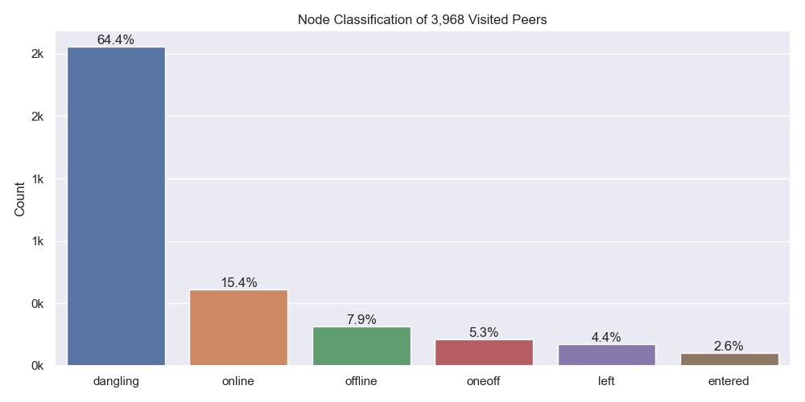
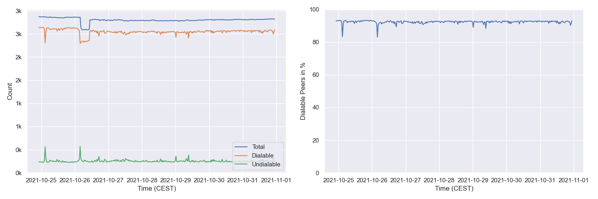
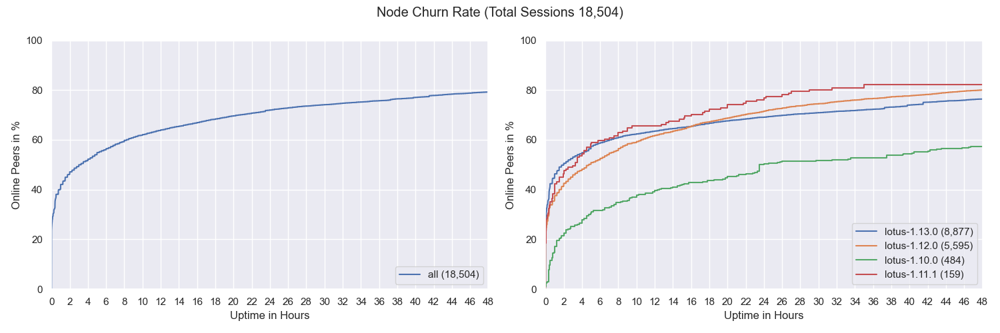
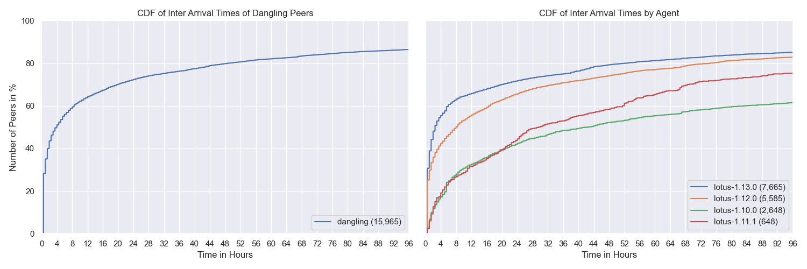
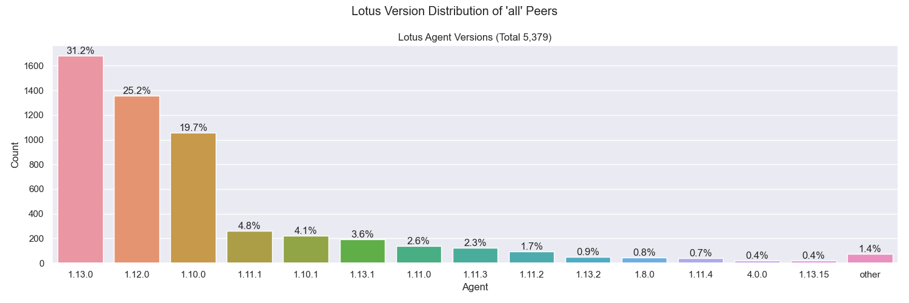
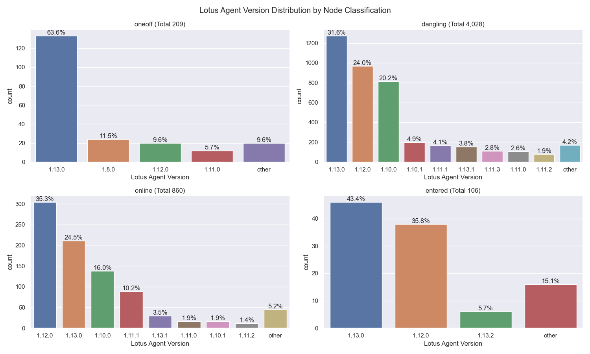
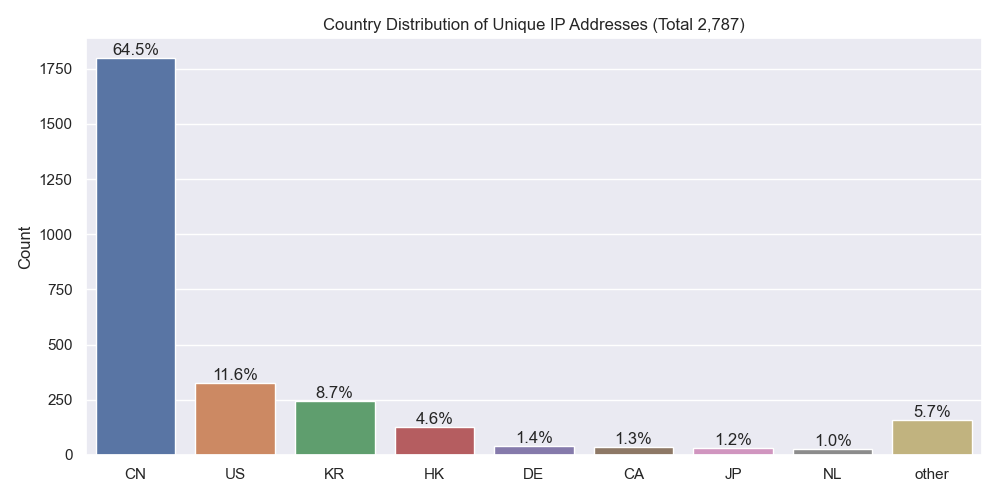
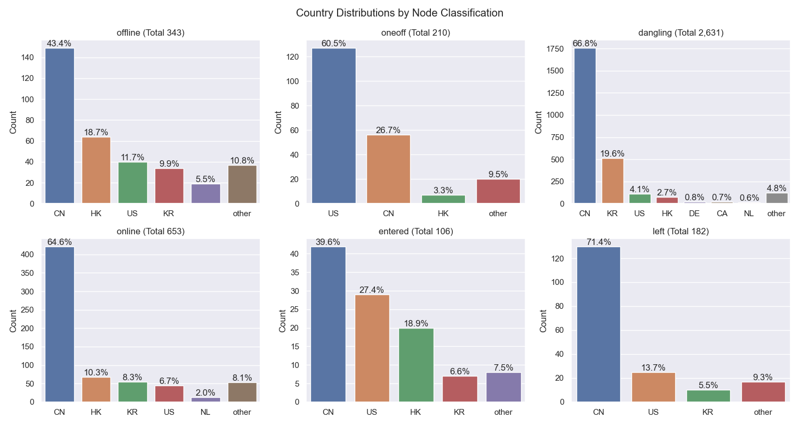
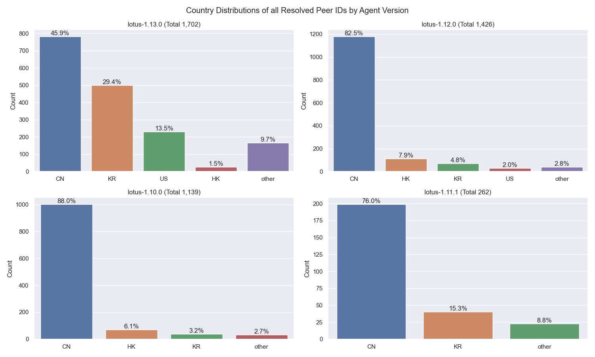
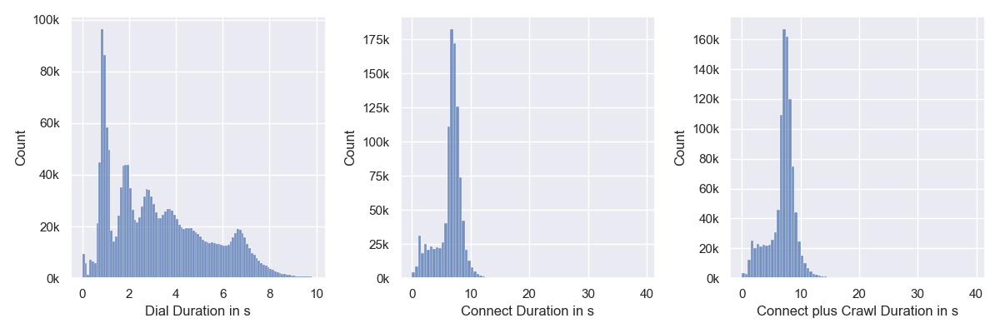

# Nebula Measurement Results Calendar Week 42

## General Information

The measurements were conducted on the following machine:

- `vCPU` - `4`
- `RAM` - `8GB`
- `Disk` - `160GB`
- `Datacenter` - `nbg1-dc3`
- `Country` - `Germany`
- `City` - `Nuremberg`

The following results show measurement data that was collected in calendar week 42 from 2021-10-18 to 2021-10-25 in 2021.

- Number of crawls `338`
- Number of visits `2,917,838` ([what is a visit?](#terminology))
- Number of unique peer IDs visited `3,968`
- Number of unique IP addresses found `2,787`

Timestamps are in UTC if not mentioned otherwise.

### Classification

Node classification:

- `offline` - A peer that was never seen online during the measurement period (always offline) but found in the DHT
- `dangling` - A peer that was seen going offline and online multiple times during the measurement period
- `oneoff` - A peer that was seen coming online and then going offline **only once** during the measurement period
- `online` - A peer that was not seen offline at all during the measurement period (always online)
- `left` - A peer that was online at the beginning of the measurement period, did go offline and didn't come back online
- `entered` - A peer that was offline at the beginning of the measurement period but appeared within and didn't go offline since then

### Crawl Time Series

## Churn

## Inter Arrival Time

## Agent Version Analysis

### Overall

Includes all peers that the crawler was able to connect to at least once (`dangling`, `online`, `oneoff`, `entered`)

### Classification

## Geo location

Resolution Classification:

- `resolved` - The number of peer IDs that could be resolved to at least one IP address (excludes peers that are only reachable via circuit-relays)
- `unresolved` - The number of peer IDs that could not or just were not yet resolved to at least one IP address
- `no public ip` - The number of peer IDs that were found in the DHT but didn't have a public IP address
- `relay` - The number of peer IDs that were only reachable by circuit relays

### Unique IP Addresses

### Classification

### Agents

## Latencies

### Overall

`Connect` measures the time it takes for the `libp2p` `host.Connect` call to return.

`Connect plus Crawl` includes the time of dialing, connecting and crawling the peer. `Crawling` means the time it takes for the FIND_NODE RPCs to resolve. Nebula is sending 15 of those with increasing common prefix lengths (CPLs) to the remote peer in parallel. 

### By Continent

## Terminology

- `visit` - Visiting a peer means dialing or connecting to it. Every time the crawler or monitoring task tries to dial or connect to a peer we consider this as _visiting_ it. Regardless of errors that may occur. 

### Node classification:

- `offline` - A peer that was never seen online during the measurement period (always offline) but found in the DHT
- `dangling` - A peer that was seen going offline and online multiple times during the measurement period
- `oneoff` - A peer that was seen coming online and then going offline only once during the measurement period multiple times
- `online` - A peer that was not seen offline at all during the measurement period (always online)
- `left` - A peer that was online at the beginning of the measurement period, did go offline and didn't come back online
- `entered` - A peer that was offline at the beginning of the measurement period but appeared within and didn't go offline since then

### IP Resolution Classification:

- `resolved` - The number of peer IDs that could be resolved to at least one IP address (excludes peers that are only reachable by circuit-relays)
- `unresolved` - The number of peer IDs that could not or just were not yet resolved to at least one IP address
- `no public ip` - The number of peer IDs that were found in the DHT but didn't have a public IP address
- `relay` - The number of peer IDs that were only reachable by circuit relays
