# Nebula Measurement Results Calendar Week 43

## General Information

The measurements were conducted on the following machine:

- `vCPU` - `4`
- `RAM` - `8GB`
- `Disk` - `160GB`
- `Datacenter` - `nbg1-dc3`
- `Country` - `Germany`
- `City` - `Nuremberg`

The following results show measurement data that was collected in calendar week 43 from 2021-10-25 to 2021-11-01 in 2021.

- Number of crawls `338`
- Number of visits `8,532,612` ([what is a visit?](#terminology))
- Number of unique peer IDs visited `58,642`
- Number of unique IP addresses found `128,614`

Timestamps are in UTC if not mentioned otherwise.

### Agent Versions

Newly discovered agent versions:

- `go-ipfs/0.9.1/08e91a280` (2021-10-25 10:32:00)
- `go-ipfs/0.11.0-dev/6d2ad699f-dirty` (2021-10-25 19:03:09)
- `go-ipfs/0.9.1/6add14d3b` (2021-10-26 04:30:58)
- `go-ipfs/0.9.1/fc8611a3d` (2021-10-26 05:01:48)
- `go-ipfs/0.9.1/8b58a166b` (2021-10-26 07:01:25)
- `go-ipfs/0.9.1/eb11dc846` (2021-10-26 08:01:17)
- `go-ipfs/0.11.0-dev/5a61bedef-dirty` (2021-10-26 10:04:00)
- `go-ipfs/0.9.1/048190b96` (2021-10-26 10:32:03)
- `go-ipfs/0.6.0-rc7/` (2021-10-26 12:32:11)
- `go-ipfs/0.11.0-dev/acede6f` (2021-10-26 16:30:13)
- `go-ipfs/0.11.0-dev/9e8b6e5b5` (2021-10-27 01:01:43)
- `go-ipfs/0.11.0-dev/3e43745` (2021-10-27 02:01:50)
- `go-ipfs/0.9.1/2879aa487` (2021-10-27 02:30:48)
- `go-ipfs/0.9.1/5cecd5e49` (2021-10-27 03:00:28)
- `go-ipfs/0.9.1/dbb36c778` (2021-10-27 03:30:47)
- `go-ipfs/0.9.1/3096bfafe` (2021-10-27 04:32:32)
- `go-ipfs/0.11.0-dev/3e4374559` (2021-10-27 11:30:30)
- `bootstrap` (2021-10-29 06:31:30)
- `go-ipfs/0.11.0-dev/3e4374559-dirty` (2021-10-29 08:31:06)
- `github.com/ethereum/go-ethereum` (2021-10-29 18:04:28)
- `go-ipfs/0.11.0-dev/52a7477` (2021-10-29 18:30:06)
- `go-ipfs/0.11.0-dev/7605b0de7` (2021-10-29 20:30:19)
- `go-ipfs/0.11.0-dev/52a747763` (2021-10-30 03:01:34)
- `go-ipfs/0.11.0-dev/52a747763-dirty` (2021-10-31 15:00:09)

### Protocols

Newly discovered protocols:

- `/protonet.live/msg-contact/0.0.1` (2021-10-26 23:33:44)
- `/protonet.live/msg-action-server/0.0.1` (2021-10-26 23:33:44)
- `/protonet.live/msg-live-contact/0.0.1` (2021-10-26 23:33:44)
- `/protonet.live/msg-action-contact/0.0.1` (2021-10-26 23:33:44)
- `/ipfsSyncGossipSub/1.0.0` (2021-10-27 01:32:47)
- `/protonet.live/msg-webrtc-client/0.0.1` (2021-10-29 22:31:46)
- `/protonet.live/msg-webrtc-server/0.0.1` (2021-10-29 22:31:46)

### Classification

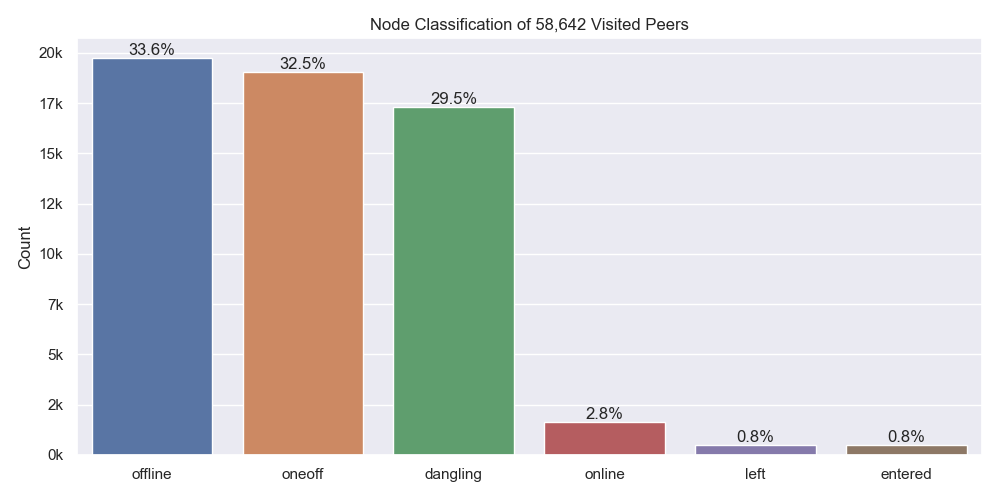

Node classification:

- `offline` - A peer that was never seen online during the measurement period (always offline) but found in the DHT
- `dangling` - A peer that was seen going offline and online multiple times during the measurement period
- `oneoff` - A peer that was seen coming online and then going offline **only once** during the measurement period
- `online` - A peer that was not seen offline at all during the measurement period (always online)
- `left` - A peer that was online at the beginning of the measurement period, did go offline and didn't come back online
- `entered` - A peer that was offline at the beginning of the measurement period but appeared within and didn't go offline since then

### Top 10 Rotating Hosts

| IP-Address     | Country | Unique Peer IDs | Agent Versions                                  |
| :------------- | :------ | --------------: | :---------------------------------------------- |
| 165.227.24.133 | US      |            5557 | ['hydra-booster/0.7.4', None]                   |
| 82.165.18.239  | DE      |            1399 | ['go-ipfs/0.4.22/', None]                       |
| 159.65.71.229  | US      |             708 | [None]                                          |
| 167.99.160.76  | US      |             300 | [None]                                          |
| 159.65.110.234 | US      |             300 | [None]                                          |
| 159.203.76.161 | US      |             273 | ['github.com/ipfs-shipyard/ipfs-counter', None] |
| 138.68.47.189  | US      |             203 | [None]                                          |
| 138.68.45.10   | US      |             202 | [None]                                          |
| 138.197.207.75 | US      |             105 | [None]                                          |
| 159.65.108.245 | US      |             101 | [None]                                          |

### Crawl Time Series

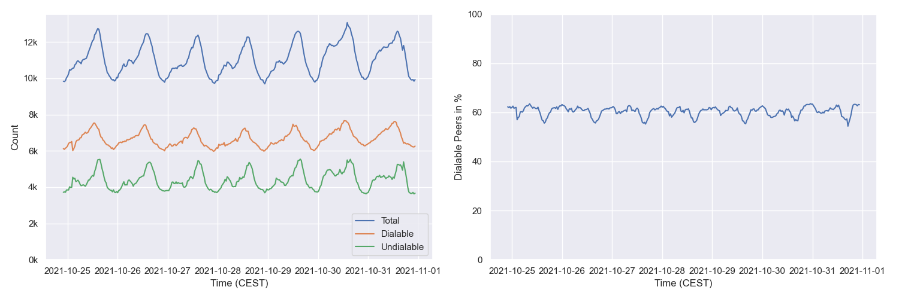

#### By Agent Version (selection)

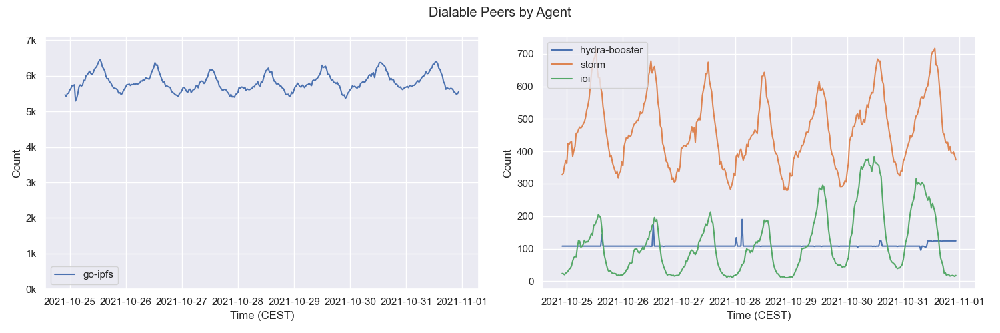

## Churn

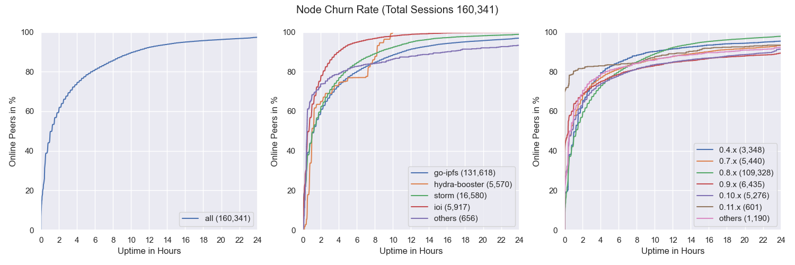

## Inter Arrival Time

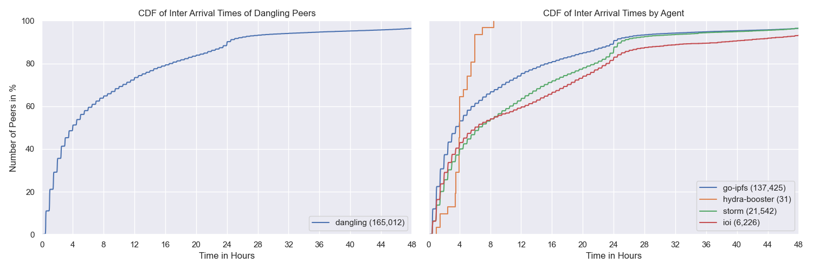

## Agent Version Analysis

### Overall

Includes all peers that the crawler was able to connect to at least once (`dangling`, `online`, `oneoff`, `entered`)

### Dangling Nodes Only

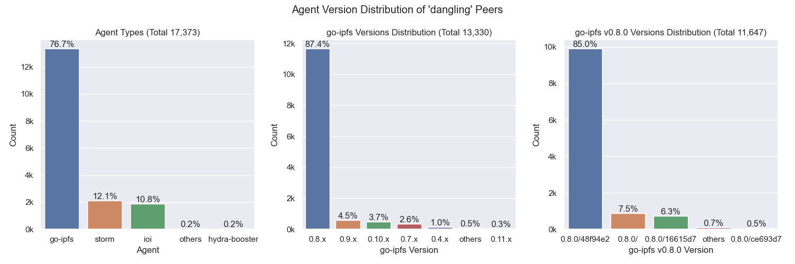

Includes all peers that were seen going offline and online multiple times during the measurement.

### Online Nodes Only

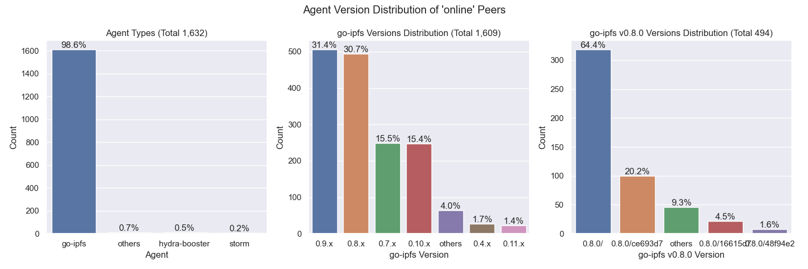

Includes all peers that were not seen offline at all during the measurement period (always online).

### Oneoff Nodes Only

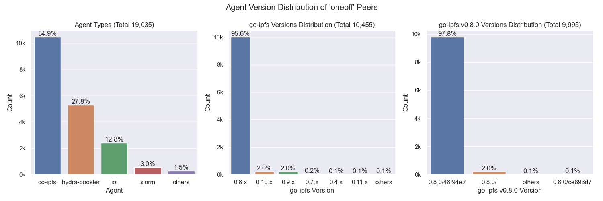

Includes all peers that were seen coming online and then going offline **only once** during the measurement period

### Entered Nodes Only

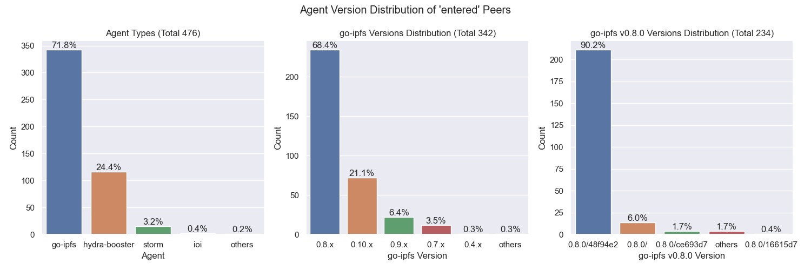

Includes all peers that were offline at the beginning of the measurement period but appeared within and didn't go offline since then.

## Geo location

### Resolution Statistics

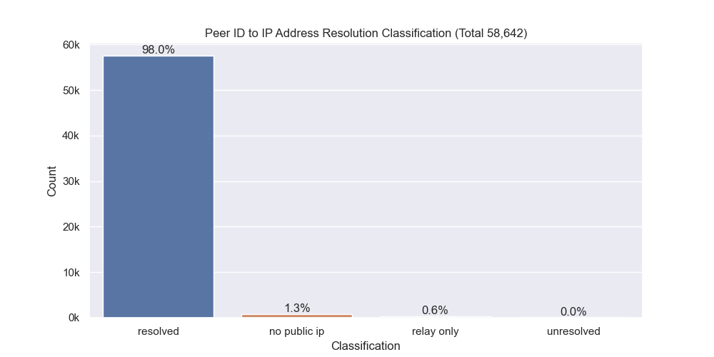

Resolution Classification:

- `resolved` - The number of peer IDs that could be resolved to at least one IP address (excludes peers that are only reachable via circuit-relays)
- `unresolved` - The number of peer IDs that could not or just were not yet resolved to at least one IP address
- `no public ip` - The number of peer IDs that were found in the DHT but didn't have a public IP address
- `relay` - The number of peer IDs that were only reachable by circuit relays

### Unique IP Addresses

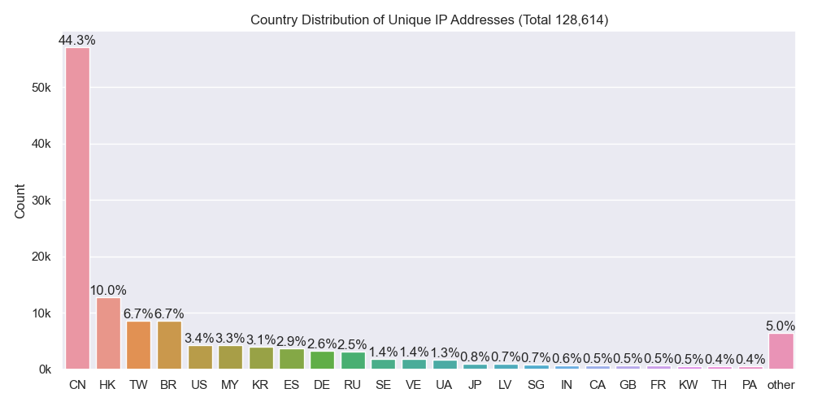

### Classification

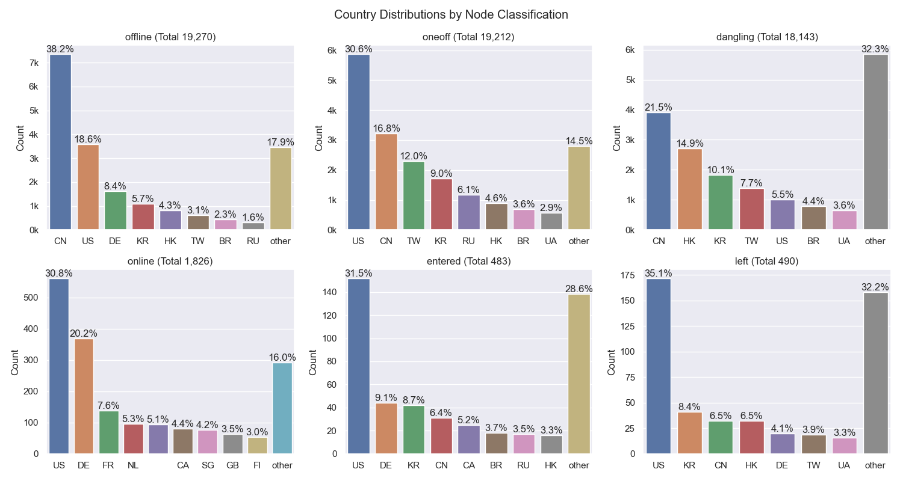

### Agents

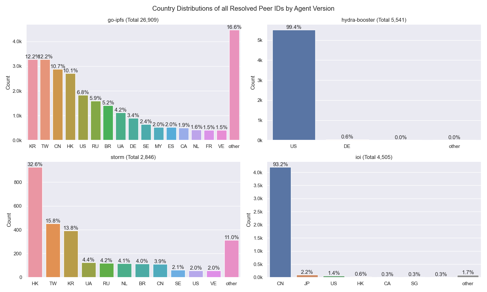

## Latencies

### Overall

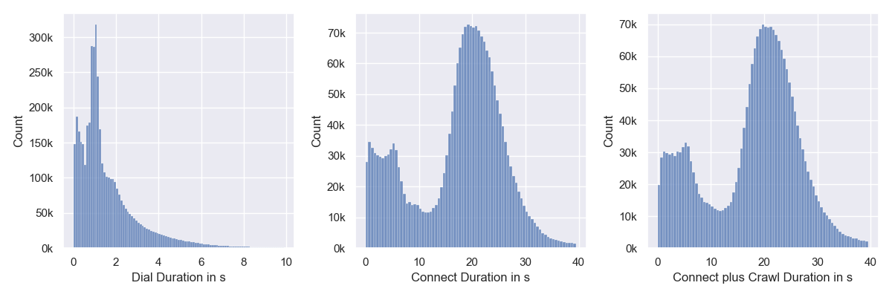

`Connect` measures the time it takes for the `libp2p` `host.Connect` call to return.

`Connect plus Crawl` includes the time of dialing, connecting and crawling the peer. `Crawling` means the time it takes for the FIND_NODE RPCs to resolve. Nebula is sending 15 of those with increasing common prefix lengths (CPLs) to the remote peer in parallel. 

### By Continent

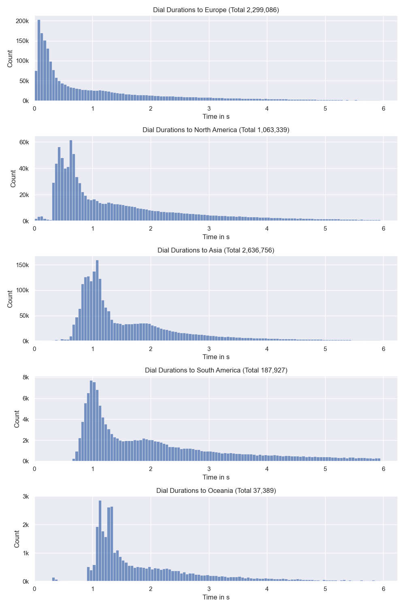

## Cloud

The number next to `Total` indicates the number of unique IP addresses that went into this calculation.

### All

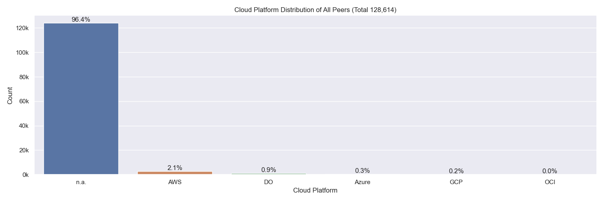

### Classification

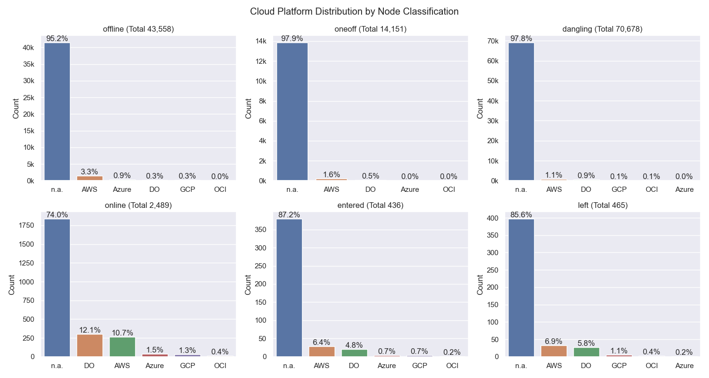

### Agents

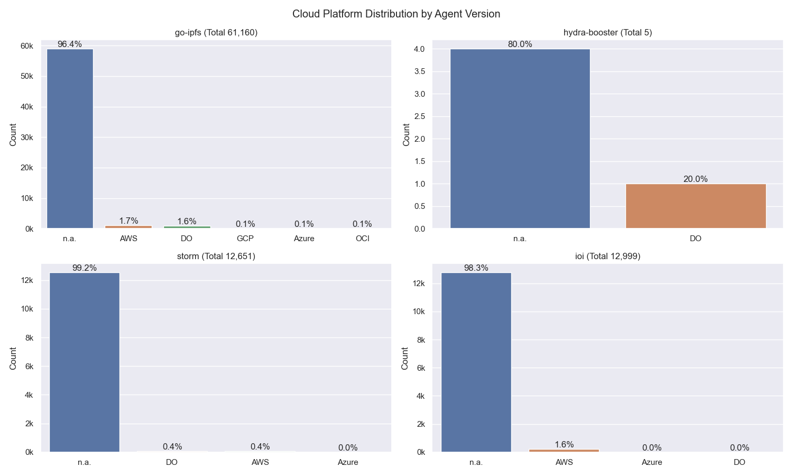

## Top Updating Peers

| Peer ID               | Final AV                  | # Transitions | Distinct AVs                                                                                                                                                                                                                                                                        | # Distinct AVs |
| :-------------------- | :------------------------ | ------------- | :---------------------------------------------------------------------------------------------------------------------------------------------------------------------------------------------------------------------------------------------------------------------------------- | -------------- |
| `12D3KooWHy8L7J7W...` | `go-ipfs/0.9.1/dc2715a`   | 151           | go-ipfs/0.11.0-dev/5a61bed go-ipfs/0.11.0-dev/65d570c go-ipfs/0.9.1/dc2715a                                                                                                                                                                                                 | 3              |
| `12D3KooWQcDBKQcu...` | `go-ipfs/0.9.1/`          | 146           | go-ipfs/0.8.0/ go-ipfs/0.9.1/                                                                                                                                                                                                                                                   | 2              |
| `12D3KooWP8Kn2f8J...` | `go-ipfs/0.8.0-rc2/`      | 138           | go-ipfs/0.8.0/ go-ipfs/0.8.0-rc2/                                                                                                                                                                                                                                               | 2              |
| `12D3KooWNgxATDv4...` | `go-ipfs/0.10.0/`         | 105           | go-ipfs/0.10.0/ go-ipfs/0.8.0/                                                                                                                                                                                                                                                  | 2              |
| `12D3KooWK6aUYpst...` | `go-ipfs/0.8.0/`          | 104           | go-ipfs/0.7.0/ go-ipfs/0.8.0/                                                                                                                                                                                                                                                   | 2              |
| `12D3KooWDCimcERh...` | `go-ipfs/0.8.0/`          | 92            | go-ipfs/0.8.0/ go-ipfs/0.9.1/                                                                                                                                                                                                                                                   | 2              |
| `QmVuRJpqWhic1bxo...` | `go-ipfs/0.6.0/`          | 82            | go-ipfs/0.6.0/ go-ipfs/0.9.1/                                                                                                                                                                                                                                                   | 2              |
| `12D3KooWJyhcTeMd...` | `go-ipfs/0.10.0/64b532f`  | 22            | go-ipfs/0.10.0/64b532f go-ipfs/0.8.0-rc1/02d15ac                                                                                                                                                                                                                                | 2              |
| `12D3KooWRaJVPga2...` | `go-ipfs/0.10.0/64b532f`  | 14            | go-ipfs/0.10.0/64b532f go-ipfs/0.8.0-rc2/4080333                                                                                                                                                                                                                                | 2              |
| `12D3KooWJHoX2Xf1...` | `go-ipfs/0.9.1/468fdad87` | 10            | go-ipfs/0.9.1/048190b96 go-ipfs/0.9.1/08e91a280 go-ipfs/0.9.1/2879aa487 go-ipfs/0.9.1/3096bfafe go-ipfs/0.9.1/5cecd5e49 go-ipfs/0.9.1/6add14d3b go-ipfs/0.9.1/8b58a166b go-ipfs/0.9.1/dbb36c778 go-ipfs/0.9.1/eb11dc846 go-ipfs/0.9.1/fc8611a3d | 10             |

> `AV` = `Agent Version`
 
- `# Final AV` - The last agent version that was observed in this measurement period
- `# Transitions` - How often did this particular peer change its agent version
- `Distinct AVs` - Distinct agent version that this peer transitioned between (could have had a single AV multiple times)

## Terminology

- `visit` - Visiting a peer means dialing or connecting to it. Every time the crawler or monitoring task tries to dial or connect to a peer we consider this as _visiting_ it. Regardless of errors that may occur. 

### Node classification:

- `offline` - A peer that was never seen online during the measurement period (always offline) but found in the DHT
- `dangling` - A peer that was seen going offline and online multiple times during the measurement period
- `oneoff` - A peer that was seen coming online and then going offline only once during the measurement period multiple times
- `online` - A peer that was not seen offline at all during the measurement period (always online)
- `left` - A peer that was online at the beginning of the measurement period, did go offline and didn't come back online
- `entered` - A peer that was offline at the beginning of the measurement period but appeared within and didn't go offline since then

### IP Resolution Classification:

- `resolved` - The number of peer IDs that could be resolved to at least one IP address (excludes peers that are only reachable by circuit-relays)
- `unresolved` - The number of peer IDs that could not or just were not yet resolved to at least one IP address
- `no public ip` - The number of peer IDs that were found in the DHT but didn't have a public IP address
- `relay` - The number of peer IDs that were only reachable by circuit relays

### Cloud Providers

- `AWS` - Amazon Web Services
- `GCP` - Google Cloud Platform
- `Azure` - Microsoft Azure
- `DO` - Digital Ocean
- `OCI` - Oracle Cloud Infrastructure