# Nebula Measurement Results Calendar Week 44

## General Information

The measurements were conducted on the following machine:

- `vCPU` - `4`
- `RAM` - `8GB`
- `Disk` - `160GB`
- `Datacenter` - `nbg1-dc3`
- `Country` - `Germany`
- `City` - `Nuremberg`

The following results show measurement data that was collected in calendar week 44 from 2021-11-01 to 2021-11-08.

- Number of crawls `336`
- Number of visits `8,401,325` ([what is a visit?](#terminology))
- Number of unique peer IDs visited `54,664`
- Number of unique IP addresses found `120,444`

Timestamps are in UTC if not mentioned otherwise.

### Agent Versions

Newly discovered agent versions:

- `go-ipfs/0.9.1/468fdad87` (2021-11-01 03:30:16)
- `go-ipfs/0.11.0-dev/52a7477-dirty` (2021-11-02 06:01:54)
- `tntlinking.com/ttchain-compute-provider` (2021-11-03 03:30:15)
- `go-ipfs/0.9.0-dev/10870291f-dirty` (2021-11-05 03:31:44)
- `go-ipfs/0.10.0/c2c313f0e` (2021-11-06 01:31:06)
- `go-ipfs/0.10.0/23d02c2e3b` (2021-11-06 03:32:19)
- `go-ipfs/0.10.0/64b532f-dirty` (2021-11-07 10:02:08)

### Protocols

Newly discovered protocols:

- `None`

### Classification

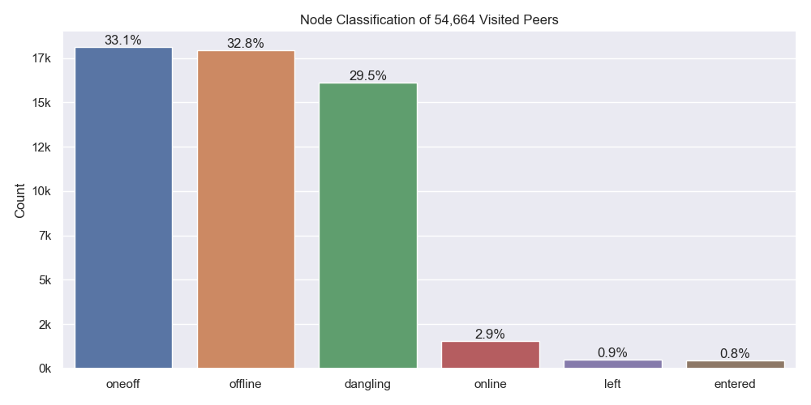

Node classification:

- `offline` - A peer that was never seen online during the measurement period (always offline) but found in the DHT
- `dangling` - A peer that was seen going offline and online multiple times during the measurement period
- `oneoff` - A peer that was seen coming online and then going offline **only once** during the measurement period
- `online` - A peer that was not seen offline at all during the measurement period (always online)
- `left` - A peer that was online at the beginning of the measurement period, did go offline and didn't come back online
- `entered` - A peer that was offline at the beginning of the measurement period but appeared within and didn't go offline since then

### Top 10 Rotating Hosts

| IP-Address     | Country | Unique Peer IDs | Agent Versions                                  |
| :------------- | :------ | --------------: | :---------------------------------------------- |
| 165.227.24.133 | US      |            5942 | ['hydra-booster/0.7.4', None]                   |
| 82.165.18.239  | DE      |            1313 | ['go-ipfs/0.4.22/', None]                       |
| 159.65.71.229  | US      |             437 | [None]                                          |
| 159.65.110.234 | US      |             331 | [None]                                          |
| 159.203.76.161 | US      |             270 | ['github.com/ipfs-shipyard/ipfs-counter', None] |
| 159.65.108.245 | US      |             200 | [None]                                          |
| 167.99.160.76  | US      |             131 | [None]                                          |
| 138.68.47.189  | US      |             123 | [None]                                          |
| 138.68.45.10   | US      |             120 | [None]                                          |
| 138.197.207.75 | US      |             100 | [None]                                          |

### Crawl Time Series

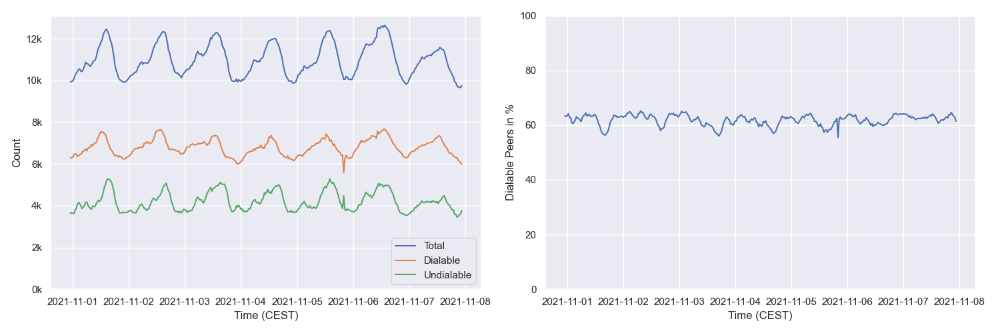

#### By Agent Version (selection)

## Churn

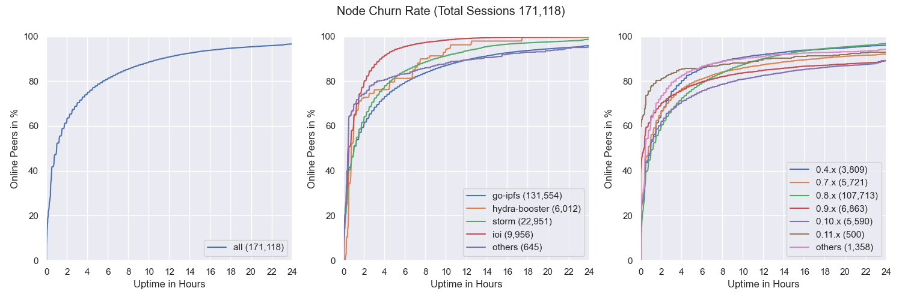

## Inter Arrival Time

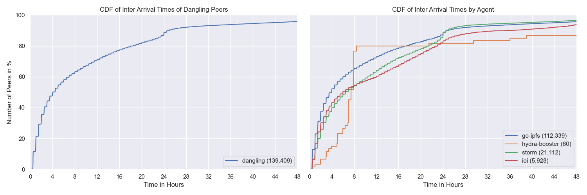

## Agent Version Analysis

### Overall

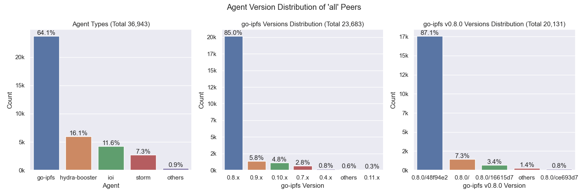

Includes all peers that the crawler was able to connect to at least once (`dangling`, `online`, `oneoff`, `entered`)

### Dangling Nodes Only

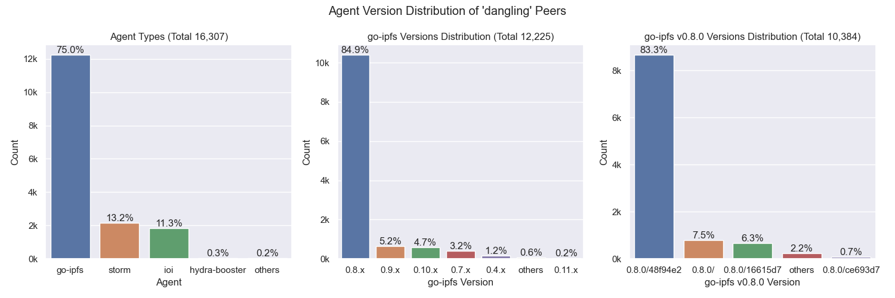

Includes all peers that were seen going offline and online multiple times during the measurement.

### Online Nodes Only

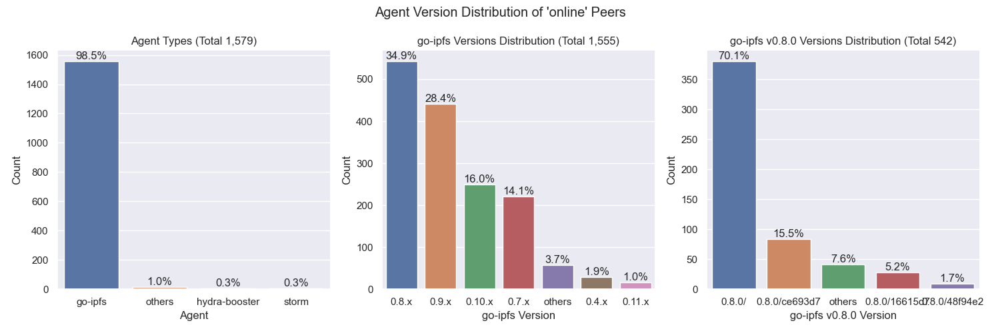

Includes all peers that were not seen offline at all during the measurement period (always online).

### Oneoff Nodes Only

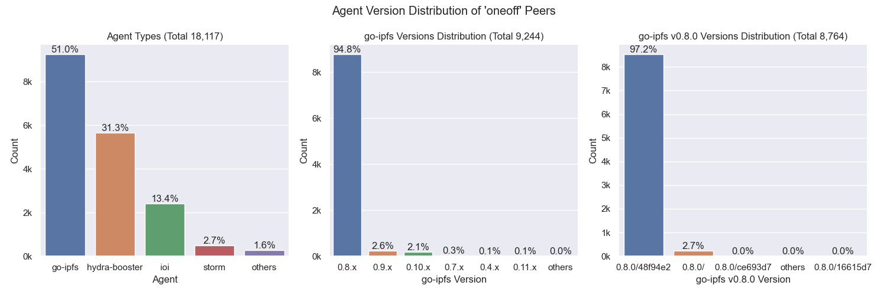

Includes all peers that were seen coming online and then going offline **only once** during the measurement period

### Entered Nodes Only

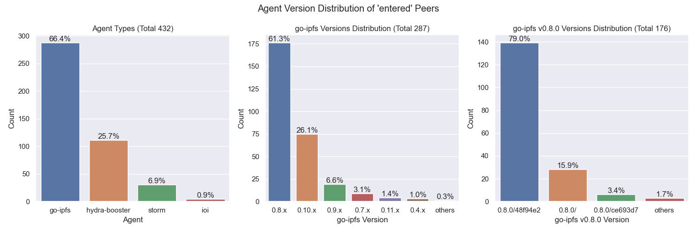

Includes all peers that were offline at the beginning of the measurement period but appeared within and didn't go offline since then.

## Geo location

### Resolution Statistics

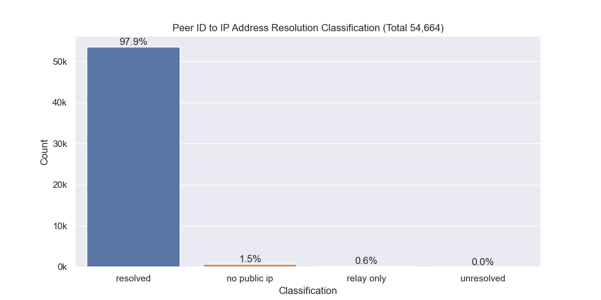

Resolution Classification:

- `resolved` - The number of peer IDs that could be resolved to at least one IP address (excludes peers that are only reachable via circuit-relays)
- `unresolved` - The number of peer IDs that could not or just were not yet resolved to at least one IP address
- `no public ip` - The number of peer IDs that were found in the DHT but didn't have a public IP address
- `relay` - The number of peer IDs that were only reachable by circuit relays

### Unique IP Addresses

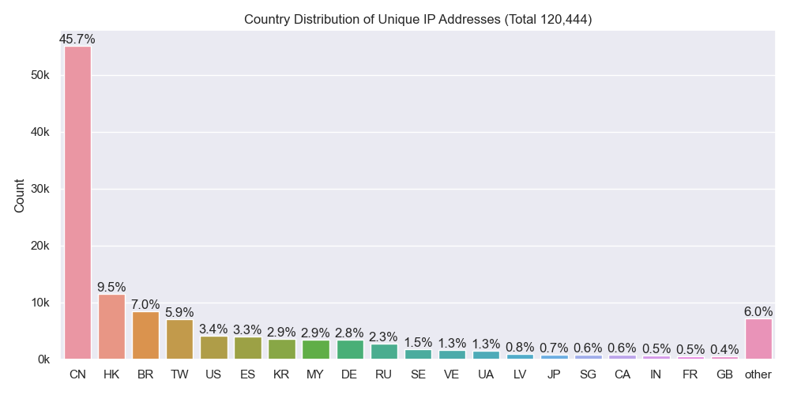

### Classification

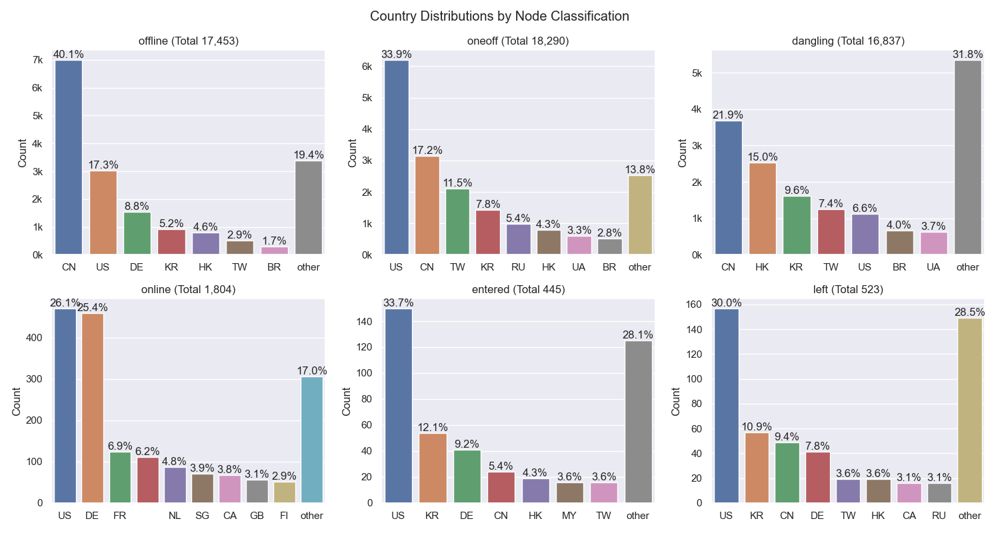

### Agents

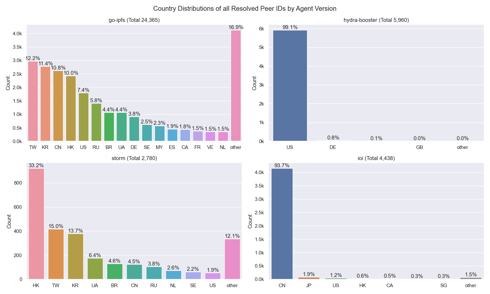

## Latencies

### Overall

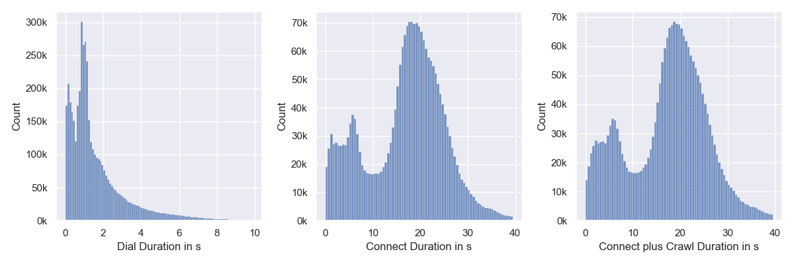

`Connect` measures the time it takes for the `libp2p` `host.Connect` call to return.

`Connect plus Crawl` includes the time of dialing, connecting and crawling the peer. `Crawling` means the time it takes for the FIND_NODE RPCs to resolve. Nebula is sending 15 of those with increasing common prefix lengths (CPLs) to the remote peer in parallel. 

### By Continent

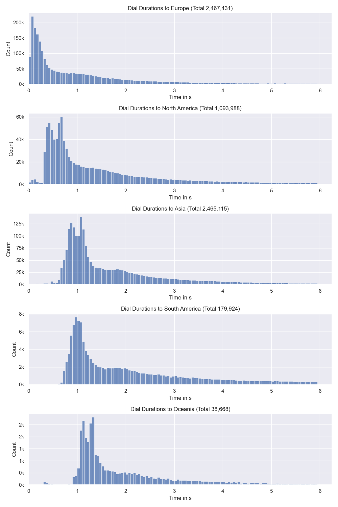

## Cloud

The number next to `Total` indicates the number of unique IP addresses that went into this calculation.

### All

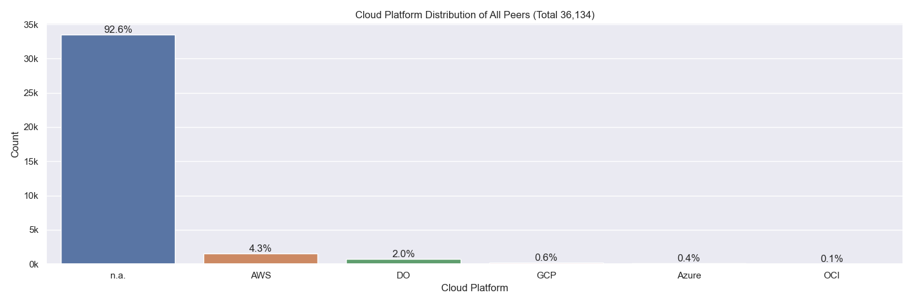

### Classification

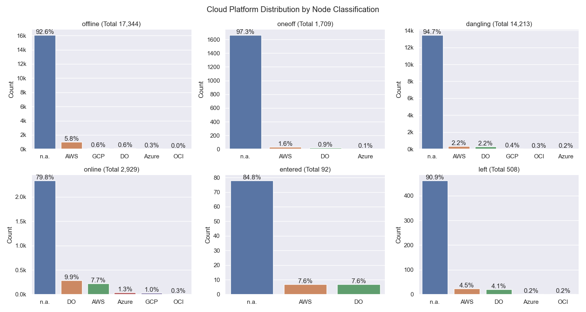

### Agents

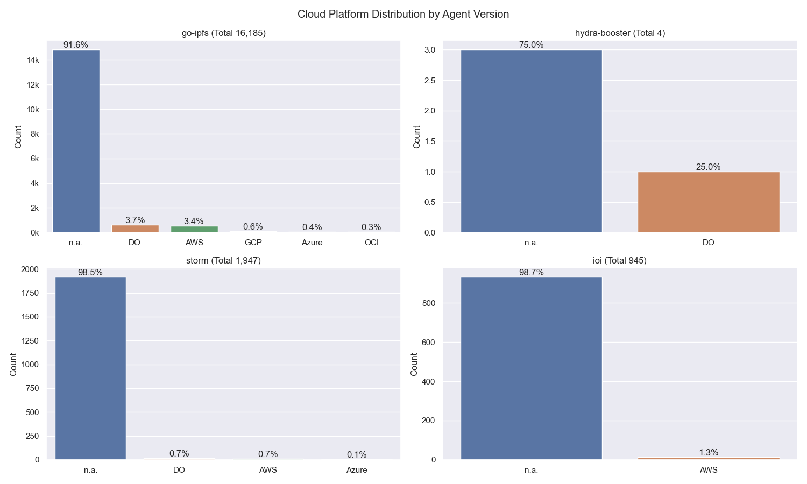

## Top Updating Peers

| Peer ID               | Final AV                 | # Transitions | Distinct AVs                                                                        | # Distinct AVs |
| :-------------------- | :----------------------- | ------------- | :---------------------------------------------------------------------------------- | -------------- |
| `12D3KooWQcDBKQcu...` | `go-ipfs/0.9.1/`         | 136           | go-ipfs/0.8.0/ go-ipfs/0.9.1/                                                   | 2              |
| `12D3KooWHy8L7J7W...` | `go-ipfs/0.9.1/dc2715a`  | 128           | go-ipfs/0.11.0-dev/5a61bed go-ipfs/0.11.0-dev/65d570c go-ipfs/0.9.1/dc2715a | 3              |
| `12D3KooWP8Kn2f8J...` | `go-ipfs/0.8.0/`         | 120           | go-ipfs/0.8.0/ go-ipfs/0.8.0-rc2/                                               | 2              |
| `12D3KooWK6aUYpst...` | `go-ipfs/0.7.0/`         | 111           | go-ipfs/0.7.0/ go-ipfs/0.8.0/                                                   | 2              |
| `12D3KooWNgxATDv4...` | `go-ipfs/0.10.0/`        | 103           | go-ipfs/0.10.0/ go-ipfs/0.8.0/                                                  | 2              |
| `12D3KooWDCimcERh...` | `go-ipfs/0.9.1/`         | 98            | go-ipfs/0.8.0/ go-ipfs/0.9.1/                                                   | 2              |
| `12D3KooWJyhcTeMd...` | `go-ipfs/0.10.0/64b532f` | 22            | go-ipfs/0.10.0/64b532f go-ipfs/0.8.0-rc1/02d15ac                                | 2              |
| `12D3KooWDiqVFubG...` | `go-ipfs/0.10.0/`        | 8             | go-ipfs/0.10.0/ go-ipfs/0.9.1/                                                  | 2              |
| `12D3KooWLDzpQT3Y...` | `go-ipfs/0.10.0/`        | 6             | go-ipfs/0.10.0/ go-ipfs/0.10.0/64b532fbb                                        | 2              |
| `12D3KooWDPFEqQgx...` | `go-ipfs/0.10.0/`        | 3             | go-ipfs/0.10.0/ go-ipfs/0.9.0/                                                  | 2              |

> `AV` = `Agent Version`
 
- `# Final AV` - The last agent version that was observed in this measurement period
- `# Transitions` - How often did this particular peer change its agent version
- `Distinct AVs` - Distinct agent version that this peer transitioned between (could have had a single AV multiple times)

## Terminology

- `visit` - Visiting a peer means dialing or connecting to it. Every time the crawler or monitoring task tries to dial or connect to a peer we consider this as _visiting_ it. Regardless of errors that may occur. 

### Node classification:

- `offline` - A peer that was never seen online during the measurement period (always offline) but found in the DHT
- `dangling` - A peer that was seen going offline and online multiple times during the measurement period
- `oneoff` - A peer that was seen coming online and then going offline only once during the measurement period multiple times
- `online` - A peer that was not seen offline at all during the measurement period (always online)
- `left` - A peer that was online at the beginning of the measurement period, did go offline and didn't come back online
- `entered` - A peer that was offline at the beginning of the measurement period but appeared within and didn't go offline since then

### IP Resolution Classification:

- `resolved` - The number of peer IDs that could be resolved to at least one IP address (excludes peers that are only reachable by circuit-relays)
- `unresolved` - The number of peer IDs that could not or just were not yet resolved to at least one IP address
- `no public ip` - The number of peer IDs that were found in the DHT but didn't have a public IP address
- `relay` - The number of peer IDs that were only reachable by circuit relays

### Cloud Providers

- `AWS` - Amazon Web Services
- `GCP` - Google Cloud Platform
- `Azure` - Microsoft Azure
- `DO` - Digital Ocean
- `OCI` - Oracle Cloud Infrastructure
