# Nebula Measurement Results Calendar Week 49

## General Information

The measurements were conducted on the following machine:

- `vCPU` - `4`
- `RAM` - `8GB`
- `Disk` - `160GB`
- `Datacenter` - `nbg1-dc3`
- `Country` - `Germany`
- `City` - `Nuremberg`

The following results show measurement data that was collected in calendar week 49 from 2021-12-06 to 2021-12-13.

- Number of crawls `336`
- Number of visits `11,805,992`
- Number of unique peer IDs visited `61,750`
- Number of unique IP addresses found `144,158`

Timestamps are in UTC if not mentioned otherwise.

### Agent Versions

Newly discovered agent versions:

- `go-ipfs/0.10.0/975d73f4e3` (2021-12-06 01:30:27)
- `go-ipfs/0.11.0-dev/92854db-dirty` (2021-12-06 07:31:38)
- `KIP/bootstrap` (2021-12-06 09:30:51)
- `github.com/Meta-Protocol/metacore` (2021-12-06 09:31:59)
- `go-ipfs/0.11.0-dev/c55fda4d6` (2021-12-06 11:00:22)
- `git.energy/corepass/hydra-corepass-provider` (2021-12-06 15:03:09)
- `gitlab.com/sarvalabs/go-kip` (2021-12-06 15:30:32)
- `go-ipfs/0.11.0-rc2/9a31ad5` (2021-12-06 18:01:03)
- `RendezvousRAT/server` (2021-12-06 21:03:02)
- `go-ipfs/0.12.0-dev/7026952c7` (2021-12-06 22:30:15)
- `go-ipfs/0.12.0-dev/7026952` (2021-12-07 04:00:24)
- `github.com/cachengo/p2p-server` (2021-12-07 21:31:02)
- `go-ipfs/0.11.0-dev/2e397ac95-dirty` (2021-12-08 08:00:31)
- `go-ipfs/0.12.0-dev/8cfc889` (2021-12-08 09:31:41)
- `go-ipfs/0.12.0-dev/8cfc88961` (2021-12-08 17:01:02)
- `go-ipfs/0.12.0-dev/615fb80` (2021-12-08 18:30:29)
- `go-ipfs/0.11.0/67220ed` (2021-12-08 22:00:30)
- `go-ipfs/0.12.0-dev/615fb80d3` (2021-12-08 23:30:16)
- `bomodroid/app_ipfs_lite` (2021-12-09 00:32:36)
- `go-ipfs/0.11.0/4c8daf296` (2021-12-09 01:00:59)
- `go-ipfs/0.11.0/67220edaa` (2021-12-09 02:00:10)
- `go-ipfs/0.12.0-dev/6fb73c4` (2021-12-09 07:30:24)
- `go-ipfs/0.12.0-dev/6fb73c45a` (2021-12-09 08:01:05)
- `go-ipfs/0.12.0-dev/007921b-dirty` (2021-12-09 17:00:20)
- `go-ipfs/0.12.0-dev/007921b90` (2021-12-09 18:01:19)
- `go-ipfs/0.12.0-dev/949ebe3` (2021-12-09 18:30:19)
- `go-ipfs/0.11.0/` (2021-12-09 19:31:52)
- `go-ipfs/0.11.0-dev/d83e3149c-dirty` (2021-12-09 20:30:27)
- `go-ipfs/0.12.0-dev/949ebe3dd` (2021-12-09 21:00:47)
- `go-ipfs/0.11.0/46d1f599c0-dirty` (2021-12-10 05:31:40)
- `go-ipfs/0.12.0-dev/deb79a2` (2021-12-10 08:31:32)
- `github.com/iand/sentinel-archiver` (2021-12-10 11:30:18)
- `github.com/iand/ipfsfiled` (2021-12-10 12:32:11)
- `go-ipfs/0.12.0-dev/deb79a258` (2021-12-11 00:00:34)
- `github.com/hyprspace/hyprspace` (2021-12-11 01:00:40)
- `go-ipfs/0.11.0-dev-ipfsmon/17c9bbf4a-dirty` (2021-12-11 10:30:20)
- `go-open-p2p` (2021-12-12 04:02:17)

### Protocols

Newly discovered protocols:

- `/p2p/join-party` (2021-12-06 09:31:59)
- `/p2p/tss` (2021-12-06 09:31:59)
- `/p2p/signatureNotifier` (2021-12-06 09:31:59)
- `/p2p/join-party-leader` (2021-12-06 09:31:59)
- `corepass/providekyc/1.0.0` (2021-12-06 15:03:09)
- `corepass/transmitkyc/1.0.0` (2021-12-06 15:03:09)
- `corepass/login/1.0.0` (2021-12-06 15:03:09)
- `corepass/authenticate/1.0.0` (2021-12-06 15:03:09)
- `sync/moi` (2021-12-06 15:30:32)
- `KIP` (2021-12-06 15:30:32)
- `moi/p2p/rpc` (2021-12-07 09:00:22)
- `/cachengo/p2p/1.0.0` (2021-12-07 21:31:02)
- `/box/peer_address/1.0.0` (2021-12-08 08:00:31)
- `/box/ping/1.0.0` (2021-12-08 08:00:31)
- `/libp2p/dcutr` (2021-12-10 08:30:56)
- `/hyprspace/0.0.3` (2021-12-11 01:00:40)
- `c42af2afb92623e0287c83335d29d4f44945bd5b1172637d496e94aba4d194a4` (2021-12-11 23:32:37)
- `/lilu.red/op/1/file` (2021-12-12 04:02:17)
- `/lilu.red/op/1/text` (2021-12-12 04:02:17)

### Classification

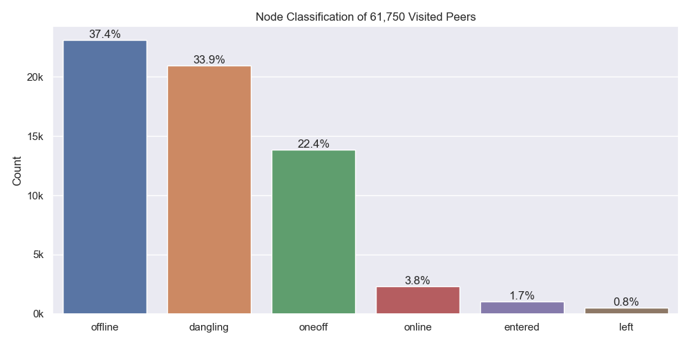

Node classification:

- `offline` - A peer that was never seen online during the measurement period (always offline) but found in the DHT
- `dangling` - A peer that was seen going offline and online multiple times during the measurement period
- `oneoff` - A peer that was seen coming online and then going offline **only once** during the measurement period
- `online` - A peer that was not seen offline at all during the measurement period (always online)
- `left` - A peer that was online at the beginning of the measurement period, did go offline and didn't come back online
- `entered` - A peer that was offline at the beginning of the measurement period but appeared within and didn't go offline since then

### Top 10 Rotating Hosts

| IP-Address      | Country | Unique Peer IDs | Agent Versions                                  |
| :-------------- | :------ | --------------: | :---------------------------------------------- |
| 82.165.18.239   | DE      |            1257 | ['go-ipfs/0.4.22/', None]                       |
| 159.203.76.161  | US      |             273 | ['github.com/ipfs-shipyard/ipfs-counter', None] |
| 123.157.156.218 | CN      |             137 | [None]                                          |
| 172.15.0.16     | US      |             136 | [None]                                          |
| 159.65.71.229   | US      |             100 | [None]                                          |
| 159.65.108.245  | US      |             100 | [None]                                          |
| 167.99.160.76   | US      |             100 | [None]                                          |
| 159.65.96.40    | US      |             100 | [None]                                          |
| 159.65.110.234  | US      |             100 | [None]                                          |
| 138.68.46.71    | US      |             100 | [None]                                          |

### Crawl Time Series

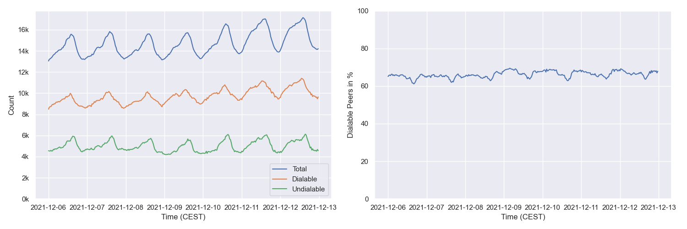

#### By Agent Version (selection)

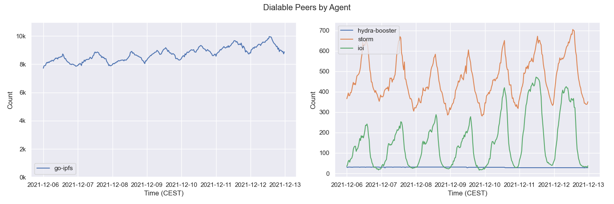

## Churn

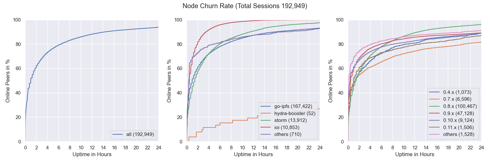

## Inter Arrival Time

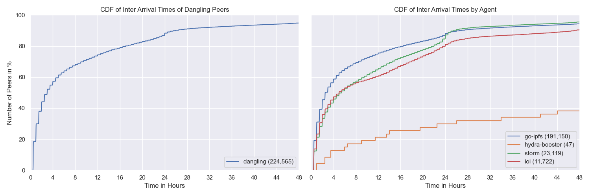

## Agent Version Analysis

### Overall

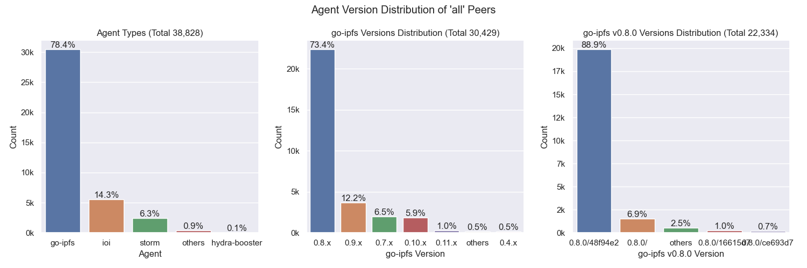

Includes all peers that the crawler was able to connect to at least once (`dangling`, `online`, `oneoff`, `entered`)

### Dangling Nodes Only

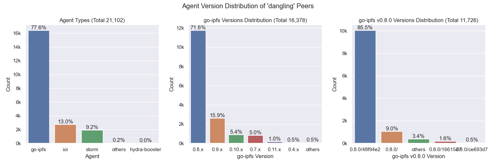

Includes all peers that were seen going offline and online multiple times during the measurement.

### Online Nodes Only

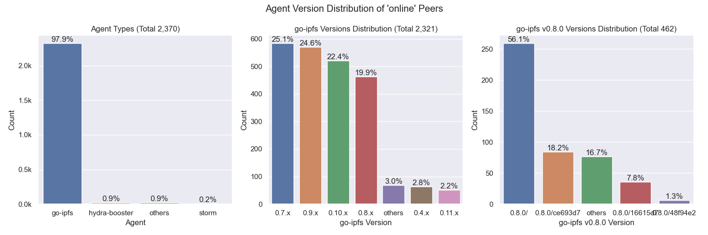

Includes all peers that were not seen offline at all during the measurement period (always online).

### Oneoff Nodes Only

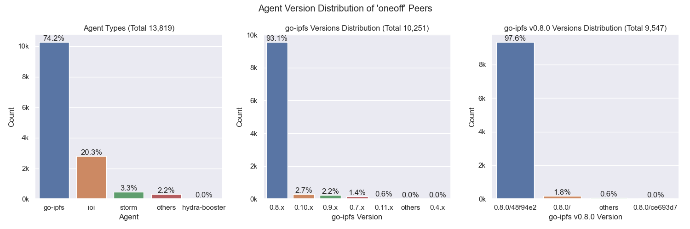

Includes all peers that were seen coming online and then going offline **only once** during the measurement period

### Entered Nodes Only

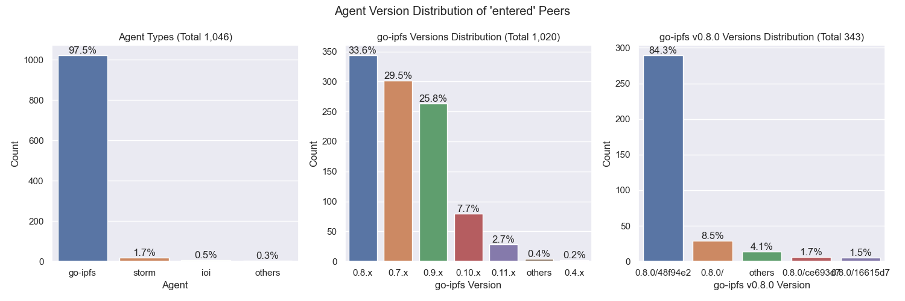

Includes all peers that were offline at the beginning of the measurement period but appeared within and didn't go offline since then.

## Geo location

### Resolution Statistics

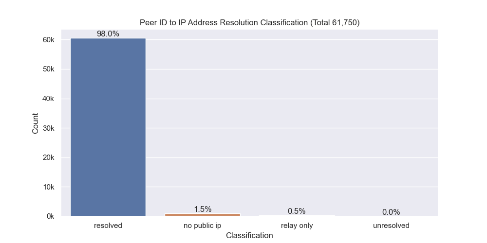

Resolution Classification:

- `resolved` - The number of peer IDs that could be resolved to at least one IP address (excludes peers that are only reachable via circuit-relays)
- `unresolved` - The number of peer IDs that could not or just were not yet resolved to at least one IP address
- `no public ip` - The number of peer IDs that were found in the DHT but didn't have a public IP address
- `relay` - The number of peer IDs that were only reachable by circuit relays

### Unique IP Addresses

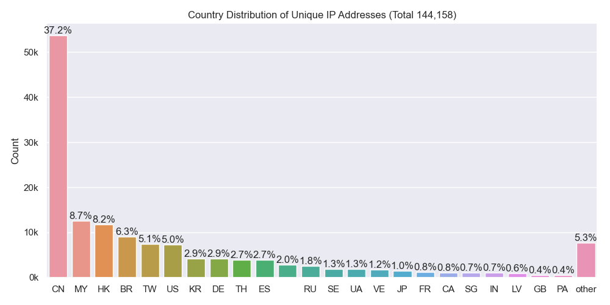

### Classification

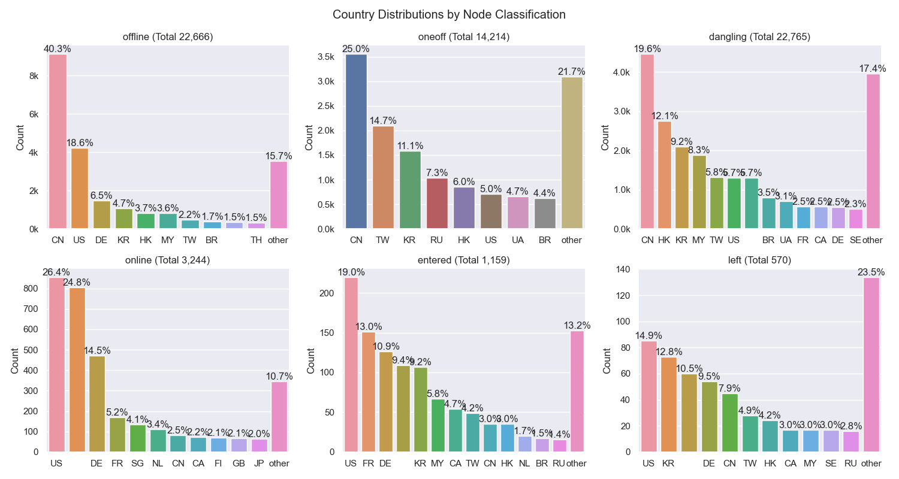

### Agents

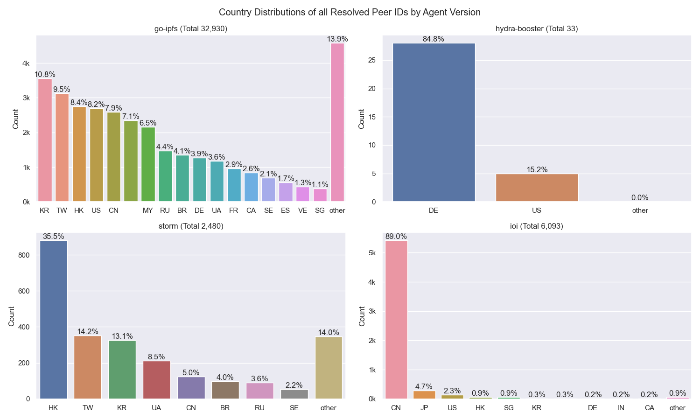

## Cloud

The number next to `Total` indicates the number of unique IP addresses that went into this calculation.

### All

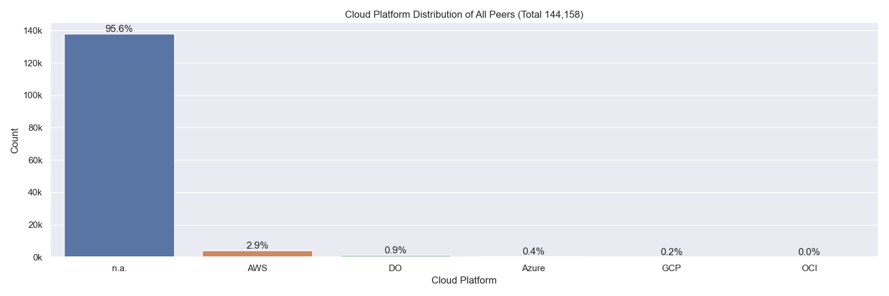

### Classification

### Agents

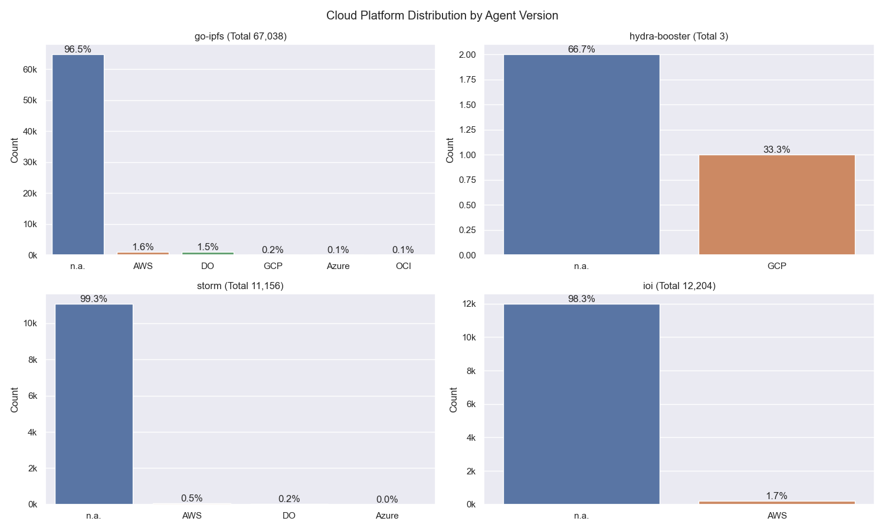

## Top Updating Peers

| Peer ID               | Final AV                       | # Transitions | Distinct AVs                                                                                                                                                                                      | # Distinct AVs |
| :-------------------- | :----------------------------- | ------------- | :------------------------------------------------------------------------------------------------------------------------------------------------------------------------------------------------ | -------------- |
| `12D3KooWHy8L7J7W...` | `go-ipfs/0.9.1/dc2715a`        | 170           | go-ipfs/0.11.0-dev/5a61bed go-ipfs/0.11.0-dev/65d570c go-ipfs/0.9.1/dc2715a                                                                                                               | 3              |
| `12D3KooWDCimcERh...` | `go-ipfs/0.8.0/`               | 160           | go-ipfs/0.8.0/ go-ipfs/0.9.1/                                                                                                                                                                 | 2              |
| `12D3KooWK6aUYpst...` | `go-ipfs/0.7.0/`               | 122           | go-ipfs/0.7.0/ go-ipfs/0.8.0/                                                                                                                                                                 | 2              |
| `12D3KooWQcDBKQcu...` | `go-ipfs/0.8.0/`               | 117           | go-ipfs/0.8.0/ go-ipfs/0.9.1/                                                                                                                                                                 | 2              |
| `12D3KooWNgxATDv4...` | `go-ipfs/0.10.0/`              | 96            | go-ipfs/0.10.0/ go-ipfs/0.8.0/                                                                                                                                                                | 2              |
| `12D3KooWJyhcTeMd...` | `go-ipfs/0.11.0/67220ed`       | 36            | go-ipfs/0.10.0/64b532f go-ipfs/0.11.0/67220ed go-ipfs/0.8.0-rc1/02d15ac                                                                                                                   | 3              |
| `12D3KooWRfxg7Vcd...` | `go-ipfs/0.10.0/`              | 30            | go-ipfs/0.10.0/ go-ipfs/0.11.0/                                                                                                                                                               | 2              |
| `12D3KooWP8Kn2f8J...` | `go-ipfs/0.8.0-rc2/`           | 22            | go-ipfs/0.8.0/ go-ipfs/0.8.0-rc2/                                                                                                                                                             | 2              |
| `Qmdex5yxScjFL8QV...` | `go-ipfs/0.13.0-dev/4d94e19`   | 6             | go-ipfs/0.12.0-dev/615fb80 go-ipfs/0.12.0-dev/6fb73c4 go-ipfs/0.12.0-dev/7026952 go-ipfs/0.12.0-dev/8cfc889 go-ipfs/0.12.0-dev/949ebe3 go-ipfs/0.12.0-dev/deb79a2             | 6              |
| `12D3KooWK1cwuzNz...` | `go-ipfs/0.12.0-dev/949ebe3dd` | 6             | go-ipfs/0.12.0-dev/007921b90 go-ipfs/0.12.0-dev/615fb80d3 go-ipfs/0.12.0-dev/6fb73c45a go-ipfs/0.12.0-dev/7026952c7 go-ipfs/0.12.0-dev/8cfc88961 go-ipfs/0.12.0-dev/949ebe3dd | 6              |

> `AV` = `Agent Version`
 
- `# Final AV` - The last agent version that was observed in this measurement period
- `# Transitions` - How often did this particular peer change its agent version
- `Distinct AVs` - Distinct agent version that this peer transitioned between (could have had a single AV multiple times)

## Terminology

- `visit` - Visiting a peer means dialing or connecting to it. Every time the crawler or monitoring task tries to dial or connect to a peer we consider this as _visiting_ it. Regardless of errors that may occur. 

### Node classification:

- `offline` - A peer that was never seen online during the measurement period (always offline) but found in the DHT
- `dangling` - A peer that was seen going offline and online multiple times during the measurement period
- `oneoff` - A peer that was seen coming online and then going offline only once during the measurement period multiple times
- `online` - A peer that was not seen offline at all during the measurement period (always online)
- `left` - A peer that was online at the beginning of the measurement period, did go offline and didn't come back online
- `entered` - A peer that was offline at the beginning of the measurement period but appeared within and didn't go offline since then

### IP Resolution Classification:

- `resolved` - The number of peer IDs that could be resolved to at least one IP address (excludes peers that are only reachable by circuit-relays)
- `unresolved` - The number of peer IDs that could not or just were not yet resolved to at least one IP address
- `no public ip` - The number of peer IDs that were found in the DHT but didn't have a public IP address
- `relay` - The number of peer IDs that were only reachable by circuit relays

### Cloud Providers

- `AWS` - Amazon Web Services
- `GCP` - Google Cloud Platform
- `Azure` - Microsoft Azure
- `DO` - Digital Ocean
- `OCI` - Oracle Cloud Infrastructure