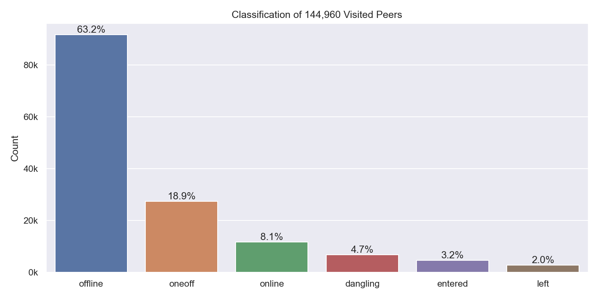
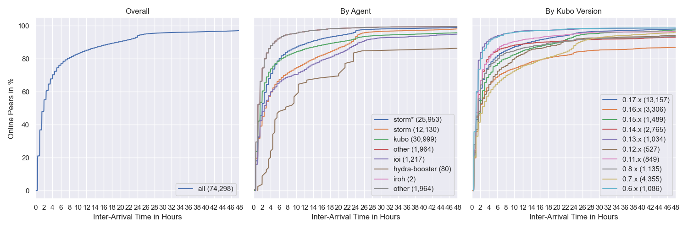
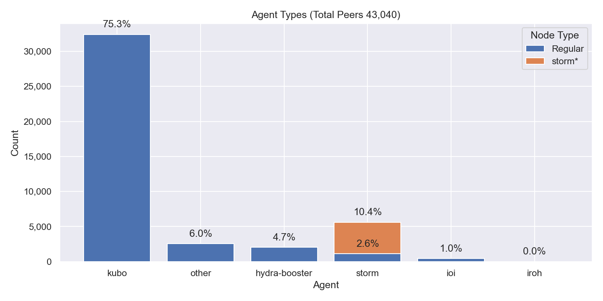
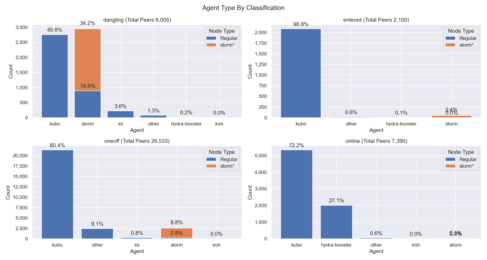
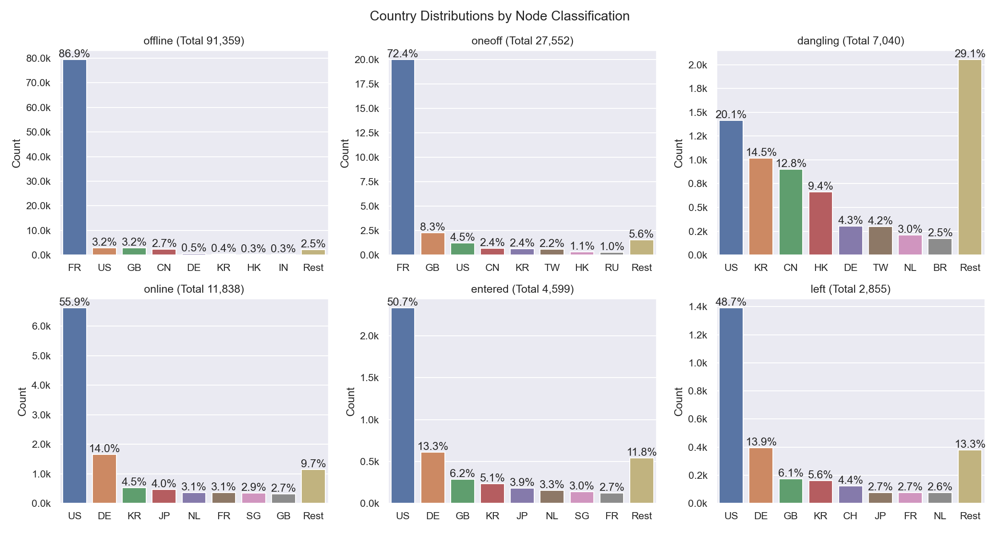

# Nebula Measurement Results Calendar Week 2 - 2023

## Table of Contents

- [General Information](#general-information)
  - [Agent Versions](#agent-versions)
  - [Protocols](#protocols)
  - [Classification](#classification)
  - [Top 10 Rotating Nodes](#top-10-rotating-nodes)
  - [Crawls](#crawls)
    - [Overall](#overall)
    - [By Agent Version](#by-agent-version)
- [Churn](#churn)
- [Inter Arrival Time](#inter-arrival-time)
- [Agent Version Analysis](#agent-version-analysis)
  - [Overall](#overall-1)
  - [Kubo](#kubo)
  - [Classification](#classification-1)
- [Geo location](#geo-location)
  - [Unique IP Addresses](#unique-ip-addresses)
  - [Classification](#classification-2)
  - [Agents](#agents)
- [Top Updating Peers](#top-updating-peers)
  - [Node classification:](#node-classification)
  - [IP Resolution Classification:](#ip-resolution-classification)
  - [Cloud Providers](#cloud-providers)
  - [Storm Specific Protocols](#storm-specific-protocols)

## General Information

The following results show measurement data that were collected in calendar week 2 in 2023 from `2023-01-09` to `2023-01-16`.

- Number of crawls `336`
- Number of visits `33,625,373`
  > Visiting a peer means dialing or connecting to it. Every time the crawler or monitoring process tries to dial or connect to a peer we consider this as _visiting_ it. Regardless of errors that may occur.
- Number of unique peer IDs visited `144,960`
- Number of unique IP addresses found `64,876`

Timestamps are in UTC if not mentioned otherwise.

### Agent Versions

Newly discovered agent versions:

- `kubo/0.18.0-rc2/desktop` (2023-01-09 02:21:08)
- `kubo/0.19.0-dev/73e6ade/docker` (2023-01-09 07:51:19)
- `github.com/application-research/estuary@261078f6b-dirty` (2023-01-09 18:22:30)
- `github.com/application-research/estuary@2d58630a7-dirty` (2023-01-09 18:52:14)
- `github.com/application-research/estuary@1b2258ed3` (2023-01-09 19:21:18)
- `github.com/application-research/estuary@46cbbb49e` (2023-01-10 17:21:54)
- `github.com/application-research/estuary@46cbbb49e-dirty` (2023-01-10 17:51:15)
- `github.com/application-research/estuary@2fafcd736` (2023-01-10 21:23:05)
- `github.com/application-research/estuary@f928c3dba-dirty` (2023-01-10 22:22:51)
- `kubo/0.18.0-rc2/6009292` (2023-01-11 00:51:01)
- `kubo/0.16.0-dev/b6b97d90a` (2023-01-11 12:52:07)
- `kubo/0.19.0-dev/f54b2bcf6` (2023-01-12 01:52:33)
- `github.com/cachengo/p2p-cli@1974a3ca1-dirty` (2023-01-12 13:51:35)
- `SybilNode@d54ece3ca-dirty` (2023-01-12 15:51:24)
- `github.com/application-research/estuary@2e3803894` (2023-01-12 16:52:48)
- `kubo/0.17.0/4485d6b-dirty` (2023-01-12 19:53:25)
- `kubo/0.19.0-dev/3bc9b67` (2023-01-13 08:53:26)
- `1.11.0` (2023-01-13 09:21:48)
- `kubo/0.18.0-dev/fdd19656c` (2023-01-13 12:21:23)
- `github.com/application-research/estuary@32ff82d0d-dirty` (2023-01-13 14:52:13)
- `kubo/0.18.0-rc2/6009292/docker` (2023-01-13 17:21:28)
- `github.com/harrisonhesslink/pythia` (2023-01-13 18:52:28)
- `github.com/application-research/estuary@80aafa80c-dirty` (2023-01-13 20:52:03)
- `kubo/0.19.0-dev/3bc9b67/docker` (2023-01-14 01:22:52)
- `github.com/application-research/estuary@0cbc1dc0d-dirty` (2023-01-14 15:51:17)
- `pythia` (2023-01-15 00:22:39)
- `gobind@` (2023-01-15 01:23:21)
- `kubo/0.19.0-dev/ed9ad0cad` (2023-01-15 03:52:47)

Agent versions that were found to support at least one [storm specific protocol](#storm-specific-protocols):

- `go-ipfs/0.8.0/48f94e2`
- `storm`

### Protocols

Newly discovered protocols:

- `/edgevpn/service/0.1` (2023-01-10 19:51:17)
- `/fluence/particle/2.0.0` (2023-01-13 09:21:48)

### Classification

In the specified time interval from `2023-01-09` to `2023-01-16` we visited `144,960` unique peer IDs.
All peer IDs fall into one of the following classifications:

| Classification | Description |
| --- | --- |
| `offline` | A peer that was never seen online during the measurement period (always offline) but found in the DHT |
| `dangling` | A peer that was seen going offline and online multiple times during the measurement period |
| `oneoff` | A peer that was seen coming online and then going offline **only once** during the measurement period |
| `online` | A peer that was not seen offline at all during the measurement period (always online) |
| `left` | A peer that was online at the beginning of the measurement period, did go offline and didn't come back online |
| `entered` | A peer that was offline at the beginning of the measurement period but appeared within and didn't go offline since then |

### Top 10 Rotating Nodes

A "rotating node" is a node (as identified by its IP address) that was found to host multiple peer IDs.

| IP-Address    | Country | Unique Peer IDs | Agent Versions | Datacenter IP |
|:------------- |:------- | ---------------:|:-------------- | ------------- |
| `51.178.18.118` | FR | 4351 | ['kubo/0.17.0/4485d6b71']| True  |
| `2001:41d0:305:2100::a67` | FR | 4351 | ['kubo/0.17.0/4485d6b71']| True  |
| `51.91.59.242` | FR | 4161 | ['kubo/0.17.0/4485d6b71']| True  |
| `2001:41d0:305:2100::2ae1` | FR | 4161 | ['kubo/0.17.0/4485d6b71']| True  |
| `2001:41d0:305:2100::2f60` | FR | 4137 | ['kubo/0.17.0/4485d6b71']| True  |
| `51.91.58.123` | FR | 4137 | ['kubo/0.17.0/4485d6b71']| True  |
| `51.178.43.200` | FR | 3621 | ['kubo/0.17.0/4485d6b71']| True  |
| `2001:41d0:304:200::25e6` | FR | 3621 | ['kubo/0.17.0/4485d6b71']| True  |
| `146.59.151.243` | FR | 3491 | ['kubo/0.16.0/38117db6f']| True  |
| `2001:41d0:304:200::de76` | FR | 3491 | ['kubo/0.16.0/38117db6f']| True  |

### Crawls

#### Overall

#### Agents

Only the top 10 kubo versions appear in the right graph (due to lack of colors) based on the average count in the time interval. The `0.8.x` versions **do not** contain disguised storm peers.

`storm*` are `go-ipfs/0.8.0/48f94e2` peers that support at least one [storm specific protocol](#storm-specific-protocols).

## Churn

Only the top 10 kubo versions appear in the right graph (due to lack of colors) based on the average count in the time interval. The `0.8.x` versions **do not** contain disguised storm peers. This graph also excludes peers that were online the whole time. You can read this graph as: if I see a peer joining the network, what's the likelihood for it to stay `X` hours in the network.

`storm*` are `go-ipfs/0.8.0/48f94e2` peers that support at least one [storm specific protocol](#storm-specific-protocols).

## Inter Arrival Time

Only the top 10 kubo versions appear in the right graph (due to lack of colors) based on the average count in the time interval. The `0.8.x` versions **do not** contain disguised storm peers.

`storm*` are `go-ipfs/0.8.0/48f94e2` peers that support at least one [storm specific protocol](#storm-specific-protocols).

## Agent Version Analysis

### Overall

Includes all peers that the crawler was able to connect to at least once: `dangling`, `online`, `oneoff`, `entered`. Hence, the total number of peers is lower as the graph excludes `offline` and `left` peers (see [classification](#peer-classification)).

### Kubo

`storm` shows the `go-ipfs/0.8.0/48f94e2` peers that support at least one [storm specific protocol](#storm-specific-protocols).

### Classification

The classifications are documented [here](#peer-classification).
`storm*` are `go-ipfs/0.8.0/48f94e2` peers that support at least one [storm specific protocol](#storm-specific-protocols).

## Geolocation

### Unique IP Addresses

This graph shows all IP addresses that we found from `2023-01-09` to `2023-01-16` in the DHT and their geolocation distribution by country.

### Classification

The classifications are documented [here](#peer-classification). 
The number in parentheses in the graph titles show the number of unique peer IDs that went into the specific subgraph.

### Agents

`storm*` are `go-ipfs/0.8.0/48f94e2` peers that support at least one [storm specific protocol](#storm-specific-protocols).

## Datacenters

### Overall

This graph shows all IP addresses that we found from `2023-01-09` to `2023-01-16` in the DHT and their datacenter association.

### Classification

The classifications are documented [here](#peer-classification). Note that the x-axes are different.

### Agents

The number in parentheses in the graph titles show the number of unique peer IDs that went into the specific subgraph.

`storm*` are `go-ipfs/0.8.0/48f94e2` peers that support at least one [storm specific protocol](#storm-specific-protocols).

## Top Updating Peers

An "updating peer" is a peer that we observed with multiple agent versions.  

| Peer ID           | Final Agent Version     | Number of Transitions | Distinct Agent Versions | Number of Distinct AVs |
|:----------------- |:------------ | ------------- |:------------ | -------------- |
| `12D3KooWNgxATDv4...` | `go-ipfs/0.8.0/` | 106  | go-ipfs/0.13.0/ go-ipfs/0.8.0/ | 2 |
| `12D3KooWQcDBKQcu...` | `go-ipfs/0.8.0/` | 105  | go-ipfs/0.11.0/ go-ipfs/0.8.0/ | 2 |
| `12D3KooWHPSQJQhE...` | `kubo/0.16.0/38117db` | 97  | kubo/0.14.0/ kubo/0.16.0/38117db | 2 |
| `12D3KooWAmVgeLTa...` | `go-ipfs/0.11.0/` | 95  | go-ipfs/0.11.0/ go-ipfs/0.12.0/ | 2 |
| `12D3KooWM1xpPWVm...` | `github.com/application-research/estuary@f928c3dba-dirty` | 5  | github.com/application-research/estuary@1b2258ed3 github.com/application-research/estuary@261078f6b-dirty github.com/application-research/estuary@2d58630a7-dirty github.com/application-research/estuary@2fafcd736 github.com/application-research/estuary@f928c3dba-dirty | 5 |
| `12D3KooWNm7x76rM...` | `kubo/0.16.0/38117db6f` | 4  | kubo/0.16.0/38117db6f kubo/0.17.0/ | 2 |
| `12D3KooWQXJRcqES...` | `kubo/0.19.0-dev/` | 2  | kubo/0.17.0/ kubo/0.19.0-dev/ | 2 |
| `QmQ7kYMaeENoN5e5...` | `kubo/0.17.0/` | 2  | kubo/0.16.0/ kubo/0.17.0/ | 2 |
| `12D3KooWBEQR33uW...` | `kubo/0.17.0/` | 2  | go-ipfs/0.12.0/ kubo/0.17.0/ | 2 |
| `12D3KooWAV3djoaw...` | `github.com/application-research/estuary@0cbc1dc0d-dirty` | 2  | github.com/application-research/estuary@0cbc1dc0d-dirty github.com/application-research/estuary@32ff82d0d-dirty | 2 |

### Peer Classification

| Classification | Description |
| --- | --- |
| `offline` | A peer that was never seen online during the measurement period (always offline) but found in the DHT |
| `dangling` | A peer that was seen going offline and online multiple times during the measurement period |
| `oneoff` | A peer that was seen coming online and then going offline **only once** during the measurement period |
| `online` | A peer that was not seen offline at all during the measurement period (always online) |
| `left` | A peer that was online at the beginning of the measurement period, did go offline and didn't come back online |
| `entered` | A peer that was offline at the beginning of the measurement period but appeared within and didn't go offline since then |

### Storm Specific Protocols

The following protocol strings are unique for `storm` nodes according to [this Bitdefender paper](https://www.bitdefender.com/files/News/CaseStudies/study/376/Bitdefender-Whitepaper-IPStorm.pdf):

- `/sreque/*`
- `/shsk/*`
- `/sfst/*`
- `/sbst/*`
- `/sbpcp/*`
- `/sbptp/*`
- `/strelayp/*`