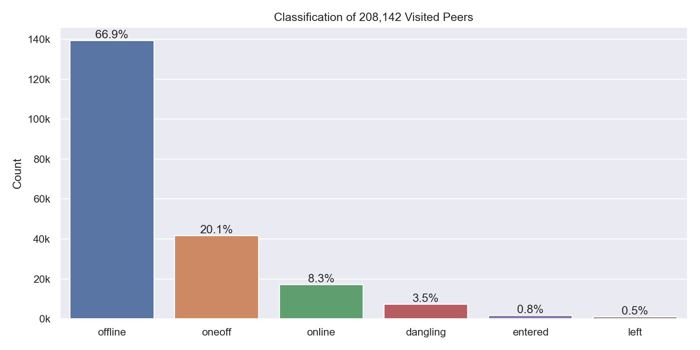
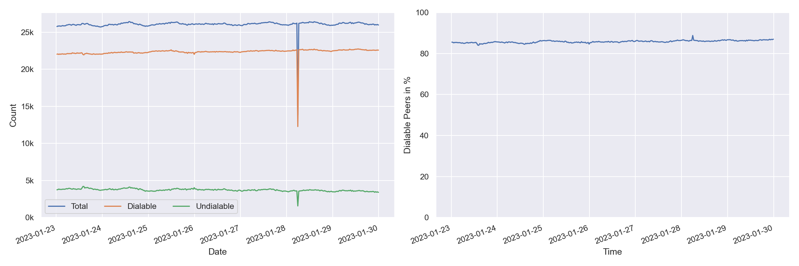
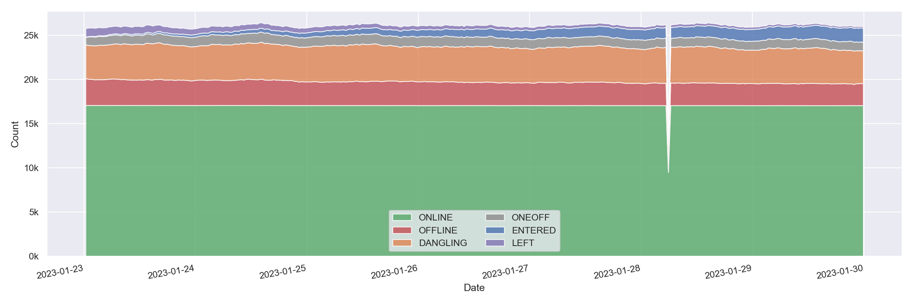
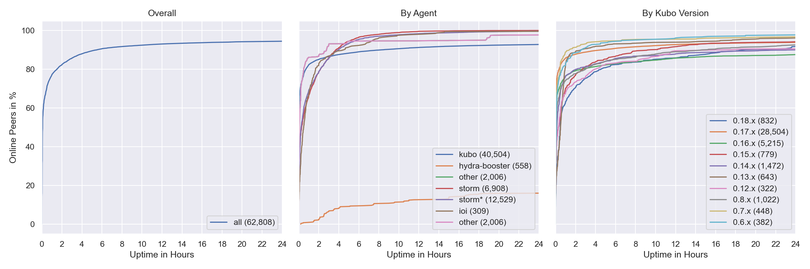
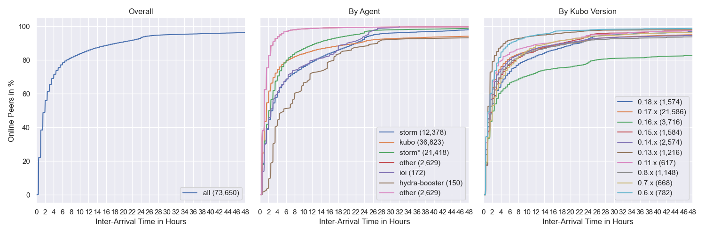
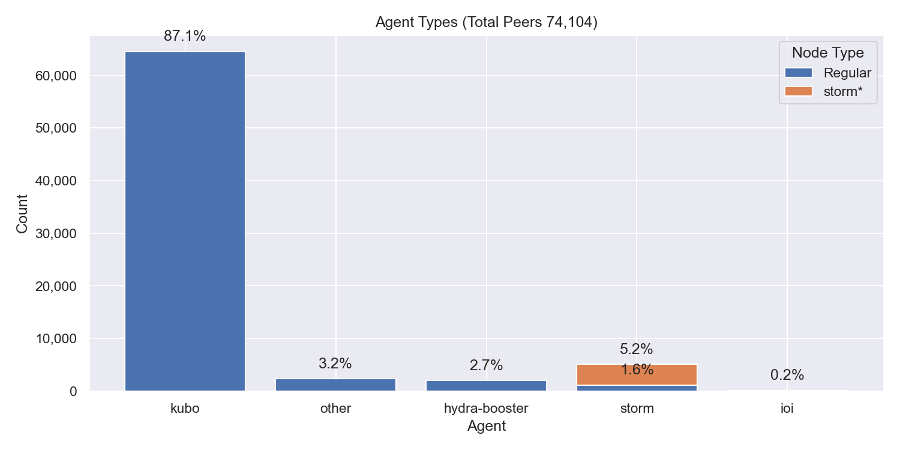
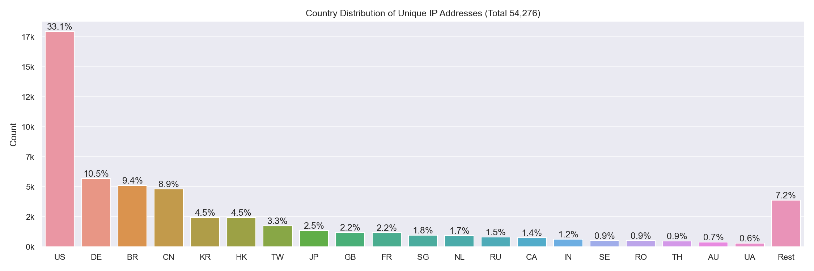
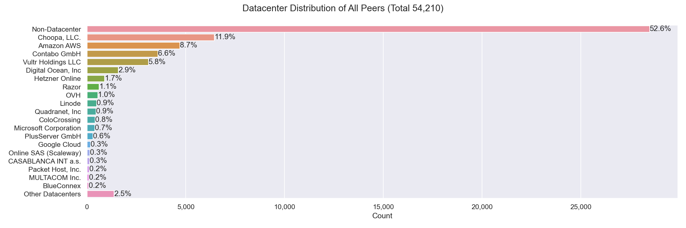
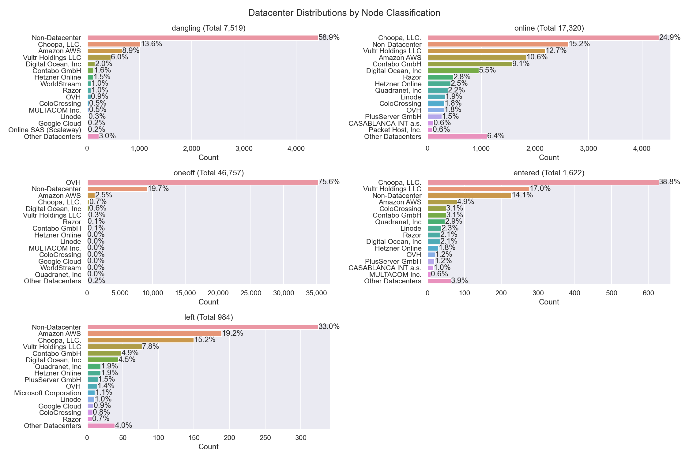

# Nebula Measurement Results Calendar Week 4 - 2023

## Table of Contents

- [Nebula Measurement Results Calendar Week 4 - 2023](#nebula-measurement-results-calendar-week-4---2023)
  - [Table of Contents](#table-of-contents)
  - [General Information](#general-information)
    - [Agent Versions](#agent-versions)
    - [Protocols](#protocols)
    - [Classification](#classification)
    - [Top 10 Rotating Nodes](#top-10-rotating-nodes)
    - [Crawls](#crawls)
      - [Overall](#overall)
      - [Classification](#classification-1)
      - [Agents](#agents)
      - [Protocols](#protocols-1)
  - [Churn](#churn)
  - [Inter Arrival Time](#inter-arrival-time)
  - [Agent Version Analysis](#agent-version-analysis)
    - [Overall](#overall-1)
    - [Kubo](#kubo)
    - [Classification](#classification-2)
  - [Geolocation](#geolocation)
    - [Unique IP Addresses](#unique-ip-addresses)
    - [Classification](#classification-3)
    - [Agents](#agents-1)
  - [Datacenters](#datacenters)
    - [Overall](#overall-2)
    - [Classification](#classification-4)
    - [Agents](#agents-2)
  - [Top Updating Peers](#top-updating-peers)
    - [Peer Classification](#peer-classification)
    - [Storm Specific Protocols](#storm-specific-protocols)

## General Information

The following results show measurement data that were collected in calendar week 4 in 2023 from `2023-01-23` to `2023-01-30`.

- Number of crawls `335`
- Number of visits `41,412,468`
  > Visiting a peer means dialing or connecting to it. Every time the crawler or monitoring process tries to dial or connect to a peer we consider this as _visiting_ it. Regardless of errors that may occur.
- Number of unique peer IDs visited `208,142`
- Number of unique peer IDs discovered in the DHT `208,023`
- Number of unique IP addresses found `56,609`

Timestamps are in UTC if not mentioned otherwise.

### Agent Versions

Newly discovered agent versions:

- `github.com/application-research/estuary@608e77505` (2023-01-23 02:21:35)
- `kubo/0.19.0-dev/9327ee6` (2023-01-23 08:51:17)
- `kubo/0.19.0-dev/c706c63/docker` (2023-01-23 08:52:33)
- `kubo/0.19.0-dev/7fc4dfae2-dirty` (2023-01-23 10:24:01)
- `kubo/0.19.0-dev/9327ee6/docker` (2023-01-23 11:23:24)
- `kubo/0.18.0/6750377/docker` (2023-01-23 14:53:33)
- `kubo/0.17.0/4485d6b/docker` (2023-01-23 15:50:55)
- `kubo/0.16.0/38117db/docker` (2023-01-23 15:50:56)
- `kubo/0.15.0-dev/kube` (2023-01-23 15:50:56)
- `kubo/0.14.0/e0fabd6/docker` (2023-01-23 15:50:56)
- `kubo/0.18.0/6750377` (2023-01-23 15:51:01)
- `go-ipfs/0.13.0/c9d51bb/docker` (2023-01-23 15:53:47)
- `kubo/0.15.0/3ae52a4/docker` (2023-01-23 15:53:50)
- `go-ipfs/0.11.0/67220ed/docker` (2023-01-23 15:54:14)
- `go-ipfs/0.13.1/8ffc7a8/docker` (2023-01-23 15:54:20)
- `kubo/0.16.0/desktop` (2023-01-23 16:24:12)
- `kubo/0.18.0/` (2023-01-23 17:51:57)
- `kubo/0.18.0/6750377/s̳̪̦̩̝͎͙͝u͍̫̺̝̱̰͝p̠͔̫͓̬̦` (2023-01-23 18:24:08)
- `go-ipfs/0.12.0/06191df/docker` (2023-01-23 18:24:21)
- `go-ipfs/0.12.0/06191df-dirty/docker` (2023-01-23 18:54:04)
- `kubo/0.17.0/desktop` (2023-01-23 19:52:05)
- `kubo/0.18.0/675037721-dirty` (2023-01-23 19:52:48)
- `kubo/0.19.0-dev/9327ee64c` (2023-01-23 20:54:12)
- `kubo/0.18.0/675037721` (2023-01-23 20:54:12)
- `go-ipfs/0.12.1/da2b9bd/docker` (2023-01-23 21:24:13)
- `go-ipfs/0.12.2/0e8b121/docker` (2023-01-23 21:53:55)
- `kubo/0.18.0/dynomod` (2023-01-23 23:51:59)
- `kubo/0.16.0-dev/c7ed7ba/docker` (2023-01-24 01:53:46)
- `validation-bot@3fe3ab3a9` (2023-01-24 02:23:55)
- `kubo/0.18.0-dev/a32128d/docker` (2023-01-24 05:23:47)
- `go.vocdoni.io/dvote@3be8bc762-dirty` (2023-01-24 11:22:46)
- `kubo/0.18.0/docker` (2023-01-24 12:51:31)
- `go.vocdoni.io/dvote@070ecb2fa-dirty` (2023-01-24 12:51:56)
- `SybilNode@07f8aea17-dirty` (2023-01-24 16:51:17)
- `go.vocdoni.io/dvote@792ba442d-dirty` (2023-01-24 19:52:02)
- `go.vocdoni.io/dvote@0a0af1e3c-dirty` (2023-01-24 21:22:06)
- `kubo/0.18.0/VALGRIND` (2023-01-25 09:22:45)
- `kubo/0.17.0/eddc5a9e4-dirty` (2023-01-25 12:52:05)
- `github.com/application-research/estuary@c37c05e68` (2023-01-25 16:23:09)
- `go-ipfs/0.11.0-dev/3ae4af826` (2023-01-25 16:54:12)
- `kubo/0.19.0-dev/6601efb/docker` (2023-01-25 18:51:51)
- `github.com/ethtweet/ethtweet@25719491b-dirty` (2023-01-26 03:51:14)
- `kubo/0.18.0/675037721-dirty/docker` (2023-01-26 09:21:29)
- `github.com/ethtweet/ethtweet@2203e9a08-dirty` (2023-01-26 10:23:46)
- `github.com/xyzmap/diva@94a06356a-dirty` (2023-01-26 11:24:11)
- `github.com/xyzmap/diva@abc46a27c-dirty` (2023-01-26 11:24:17)
- `kubo/0.19.0-dev/644f0ae22` (2023-01-26 11:51:22)
- `github.com/xyzmap/diva@8c7a6125e-dirty` (2023-01-26 18:24:19)
- `go.vocdoni.io/dvote@bbfee367a-dirty` (2023-01-26 19:21:56)
- `kubo/0.19.0-dev/9327ee64c-dirty/docker` (2023-01-26 22:23:12)
- `github.com/ethtweet/ethtweet@04ee243e7-dirty` (2023-01-27 00:51:49)
- `github.com/application-research/autoretrieve@ebf5c4ee7` (2023-01-27 02:21:59)
- `github.com/application-research/autoretrieve@ebf5c4ee7-dirty` (2023-01-27 03:21:57)
- `kubo/0.19.0-dev/2c319a3e5-dirty` (2023-01-27 03:24:41)
- `github.com/application-research/autoretrieve@c0de64f0f` (2023-01-27 03:52:08)
- `github.com/application-research/autoretrieve@4b4dcae63` (2023-01-27 04:22:05)
- `kubo/0.18.0/DC` (2023-01-27 09:21:41)
- `kubo/0.19.0-dev/a3c70a1/docker` (2023-01-27 14:51:48)
- `kubo/0.18.0/desktop` (2023-01-27 21:51:18)
- `kubo/0.19.0-dev/b3c98bb/docker` (2023-01-27 23:52:49)
- `kubo/0.19.0-dev/7cb8082bb` (2023-01-28 10:53:56)
- `go-ipfs/0.10.0/e70eedba6b` (2023-01-28 16:53:11)
- `github.com/gloflow/gloflow@3ec2f12b8-dirty` (2023-01-28 23:23:48)
- `kubo/0.19.0-dev/7cb8082/docker` (2023-01-28 23:53:36)
- `kubo/0.15.0-dev/docker` (2023-01-29 19:53:51)

Agent versions that were found to support at least one [storm specific protocol](#storm-specific-protocols):

- `go-ipfs/0.8.0/48f94e2`
- `storm`

### Protocols

Newly discovered protocols:

- `my_cifar_run_state_averager::TrainingStateAverager.rpc_join_group` (2023-01-24 05:24:28)
- `my_cifar_run_state_averager::TrainingStateAverager.rpc_aggregate_part` (2023-01-24 05:24:28)
- `my_cifar_run_state_averager::TrainingStateAverager.rpc_download_state` (2023-01-24 05:24:28)
- `/grpc/v1-beta` (2023-01-26 11:53:10)
- `diva/kad/1.0.0` (2023-01-27 13:24:35)
- `/gf/general/0.0.1` (2023-01-28 23:23:48)

### Classification

In the specified time interval from `2023-01-23` to `2023-01-30` we visited `` unique peer IDs.
All peer IDs fall into one of the following classifications:

| Classification | Description |
| --- | --- |
| `offline` | A peer that was never seen online during the measurement period (always offline) but found in the DHT |
| `dangling` | A peer that was seen going offline and online multiple times during the measurement period |
| `oneoff` | A peer that was seen coming online and then going offline **only once** during the measurement period |
| `online` | A peer that was not seen offline at all during the measurement period (always online) |
| `left` | A peer that was online at the beginning of the measurement period, did go offline and didn't come back online |
| `entered` | A peer that was offline at the beginning of the measurement period but appeared within and didn't go offline since then |

### Top 10 Rotating Nodes

A "rotating node" is a node (as identified by its IP address) that was found to host multiple peer IDs.

| IP-Address    | Country | Unique Peer IDs | Agent Versions | Datacenter IP |
|:------------- |:------- | ---------------:|:-------------- | ------------- |
| `2001:41d0:304:200::41cd` | FR | 5042 | ['kubo/0.17.0/4485d6b71']| True  |
| `51.210.150.216` | FR | 5042 | ['kubo/0.17.0/4485d6b71']| True  |
| `146.59.151.243` | FR | 5039 | ['kubo/0.14.0/e0fabd6/docker', 'kubo/0.16.0/38117db6f']| True  |
| `2001:41d0:304:200::de76` | FR | 5039 | ['kubo/0.14.0/e0fabd6/docker', 'kubo/0.16.0/38117db6f']| True  |
| `51.178.18.118` | FR | 5020 | ['kubo/0.17.0/4485d6b71']| True  |
| `2001:41d0:305:2100::a67` | FR | 5020 | ['kubo/0.17.0/4485d6b71']| True  |
| `51.210.151.221` | FR | 5010 | ['kubo/0.17.0/4485d6b71']| True  |
| `2001:41d0:304:200::41da` | FR | 5010 | ['kubo/0.17.0/4485d6b71']| True  |
| `141.94.68.144` | FR | 4987 | ['kubo/0.17.0/4485d6b71']| False  |
| `2001:41d0:304:200::41f5` | FR | 4987 | ['kubo/0.17.0/4485d6b71']| True  |

### Crawls

#### Overall

#### Classification

#### Agents

Only the top 10 kubo versions appear in the right graph (due to lack of colors) based on the average count in the time interval. The `0.8.x` versions **do not** contain disguised storm peers.

`storm*` are `go-ipfs/0.8.0/48f94e2` peers that support at least one [storm specific protocol](#storm-specific-protocols).

#### Protocols

## Churn

Only the top 10 kubo versions appear in the right graph (due to lack of colors) based on the average count in the time interval. The `0.8.x` versions **do not** contain disguised storm peers. This graph also excludes peers that were online the whole time. You can read this graph as: if I see a peer joining the network, what's the likelihood for it to stay `X` hours in the network.

`storm*` are `go-ipfs/0.8.0/48f94e2` peers that support at least one [storm specific protocol](#storm-specific-protocols).

## Inter Arrival Time

Only the top 10 kubo versions appear in the right graph (due to lack of colors) based on the average count in the time interval. The `0.8.x` versions **do not** contain disguised storm peers.

`storm*` are `go-ipfs/0.8.0/48f94e2` peers that support at least one [storm specific protocol](#storm-specific-protocols).

## Agent Version Analysis

### Overall

Includes all peers that the crawler was able to connect to at least once: `dangling`, `online`, `oneoff`, `entered`. Hence, the total number of peers is lower as the graph excludes `offline` and `left` peers (see [classification](#peer-classification)).

### Kubo

`storm` shows the `go-ipfs/0.8.0/48f94e2` peers that support at least one [storm specific protocol](#storm-specific-protocols).

### Classification

The classifications are documented [here](#peer-classification).
`storm*` are `go-ipfs/0.8.0/48f94e2` peers that support at least one [storm specific protocol](#storm-specific-protocols).

## Geolocation

### Unique IP Addresses

This graph shows all IP addresses that we found from `2023-01-23` to `2023-01-30` in the DHT and their geolocation distribution by country.

### Classification

The classifications are documented [here](#peer-classification). 
The number in parentheses in the graph titles show the number of unique peer IDs that went into the specific subgraph.

### Agents

`storm*` are `go-ipfs/0.8.0/48f94e2` peers that support at least one [storm specific protocol](#storm-specific-protocols).

## Datacenters

### Overall

This graph shows all IP addresses that we found from `2023-01-23` to `2023-01-30` in the DHT and their datacenter association.

### Classification

The classifications are documented [here](#peer-classification). Note that the x-axes are different.

### Agents

The number in parentheses in the graph titles show the number of unique peer IDs that went into the specific subgraph.

`storm*` are `go-ipfs/0.8.0/48f94e2` peers that support at least one [storm specific protocol](#storm-specific-protocols).

## Top Updating Peers

An "updating peer" is a peer that we observed with multiple agent versions.  

| Peer ID           | Final Agent Version     | Number of Transitions | Distinct Agent Versions | Number of Distinct AVs |
|:----------------- |:------------ | ------------- |:------------ | -------------- |
| `12D3KooWRASFxuhe...` | `kubo/0.14.0/e0fabd6/docker` | 171  | kubo/0.14.0/e0fabd6 kubo/0.14.0/e0fabd6/docker | 2 |
| `12D3KooWQ9KouDoa...` | `kubo/0.14.0/e0fabd6/docker` | 170  | kubo/0.14.0/e0fabd6 kubo/0.14.0/e0fabd6/docker | 2 |
| `12D3KooWA9iv5LeT...` | `kubo/0.14.0/e0fabd6` | 170  | kubo/0.14.0/e0fabd6 kubo/0.14.0/e0fabd6/docker | 2 |
| `12D3KooWFLKtrNaz...` | `kubo/0.14.0/e0fabd6` | 169  | kubo/0.14.0/e0fabd6 kubo/0.14.0/e0fabd6/docker | 2 |
| `12D3KooWJ7LbSCnD...` | `kubo/0.14.0/e0fabd6/docker` | 168  | kubo/0.14.0/e0fabd6 kubo/0.14.0/e0fabd6/docker | 2 |
| `12D3KooWBDHhSMti...` | `kubo/0.14.0/e0fabd6` | 168  | kubo/0.14.0/e0fabd6 kubo/0.14.0/e0fabd6/docker | 2 |
| `12D3KooWCJWFh3ob...` | `kubo/0.14.0/e0fabd6` | 167  | kubo/0.14.0/e0fabd6 kubo/0.14.0/e0fabd6/docker | 2 |
| `12D3KooWDu85Fbo2...` | `kubo/0.14.0/e0fabd6/docker` | 166  | kubo/0.14.0/e0fabd6 kubo/0.14.0/e0fabd6/docker | 2 |
| `12D3KooWBZi1AeS2...` | `kubo/0.14.0/e0fabd6/docker` | 165  | kubo/0.14.0/e0fabd6 kubo/0.14.0/e0fabd6/docker | 2 |
| `12D3KooWFYW7AZA8...` | `kubo/0.14.0/e0fabd6/docker` | 165  | kubo/0.14.0/e0fabd6 kubo/0.14.0/e0fabd6/docker | 2 |

### Peer Classification

| Classification | Description |
| --- | --- |
| `offline` | A peer that was never seen online during the measurement period (always offline) but found in the DHT |
| `dangling` | A peer that was seen going offline and online multiple times during the measurement period |
| `oneoff` | A peer that was seen coming online and then going offline **only once** during the measurement period |
| `online` | A peer that was not seen offline at all during the measurement period (always online) |
| `left` | A peer that was online at the beginning of the measurement period, did go offline and didn't come back online |
| `entered` | A peer that was offline at the beginning of the measurement period but appeared within and didn't go offline since then |

### Storm Specific Protocols

The following protocol strings are unique for `storm` nodes according to [this Bitdefender paper](https://www.bitdefender.com/files/News/CaseStudies/study/376/Bitdefender-Whitepaper-IPStorm.pdf):

- `/sreque/*`
- `/shsk/*`
- `/sfst/*`
- `/sbst/*`
- `/sbpcp/*`
- `/sbptp/*`
- `/strelayp/*`