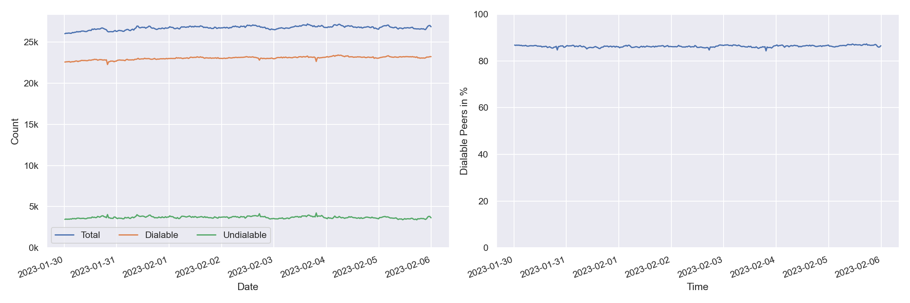
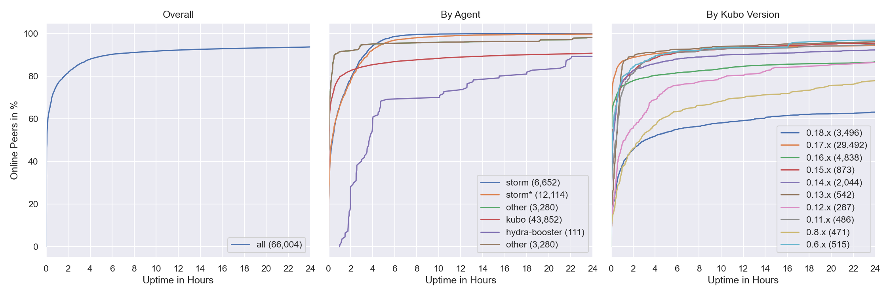
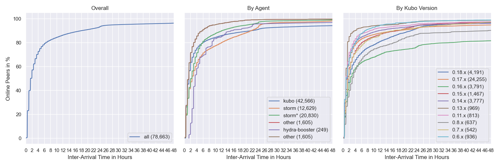
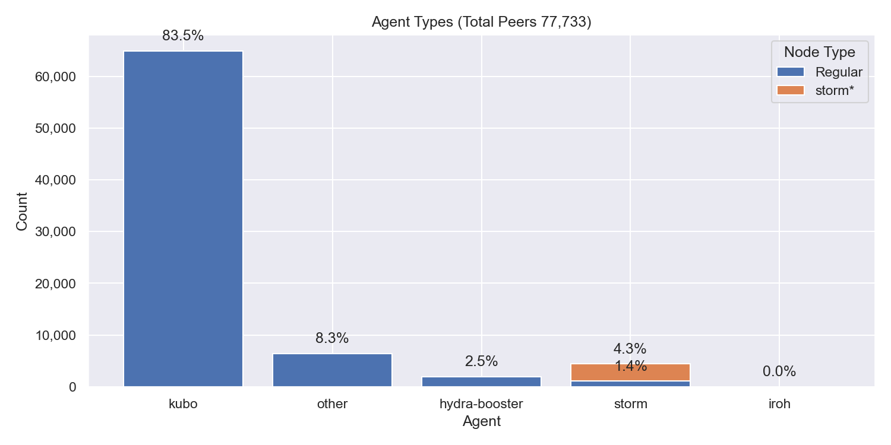
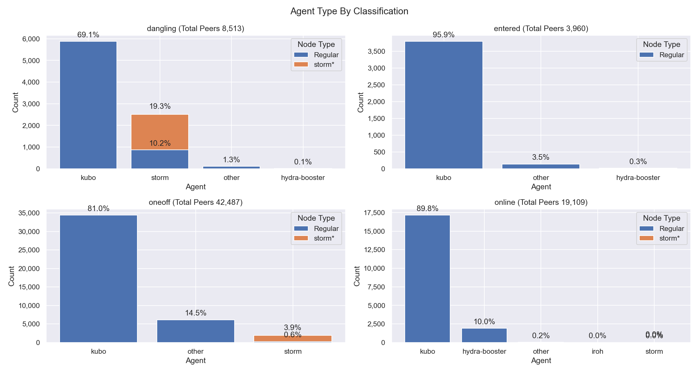
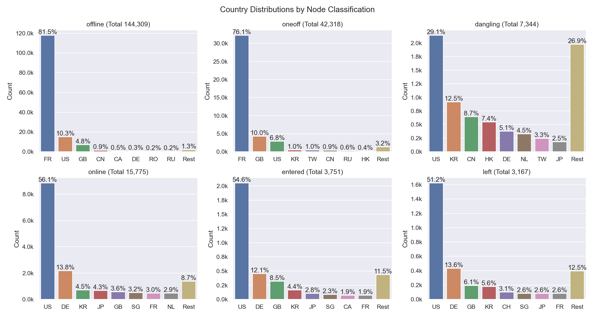
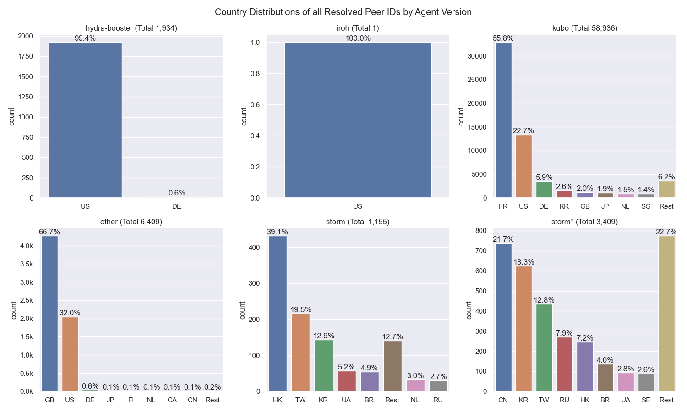

# Nebula Measurement Results Calendar Week 5 - 2023

## Table of Contents

- [Nebula Measurement Results Calendar Week 5 - 2023](#nebula-measurement-results-calendar-week-5---2023)
  - [Table of Contents](#table-of-contents)
  - [General Information](#general-information)
    - [Agent Versions](#agent-versions)
    - [Protocols](#protocols)
    - [Top 10 Rotating Nodes](#top-10-rotating-nodes)
    - [Crawls](#crawls)
      - [Overall](#overall)
      - [Classification](#classification)
      - [Agents](#agents)
      - [Total Peer IDs Discovered Classification](#total-peer-ids-discovered-classification)
      - [Protocols](#protocols-1)
  - [Churn](#churn)
  - [Inter Arrival Time](#inter-arrival-time)
  - [Agent Version Analysis](#agent-version-analysis)
    - [Overall](#overall-1)
    - [Kubo](#kubo)
    - [Classification](#classification-1)
  - [Geolocation](#geolocation)
    - [Unique IP Addresses](#unique-ip-addresses)
    - [Classification](#classification-2)
    - [Agents](#agents-1)
  - [Datacenters](#datacenters)
    - [Overall](#overall-2)
    - [Classification](#classification-3)
    - [Agents](#agents-2)
    - [Peer Classification](#peer-classification)
    - [Storm Specific Protocols](#storm-specific-protocols)

## General Information

The following results show measurement data that were collected in calendar week 5 in 2023 from `2023-01-30` to `2023-02-06`.

- Number of crawls `336`
- Number of visits `42,981,473`
  > Visiting a peer means dialing or connecting to it. Every time the crawler or monitoring process tries to dial or connect to a peer we consider this as _visiting_ it. Regardless of errors that may occur.
- Number of unique peer IDs visited `216,403`
- Number of unique peer IDs discovered in the DHT `216,275`
- Number of unique IP addresses found `54,465`

Timestamps are in UTC if not mentioned otherwise.

### Agent Versions

Newly discovered agent versions:

- `/go-ipfs/0.5.0-dev/35378ab` (2023-01-30 08:53:26)
- `kubo/0.18.1/675f8bd/docker` (2023-01-30 14:22:35)
- `kubo/0.18.1/675f8bd` (2023-01-30 15:51:12)
- `kubo/0.18.1/` (2023-01-30 18:21:35)
- `github.com/application-research/estuary@80ea1b477` (2023-01-30 18:51:04)
- `github.com/application-research/estuary@80ea1b477-dirty` (2023-01-30 18:51:15)
- `kubo/0.18.1/675f8bd/s̳̪̦̩̝͎͙͝u͍̫̺̝̱̰͝p̠͔̫͓̬̦` (2023-01-30 19:54:08)
- `kubo/0.18.1/675f8bddc` (2023-01-30 20:21:30)
- `kubo/0.19.0-dev/a3c70a11e-dirty` (2023-01-31 02:52:36)
- `kubo/0.19.0-dev/6819d9a/docker` (2023-01-31 08:22:48)
- `kubo/0.15.0/desktop` (2023-01-31 09:24:39)
- `kubo/0.18.1/VALGRIND` (2023-01-31 09:54:04)
- `kubo/0.18.1/DC` (2023-01-31 12:51:05)
- `go.vocdoni.io/dvote@ae0335b36-dirty` (2023-01-31 13:21:44)
- `github.com/application-research/autoretrieve@df83ba119` (2023-01-31 22:23:23)
- `github.com/application-research/autoretrieve@4a32b93ec` (2023-01-31 22:53:39)
- `github.com/application-research/autoretrieve@b5ddb9932` (2023-01-31 23:23:28)
- `kubo/0.19.0-dev/4e8271b10` (2023-01-31 23:23:28)
- `SybilNode@2e3246986-dirty` (2023-01-31 23:52:06)
- `kubo/0.18.1/675f8bd-dirty/docker` (2023-01-31 23:53:48)
- `github.com/application-research/autoretrieve@1d7d951b2` (2023-01-31 23:54:27)
- `github.com/application-research/autoretrieve@040eefcc1` (2023-02-01 03:23:39)
- `kubo/0.19.0-dev/4e8271b10-dirty` (2023-02-01 06:23:39)
- `kubo/0.18.1/desktop` (2023-02-01 08:53:08)
- `kubo/0.18.1/docker` (2023-02-01 08:53:23)
- `kubo/0.19.0-dev/3fb644a/docker` (2023-02-01 09:52:43)
- `go.vocdoni.io/dvote@582afb6e1-dirty` (2023-02-01 10:24:43)
- `0.7.4-downgrade-air-0dcc0ad-733-1.0` (2023-02-01 11:22:16)
- `go.vocdoni.io/dvote@d438ba8e8-dirty` (2023-02-01 18:52:16)
- `kubo/0.19.0-dev/dfb0ba8a4-dirty` (2023-02-01 22:22:15)
- `kubo/0.19.0-dev/14649aa/docker` (2023-02-02 08:24:32)
- `kubo/0.17.0-dev/b5b18e2/docker` (2023-02-02 09:54:33)
- `/go-ipfs/0.5.0-dev/0f6d6c47b` (2023-02-02 10:24:03)
- `github.com/application-research/autoretrieve@040450b31` (2023-02-02 20:52:43)
- `github.com/application-research/autoretrieve@58e68a336` (2023-02-02 21:22:43)
- `kubo/0.19.0-dev/386f61583-dirty` (2023-02-03 02:51:14)
- `/go-ipfs/0.5.0-dev/0f6d6c4-dirty` (2023-02-03 08:53:54)
- `0.7.4-test-antiddos-80afeb1-758-1.0` (2023-02-03 09:23:07)
- `main@0dacc27ab-dirty` (2023-02-03 16:51:18)
- `github.com/manishmeganathan/peerchat` (2023-02-03 17:22:41)
- `rust-libp2p/0.41.1` (2023-02-03 19:52:07)
- `main@880e89fdd-dirty` (2023-02-03 20:22:39)
- `main@40dc2aa62-dirty` (2023-02-04 16:54:38)
- `main@ce5d36ed3-dirty` (2023-02-05 00:22:46)
- `main@8afc837db-dirty` (2023-02-05 13:21:26)
- `main@8281426bd-dirty` (2023-02-05 19:51:21)
- `main@129294d40-dirty` (2023-02-05 21:51:53)
- `main@aaf25bafa-dirty` (2023-02-05 22:52:01)

Agent versions that were found to support at least one [storm specific protocol](#storm-specific-protocols):

- `go-ipfs/0.8.0/48f94e2`
- `storm`

### Protocols

Newly discovered protocols:

### Top 10 Rotating Nodes

A "rotating node" is a node (as identified by its IP address) that was found to host multiple peer IDs.

| IP-Address    | Country | Unique Peer IDs | Agent Versions | Datacenter IP |
|:------------- |:------- | ---------------:|:-------------- | ------------- |
| `141.94.68.144` | FR | 5066 | ['kubo/0.17.0/4485d6b71']| False  |
| `2001:41d0:304:200::41f5` | FR | 5066 | ['kubo/0.17.0/4485d6b71']| True  |
| `51.178.18.118` | FR | 5064 | ['kubo/0.17.0/4485d6b71']| True  |
| `2001:41d0:305:2100::a67` | FR | 5064 | ['kubo/0.17.0/4485d6b71']| True  |
| `51.210.151.221` | FR | 5006 | ['kubo/0.17.0/4485d6b71']| True  |
| `2001:41d0:304:200::41cd` | FR | 5006 | ['kubo/0.17.0/4485d6b71']| True  |
| `51.210.150.216` | FR | 5006 | ['kubo/0.17.0/4485d6b71']| True  |
| `2001:41d0:304:200::41da` | FR | 5006 | ['kubo/0.17.0/4485d6b71']| True  |
| `51.91.59.242` | FR | 4965 | ['kubo/0.17.0/4485d6b71']| True  |
| `2001:41d0:305:2100::2ae1` | FR | 4965 | ['kubo/0.17.0/4485d6b71']| True  |

### Crawls

#### Overall

#### Classification

#### Agents

Only the top 10 kubo versions appear in the right graph (due to lack of colors) based on the average count in the time interval. The `0.8.x` versions **do not** contain disguised storm peers.

`storm*` are `go-ipfs/0.8.0/48f94e2` peers that support at least one [storm specific protocol](#storm-specific-protocols).

#### Total Peer IDs Discovered Classification

In the specified time interval from `2023-01-30` to `2023-02-06` we visited `` unique peer IDs.
All peer IDs fall into one of the following classifications:

| Classification | Description |
| --- | --- |
| `offline` | A peer that was never seen online during the measurement period (always offline) but found in the DHT |
| `dangling` | A peer that was seen going offline and online multiple times during the measurement period |
| `oneoff` | A peer that was seen coming online and then going offline **only once** during the measurement period |
| `online` | A peer that was not seen offline at all during the measurement period (always online) |
| `left` | A peer that was online at the beginning of the measurement period, did go offline and didn't come back online |
| `entered` | A peer that was offline at the beginning of the measurement period but appeared within and didn't go offline since then |

#### Protocols

## Churn

Only the top 10 kubo versions appear in the right graph (due to lack of colors) based on the average count in the time interval. The `0.8.x` versions **do not** contain disguised storm peers. This graph also excludes peers that were online the whole time. You can read this graph as: if I see a peer joining the network, what's the likelihood for it to stay `X` hours in the network.

`storm*` are `go-ipfs/0.8.0/48f94e2` peers that support at least one [storm specific protocol](#storm-specific-protocols).

## Inter Arrival Time

Only the top 10 kubo versions appear in the right graph (due to lack of colors) based on the average count in the time interval. The `0.8.x` versions **do not** contain disguised storm peers.

`storm*` are `go-ipfs/0.8.0/48f94e2` peers that support at least one [storm specific protocol](#storm-specific-protocols).

## Agent Version Analysis

### Overall

Includes all peers that the crawler was able to connect to at least once: `dangling`, `online`, `oneoff`, `entered`. Hence, the total number of peers is lower as the graph excludes `offline` and `left` peers (see [classification](#peer-classification)).

### Kubo

`storm` shows the `go-ipfs/0.8.0/48f94e2` peers that support at least one [storm specific protocol](#storm-specific-protocols).

### Classification

The classifications are documented [here](#peer-classification).
`storm*` are `go-ipfs/0.8.0/48f94e2` peers that support at least one [storm specific protocol](#storm-specific-protocols).

## Geolocation

### Unique IP Addresses

This graph shows all IP addresses that we found from `2023-01-30` to `2023-02-06` in the DHT and their geolocation distribution by country.

### Classification

The classifications are documented [here](#peer-classification). 
The number in parentheses in the graph titles show the number of unique peer IDs that went into the specific subgraph.

### Agents

`storm*` are `go-ipfs/0.8.0/48f94e2` peers that support at least one [storm specific protocol](#storm-specific-protocols).

## Datacenters

### Overall

This graph shows all IP addresses that we found from `2023-01-30` to `2023-02-06` in the DHT and their datacenter association.

### Classification

The classifications are documented [here](#peer-classification). Note that the x-axes are different.

### Agents

The number in parentheses in the graph titles show the number of unique peer IDs that went into the specific subgraph.

`storm*` are `go-ipfs/0.8.0/48f94e2` peers that support at least one [storm specific protocol](#storm-specific-protocols).

### Peer Classification

| Classification | Description |
| --- | --- |
| `offline` | A peer that was never seen online during the measurement period (always offline) but found in the DHT |
| `dangling` | A peer that was seen going offline and online multiple times during the measurement period |
| `oneoff` | A peer that was seen coming online and then going offline **only once** during the measurement period |
| `online` | A peer that was not seen offline at all during the measurement period (always online) |
| `left` | A peer that was online at the beginning of the measurement period, did go offline and didn't come back online |
| `entered` | A peer that was offline at the beginning of the measurement period but appeared within and didn't go offline since then |

### Storm Specific Protocols

The following protocol strings are unique for `storm` nodes according to [this Bitdefender paper](https://www.bitdefender.com/files/News/CaseStudies/study/376/Bitdefender-Whitepaper-IPStorm.pdf):

- `/sreque/*`
- `/shsk/*`
- `/sfst/*`
- `/sbst/*`
- `/sbpcp/*`
- `/sbptp/*`
- `/strelayp/*`