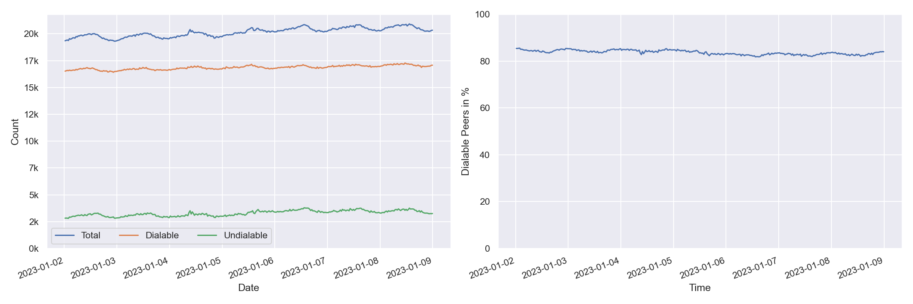
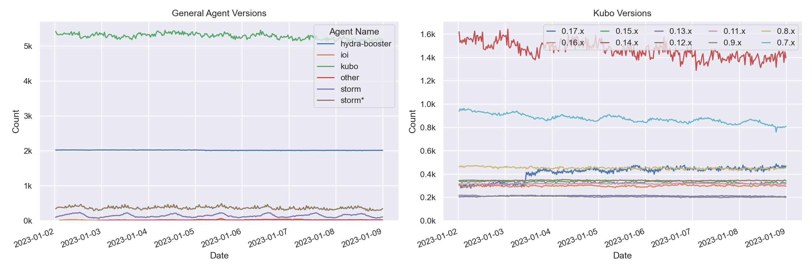
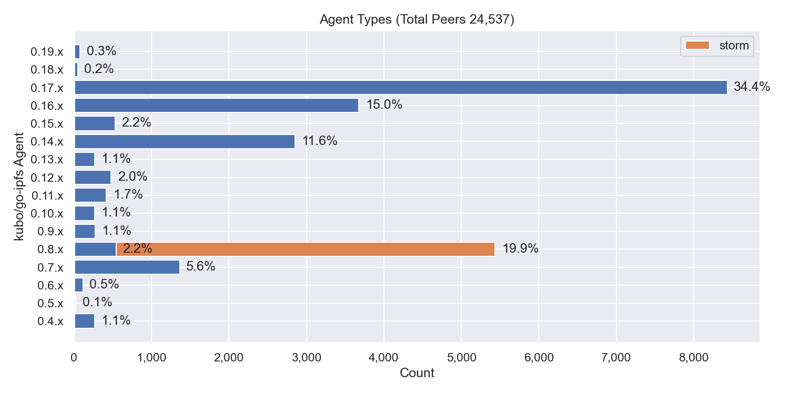
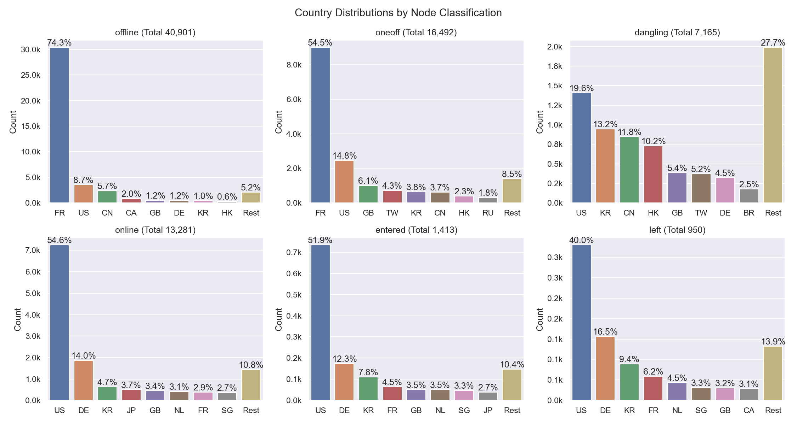
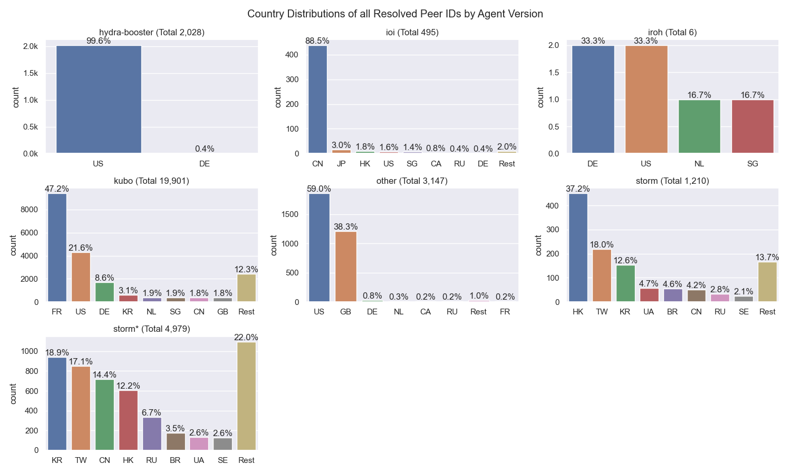
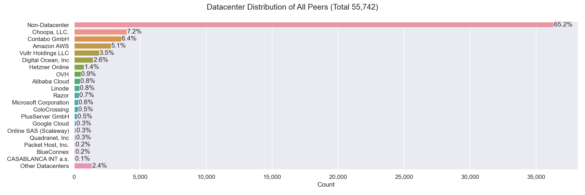
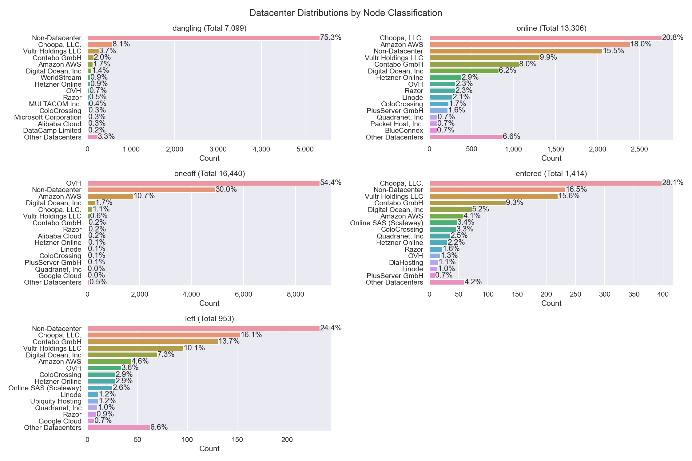
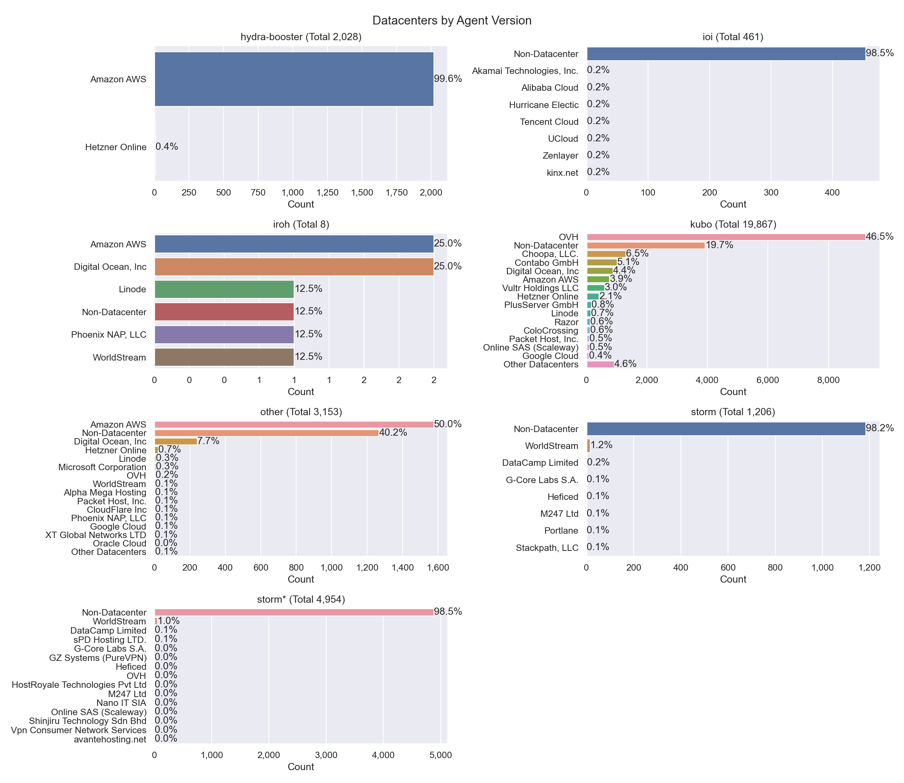

# Nebula Measurement Results Calendar Week 1 - 2023

## Table of Contents

- [General Information](#general-information)
  - [Agent Versions](#agent-versions)
  - [Protocols](#protocols)
  - [Classification](#classification)
  - [Top 10 Rotating Nodes](#top-10-rotating-nodes)
  - [Crawls](#crawls)
    - [Overall](#overall)
    - [By Agent Version](#by-agent-version)
- [Churn](#churn)
- [Inter Arrival Time](#inter-arrival-time)
- [Agent Version Analysis](#agent-version-analysis)
  - [Overall](#overall-1)
  - [Kubo](#kubo)
  - [Classification](#classification-1)
- [Geo location](#geo-location)
  - [Unique IP Addresses](#unique-ip-addresses)
  - [Classification](#classification-2)
  - [Agents](#agents)
- [Top Updating Peers](#top-updating-peers)
  - [Node classification:](#node-classification)
  - [IP Resolution Classification:](#ip-resolution-classification)
  - [Cloud Providers](#cloud-providers)
  - [Storm Specific Protocols](#storm-specific-protocols)

## General Information

The following results show measurement data that were collected in calendar week 1 in 2023 from `2023-01-02` to `2023-01-09`.

- Number of crawls `336`
- Number of visits `31,643,037`
  > Visiting a peer means dialing or connecting to it. Every time the crawler or monitoring process tries to dial or connect to a peer we consider this as _visiting_ it. Regardless of errors that may occur.
- Number of unique peer IDs visited `79,221`
- Number of unique IP addresses found `60,434`

Timestamps are in UTC if not mentioned otherwise.

### Agent Versions

Newly discovered agent versions:

- `kubo/0.19.0-dev/2d45b2d/s̳̪̦̩̝͎͙͝u͍̫̺̝̱̰͝p̠͔̫͓̬̦` (2023-01-02 13:21:40)
- `kubo/0.19.0-dev/d6921c6/docker` (2023-01-02 16:21:18)
- `kubo/0.19.0-dev/d6921c6d0-dirty` (2023-01-02 16:21:53)
- `kubo/0.19.0-dev/94f8f89` (2023-01-02 18:21:37)
- `go-ipfs/0.14.0-dev/5615715` (2023-01-03 00:51:53)
- `github.com/ipfs-shipyard/ipfs-counter` (2023-01-03 02:21:26)
- `kubo/0.19.0-dev/94f8f89/docker` (2023-01-03 11:52:11)
- `SybilNode@ee19f0e95-dirty` (2023-01-03 12:22:34)
- `go-ipfs/0.13.0/a3d13fc309` (2023-01-03 15:51:08)
- `github.com/application-research/estuary@05f80a9d5-dirty` (2023-01-03 15:51:30)
- `kubo/0.16.0/38117db6f-dirty` (2023-01-03 21:51:48)
- `go-qkfile/0.9.1/` (2023-01-03 23:52:33)
- `kubo/0.17.0-dev/38117db6f-dirty` (2023-01-04 02:51:47)
- `github.com/application-research/estuary@5d2f24f2a` (2023-01-04 07:22:23)
- `kubo/0.19.0-dev/94f8f89c4-dirty` (2023-01-04 11:51:13)
- `kubo/0.18.0-rc1/ae774a3/docker` (2023-01-04 13:21:45)
- `kubo/0.19.0-dev/8cdc86d/docker` (2023-01-04 13:52:08)
- `kubo/0.19.0-dev/8cdc86d8c-dirty` (2023-01-04 14:22:41)
- `kubo/0.18.0-rc2/6009292/s̳̪̦̩̝͎͙͝u͍̫̺̝̱̰͝p̠͔̫͓̬̦` (2023-01-04 16:21:03)
- `go-ipfs/0.13.0-dev/bc7ddef8d-dirty` (2023-01-04 16:21:30)
- `kubo/0.19.0-dev/94f8f89c4` (2023-01-04 16:21:36)
- `kubo/0.16.0-dev/` (2023-01-04 16:22:15)
- `kubo/0.18.0-rc2/` (2023-01-04 20:21:17)
- `kubo/0.19.0-dev/d386c43` (2023-01-05 01:51:33)
- `go-ipfs/0.7.0-rc2/` (2023-01-05 06:22:16)
- `kubo/0.19.0-dev/13155e5/docker` (2023-01-05 07:20:59)
- `p2pd/0.1` (2023-01-05 08:21:24)
- `kubo/0.19.0-dev/8cdc86d8c` (2023-01-05 11:21:21)
- `kubo/0.17.0/fd23d79` (2023-01-05 13:21:08)
- `github.com/cachengo/p2p-cli@e62cc20cd-dirty` (2023-01-05 13:21:17)
- `github.com/libp2p/go-libp2p/examples@82315917f` (2023-01-05 13:22:43)
- `go.vocdoni.io/dvote@a8b6494e6-dirty` (2023-01-05 15:53:00)
- `validation-bot@48952adb9` (2023-01-05 21:22:00)
- `kubo/0.19.0-dev/ca0396e/docker` (2023-01-05 22:22:41)
- `kubo/0.15.0-dev/cb280cb` (2023-01-06 04:53:01)
- `kubo/0.19.0-dev/73e6ade10-dirty` (2023-01-06 08:23:09)
- `kubo/0.19.0-dev/73e6ade10` (2023-01-06 09:20:58)
- `kubo/0.19.0-dev/5f2c81466-dirty` (2023-01-06 09:51:16)
- `go.vocdoni.io/dvote@2969ef7a2-dirty` (2023-01-07 00:21:57)
- `kubo/0.19.0-dev/ca0396e` (2023-01-08 06:51:13)
- `rust-ipfs` (2023-01-08 10:21:55)

Agent versions that were found to support at least one [storm specific protocol](#storm-specific-protocols):

- `go-ipfs/0.8.0/48f94e2`
- `storm`

### Protocols

Newly discovered protocols:

- `/availability/1.0.0` (2023-01-02 11:22:54)
- `/interaction/1.0.0` (2023-01-02 11:22:54)
- `netEcho/1.0.0` (2023-01-04 13:22:02)
- `albert_state_averager::TrainingStateAverager.rpc_join_group` (2023-01-05 08:21:24)
- `albert_grad_averager::GradientAverager.rpc_download_state` (2023-01-05 08:21:24)
- `albert_grad_averager::GradientAverager.rpc_join_group` (2023-01-05 08:21:24)
- `albert_grad_averager::GradientAverager.rpc_aggregate_part` (2023-01-05 08:21:24)
- `albert_state_averager::TrainingStateAverager.rpc_download_state` (2023-01-05 08:21:24)
- `DHTProtocol.rpc_store` (2023-01-05 08:21:24)
- `DHTProtocol.rpc_ping` (2023-01-05 08:21:24)
- `DHTProtocol.rpc_find` (2023-01-05 08:21:24)
- `albert_state_averager::TrainingStateAverager.rpc_aggregate_part` (2023-01-05 08:21:24)
- `/cachengo/p2p/1.0.0` (2023-01-05 13:21:17)
- `/cachengo/tun/0.0.1` (2023-01-05 13:21:17)
- `61965f9471dcb020809aaff088bd0b1f28e6473c8e3c4a1fb9fdd48f4ae95163` (2023-01-05 15:53:00)
- `/asmb/maons/1.0.0` (2023-01-05 18:51:04)
- `/warp/sync/0.0.1` (2023-01-08 10:21:55)

### Classification

In the specified time interval from `2023-01-02` to `2023-01-09` we visited `79,221` unique peer IDs.
All peer IDs fall into one of the following classifications:

| Classification | Description |
| --- | --- |
| `offline` | A peer that was never seen online during the measurement period (always offline) but found in the DHT |
| `dangling` | A peer that was seen going offline and online multiple times during the measurement period |
| `oneoff` | A peer that was seen coming online and then going offline **only once** during the measurement period |
| `online` | A peer that was not seen offline at all during the measurement period (always online) |
| `left` | A peer that was online at the beginning of the measurement period, did go offline and didn't come back online |
| `entered` | A peer that was offline at the beginning of the measurement period but appeared within and didn't go offline since then |

### Top 10 Rotating Nodes

A "rotating node" is a node (as identified by its IP address) that was found to host multiple peer IDs.

| IP-Address    | Country | Unique Peer IDs | Agent Versions | Datacenter IP |
|:------------- |:------- | ---------------:|:-------------- | ------------- |
| `146.59.151.243` | FR | 2077 | ['kubo/0.16.0/38117db6f']| True  |
| `2001:41d0:304:200::de76` | FR | 2077 | ['kubo/0.16.0/38117db6f']| True  |
| `2001:41d0:304:200::25e6` | FR | 2069 | ['kubo/0.17.0/4485d6b71']| True  |
| `51.178.43.200` | FR | 2069 | ['kubo/0.17.0/4485d6b71']| True  |
| `2001:41d0:305:2100::2f60` | FR | 1653 | ['kubo/0.17.0/4485d6b71']| True  |
| `51.91.58.123` | FR | 1653 | ['kubo/0.17.0/4485d6b71']| True  |
| `51.91.59.242` | FR | 1640 | ['kubo/0.17.0/4485d6b71']| True  |
| `2001:41d0:305:2100::2ae1` | FR | 1640 | ['kubo/0.17.0/4485d6b71']| True  |
| `54.187.21.48` | US | 1561 | ['kubo/0.17.0/4485d6b71', 'SybilNode@347fc79bf-dirty']| True  |
| `51.178.18.118` | FR | 1473 | ['kubo/0.17.0/4485d6b71']| True  |

### Crawls

#### Overall

#### Agents

Only the top 10 kubo versions appear in the right graph (due to lack of colors) based on the average count in the time interval. The `0.8.x` versions **do not** contain disguised storm peers.

`storm*` are `go-ipfs/0.8.0/48f94e2` peers that support at least one [storm specific protocol](#storm-specific-protocols).

## Churn

Only the top 10 kubo versions appear in the right graph (due to lack of colors) based on the average count in the time interval. The `0.8.x` versions **do not** contain disguised storm peers. This graph also excludes peers that were online the whole time. You can read this graph as: if I see a peer joining the network, what's the likelihood for it to stay `X` hours in the network.

`storm*` are `go-ipfs/0.8.0/48f94e2` peers that support at least one [storm specific protocol](#storm-specific-protocols).

## Inter Arrival Time

Only the top 10 kubo versions appear in the right graph (due to lack of colors) based on the average count in the time interval. The `0.8.x` versions **do not** contain disguised storm peers.

`storm*` are `go-ipfs/0.8.0/48f94e2` peers that support at least one [storm specific protocol](#storm-specific-protocols).

## Agent Version Analysis

### Overall

Includes all peers that the crawler was able to connect to at least once: `dangling`, `online`, `oneoff`, `entered`. Hence, the total number of peers is lower as the graph excludes `offline` and `left` peers (see [classification](#peer-classification)).

### Kubo

`storm` shows the `go-ipfs/0.8.0/48f94e2` peers that support at least one [storm specific protocol](#storm-specific-protocols).

### Classification

The classifications are documented [here](#peer-classification).
`storm*` are `go-ipfs/0.8.0/48f94e2` peers that support at least one [storm specific protocol](#storm-specific-protocols).

## Geolocation

### Unique IP Addresses

This graph shows all IP addresses that we found from `2023-01-02` to `2023-01-09` in the DHT and their geolocation distribution by country.

### Classification

The classifications are documented [here](#peer-classification). 
The number in parentheses in the graph titles show the number of unique peer IDs that went into the specific subgraph.

### Agents

`storm*` are `go-ipfs/0.8.0/48f94e2` peers that support at least one [storm specific protocol](#storm-specific-protocols).

## Datacenters

### Overall

This graph shows all IP addresses that we found from `2023-01-02` to `2023-01-09` in the DHT and their datacenter association.

### Classification

The classifications are documented [here](#peer-classification). Note that the x-axes are different.

### Agents

The number in parentheses in the graph titles show the number of unique peer IDs that went into the specific subgraph.

`storm*` are `go-ipfs/0.8.0/48f94e2` peers that support at least one [storm specific protocol](#storm-specific-protocols).

## Top Updating Peers

An "updating peer" is a peer that we observed with multiple agent versions.  

| Peer ID           | Final Agent Version     | Number of Transitions | Distinct Agent Versions | Number of Distinct AVs |
|:----------------- |:------------ | ------------- |:------------ | -------------- |
| `12D3KooWHPSQJQhE...` | `kubo/0.16.0/38117db` | 124  | kubo/0.14.0/ kubo/0.16.0/38117db | 2 |
| `12D3KooWQcDBKQcu...` | `go-ipfs/0.8.0/` | 117  | go-ipfs/0.11.0/ go-ipfs/0.8.0/ | 2 |
| `12D3KooWNgxATDv4...` | `go-ipfs/0.13.0/` | 93  | go-ipfs/0.13.0/ go-ipfs/0.8.0/ | 2 |
| `12D3KooWAmVgeLTa...` | `go-ipfs/0.11.0/` | 78  | go-ipfs/0.11.0/ go-ipfs/0.12.0/ | 2 |
| `12D3KooWRgupzq5n...` | `go-ipfs/0.12.0/cd3e791-dirty` | 4  | go-ipfs/0.12.0/06191dfef-dirty go-ipfs/0.12.0/cd3e791-dirty | 2 |
| `12D3KooWLraDoZcE...` | `kubo/0.19.0-dev/ca0396e/docker` | 4  | kubo/0.19.0-dev/13155e5/docker kubo/0.19.0-dev/8cdc86d/docker kubo/0.19.0-dev/94f8f89/docker kubo/0.19.0-dev/ca0396e/docker | 4 |
| `12D3KooWM4PddDjH...` | `kubo/0.16.0/` | 3  | kubo/0.16.0/ kubo/0.17.0/4485d6b71 | 2 |
| `12D3KooWK2mqKoGU...` | `kubo/0.19.0-dev/ca0396e/docker` | 3  | kubo/0.19.0-dev/8cdc86d/docker kubo/0.19.0-dev/94f8f89/docker kubo/0.19.0-dev/ca0396e/docker | 3 |
| `Qmdex5yxScjFL8QV...` | `kubo/0.19.0-dev/ca0396e` | 3  | kubo/0.19.0-dev/94f8f89 kubo/0.19.0-dev/ca0396e kubo/0.19.0-dev/d386c43 | 3 |
| `12D3KooWGu75WrEg...` | `kubo/0.17.0/4485d6b71` | 3  | kubo/0.17.0/ kubo/0.17.0/4485d6b71 | 2 |

### Peer Classification

| Classification | Description |
| --- | --- |
| `offline` | A peer that was never seen online during the measurement period (always offline) but found in the DHT |
| `dangling` | A peer that was seen going offline and online multiple times during the measurement period |
| `oneoff` | A peer that was seen coming online and then going offline **only once** during the measurement period |
| `online` | A peer that was not seen offline at all during the measurement period (always online) |
| `left` | A peer that was online at the beginning of the measurement period, did go offline and didn't come back online |
| `entered` | A peer that was offline at the beginning of the measurement period but appeared within and didn't go offline since then |

### Storm Specific Protocols

The following protocol strings are unique for `storm` nodes according to [this Bitdefender paper](https://www.bitdefender.com/files/News/CaseStudies/study/376/Bitdefender-Whitepaper-IPStorm.pdf):

- `/sreque/*`
- `/shsk/*`
- `/sfst/*`
- `/sbst/*`
- `/sbpcp/*`
- `/sbptp/*`
- `/strelayp/*`