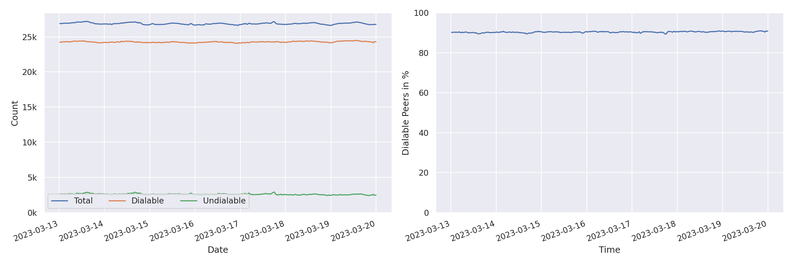
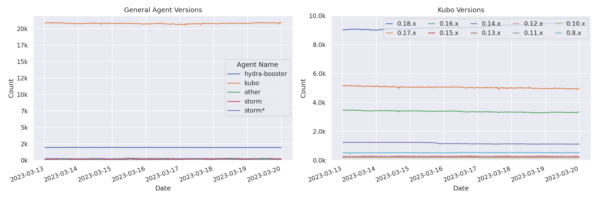
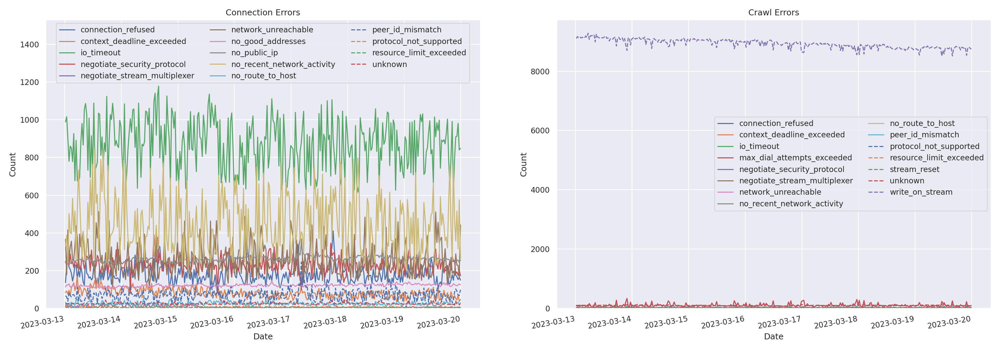
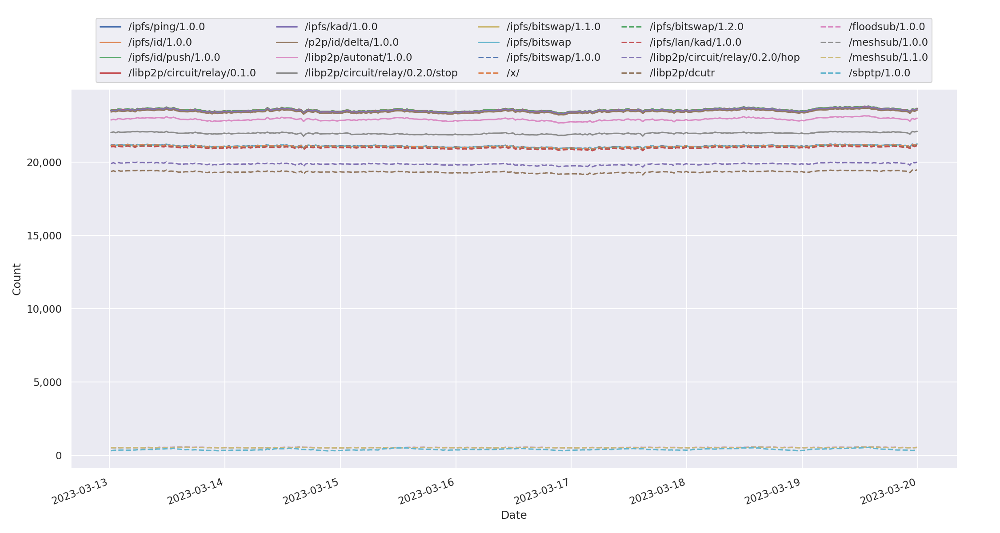
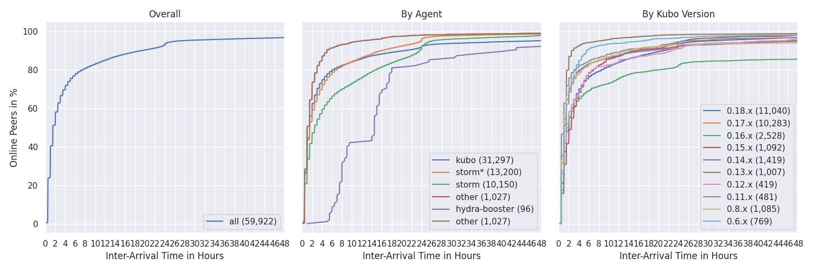
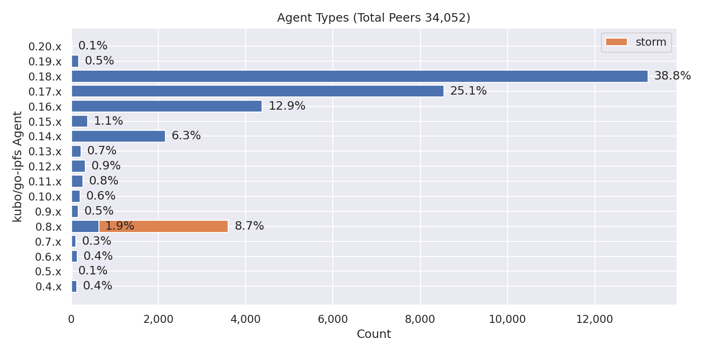
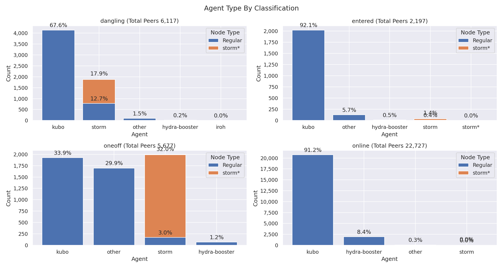
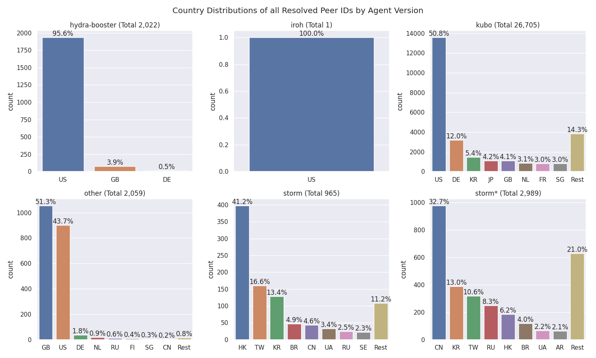
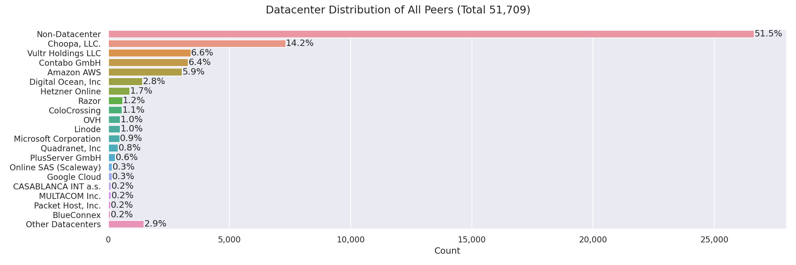
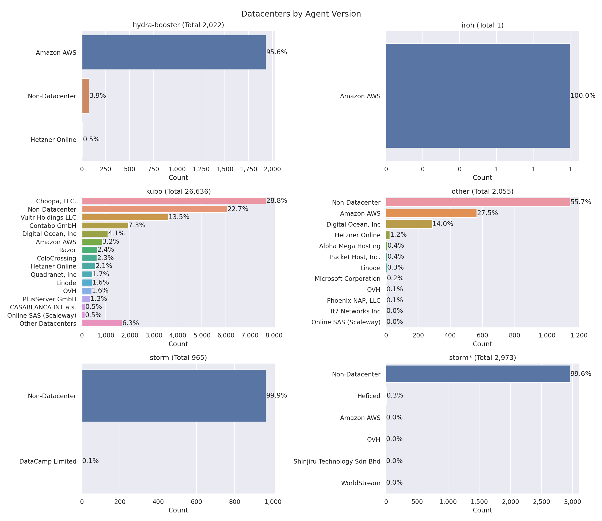

# Nebula Measurement Results Calendar Week 11 - 2023

## Table of Contents

- [General Information](#general-information)
  - [Agent Versions](#agent-versions)
  - [Protocols](#protocols)
  - [Classification](#classification)
  - [Top 10 Rotating Nodes](#top-10-rotating-nodes)
  - [Crawls](#crawls)
    - [Overall](#overall)
    - [By Agent Version](#by-agent-version)
- [Churn](#churn)
- [Inter Arrival Time](#inter-arrival-time)
- [Agent Version Analysis](#agent-version-analysis)
  - [Overall](#overall-1)
  - [Kubo](#kubo)
  - [Classification](#classification-1)
- [Geo location](#geo-location)
  - [Unique IP Addresses](#unique-ip-addresses)
  - [Classification](#classification-2)
  - [Agents](#agents)
- [Top Updating Peers](#top-updating-peers)
  - [Node classification:](#node-classification)
  - [IP Resolution Classification:](#ip-resolution-classification)
  - [Cloud Providers](#cloud-providers)
  - [Storm Specific Protocols](#storm-specific-protocols)

## General Information

The following results show measurement data that were collected in calendar week 11 in 2023 from `2023-03-13` to `2023-03-20`.

- Number of crawls `335`
- Number of visits `45,297,812`
  > Visiting a peer means dialing or connecting to it. Every time the crawler or monitoring process tries to dial or connect to a peer we consider this as _visiting_ it. Regardless of errors that may occur.
- Number of unique peer IDs visited `43,661`
- Number of unique peer IDs discovered in the DHT `43,561`
- Number of unique IP addresses found `53,639`

Timestamps are in UTC if not mentioned otherwise.

### Agent Versions

Newly discovered agent versions:

- `kubo/0.19.0-dev/d1541e1d3-dirty` (2023-03-13 06:53:15)
- `github.com/application-research/estuary@5b5dbe61f` (2023-03-13 08:52:09)
- `github.com/application-research/estuary@874bb6e12` (2023-03-13 08:52:55)
- `github.com/photon-storage/go-photon@dacdd40cc` (2023-03-13 11:21:29)
- `github.com/photon-storage/go-photon@cb421b691-dirty` (2023-03-13 12:22:01)
- `github.com/photon-storage/go-photon@da9c5602b` (2023-03-13 12:51:40)
- `github.com/mearaj/protonet@b57524310-dirty` (2023-03-13 13:52:02)
- `0.8.3-tokio-7170aa0-1291-1.0` (2023-03-13 15:21:42)
- `delta@c662b5a57` (2023-03-14 02:51:14)
- `delta@c662b5a57-dirty` (2023-03-14 02:52:11)
- `github.com/photon-storage/go-photon@3635b5c1b` (2023-03-14 05:53:35)
- `delta@92b983794-dirty` (2023-03-14 13:22:31)
- `main@d1cc2f294-dirty` (2023-03-14 15:54:26)
- `kubo/0.20.0-dev/5b9442c/docker` (2023-03-14 18:22:03)
- `kubo/0.18.1/675f8bd/filebase` (2023-03-14 18:52:13)
- `kubo/0.20.0-dev/182ec03/docker` (2023-03-14 20:21:52)
- `0.8.3-tokio-b41b02a-1342-1.0` (2023-03-15 09:21:14)
- `kubo/0.20.0-dev/1f5763f/docker` (2023-03-15 10:23:44)
- `kubo/0.20.0-dev/4a6c8d5/docker` (2023-03-15 11:53:31)
- `kubo/0.20.0-dev/4a6c8d5` (2023-03-15 13:23:03)
- `github.com/application-research/estuary@66a41e8d8` (2023-03-15 15:51:01)
- `validation-bot@bd44f952a` (2023-03-15 16:21:54)
- `validation-bot@0da413c6d` (2023-03-15 20:53:38)
- `github.com/application-research/estuary@ebe47c94e` (2023-03-15 21:20:56)
- `main@afb5e3386-dirty` (2023-03-15 21:22:47)
- `kubo/0.20.0-dev/676e557/docker` (2023-03-16 00:51:35)
- `delta@2aaa416f8-dirty` (2023-03-16 02:22:23)
- `kubo/0.20.0-dev/684d9dc79` (2023-03-16 10:52:51)
- `dagim.at/mychat@` (2023-03-16 12:21:12)
- `github.com/gloflow/gloflow@5d591e703-dirty` (2023-03-16 12:21:18)
- `validation-bot@5cafc0e62` (2023-03-16 18:22:49)
- `validation-bot@7e8eb03a3` (2023-03-16 19:22:49)
- `delta@eaa7ff22f-dirty` (2023-03-16 19:51:58)
- `kubo/0.20.0-dev/51eabd46d` (2023-03-16 20:21:34)
- `delta@6cffb92dd-dirty` (2023-03-16 22:51:51)
- `delta@f07487dd2-dirty` (2023-03-16 23:21:15)
- `main@ef7cf7ce7-dirty` (2023-03-16 23:22:21)
- `SybilNode@ef7cf7ce7-dirty` (2023-03-17 00:54:17)
- `validation-bot@4fcc57320` (2023-03-17 03:23:39)
- `kubo/0.20.0-dev/51eabd4` (2023-03-17 06:23:09)
- `kubo/0.20.0-dev/51eabd4/docker` (2023-03-17 07:23:34)
- `kubo/0.20.0-dev/51eabd46d-dirty` (2023-03-17 15:51:33)
- `github.com/application-research/estuary@ebe47c94e-dirty` (2023-03-17 17:22:37)
- `kubo/0.20.0-dev/63b2a0e06` (2023-03-17 17:23:59)
- `kubo/0.20.0-dev/63b2a0e/docker` (2023-03-17 19:53:35)
- `github.com/mearaj/protonet@e4cd5814e-dirty` (2023-03-18 08:21:45)
- `kubo/0.19.0-dev/ed4d6b7-dirty` (2023-03-18 08:51:28)
- `kubo/0.20.0-dev/5b9442cfe-dirty` (2023-03-18 12:52:30)
- `delta@579ec0d85-dirty` (2023-03-19 03:21:12)
- `libp2p-chat@6970a6701-dirty` (2023-03-19 06:22:35)
- `rust-libp2p/0.42.0` (2023-03-19 17:23:45)

Agent versions that were found to support at least one [storm specific protocol](#storm-specific-protocols):

- `go-ipfs/0.8.0/48f94e2`
- `storm`

### Protocols

Newly discovered protocols:

- `/text/1.0.0` (2023-03-15 09:53:05)
- `/file/1.0.0` (2023-03-15 09:53:05)
- `/bench/1.0.0` (2023-03-15 09:53:05)
- `/audio/1.0.0` (2023-03-15 09:53:05)
- `/cmd/1.0.0` (2023-03-15 09:53:05)
- `/p2p/rpc/knode` (2023-03-16 06:51:37)

### Top 10 Rotating Nodes

A "rotating node" is a node (as identified by its IP address) that was found to host multiple peer IDs.

| IP-Address    | Country | Unique Peer IDs | Agent Versions | Datacenter IP |
|:------------- |:------- | ---------------:|:-------------- | ------------- |
| `193.60.241.98` | GB | 1136 | ['hydra-booster/0.7.4', 'kubo/0.15.0/3ae52a41e', 'main@d1cc2f294-dirty', 'SybilNode@d54ece3ca-dirty', 'SybilNode@ee19f0e95-dirty']| False  |
| `54.187.21.48` | US | 544 | ['kubo/0.17.0/4485d6b71', 'main@afb5e3386-dirty', 'main@ef7cf7ce7-dirty', 'SybilNode@9ebc0a872-dirty', 'SybilNode@ef7cf7ce7-dirty']| True  |
| `159.203.76.161` | US | 269 | ['github.com/ipfs-shipyard/ipfs-counter']| True  |
| `117.174.25.136` | CN | 63 | ['go-ipfs/0.8.0/cc95853']| False  |
| `111.9.31.185` | CN | 62 | ['go-ipfs/0.8.0/cc95853']| False  |
| `117.174.25.135` | CN | 62 | ['go-ipfs/0.8.0/cc95853']| False  |
| `183.222.63.187` | CN | 62 | ['go-ipfs/0.8.0/cc95853']| False  |
| `183.222.63.181` | CN | 62 | ['go-ipfs/0.8.0/cc95853']| False  |
| `117.174.25.137` | CN | 62 | ['go-ipfs/0.8.0/cc95853']| False  |
| `183.222.63.208` | CN | 62 | ['go-ipfs/0.8.0/cc95853']| False  |

### Crawls

#### Overall

#### Classification

#### Agents

Only the top 10 kubo versions appear in the right graph (due to lack of colors) based on the average count in the time interval. The `0.8.x` versions **do not** contain disguised storm peers.

`storm*` are `go-ipfs/0.8.0/48f94e2` peers that support at least one [storm specific protocol](#storm-specific-protocols).

#### Errors

#### Total Peer IDs Discovered Classification

In the specified time interval from `2023-03-13` to `2023-03-20` we visited `` unique peer IDs.
All peer IDs fall into one of the following classifications:

| Classification | Description |
| --- | --- |
| `offline` | A peer that was never seen online during the measurement period (always offline) but found in the DHT |
| `dangling` | A peer that was seen going offline and online multiple times during the measurement period |
| `oneoff` | A peer that was seen coming online and then going offline **only once** during the measurement period |
| `online` | A peer that was not seen offline at all during the measurement period (always online) |
| `left` | A peer that was online at the beginning of the measurement period, did go offline and didn't come back online |
| `entered` | A peer that was offline at the beginning of the measurement period but appeared within and didn't go offline since then |

#### Protocols

## Churn

Only the top 10 kubo versions appear in the right graph (due to lack of colors) based on the average count in the time interval. The `0.8.x` versions **do not** contain disguised storm peers. This graph also excludes peers that were online the whole time. You can read this graph as: if I see a peer joining the network, what's the likelihood for it to stay `X` hours in the network.

`storm*` are `go-ipfs/0.8.0/48f94e2` peers that support at least one [storm specific protocol](#storm-specific-protocols).

## Inter Arrival Time

Only the top 10 kubo versions appear in the right graph (due to lack of colors) based on the average count in the time interval. The `0.8.x` versions **do not** contain disguised storm peers.

`storm*` are `go-ipfs/0.8.0/48f94e2` peers that support at least one [storm specific protocol](#storm-specific-protocols).

## Agent Version Analysis

### Overall

Includes all peers that the crawler was able to connect to at least once: `dangling`, `online`, `oneoff`, `entered`. Hence, the total number of peers is lower as the graph excludes `offline` and `left` peers (see [classification](#peer-classification)).

### Kubo

`storm` shows the `go-ipfs/0.8.0/48f94e2` peers that support at least one [storm specific protocol](#storm-specific-protocols).

### Classification

The classifications are documented [here](#peer-classification).
`storm*` are `go-ipfs/0.8.0/48f94e2` peers that support at least one [storm specific protocol](#storm-specific-protocols).

## Geolocation

### Unique IP Addresses

This graph shows all IP addresses that we found from `2023-03-13` to `2023-03-20` in the DHT and their geolocation distribution by country.

### Classification

The classifications are documented [here](#peer-classification). 
The number in parentheses in the graph titles show the number of unique peer IDs that went into the specific subgraph.

### Agents

`storm*` are `go-ipfs/0.8.0/48f94e2` peers that support at least one [storm specific protocol](#storm-specific-protocols).

## Datacenters

### Overall

This graph shows all IP addresses that we found from `2023-03-13` to `2023-03-20` in the DHT and their datacenter association.

### Classification

The classifications are documented [here](#peer-classification). Note that the x-axes are different.

### Agents

The number in parentheses in the graph titles show the number of unique peer IDs that went into the specific subgraph.

`storm*` are `go-ipfs/0.8.0/48f94e2` peers that support at least one [storm specific protocol](#storm-specific-protocols).

### Peer Classification

| Classification | Description |
| --- | --- |
| `offline` | A peer that was never seen online during the measurement period (always offline) but found in the DHT |
| `dangling` | A peer that was seen going offline and online multiple times during the measurement period |
| `oneoff` | A peer that was seen coming online and then going offline **only once** during the measurement period |
| `online` | A peer that was not seen offline at all during the measurement period (always online) |
| `left` | A peer that was online at the beginning of the measurement period, did go offline and didn't come back online |
| `entered` | A peer that was offline at the beginning of the measurement period but appeared within and didn't go offline since then |

### Storm Specific Protocols

The following protocol strings are unique for `storm` nodes according to [this Bitdefender paper](https://www.bitdefender.com/files/News/CaseStudies/study/376/Bitdefender-Whitepaper-IPStorm.pdf):

- `/sreque/*`
- `/shsk/*`
- `/sfst/*`
- `/sbst/*`
- `/sbpcp/*`
- `/sbptp/*`
- `/strelayp/*`