# Nebula Measurement Results Calendar Week 41 - 2023

## Table of Contents

- [Nebula Measurement Results Calendar Week 41 - 2023](#nebula-measurement-results-calendar-week-41---2023)
  - [Table of Contents](#table-of-contents)
  - [General Information](#general-information)
    - [Protocols](#protocols)
    - [Crawls](#crawls)
      - [Overall](#overall)
      - [Classification](#classification)
      - [Agents](#agents)
      - [Errors](#errors)
      - [Total Peer IDs Discovered Classification](#total-peer-ids-discovered-classification)
      - [Protocols](#protocols-1)
  - [Churn](#churn)
  - [Inter Arrival Time](#inter-arrival-time)
  - [Agent Version Analysis](#agent-version-analysis)
    - [Overall](#overall-1)
    - [Parity Polkadot](#parity-polkadot)
    - [Moonbeam Parachain Collator](#moonbeam-parachain-collator)
    - [Robonomics Network Parachain Collator](#robonomics-network-parachain-collator)
    - [Polkadot parachain](#polkadot-parachain)
    - [Classification](#classification-1)
  - [Geolocation](#geolocation)
    - [Unique IP Addresses](#unique-ip-addresses)
    - [Classification](#classification-2)
    - [Agents](#agents-1)
  - [Datacenters](#datacenters)
    - [Overall](#overall-2)
    - [Classification](#classification-3)
    - [Agents](#agents-2)
    - [Peer Classification](#peer-classification)

## General Information

The following results show measurement data that were collected in calendar week 41 in 2023 from `2023-10-09` to `2023-10-16`.

- Number of crawls `336`
- Number of visits `8,636,495`
  > Visiting a peer means dialing or connecting to it. Every time the crawler or monitoring process tries to dial or connect to a peer we consider this as _visiting_ it. Regardless of errors that may occur.
- Number of unique peer IDs visited `17,528`
- Number of unique peer IDs discovered in the DHT `17,328`
- Number of unique IP addresses found `8,769`

Timestamps are in UTC if not mentioned otherwise.

### Protocols

Newly discovered protocols:

- `/91b171bb158e2d3848fa23a9f1c25182fb8e20313b2c1eb49219da7a70ce90c3/collation/2` (2023-10-13 15:46:32)
- `/91b171bb158e2d3848fa23a9f1c25182fb8e20313b2c1eb49219da7a70ce90c3/validation/2` (2023-10-13 15:46:32)

### Crawls

#### Overall

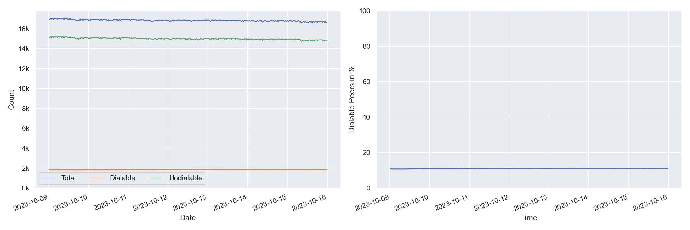

#### Classification

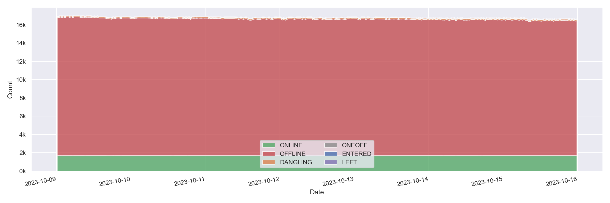

#### Agents

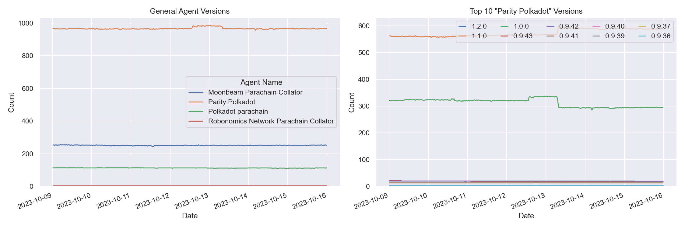

Only the top 10 "Parity Polkadot" versions appear in the right graph (due to lack of colors) based on the average count in the time interval.

#### Errors

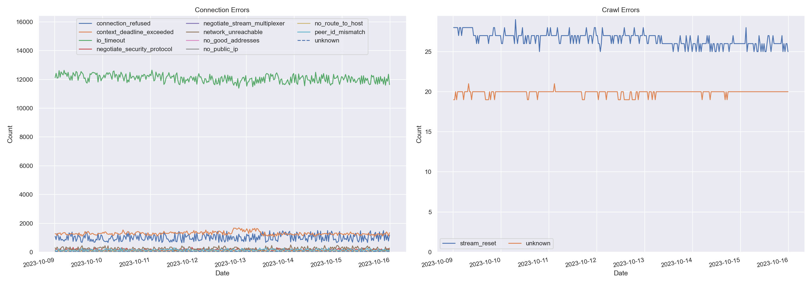

#### Total Peer IDs Discovered Classification

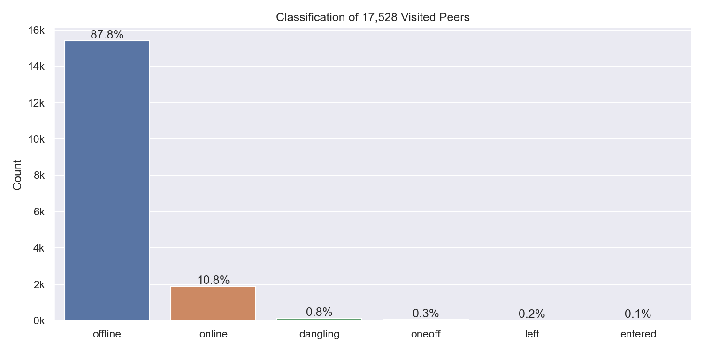

In the specified time interval from `2023-10-09` to `2023-10-16` we visited `17,528` unique peer IDs.
All peer IDs fall into one of the following classifications:

| Classification | Description |
| --- | --- |
| `offline` | A peer that was never seen online during the measurement period (always offline) but found in the DHT |
| `dangling` | A peer that was seen going offline and online multiple times during the measurement period |
| `oneoff` | A peer that was seen coming online and then going offline **only once** during the measurement period |
| `online` | A peer that was not seen offline at all during the measurement period (always online) |
| `left` | A peer that was online at the beginning of the measurement period, did go offline and didn't come back online |
| `entered` | A peer that was offline at the beginning of the measurement period but appeared within and didn't go offline since then |

#### Protocols

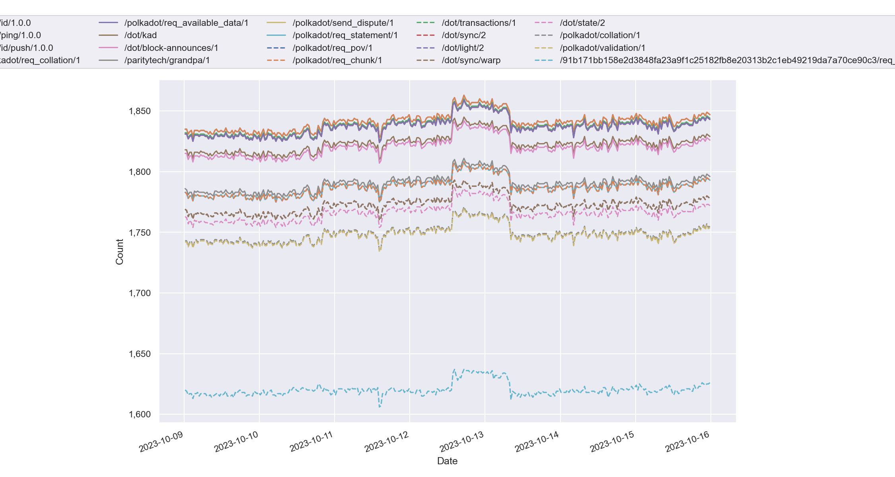

## Churn

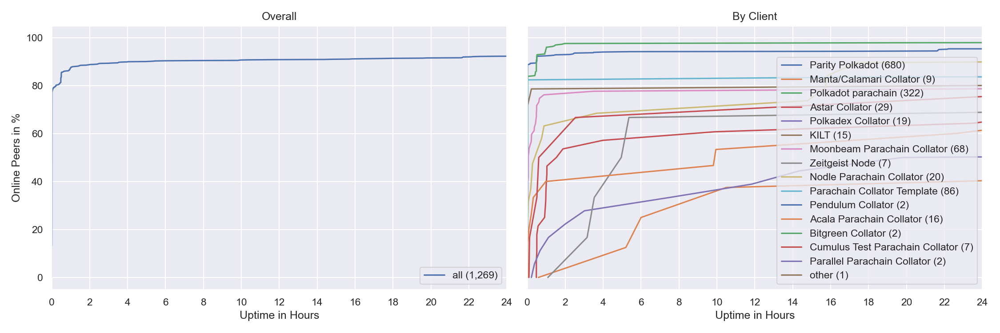

Both graphs exclude peers that were online the whole time. You can read this graph as: if I see a peer joining the network, what's the likelihood for it to stay `X` hours in the network.

## Inter Arrival Time

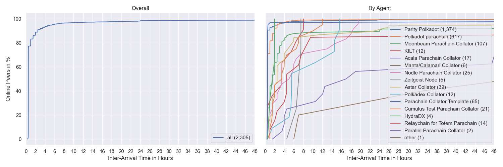

## Agent Version Analysis

### Overall

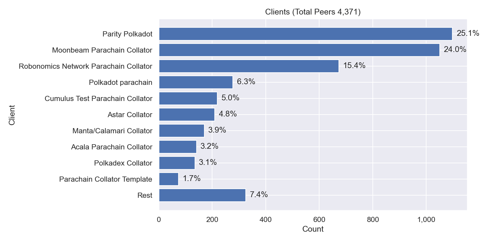

Includes all peers that the crawler was able to connect to at least once: `dangling`, `online`, `oneoff`, `entered`. Hence, the total number of peers is lower as the graph excludes `offline` and `left` peers (see [classification](#peer-classification)).

### Parity Polkadot

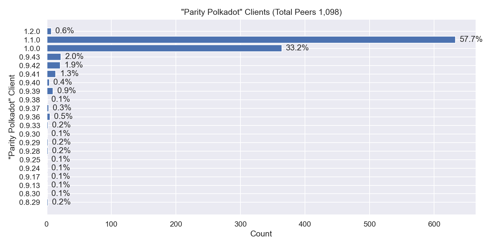

### Moonbeam Parachain Collator

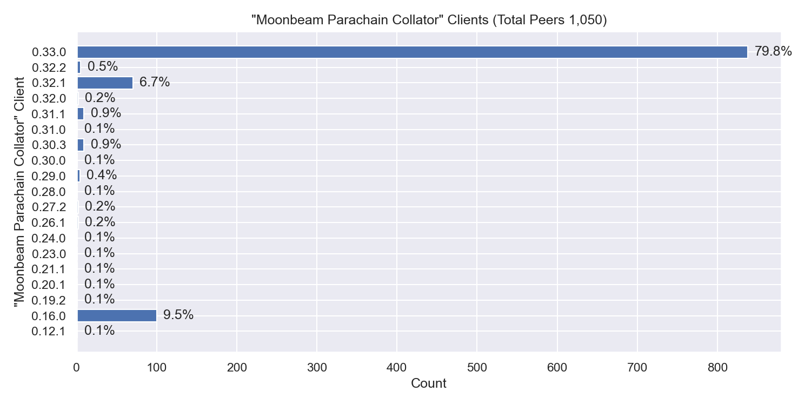

### Robonomics Network Parachain Collator

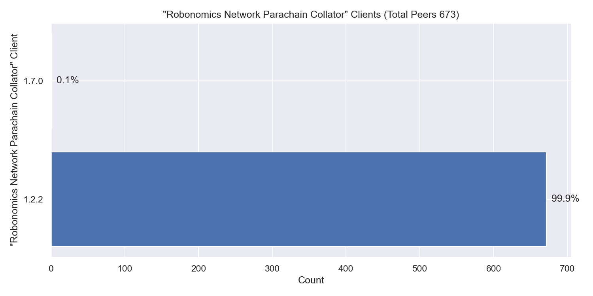

### Polkadot parachain

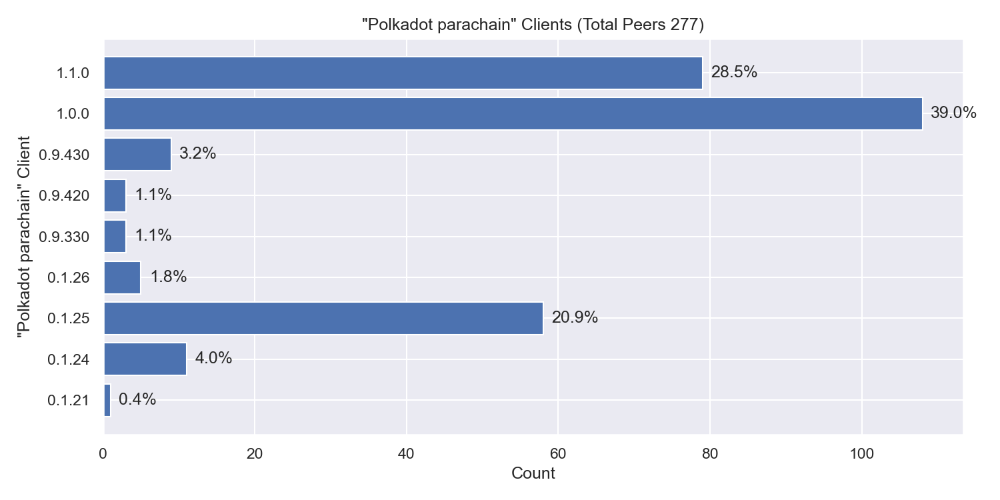

### Classification

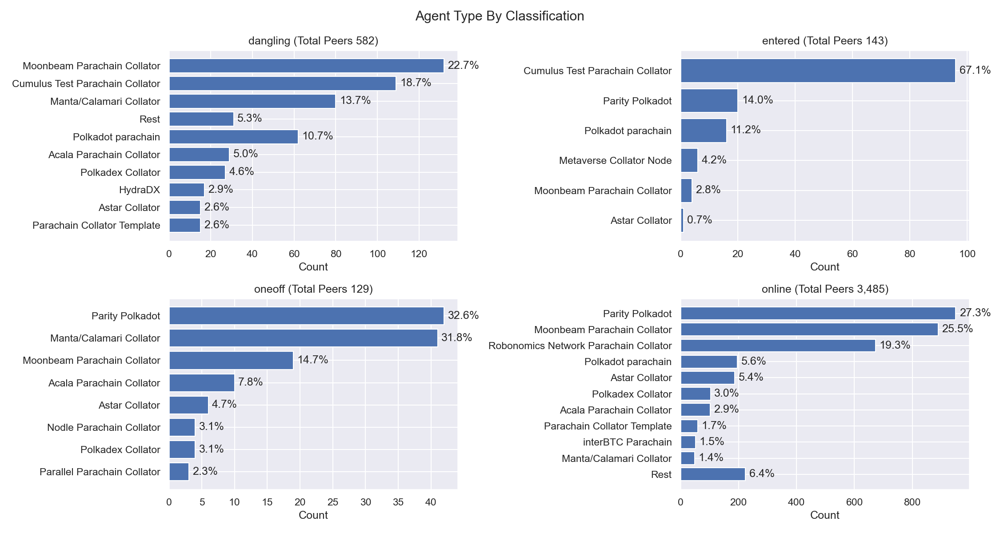

The classifications are documented [here](#peer-classification).
## Geolocation

### Unique IP Addresses

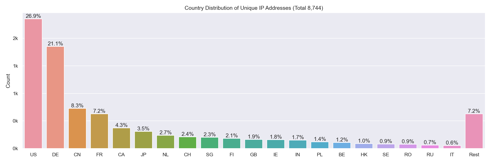

This graph shows all IP addresses that we found from `2023-10-09` to `2023-10-16` in the DHT and their geolocation distribution by country.

### Classification

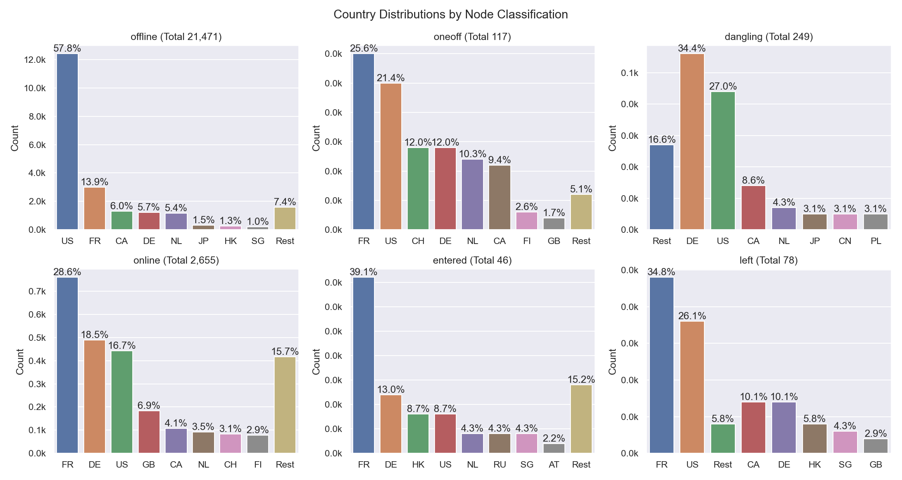

The classifications are documented [here](#peer-classification). 
The number in parentheses in the graph titles show the number of unique peer IDs that went into the specific subgraph.

### Agents

## Datacenters

### Overall

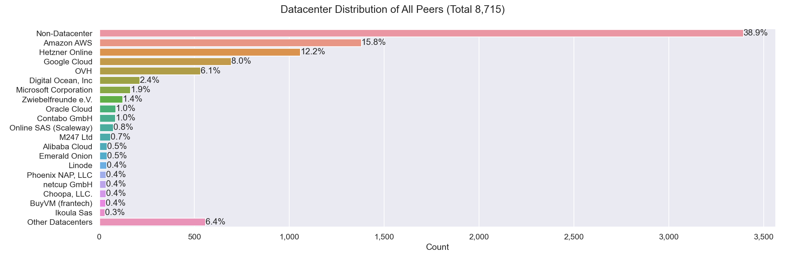

This graph shows all IP addresses that we found from `2023-10-09` to `2023-10-16` in the DHT and their datacenter association.

### Classification

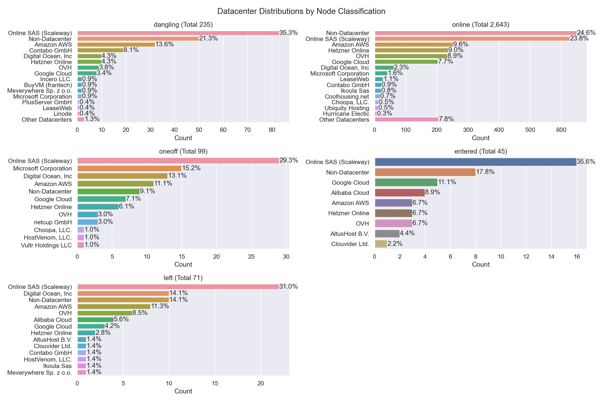

The classifications are documented [here](#peer-classification). Note that the x-axes are different.

### Agents

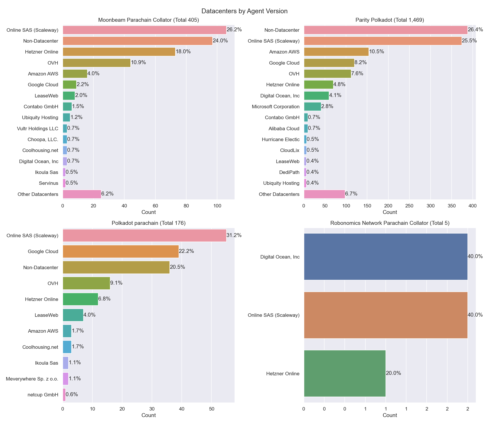

The number in parentheses in the graph titles show the number of unique peer IDs that went into the specific subgraph.

### Peer Classification

| Classification | Description |
| --- | --- |
| `offline` | A peer that was never seen online during the measurement period (always offline) but found in the DHT |
| `dangling` | A peer that was seen going offline and online multiple times during the measurement period |
| `oneoff` | A peer that was seen coming online and then going offline **only once** during the measurement period |
| `online` | A peer that was not seen offline at all during the measurement period (always online) |
| `left` | A peer that was online at the beginning of the measurement period, did go offline and didn't come back online |
| `entered` | A peer that was offline at the beginning of the measurement period but appeared within and didn't go offline since then |
