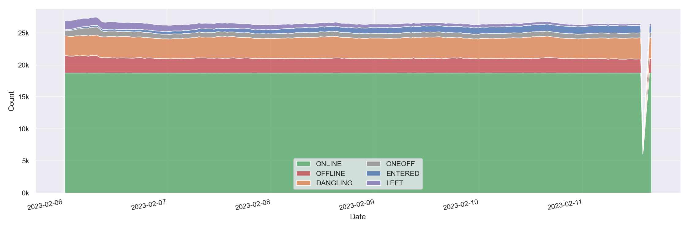
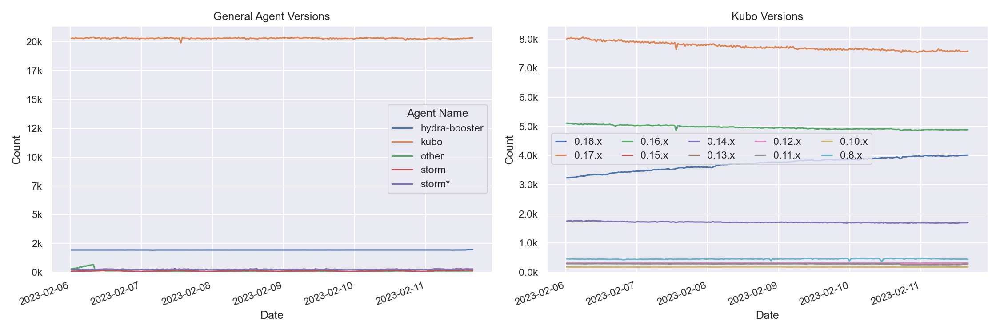
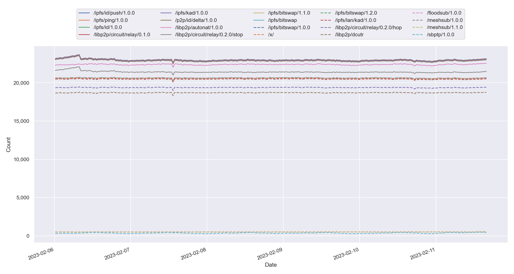
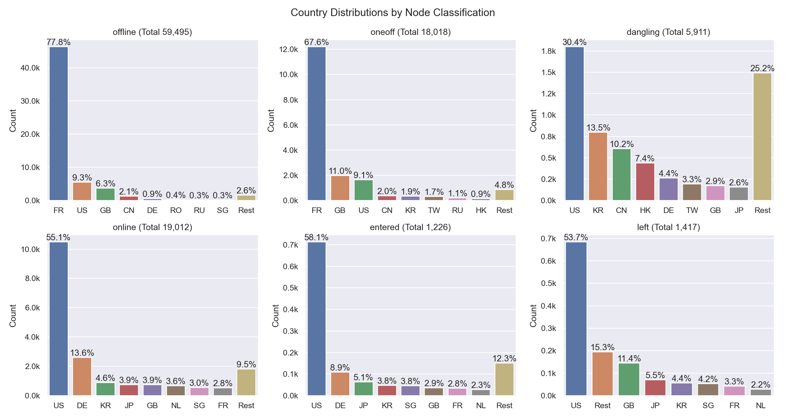
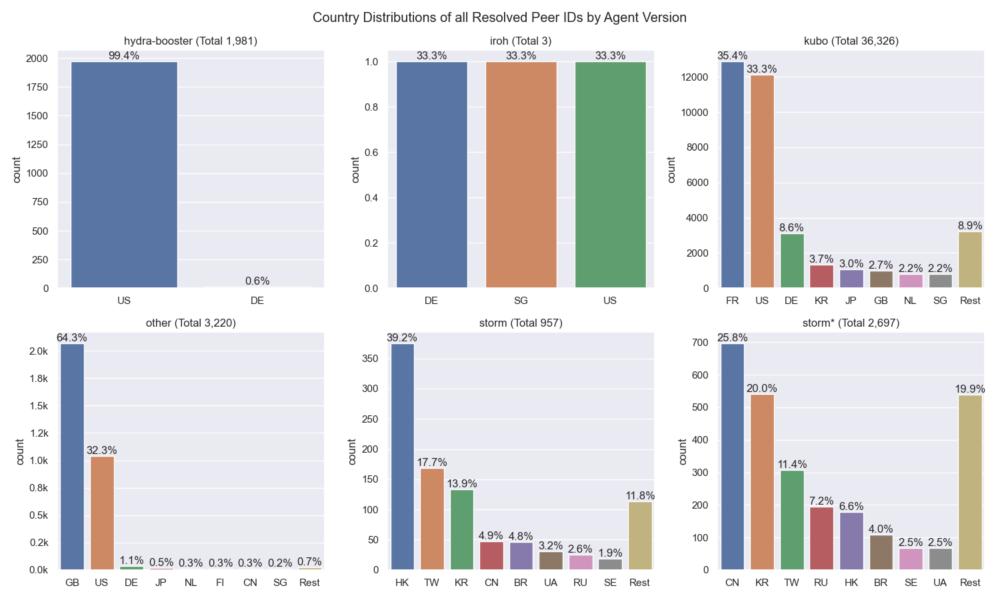

# Nebula Measurement Results Calendar Week 6 - 2023

## Table of Contents

- [Nebula Measurement Results Calendar Week 6 - 2023](#nebula-measurement-results-calendar-week-6---2023)
  - [Table of Contents](#table-of-contents)
  - [General Information](#general-information)
    - [Agent Versions](#agent-versions)
    - [Protocols](#protocols)
    - [Top 10 Rotating Nodes](#top-10-rotating-nodes)
    - [Crawls](#crawls)
      - [Overall](#overall)
      - [Classification](#classification)
      - [Agents](#agents)
      - [Total Peer IDs Discovered Classification](#total-peer-ids-discovered-classification)
      - [Protocols](#protocols-1)
  - [Churn](#churn)
  - [Inter Arrival Time](#inter-arrival-time)
  - [Agent Version Analysis](#agent-version-analysis)
    - [Overall](#overall-1)
    - [Kubo](#kubo)
    - [Classification](#classification-1)
  - [Geolocation](#geolocation)
    - [Unique IP Addresses](#unique-ip-addresses)
    - [Classification](#classification-2)
    - [Agents](#agents-1)
  - [Datacenters](#datacenters)
    - [Overall](#overall-2)
    - [Classification](#classification-3)
    - [Agents](#agents-2)
  - [Top Updating Peers](#top-updating-peers)
    - [Peer Classification](#peer-classification)
    - [Storm Specific Protocols](#storm-specific-protocols)

## General Information

The following results show measurement data that were collected in calendar week 6 in 2023 from `2023-02-06` to `2023-02-13`.

- Number of crawls `269`
- Number of visits `34,496,402`
  > Visiting a peer means dialing or connecting to it. Every time the crawler or monitoring process tries to dial or connect to a peer we consider this as _visiting_ it. Regardless of errors that may occur.
- Number of unique peer IDs visited `104,986`
- Number of unique peer IDs discovered in the DHT `104,839`
- Number of unique IP addresses found `50,780`

Timestamps are in UTC if not mentioned otherwise.

### Agent Versions

Newly discovered agent versions:

- `kubo/0.19.0-dev/14649aa8b` (2023-02-06 11:21:58)
- `go.vocdoni.io/dvote@90a907185-dirty` (2023-02-06 11:51:40)
- `kubo/0.18.1/675f8bddc-dirty/docker` (2023-02-06 11:52:45)
- `github.com/ethtweet/ethtweet@10288fab9-dirty` (2023-02-06 13:23:43)
- `github.com/ethtweet/ethtweet@85da626b6-dirty` (2023-02-07 05:24:37)
- `go.vocdoni.io/dvote@2464a8340-dirty` (2023-02-07 11:21:47)
- `go-ipfs/0.14.0-dev/6602dd704` (2023-02-07 15:23:45)
- `kubo/0.19.0-dev/8b061d21f-dirty` (2023-02-07 22:51:24)
- `kubo/0.19.0-dev/799e5ac/docker` (2023-02-08 04:52:42)
- `kubo/0.19.0-dev/799e5ac0a` (2023-02-08 06:52:18)
- `kubo/0.18.1/d4e1c9dce` (2023-02-08 20:23:30)
- `kubo/0.19.0-dev/57215d010-dirty` (2023-02-09 05:52:32)
- `go-btfs/2.2.1.1/0a04db0` (2023-02-09 09:54:08)
- `0.7.4` (2023-02-09 16:51:16)
- `delta@5c53c55fa-dirty` (2023-02-09 21:52:05)
- `kubo/0.19.0-dev/fb7f7b15b-dirty` (2023-02-10 07:23:00)
- `kubo/0.19.0-dev/fb7f7b1/docker` (2023-02-10 08:52:15)
- `0.7.5-optional-async-std-libp2p-7b5e71c-852-1.0` (2023-02-10 13:22:59)
- `gitlab.com/nunet/device-management-service@` (2023-02-10 13:24:24)
- `github.com/application-research/estuary@46bd8b84b-dirty` (2023-02-10 15:23:57)
- `0.7.5-optional-async-std-libp2p-f16b088-865-1.0` (2023-02-10 15:52:27)
- `kubo/0.19.0-dev/fb7f7b15b` (2023-02-10 16:53:43)
- `github.com/ethtweet/ethtweet@6e6c5d7a0-dirty` (2023-02-10 18:21:50)
- `github.com/ethtweet/ethtweet@fc9c474cf-dirty` (2023-02-10 22:53:05)
- `go-ipfs/0.9.0-rc1/` (2023-02-11 15:24:15)

Agent versions that were found to support at least one [storm specific protocol](#storm-specific-protocols):

- `go-ipfs/0.8.0/48f94e2`
- `storm`

### Protocols

Newly discovered protocols:

- `/telemetry/telemetry/0.5.0` (2023-02-08 20:23:30)
- `/btfs/kad/1.0.0` (2023-02-09 09:54:08)
- `/btfs/lan/kad/1.0.0` (2023-02-09 09:54:08)

### Top 10 Rotating Nodes

A "rotating node" is a node (as identified by its IP address) that was found to host multiple peer IDs.

| IP-Address    | Country | Unique Peer IDs | Agent Versions | Datacenter IP |
|:------------- |:------- | ---------------:|:-------------- | ------------- |
| `2001:41d0:304:200::41f5` | FR | 4013 | ['kubo/0.17.0/4485d6b71']| True  |
| `141.94.68.144` | FR | 4013 | ['kubo/0.17.0/4485d6b71']| False  |
| `2001:41d0:304:200::41cd` | FR | 3979 | ['kubo/0.17.0/4485d6b71']| True  |
| `51.210.150.216` | FR | 3979 | ['kubo/0.17.0/4485d6b71']| True  |
| `51.210.151.221` | FR | 3884 | ['kubo/0.17.0/4485d6b71']| True  |
| `2001:41d0:304:200::41da` | FR | 3884 | ['kubo/0.17.0/4485d6b71']| True  |
| `193.60.241.98` | GB | 2071 | ['kubo/0.15.0/3ae52a41e', 'main@129294d40-dirty', 'main@8afc837db-dirty', 'SybilNode@ee19f0e95-dirty']| False  |
| `54.187.21.48` | US | 727 | ['kubo/0.17.0/4485d6b71', 'main@aaf25bafa-dirty', 'SybilNode@07f8aea17-dirty', 'SybilNode@347fc79bf-dirty']| True  |
| `51.178.18.118` | FR | 241 | ['kubo/0.17.0/4485d6b71']| True  |
| `2001:41d0:305:2100::a67` | FR | 241 | ['kubo/0.17.0/4485d6b71']| True  |

### Crawls

#### Overall

#### Classification

#### Agents

Only the top 10 kubo versions appear in the right graph (due to lack of colors) based on the average count in the time interval. The `0.8.x` versions **do not** contain disguised storm peers.

`storm*` are `go-ipfs/0.8.0/48f94e2` peers that support at least one [storm specific protocol](#storm-specific-protocols).

#### Total Peer IDs Discovered Classification

In the specified time interval from `2023-02-06` to `2023-02-13` we visited `` unique peer IDs.
All peer IDs fall into one of the following classifications:

| Classification | Description |
| --- | --- |
| `offline` | A peer that was never seen online during the measurement period (always offline) but found in the DHT |
| `dangling` | A peer that was seen going offline and online multiple times during the measurement period |
| `oneoff` | A peer that was seen coming online and then going offline **only once** during the measurement period |
| `online` | A peer that was not seen offline at all during the measurement period (always online) |
| `left` | A peer that was online at the beginning of the measurement period, did go offline and didn't come back online |
| `entered` | A peer that was offline at the beginning of the measurement period but appeared within and didn't go offline since then |

#### Protocols

## Churn

Only the top 10 kubo versions appear in the right graph (due to lack of colors) based on the average count in the time interval. The `0.8.x` versions **do not** contain disguised storm peers. This graph also excludes peers that were online the whole time. You can read this graph as: if I see a peer joining the network, what's the likelihood for it to stay `X` hours in the network.

`storm*` are `go-ipfs/0.8.0/48f94e2` peers that support at least one [storm specific protocol](#storm-specific-protocols).

## Inter Arrival Time

Only the top 10 kubo versions appear in the right graph (due to lack of colors) based on the average count in the time interval. The `0.8.x` versions **do not** contain disguised storm peers.

`storm*` are `go-ipfs/0.8.0/48f94e2` peers that support at least one [storm specific protocol](#storm-specific-protocols).

## Agent Version Analysis

### Overall

Includes all peers that the crawler was able to connect to at least once: `dangling`, `online`, `oneoff`, `entered`. Hence, the total number of peers is lower as the graph excludes `offline` and `left` peers (see [classification](#peer-classification)).

### Kubo

`storm` shows the `go-ipfs/0.8.0/48f94e2` peers that support at least one [storm specific protocol](#storm-specific-protocols).

### Classification

The classifications are documented [here](#peer-classification).
`storm*` are `go-ipfs/0.8.0/48f94e2` peers that support at least one [storm specific protocol](#storm-specific-protocols).

## Geolocation

### Unique IP Addresses

This graph shows all IP addresses that we found from `2023-02-06` to `2023-02-13` in the DHT and their geolocation distribution by country.

### Classification

The classifications are documented [here](#peer-classification). 
The number in parentheses in the graph titles show the number of unique peer IDs that went into the specific subgraph.

### Agents

`storm*` are `go-ipfs/0.8.0/48f94e2` peers that support at least one [storm specific protocol](#storm-specific-protocols).

## Datacenters

### Overall

This graph shows all IP addresses that we found from `2023-02-06` to `2023-02-13` in the DHT and their datacenter association.

### Classification

The classifications are documented [here](#peer-classification). Note that the x-axes are different.

### Agents

The number in parentheses in the graph titles show the number of unique peer IDs that went into the specific subgraph.

`storm*` are `go-ipfs/0.8.0/48f94e2` peers that support at least one [storm specific protocol](#storm-specific-protocols).

## Top Updating Peers

An "updating peer" is a peer that we observed with multiple agent versions.  

| Peer ID           | Final Agent Version     | Number of Transitions | Distinct Agent Versions | Number of Distinct AVs |
|:----------------- |:------------ | ------------- |:------------ | -------------- |
| `12D3KooWEoPrMZRs...` | `kubo/0.14.0/e0fabd6/docker` | 154  | kubo/0.14.0/e0fabd6 kubo/0.14.0/e0fabd6/docker | 2 |
| `12D3KooWL81SUmeG...` | `kubo/0.14.0/e0fabd6/docker` | 151  | kubo/0.14.0/e0fabd6 kubo/0.14.0/e0fabd6/docker | 2 |
| `12D3KooWDpojPiK9...` | `kubo/0.14.0/e0fabd6` | 151  | kubo/0.14.0/e0fabd6 kubo/0.14.0/e0fabd6/docker | 2 |
| `12D3KooWPkjJFUxo...` | `kubo/0.14.0/e0fabd6` | 149  | kubo/0.14.0/e0fabd6 kubo/0.14.0/e0fabd6/docker | 2 |
| `12D3KooWFk5K3ekh...` | `kubo/0.14.0/e0fabd6/docker` | 149  | kubo/0.14.0/e0fabd6 kubo/0.14.0/e0fabd6/docker | 2 |
| `12D3KooWFagorLTL...` | `kubo/0.14.0/e0fabd6` | 147  | kubo/0.14.0/e0fabd6 kubo/0.14.0/e0fabd6/docker | 2 |
| `12D3KooWAxHt9KMA...` | `kubo/0.14.0/e0fabd6` | 147  | kubo/0.14.0/e0fabd6 kubo/0.14.0/e0fabd6/docker | 2 |
| `12D3KooWKK5iiV2k...` | `kubo/0.14.0/e0fabd6` | 147  | kubo/0.14.0/e0fabd6 kubo/0.14.0/e0fabd6/docker | 2 |
| `12D3KooWMzhCMyPi...` | `kubo/0.14.0/e0fabd6` | 146  | kubo/0.14.0/e0fabd6 kubo/0.14.0/e0fabd6/docker | 2 |
| `12D3KooWKrWoZmEy...` | `kubo/0.14.0/e0fabd6` | 145  | kubo/0.14.0/e0fabd6 kubo/0.14.0/e0fabd6/docker | 2 |

### Peer Classification

| Classification | Description |
| --- | --- |
| `offline` | A peer that was never seen online during the measurement period (always offline) but found in the DHT |
| `dangling` | A peer that was seen going offline and online multiple times during the measurement period |
| `oneoff` | A peer that was seen coming online and then going offline **only once** during the measurement period |
| `online` | A peer that was not seen offline at all during the measurement period (always online) |
| `left` | A peer that was online at the beginning of the measurement period, did go offline and didn't come back online |
| `entered` | A peer that was offline at the beginning of the measurement period but appeared within and didn't go offline since then |

### Storm Specific Protocols

The following protocol strings are unique for `storm` nodes according to [this Bitdefender paper](https://www.bitdefender.com/files/News/CaseStudies/study/376/Bitdefender-Whitepaper-IPStorm.pdf):

- `/sreque/*`
- `/shsk/*`
- `/sfst/*`
- `/sbst/*`
- `/sbpcp/*`
- `/sbptp/*`
- `/strelayp/*`