# Nebula Measurement Results Calendar Week 9 - 2023

## Table of Contents

- [Nebula Measurement Results Calendar Week 9 - 2023](#nebula-measurement-results-calendar-week-9---2023)
  - [Table of Contents](#table-of-contents)
  - [General Information](#general-information)
    - [Agent Versions](#agent-versions)
    - [Protocols](#protocols)
    - [Top 10 Rotating Nodes](#top-10-rotating-nodes)
    - [Crawls](#crawls)
      - [Overall](#overall)
      - [Classification](#classification)
      - [Agents](#agents)
      - [Errors](#errors)
      - [Total Peer IDs Discovered Classification](#total-peer-ids-discovered-classification)
      - [Protocols](#protocols-1)
  - [Churn](#churn)
  - [Inter Arrival Time](#inter-arrival-time)
  - [Agent Version Analysis](#agent-version-analysis)
    - [Overall](#overall-1)
    - [Kubo](#kubo)
    - [Classification](#classification-1)
  - [Geolocation](#geolocation)
    - [Unique IP Addresses](#unique-ip-addresses)
    - [Classification](#classification-2)
    - [Agents](#agents-1)
  - [Datacenters](#datacenters)
    - [Overall](#overall-2)
    - [Classification](#classification-3)
    - [Agents](#agents-2)
  - [Website Monitoring](#website-monitoring)
    - [Time To First Byte](#time-to-first-byte)
    - [DOMContentLoaded](#domcontentloaded)
    - [HTTP vs. Kubo](#http-vs-kubo)
    - [Error Rate](#error-rate)
    - [\*](#)
    - [Peer Classification](#peer-classification)
    - [Storm Specific Protocols](#storm-specific-protocols)

## General Information

The following results show measurement data that were collected in calendar week 9 in 2023 from `2023-02-27` to `2023-03-06`.

- Number of crawls `336`
- Number of visits `44,343,835`
  > Visiting a peer means dialing or connecting to it. Every time the crawler or monitoring process tries to dial or connect to a peer we consider this as _visiting_ it. Regardless of errors that may occur.
- Number of unique peer IDs visited `55,011`
- Number of unique peer IDs discovered in the DHT `54,900`
- Number of unique IP addresses found `53,508`

Timestamps are in UTC if not mentioned otherwise.

### Agent Versions

Newly discovered agent versions:

- `delta@a9ff1a493-dirty` (2023-02-27 06:22:51)
- `kubo/0.19.0-dev/21a3509` (2023-02-27 10:21:45)
- `kubo/0.19.0-dev/fb6aeae` (2023-02-27 12:21:21)
- `0.8.2` (2023-02-27 16:51:26)
- `tfm_ciber/alber/p2p@60f44c219-dirty` (2023-02-27 17:23:19)
- `kubo/0.19.0-dev/8ec0727` (2023-02-27 19:21:24)
- `tfm_ciber/alber/p2p@7cf9e608a-dirty` (2023-02-27 19:21:32)
- `delta@392855d77-dirty` (2023-02-27 21:21:51)
- `kubo/0.19.0-dev/e3b17a4/docker` (2023-02-28 02:21:27)
- `delta@71efe1481-dirty` (2023-02-28 03:51:30)
- `go-ipfs/0.9.0-dev/3393b4a39` (2023-02-28 10:52:19)
- `tfm_ciber/alber/p2p@d04a53e69` (2023-02-28 10:52:47)
- `kubo/0.19.0-dev/56b9962/docker` (2023-02-28 13:22:25)
- `github.com/mearaj/protonet@0f32d05a4-dirty` (2023-02-28 14:22:57)
- `github.com/application-research/estuary@80aafa80c` (2023-02-28 15:53:39)
- `kubo/0.19.0-dev/cf9276d/docker` (2023-02-28 16:52:26)
- `github.com/mearaj/protonet@8df52c3f8` (2023-02-28 18:53:03)
- `delta@4e5ea565a-dirty` (2023-02-28 22:21:56)
- `kubo/0.19.0-dev/145795b/docker` (2023-03-01 10:23:13)
- `kubo/0.19.0-dev/145795b14-dirty` (2023-03-01 12:23:08)
- `github.com/dennis-tra/parsec@759cdb39a-dirty` (2023-03-01 20:52:06)
- `go.vocdoni.io/dvote@1c5fc142e-dirty` (2023-03-01 23:51:45)
- `delta@5a6aeb195-dirty` (2023-03-02 02:21:44)
- `github.com/ethtweet/ethtweet@de8f1102f-dirty` (2023-03-02 08:51:52)
- `github.com/dennis-tra/parsec@419fc25fe-dirty` (2023-03-02 14:21:20)
- `ipfs-server/0.1.0` (2023-03-02 14:23:49)
- `delta@d167bf98a-dirty` (2023-03-02 15:24:02)
- `Uplink` (2023-03-02 18:21:34)
- `github.com/siisee11/golang-blockchain` (2023-03-02 19:51:38)
- `github.com/ethtweet/ethtweet@ff31d21f7-dirty` (2023-03-02 21:53:40)
- `kubo/0.19.0-dev/fe8f72e70-dirty` (2023-03-02 23:21:08)
- `kubo/0.19.0-dev/fe8f72e/docker` (2023-03-03 03:52:01)
- `delta@36cb73230-dirty` (2023-03-03 04:21:56)
- `p2ptunnel@d2c071afb-dirty` (2023-03-03 10:52:28)
- `github.com/dennis-tra/parsec@e251ae94c-dirty` (2023-03-03 11:51:37)
- `go.vocdoni.io/dvote@34855418d-dirty` (2023-03-03 12:21:19)
- `github.com/mearaj/protonet@268b0407d` (2023-03-03 12:23:27)
- `github.com/dennis-tra/parsec@6e18e5d53-dirty` (2023-03-03 12:52:01)
- `go.vocdoni.io/dvote@8475dce42-dirty` (2023-03-03 13:21:11)
- `github.com/dennis-tra/parsec@77e2e184c-dirty` (2023-03-03 22:21:15)
- `delta@5e33582af-dirty` (2023-03-03 22:22:46)
- `github.com/libp2p/go-libp2p/examples/pubsub/chat@` (2023-03-04 14:52:04)
- `tfm_ciber/alber/p2p@9f4dcb4ad-dirty` (2023-03-04 15:22:13)
- `P2P_Example` (2023-03-04 16:51:35)
- `punchr/honeypot/dev` (2023-03-04 19:21:41)
- `delta@8c9854657-dirty` (2023-03-05 04:21:40)
- `kubo/0.19.0-dev/d1541e1d3` (2023-03-05 07:53:01)
- `delta@0fc82181f-dirty` (2023-03-05 11:52:36)
- `delta@f88dacb0f-dirty` (2023-03-05 12:51:15)
- `synchronization@cc1a5e256-dirty` (2023-03-05 12:53:57)
- `kubo/0.19.0-dev/d1541e1` (2023-03-05 15:21:35)
- `github.com/mearaj/protonet@8cd3388a1-dirty` (2023-03-05 18:23:04)
- `delta@f88dacb0f` (2023-03-05 23:21:52)

Agent versions that were found to support at least one [storm specific protocol](#storm-specific-protocols):

- `go-ipfs/0.8.0/48f94e2`
- `storm`

### Protocols

Newly discovered protocols:

- `/audio/1.1.0` (2023-02-27 17:23:19)
- `/file/1.1.0` (2023-02-27 17:23:19)
- `/bench/1.1.0` (2023-02-27 17:23:19)
- `/p2p/1.0.0` (2023-03-02 19:51:38)

### Top 10 Rotating Nodes

A "rotating node" is a node (as identified by its IP address) that was found to host multiple peer IDs.

| IP-Address    | Country | Unique Peer IDs | Agent Versions | Datacenter IP |
|:------------- |:------- | ---------------:|:-------------- | ------------- |
| `54.187.21.48` | US | 1525 | ['kubo/0.17.0/4485d6b71', 'main@f1ecfa16c-dirty', 'SybilNode@9ebc0a872-dirty']| True  |
| `159.203.76.161` | US | 255 | ['github.com/ipfs-shipyard/ipfs-counter']| True  |
| `193.60.241.98` | GB | 210 | ['hydra-booster/0.7.4', 'kubo/0.15.0/3ae52a41e', 'SybilNode@d54ece3ca-dirty', 'SybilNode@ee19f0e95-dirty']| False  |
| `117.174.25.136` | CN | 66 | ['go-ipfs/0.8.0/cc95853']| False  |
| `117.174.25.135` | CN | 65 | ['go-ipfs/0.8.0/cc95853']| False  |
| `183.222.63.187` | CN | 65 | ['go-ipfs/0.8.0/cc95853']| False  |
| `183.222.63.208` | CN | 65 | ['go-ipfs/0.8.0/cc95853']| False  |
| `111.9.31.185` | CN | 64 | ['go-ipfs/0.8.0/cc95853']| False  |
| `183.222.63.181` | CN | 64 | ['go-ipfs/0.8.0/cc95853']| False  |
| `117.174.25.137` | CN | 64 | ['go-ipfs/0.8.0/cc95853']| False  |

### Crawls

#### Overall

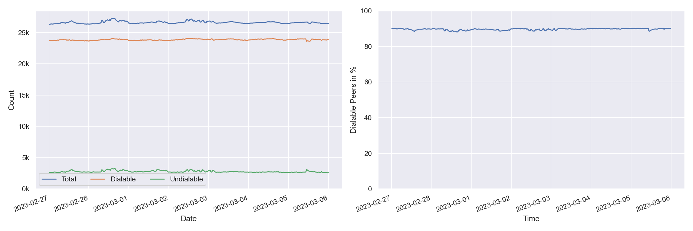

#### Classification

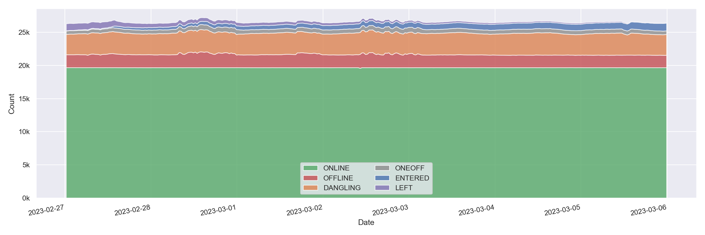

#### Agents

Only the top 10 kubo versions appear in the right graph (due to lack of colors) based on the average count in the time interval. The `0.8.x` versions **do not** contain disguised storm peers.

`storm*` are `go-ipfs/0.8.0/48f94e2` peers that support at least one [storm specific protocol](#storm-specific-protocols).

#### Errors

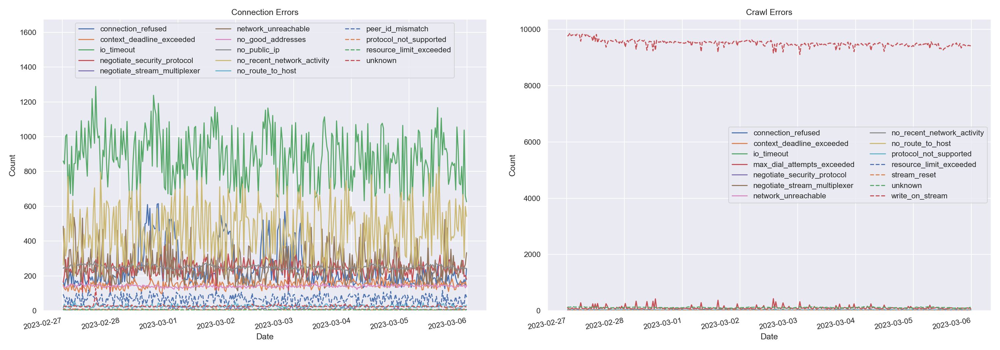

#### Total Peer IDs Discovered Classification

In the specified time interval from `2023-02-27` to `2023-03-06` we visited `` unique peer IDs.
All peer IDs fall into one of the following classifications:

| Classification | Description |
| --- | --- |
| `offline` | A peer that was never seen online during the measurement period (always offline) but found in the DHT |
| `dangling` | A peer that was seen going offline and online multiple times during the measurement period |
| `oneoff` | A peer that was seen coming online and then going offline **only once** during the measurement period |
| `online` | A peer that was not seen offline at all during the measurement period (always online) |
| `left` | A peer that was online at the beginning of the measurement period, did go offline and didn't come back online |
| `entered` | A peer that was offline at the beginning of the measurement period but appeared within and didn't go offline since then |

#### Protocols

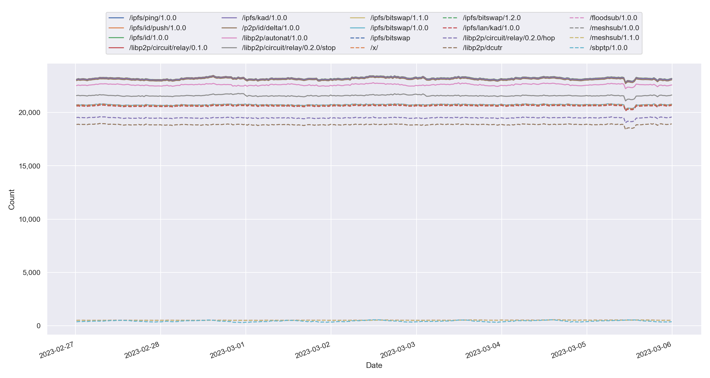

## Churn

Only the top 10 kubo versions appear in the right graph (due to lack of colors) based on the average count in the time interval. The `0.8.x` versions **do not** contain disguised storm peers. This graph also excludes peers that were online the whole time. You can read this graph as: if I see a peer joining the network, what's the likelihood for it to stay `X` hours in the network.

`storm*` are `go-ipfs/0.8.0/48f94e2` peers that support at least one [storm specific protocol](#storm-specific-protocols).

## Inter Arrival Time

Only the top 10 kubo versions appear in the right graph (due to lack of colors) based on the average count in the time interval. The `0.8.x` versions **do not** contain disguised storm peers.

`storm*` are `go-ipfs/0.8.0/48f94e2` peers that support at least one [storm specific protocol](#storm-specific-protocols).

## Agent Version Analysis

### Overall

Includes all peers that the crawler was able to connect to at least once: `dangling`, `online`, `oneoff`, `entered`. Hence, the total number of peers is lower as the graph excludes `offline` and `left` peers (see [classification](#peer-classification)).

### Kubo

`storm` shows the `go-ipfs/0.8.0/48f94e2` peers that support at least one [storm specific protocol](#storm-specific-protocols).

### Classification

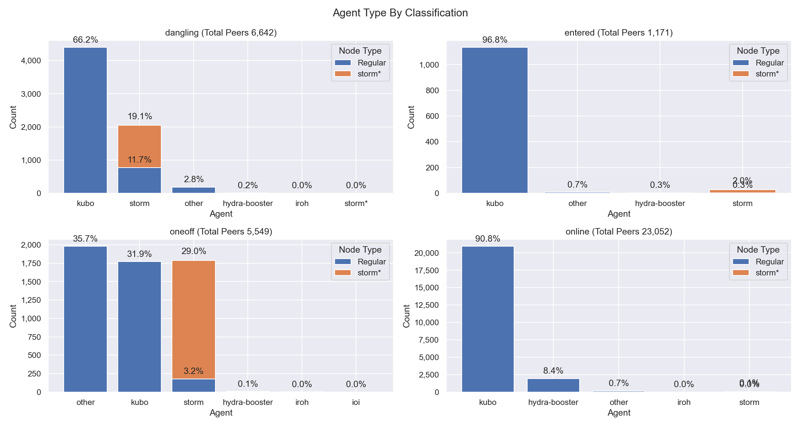

The classifications are documented [here](#peer-classification).
`storm*` are `go-ipfs/0.8.0/48f94e2` peers that support at least one [storm specific protocol](#storm-specific-protocols).

## Geolocation

### Unique IP Addresses

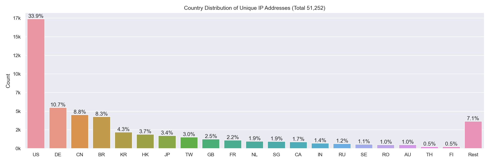

This graph shows all IP addresses that we found from `2023-02-27` to `2023-03-06` in the DHT and their geolocation distribution by country.

### Classification

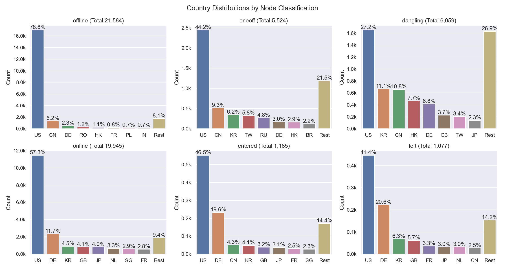

The classifications are documented [here](#peer-classification). 
The number in parentheses in the graph titles show the number of unique peer IDs that went into the specific subgraph.

### Agents

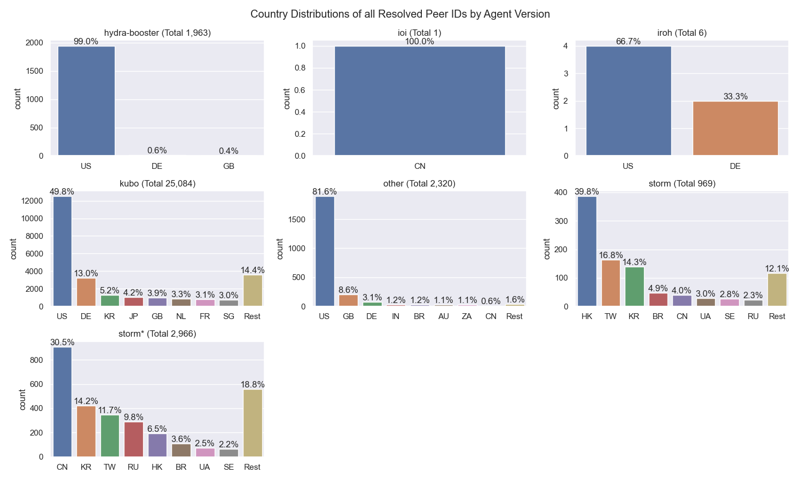

`storm*` are `go-ipfs/0.8.0/48f94e2` peers that support at least one [storm specific protocol](#storm-specific-protocols).

## Datacenters

### Overall

This graph shows all IP addresses that we found from `2023-02-27` to `2023-03-06` in the DHT and their datacenter association.

### Classification

The classifications are documented [here](#peer-classification). Note that the x-axes are different.

### Agents

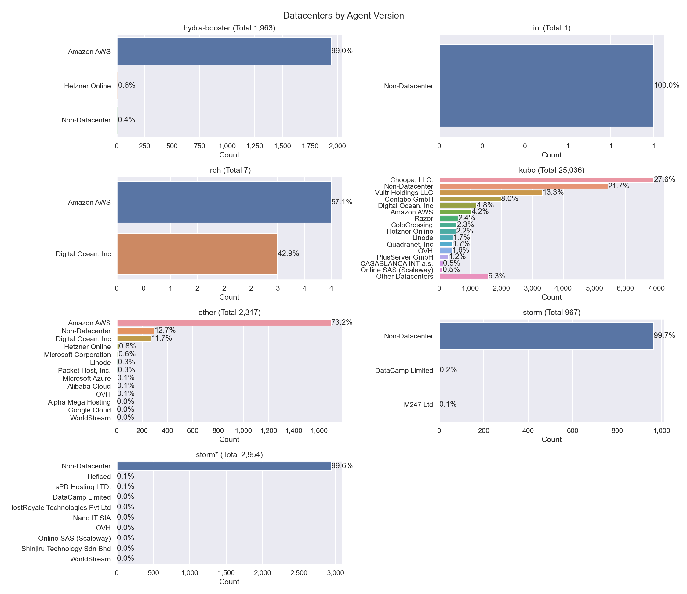

The number in parentheses in the graph titles show the number of unique peer IDs that went into the specific subgraph.

`storm*` are `go-ipfs/0.8.0/48f94e2` peers that support at least one [storm specific protocol](#storm-specific-protocols).

## Website Monitoring

We are using [`phantomas`](https://github.com/macbre/phantomas) for the following measurements. The graphs below show the p50, p90, and p99 timings of different metrics and aggregate the performance across the last week.

**Do you want another metric visualized?** Check out [this long list](https://github.com/macbre/phantomas/blob/devel/docs/metrics.md) of options.

### Time To First Byte

The time it took to receive the first byte of the first response (that was not a redirect). The large number in each tile is the time in seconds and the small number in each lower right corner is the percentage change compared to the previous week[*](#*). The number at the very bottom of the graph shows the sample size that went into each subplot/website. Note: the color scales are different in each graph.

Definitely check the sample size that went into the measurement of each website. The numnber is stated at the bottom of the graph.

### DOMContentLoaded

The DOMContentLoaded event fires when the HTML document has been completely parsed, and all deferred scripts (`<script defer src="…">` and `<script type="module">`) have downloaded and executed. The large number in each tile is the time in seconds and the small number in each lower right corner is the percentage change compared to the previous week[*](#*). The number at the very bottom of the graph shows the sample size that went into each subplot/website. Note: the color scales are different in each graph.

**These numbers don't account for the network latencies!**

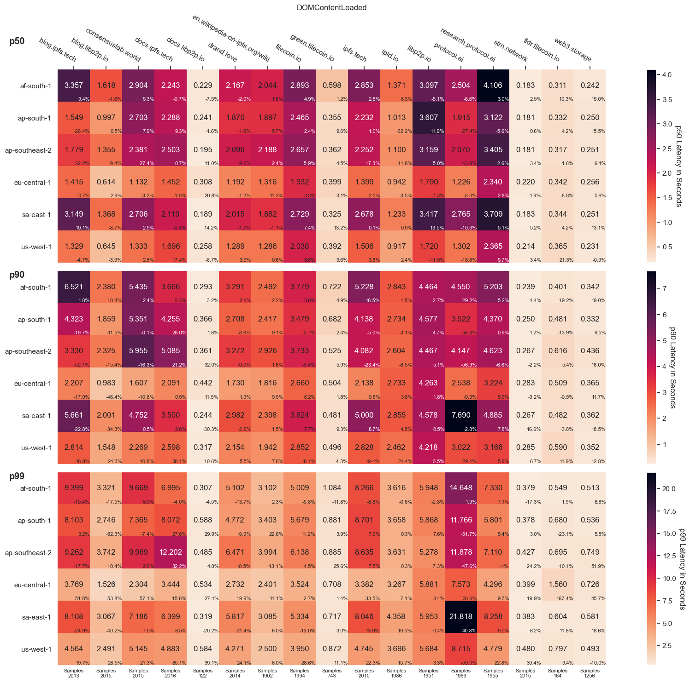

### HTTP vs. Kubo

The number above each bar shows the sample size that went into the calculation.

### Error Rate

We're doing 288 requests per day for each website. The following graph shows the daily error rate in accessing these website.

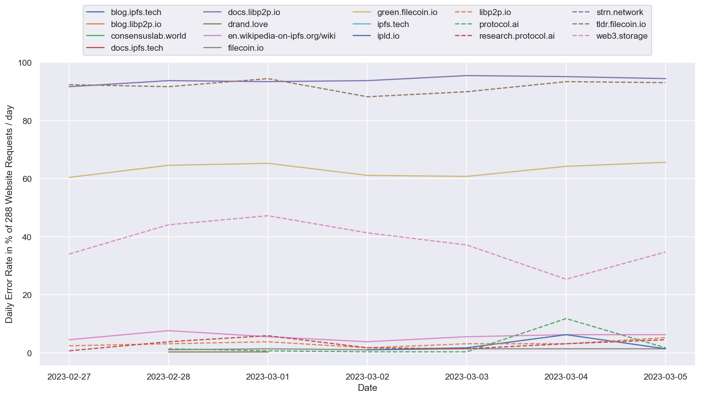

### *

Compared to last week the reported time window has slightly changed, so the percentage changes won't add up to week's report.

### Peer Classification

| Classification | Description |
| --- | --- |
| `offline` | A peer that was never seen online during the measurement period (always offline) but found in the DHT |
| `dangling` | A peer that was seen going offline and online multiple times during the measurement period |
| `oneoff` | A peer that was seen coming online and then going offline **only once** during the measurement period |
| `online` | A peer that was not seen offline at all during the measurement period (always online) |
| `left` | A peer that was online at the beginning of the measurement period, did go offline and didn't come back online |
| `entered` | A peer that was offline at the beginning of the measurement period but appeared within and didn't go offline since then |

### Storm Specific Protocols

The following protocol strings are unique for `storm` nodes according to [this Bitdefender paper](https://www.bitdefender.com/files/News/CaseStudies/study/376/Bitdefender-Whitepaper-IPStorm.pdf):

- `/sreque/*`
- `/shsk/*`
- `/sfst/*`
- `/sbst/*`
- `/sbpcp/*`
- `/sbptp/*`
- `/strelayp/*`