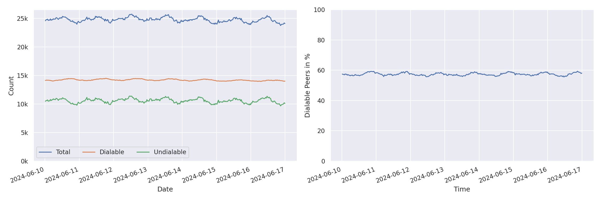
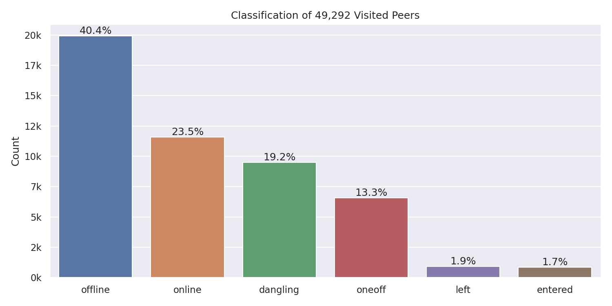
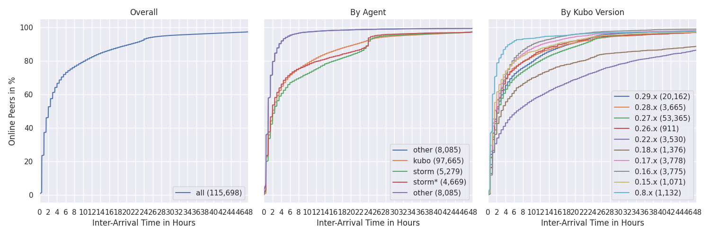
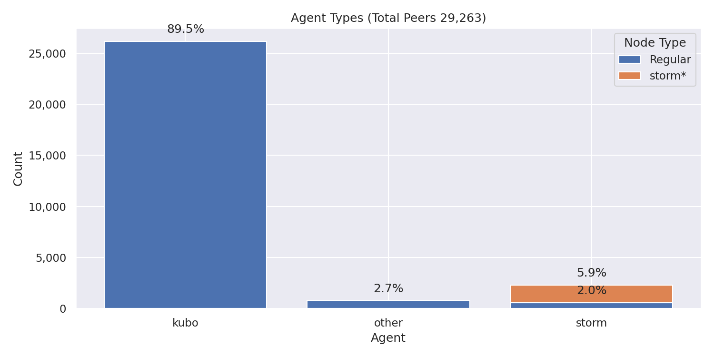
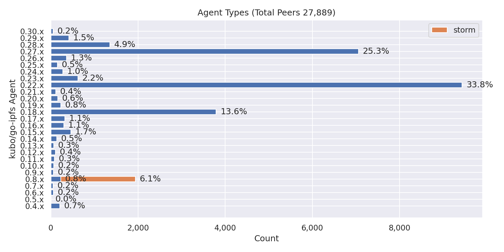
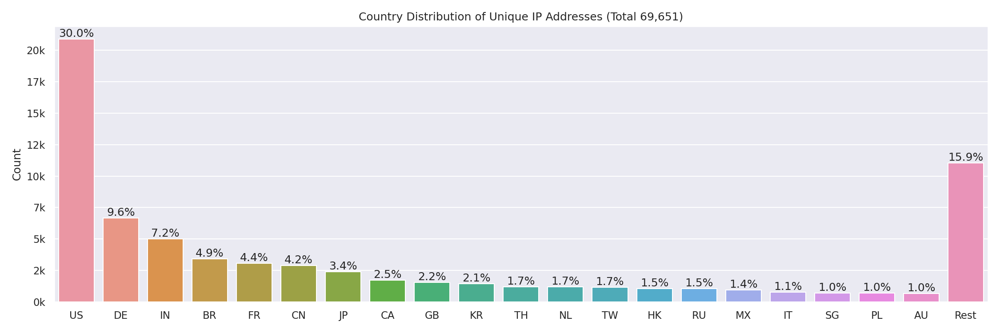
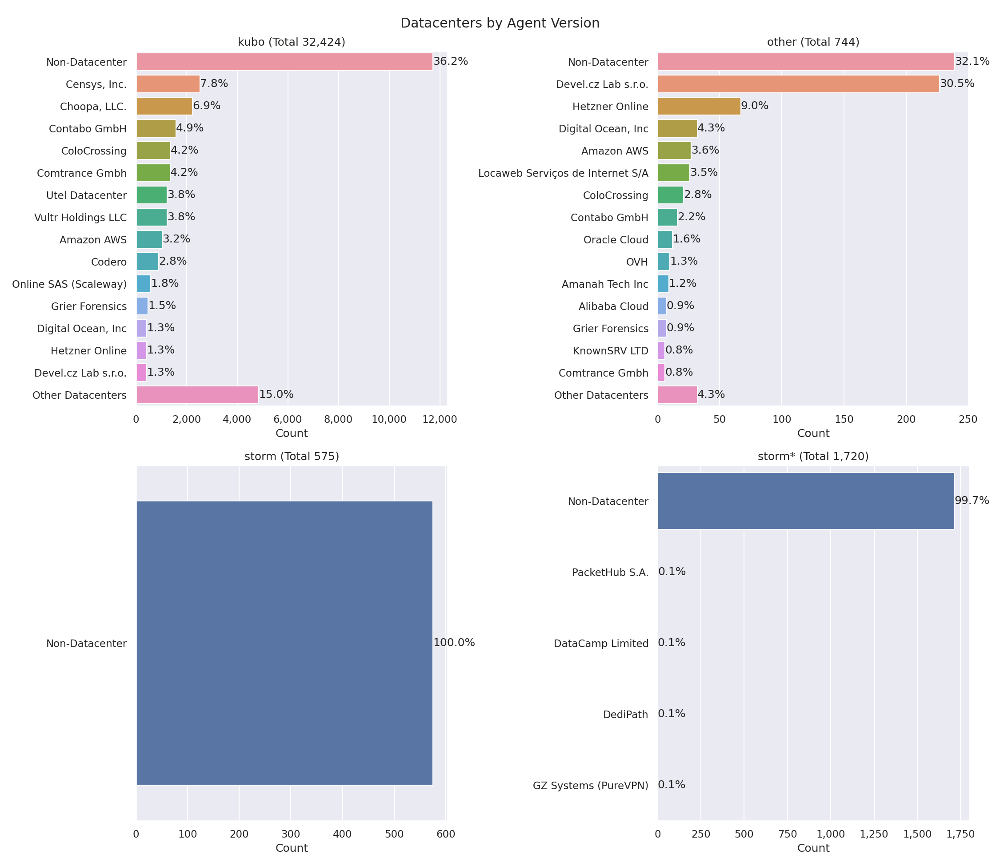

# Nebula Measurement Results Calendar Week 24 - 2024

## Table of Contents

- [General Information](#general-information)
  - [Agent Versions](#agent-versions)
  - [Protocols](#protocols)
  - [Top 10 Rotating Nodes](#top-10-rotating-nodes)
  - [Crawls](#crawls)
    - [Overall](#overall)
    - [Classification](#classification)
    - [Agents](#agents)
    - [Errors](#errors)
    - [Total Peer IDs Discovered Classification](#total-peer-ids-discovered-classification)
    - [Protocols](#protocols-1)
- [Churn](#churn)
- [Inter Arrival Time](#inter-arrival-time)
- [Agent Version Analysis](#agent-version-analysis)
  - [Overall](#overall-1)
  - [Kubo](#kubo)
  - [Classification](#classification-1)
- [Geolocation](#geolocation)
  - [Unique IP Addresses](#unique-ip-addresses)
  - [Classification](#classification-2)
  - [Agents](#agents-1)
- [Datacenters](#datacenters)
  - [Overall](#overall-2)
  - [Classification](#classification-3)
  - [Agents](#agents-2)
  - [Peer Classification](#peer-classification)
  - [Storm Specific Protocols](#storm-specific-protocols)

## General Information

The following results show measurement data that were collected in calendar week 24 in 2024 from `2024-06-10` to `2024-06-17`.

- Number of crawls `336`
- Number of visits `28,340,890`
  > Visiting a peer means dialing or connecting to it. Every time the crawler or monitoring process tries to dial or connect to a peer we consider this as _visiting_ it. Regardless of errors that may occur.
- Number of unique peer IDs visited `49,292`
- Number of unique peer IDs discovered in the DHT `48,870`
- Number of unique IP addresses found `70,538`

Timestamps are in UTC if not mentioned otherwise.

### Agent Versions

Newly discovered agent versions:

- `js-libp2p/0.45.9 UserAgent=v20.14.0` (2024-06-10 01:51:23)
- `kubo/0.30.0-dev/a07852a3f-dirty` (2024-06-10 14:20:58)
- `kubo/0.30.0-dev/a07852a3f` (2024-06-10 14:50:53)
- `kubo/0.29.0/3f0947b/docker` (2024-06-10 15:20:58)
- `kubo/0.29.0/` (2024-06-10 20:20:44)
- `kubo/0.30.0-dev/c9bab01/docker` (2024-06-10 21:21:33)
- `kubo/0.29.0/3f0947b74` (2024-06-10 21:50:51)
- `helia/4.2.3 libp2p/1.6.1 UserAgent=v21.7.3` (2024-06-11 01:51:12)
- `kubo/0.30.0-dev/144e97c/docker` (2024-06-11 13:21:26)
- `helia/4.2.3 libp2p/1.6.1 UserAgent=v18.17.1` (2024-06-11 14:21:00)
- `kubo/0.29.0/VALGRIND` (2024-06-11 16:20:52)
- `kubo/0.29.0/3f0947b` (2024-06-11 23:21:04)
- `helia/4.2.3 libp2p/1.6.1 UserAgent=v20.13.1` (2024-06-12 04:21:26)
- `helia/4.2.3 libp2p/1.6.0 UserAgent=v20.12.2` (2024-06-12 08:21:27)
- `kubo/0.30.0-dev/144e97cf6` (2024-06-12 13:22:27)
- `helia/4.2.3 libp2p/1.6.1 UserAgent=v18.20.3` (2024-06-12 13:52:35)
- `github.com/JackalLabs/sequoia@dbc45c3aa-dirty` (2024-06-12 14:20:55)
- `kubo/0.29.0/desktop` (2024-06-12 19:50:46)
- `helia/4.2.3 libp2p/1.6.0 UserAgent=v20.14.0` (2024-06-14 07:21:04)
- `kubo/0.29.0/642dfde-dirty` (2024-06-14 08:51:31)
- `kubo/0.30.0-dev/144e97cf6-dirty` (2024-06-14 12:51:11)
- `kubo/0.30.0-dev/121c602/docker` (2024-06-14 19:51:22)
- `libp2p` (2024-06-14 20:51:02)
- `miregrd` (2024-06-15 04:51:04)
- `kubo/0.30.0-dev/121c6023c-dirty` (2024-06-15 12:51:38)
- `github.com/harmony-one/harmony@b02ea4c83-dirty` (2024-06-16 03:51:13)
- `kubo/0.30.0-dev/121c6023c` (2024-06-16 09:20:48)
- `github.com/harmony-one/harmony@b02ea4c83` (2024-06-16 09:51:12)
- `github.com/harmony-one/harmony@8fda84a89` (2024-06-16 13:51:43)
- `helia/4.2.3 libp2p/1.6.1 UserAgent=v20.14.0` (2024-06-16 21:51:27)

Agent versions that were found to support at least one [storm specific protocol](#storm-specific-protocols):

- `go-ipfs/0.8.0/48f94e2`
- `storm`

### Protocols

Newly discovered protocols:

- `/` (2024-06-10 08:21:04)
- `/libp2p/autonat/2/dial-back` (2024-06-13 08:20:56)
- `/libp2p/autonat/2/dial-request` (2024-06-13 08:20:56)

### Top 10 Rotating Nodes

A "rotating node" is a node (as identified by its IP address) that was found to host multiple peer IDs.

| IP-Address    | Country | Unique Peer IDs | Agent Versions | Datacenter IP |
|:------------- |:------- | ---------------:|:-------------- | ------------- |
| `159.203.76.161` | US | 209 | ['github.com/ipfs-shipyard/ipfs-counter']| True  |
| `74.48.66.70` | CA | 153 | ['kubo/0.22.0/3f884d3/gala.games']| False  |
| `74.48.66.70` | US | 153 | ['kubo/0.22.0/3f884d3/gala.games']| False  |
| `51.15.247.127` | FR | 78 | ['kubo/0.22.0-dev/c95f9e1-dirty']| True  |
| `51.15.129.122` | IN | 76 | ['kubo/0.22.0-dev/c95f9e1-dirty']| True  |
| `51.159.150.159` | FR | 70 | ['kubo/0.22.0-dev/c95f9e1-dirty']| True  |
| `109.123.248.64` | CZ | 61 | ['kubo/0.22.0/3f884d3/gala.games']| True  |
| `109.123.248.64` | DE | 61 | ['kubo/0.22.0/3f884d3/gala.games']| True  |
| `51.158.111.77` | FR | 55 | ['kubo/0.22.0-dev/c95f9e1-dirty']| True  |
| `151.115.53.194` | PL | 45 | ['kubo/0.22.0-dev/c95f9e1-dirty']| True  |

### Crawls

#### Overall

#### Classification

#### Agents

Only the top 10 kubo versions appear in the right graph (due to lack of colors) based on the average count in the time interval. The `0.8.x` versions **do not** contain disguised storm peers.

`storm*` are `go-ipfs/0.8.0/48f94e2` peers that support at least one [storm specific protocol](#storm-specific-protocols).

#### Errors

#### Total Peer IDs Discovered Classification

In the specified time interval from `2024-06-10` to `2024-06-17` we visited `49,292` unique peer IDs.
All peer IDs fall into one of the following classifications:

| Classification | Description |
| --- | --- |
| `offline` | A peer that was never seen online during the measurement period (always offline) but found in the DHT |
| `dangling` | A peer that was seen going offline and online multiple times during the measurement period |
| `oneoff` | A peer that was seen coming online and then going offline **only once** during the measurement period |
| `online` | A peer that was not seen offline at all during the measurement period (always online) |
| `left` | A peer that was online at the beginning of the measurement period, did go offline and didn't come back online |
| `entered` | A peer that was offline at the beginning of the measurement period but appeared within and didn't go offline since then |

#### Protocols

## Churn

Only the top 10 kubo versions appear in the right graph (due to lack of colors) based on the average count in the time interval. The `0.8.x` versions **do not** contain disguised storm peers. This graph also excludes peers that were online the whole time. You can read this graph as: if I see a peer joining the network, what's the likelihood for it to stay `X` hours in the network.

`storm*` are `go-ipfs/0.8.0/48f94e2` peers that support at least one [storm specific protocol](#storm-specific-protocols).

## Inter Arrival Time

Only the top 10 kubo versions appear in the right graph (due to lack of colors) based on the average count in the time interval. The `0.8.x` versions **do not** contain disguised storm peers.

`storm*` are `go-ipfs/0.8.0/48f94e2` peers that support at least one [storm specific protocol](#storm-specific-protocols).

## Agent Version Analysis

### Overall

Includes all peers that the crawler was able to connect to at least once: `dangling`, `online`, `oneoff`, `entered`. Hence, the total number of peers is lower as the graph excludes `offline` and `left` peers (see [classification](#peer-classification)).

### Kubo

`storm` shows the `go-ipfs/0.8.0/48f94e2` peers that support at least one [storm specific protocol](#storm-specific-protocols).

### Classification

The classifications are documented [here](#peer-classification).
`storm*` are `go-ipfs/0.8.0/48f94e2` peers that support at least one [storm specific protocol](#storm-specific-protocols).

## Geolocation

### Unique IP Addresses

This graph shows all IP addresses that we found from `2024-06-10` to `2024-06-17` in the DHT and their geolocation distribution by country.

### Classification

The classifications are documented [here](#peer-classification). 
The number in parentheses in the graph titles show the number of unique peer IDs that went into the specific subgraph.

### Agents

`storm*` are `go-ipfs/0.8.0/48f94e2` peers that support at least one [storm specific protocol](#storm-specific-protocols).

## Datacenters

### Overall

This graph shows all IP addresses that we found from `2024-06-10` to `2024-06-17` in the DHT and their datacenter association.

### Classification

The classifications are documented [here](#peer-classification). Note that the x-axes are different.

### Agents

The number in parentheses in the graph titles show the number of unique peer IDs that went into the specific subgraph.

`storm*` are `go-ipfs/0.8.0/48f94e2` peers that support at least one [storm specific protocol](#storm-specific-protocols).

### Peer Classification

| Classification | Description |
| --- | --- |
| `offline` | A peer that was never seen online during the measurement period (always offline) but found in the DHT |
| `dangling` | A peer that was seen going offline and online multiple times during the measurement period |
| `oneoff` | A peer that was seen coming online and then going offline **only once** during the measurement period |
| `online` | A peer that was not seen offline at all during the measurement period (always online) |
| `left` | A peer that was online at the beginning of the measurement period, did go offline and didn't come back online |
| `entered` | A peer that was offline at the beginning of the measurement period but appeared within and didn't go offline since then |

### Storm Specific Protocols

The following protocol strings are unique for `storm` nodes according to [this Bitdefender paper](https://www.bitdefender.com/files/News/CaseStudies/study/376/Bitdefender-Whitepaper-IPStorm.pdf):

- `/sreque/*`
- `/shsk/*`
- `/sfst/*`
- `/sbst/*`
- `/sbpcp/*`
- `/sbptp/*`
- `/strelayp/*`