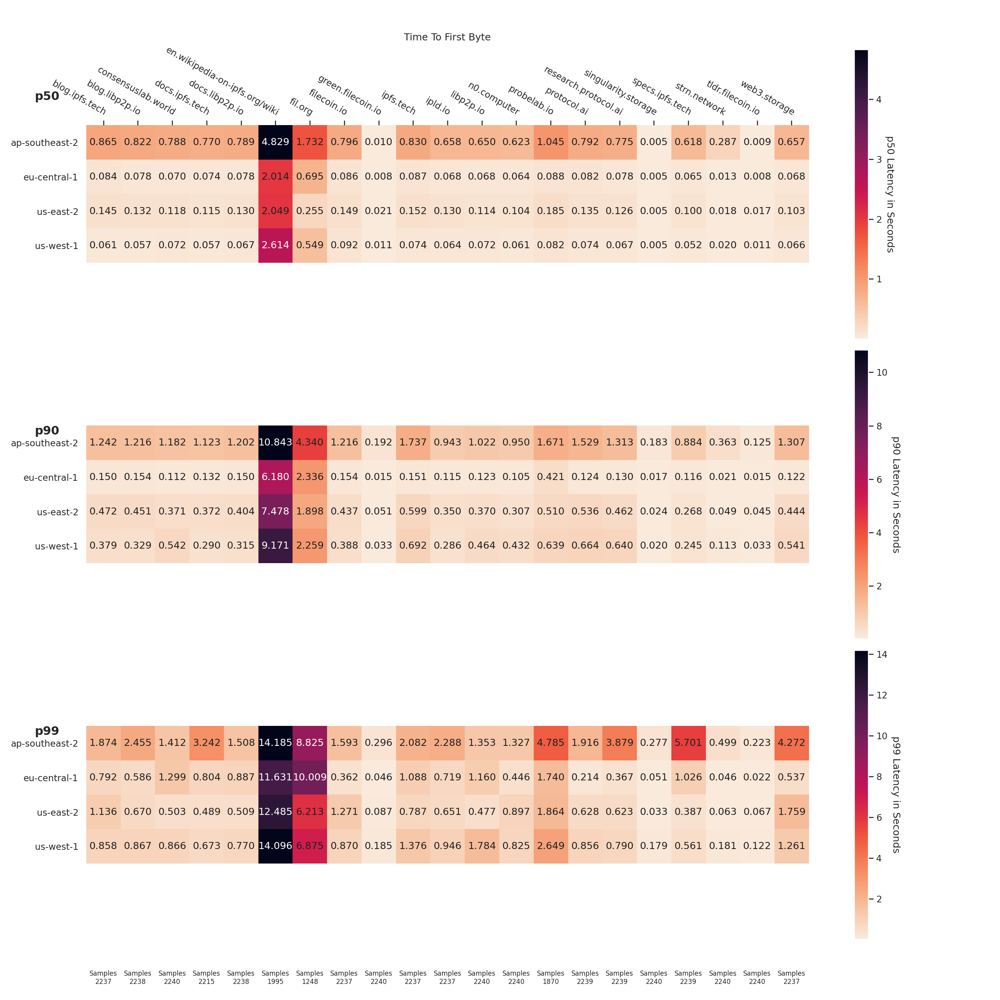

# Nebula Measurement Results Calendar Week 4 - 2025

## Table of Contents

- [Nebula Measurement Results Calendar Week 4 - 2025](#nebula-measurement-results-calendar-week-4---2025)
  - [General Information](#general-information)
    - [Agent Versions](#agent-versions)
    - [Protocols](#protocols)
    - [Top 10 Rotating Nodes](#top-10-rotating-nodes)
    - [Crawls](#crawls)
      - [Overall](#overall)
      - [Classification](#classification)
      - [Agents](#agents)
      - [DHT Server vs. Clients](#dht-server-vs-clients)
      - [Errors](#errors)
      - [Total Peer IDs Discovered Classification](#total-peer-ids-discovered-classification)
      - [Protocols](#protocols-1)
  - [Churn](#churn)
  - [Inter Arrival Time](#inter-arrival-time)
  - [Agent Version Analysis](#agent-version-analysis)
    - [Overall](#overall-1)
    - [Kubo](#kubo)
    - [Classification](#classification-1)
  - [Geolocation](#geolocation)
    - [Unique IP Addresses](#unique-ip-addresses)
    - [Classification](#classification-2)
    - [Agents](#agents-1)
  - [Datacenters](#datacenters)
    - [Overall](#overall-2)
    - [Classification](#classification-3)
    - [Agents](#agents-2)
  - [Website Monitoring](#website-monitoring)
    - [Time To First Byte](#time-to-first-byte)
    - [First Contentful Paint](#first-contentful-paint)
    - [Largest Contentful Paint](#largest-contentful-paint)
    - [HTTP vs. Kubo](#http-vs-kubo)
    - [Error Rate](#error-rate)
  - [DHT Performance](#dht-performance)
    - [Weekly](#weekly)
    - [Daily](#daily)
    - [Error Rate](#error-rate-1)
  - [Terminology](#terminology)
    - [Peer Classification](#peer-classification)
    - [Storm Specific Protocols](#storm-specific-protocols)

## General Information

The following results show measurement data that were collected in calendar week 4 in 2025 from `2025-01-27` to `2025-02-03`.

- Number of crawls `84`
- Number of visits `10,347,473`
  > Visiting a peer means dialing or connecting to it. Every time the crawler or monitoring process tries to dial or connect to a peer we consider this as _visiting_ it. Regardless of errors that may occur.
- Number of unique peer IDs visited `50,686`
- Number of unique peer IDs discovered in the DHT `50,172`
- Number of unique IP addresses found `56,599`

Timestamps are in UTC if not mentioned otherwise.

### Agent Versions

Newly discovered agent versions:

- `bitswapper@v1.0.0` (2025-01-27 04:01:10)
- `someguy/v0.8.0 2025-01-23-9deb78d` (2025-01-27 04:01:15)
- `kubo/0.33.0-rc3/4c23919/collab.ipfscluster.io` (2025-01-27 04:01:15)
- `kubo/0.34.0-dev/3c9cc3f/docker` (2025-01-27 04:01:20)
- `p2proxy@4b2a276fc` (2025-01-27 04:01:20)
- `p2p_win@` (2025-01-27 12:01:34)
- `dvpncmd@d87a1bcb2-hayek` (2025-01-27 14:01:11)
- `p2proxy@42c35ed5b-dirty` (2025-01-27 16:01:56)
- `bootnode-20250127213046` (2025-01-27 22:01:35)
- `bootnode-20250128114418` (2025-01-28 12:01:30)
- `ca-vsc@47987ea14` (2025-01-28 16:01:10)
- `bootnode-20250128143441` (2025-01-28 16:01:27)
- `github.com/harmony-one/harmony@03a37af6e` (2025-01-29 10:01:43)
- `kubo/0.30.0-dev/97e5e6b` (2025-01-29 16:01:44)
- `bootnode-20250129124112` (2025-01-29 16:01:54)
- `ca-vsc@07b604317` (2025-01-29 20:01:46)
- `kubo/0.33.0/8b65738` (2025-01-29 22:01:09)
- `kubo/0.33.0/8b65738/docker` (2025-01-29 22:01:17)
- `kubo/0.33.0/8b65738/1234567890123456789012345678901234567890` (2025-01-29 22:01:35)
- `kubo/0.33.0/` (2025-01-30 02:01:15)
- `bootnode-20250129223141` (2025-01-30 04:02:00)
- `kubo/0.33.0/8b6573802` (2025-01-30 06:01:19)
- `helia/4.2.4 libp2p/1.8.0 UserAgent=v22.11.0` (2025-01-30 10:01:22)
- `kubo/0.34.0-dev/dab91c8/docker` (2025-01-30 10:02:13)
- `ca-vsc@1067aade7` (2025-01-30 12:01:52)
- `bootnode-20250130115749` (2025-01-30 18:01:20)
- `kubo/0.34.0-dev/9adab29/docker` (2025-01-30 20:01:48)
- `kubo/0.34.0-dev/9adab295e-dirty` (2025-01-30 22:01:37)
- `kubo/0.34.0-dev/5d143a2/docker` (2025-01-30 22:01:46)
- `kubo/0.34.0-dev/42394af/docker` (2025-01-30 22:01:55)
- `kubo/0.33.0/desktop` (2025-01-31 00:01:08)
- `bootnode-20250130121745` (2025-01-31 04:01:14)
- `ca-vsc@4a8a1a38c` (2025-01-31 10:01:19)
- `kubo/0.34.0-dev/e08c7cb/docker` (2025-01-31 16:01:59)
- `bootnode-20250131084008` (2025-01-31 16:02:02)
- `kubo/0.34.0-dev/5d143a25c-dirty` (2025-01-31 16:02:02)
- `kubo/0.34.0-dev/6927f4f/docker` (2025-01-31 18:01:32)
- `kubo/0.33.0/8b6573802-dirty` (2025-01-31 18:01:45)
- `github.com/JackalLabs/sequoia@409e869a6` (2025-02-01 04:01:22)
- `codeberg.org/QuantumGang/QuantumSplitApi@` (2025-02-01 18:01:29)
- `bootnode-20250201205203` (2025-02-01 22:01:22)
- `kubo/0.33.0/9e38d69-dirty` (2025-02-02 16:02:12)

Agent versions that were found to support at least one [storm specific protocol](#storm-specific-protocols):

- `go-ipfs/0.8.0/48f94e2`
- `storm`

### Protocols

Newly discovered protocols:

- `/orbitdb/heads/orbitdb/zdpuAthCBzoJp1HyrYaF5vEE7QijtncgUtCgHfmDEPGmQGr2g` (2025-01-27 16:01:09)
- `/orbitdb/heads/orbitdb/zdpuAw1Y3dV7HtFoEb1FDCfMERfZomhcXZEwTzxFV6to4FsxM` (2025-01-27 16:01:09)
- `/orbitdb/heads/orbitdb/zdpuAyKNCDWyYKekh4iQS3qHDfSinyzgvUjVHBUFRZUXX8y8r` (2025-01-27 16:02:09)
- `/orbitdb/heads/orbitdb/zdpuAsPjLsaRYSA2bqY4rzQwtHz4oxR4dZ4KyoVh2euYY1nYU` (2025-01-27 16:02:09)
- `/orbitdb/heads/orbitdb/zdpuAneEhBU93vFCq8VnBZy9RvmptbZFQJxXJfMkQ42qYrn3Z` (2025-01-28 10:02:03)
- `/orbitdb/heads/orbitdb/zdpuAsYZpYUB6jd1HikEibwJxVHKrgGjk4foRSig7dn6isxJA` (2025-01-28 10:02:03)
- `/orbitdb/heads/orbitdb/zdpuAofKXJgKgJyWX5gkSUX7nfNFQzv4QiqEZXDe5T3qyfRy9` (2025-01-29 10:01:17)
- `/orbitdb/heads/orbitdb/zdpuAr4tF1VCENCZCm3w6wa98fCRfkcPBVAiHuJo5yetUppCz` (2025-01-29 10:01:17)
- `/orbitdb/heads/orbitdb/zdpuB3MUqRsTfm3Uy9Qha9D6sKDU62bDDBLBAotbD9BG1P8Xw` (2025-01-30 10:01:22)
- `/orbitdb/heads/orbitdb/zdpuArnUM7eL4ZiyhZSiYaXpS2TkzqNkeGVV8JEtmx5TZ2TVS` (2025-01-30 10:01:22)

### Top 10 Rotating Nodes

A "rotating node" is a node (as identified by its IP address) that was found to host multiple peer IDs.

| IP-Address    | Country | Unique Peer IDs | Agent Versions | Datacenter IP |
|:------------- |:------- | ---------------:|:-------------- | ------------- |
| `5.39.80.110` | FR | 84 | ['edgevpn']| True  |
| `2001:41d0:8:926e::1` | FR | 84 | ['edgevpn']| True  |
| `152.81.47.227` | FR | 71 | ['kubo/0.32.0/']| False  |
| `142.93.215.219` | IN | 52 | ['kubo/0.22.0/3f884d3/gala.games', 'kubo/0.28.0/', 'kubo/0.29.0/3f0947b']| True  |
| `2600:3c07::f03c:95ff:febb:e7a` | FR | 50 | ['edgevpn']| True  |
| `172.233.243.82` | FR | 50 | ['edgevpn']| True  |
| `91.230.153.86` | RU | 34 | ['edgevpn']| False  |
| `26.26.26.1` | US | 34 | ['gobind@', 'kubo/0.28.0/']| False  |
| `191.252.92.4` | BR | 22 | ['js-libp2p/0.45.9 UserAgent=v20.14.0']| True  |
| `88.99.172.194` | DE | 21 | ['kubo/0.18.1/675f8bd/docker', 'kubo/0.28.0-dev/121cfae/docker', 'kubo/0.29.0/3f0947b']| True  |

### Crawls

#### Overall

#### Classification

#### Agents

Only the top 10 kubo versions appear in the right graph (due to lack of colors) based on the average count in the time interval. The `0.8.x` versions **do not** contain disguised storm peers.

`storm*` are `go-ipfs/0.8.0/48f94e2` peers that support at least one [storm specific protocol](#storm-specific-protocols).

#### DHT Server vs. Clients

You can find the most up-to-date graph on [`probelab.io/ipfskpi`](https://probelab.io/ipfskpi/#ipfs-servers-vs-clients-plot).

#### Errors

#### Total Peer IDs Discovered Classification

In the specified time interval from `2025-01-27` to `2025-02-03` we visited `` unique peer IDs.
All peer IDs fall into one of the following classifications:

| Classification | Description |
| --- | --- |
| `offline` | A peer that was never seen online during the measurement period (always offline) but found in the DHT |
| `dangling` | A peer that was seen going offline and online multiple times during the measurement period |
| `oneoff` | A peer that was seen coming online and then going offline **only once** during the measurement period |
| `online` | A peer that was not seen offline at all during the measurement period (always online) |
| `left` | A peer that was online at the beginning of the measurement period, did go offline and didn't come back online |
| `entered` | A peer that was offline at the beginning of the measurement period but appeared within and didn't go offline since then |

#### Protocols

## Churn

Only the top 10 kubo versions appear in the right graph (due to lack of colors) based on the average count in the time interval. The `0.8.x` versions **do not** contain disguised storm peers. This graph also excludes peers that were online the whole time. You can read this graph as: if I see a peer joining the network, what's the likelihood for it to stay `X` hours in the network.

`storm*` are `go-ipfs/0.8.0/48f94e2` peers that support at least one [storm specific protocol](#storm-specific-protocols).

## Inter Arrival Time

Only the top 10 kubo versions appear in the right graph (due to lack of colors) based on the average count in the time interval. The `0.8.x` versions **do not** contain disguised storm peers.

`storm*` are `go-ipfs/0.8.0/48f94e2` peers that support at least one [storm specific protocol](#storm-specific-protocols).

## Agent Version Analysis

### Overall

Includes all peers that the crawler was able to connect to at least once: `dangling`, `online`, `oneoff`, `entered`. Hence, the total number of peers is lower as the graph excludes `offline` and `left` peers (see [classification](#peer-classification)).

### Kubo

`storm` shows the `go-ipfs/0.8.0/48f94e2` peers that support at least one [storm specific protocol](#storm-specific-protocols).

### Classification

The classifications are documented [here](#peer-classification).
`storm*` are `go-ipfs/0.8.0/48f94e2` peers that support at least one [storm specific protocol](#storm-specific-protocols).

## Geolocation

### Unique IP Addresses

This graph shows all IP addresses that we found from `2025-01-27` to `2025-02-03` in the DHT and their geolocation distribution by country.

### Classification

The classifications are documented [here](#peer-classification). 
The number in parentheses in the graph titles show the number of unique peer IDs that went into the specific subgraph.

### Agents

`storm*` are `go-ipfs/0.8.0/48f94e2` peers that support at least one [storm specific protocol](#storm-specific-protocols).

## Datacenters

### Overall

This graph shows all IP addresses that we found from `2025-01-27` to `2025-02-03` in the DHT and their datacenter association.

### Classification

The classifications are documented [here](#peer-classification). Note that the x-axes are different.

### Agents

The number in parentheses in the graph titles show the number of unique peer IDs that went into the specific subgraph.

`storm*` are `go-ipfs/0.8.0/48f94e2` peers that support at least one [storm specific protocol](#storm-specific-protocols).

## Website Monitoring

For a description of our measurement methodology check out [this repository](https://github.com/dennis-tra/tiros).

### Time To First Byte

The time it took to receive the first byte of the first response (that was not a redirect). The large number in each tile is the time in seconds. The number at the very bottom of the graph shows the sample size that went into each subplot/website. Note: the color scales are different in each graph.

### First Contentful Paint

### Largest Contentful Paint

### HTTP vs. Kubo

The number above each bar shows the sample size that went into the calculation.

### Error Rate

The following graph shows the daily error rate in accessing these website.

## DHT Performance

We are running lean libp2p peers that just support the Kademlia DHT protocol in six different AWS regions. Each peer takes turns to publish the provider record for a CID of random data. All other peers are then instructed to lookup that CID. "Looking up" here means finding the provider record. So the numbers below don't show the actual content retrieval times (which would depend on file sizes) but instead the DHT performance. The peers run `go-libp2p-kad-dht` version `v0.21.1` + default configurations.

Code can be found here: [dennis-tra/parsec](https://github.com/dennis-tra/parsec) (we plan to move this to our [ProbeLab organization](https://github.com/probe-lab))

### Weekly

The number in parenthesis is the number of publications/retrievals for that particular region that went into the calculation.

The number in the box is the number of publications/retrievals for that particular region that went into the calculation.

The box extends from the first quartile (Q1) to the third quartile (Q3) of the data, with a line at the median. The whiskers extend from the box by 1.5x the inter-quartile range (IQR). Flier points are those past the end of the whiskers. See https://en.wikipedia.org/wiki/Box_plot for reference.

### Daily

The number in the box is the number of publications that went into the calculation of the box.

The box extends from the first quartile (Q1) to the third quartile (Q3) of the data, with a line at the median. The whiskers extend from the box by 1.5x the inter-quartile range (IQR). Flier points are those past the end of the whiskers. See https://en.wikipedia.org/wiki/Box_plot for reference.

The number in the box is the number of publications/retrievals that went into the calculation of the box.

The box extends from the first quartile (Q1) to the third quartile (Q3) of the data, with a line at the median. The whiskers extend from the box by 1.5x the inter-quartile range (IQR). Flier points are those past the end of the whiskers. See https://en.wikipedia.org/wiki/Box_plot for reference.

### Error Rate

### Peer Classification

| Classification | Description |
| --- | --- |
| `offline` | A peer that was never seen online during the measurement period (always offline) but found in the DHT |
| `dangling` | A peer that was seen going offline and online multiple times during the measurement period |
| `oneoff` | A peer that was seen coming online and then going offline **only once** during the measurement period |
| `online` | A peer that was not seen offline at all during the measurement period (always online) |
| `left` | A peer that was online at the beginning of the measurement period, did go offline and didn't come back online |
| `entered` | A peer that was offline at the beginning of the measurement period but appeared within and didn't go offline since then |

### Storm Specific Protocols

The following protocol strings are unique for `storm` nodes according to [this Bitdefender paper](https://www.bitdefender.com/files/News/CaseStudies/study/376/Bitdefender-Whitepaper-IPStorm.pdf):

- `/sreque/*`
- `/shsk/*`
- `/sfst/*`
- `/sbst/*`
- `/sbpcp/*`
- `/sbptp/*`
- `/strelayp/*`