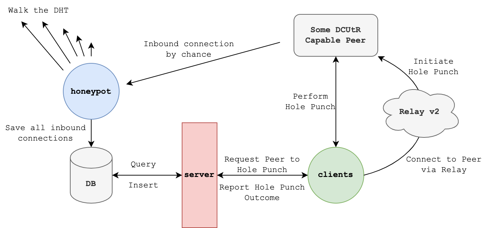
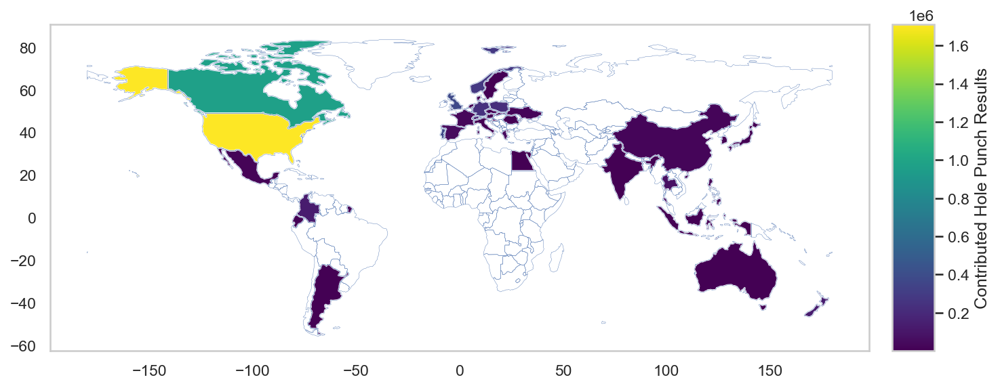

# Final Report: NAT Hole Punching Measurement Campaign

- [Final Report: NAT Hole Punching Measurement Campaign](#final-report-nat-hole-punching-measurement-campaign)
- [Impact \& TL;DR](#impact--tldr)
- [Introduction](#introduction)
- [Measurement](#measurement)
  - [Setup](#setup)
  - [Campaign](#campaign)
- [Analysis](#analysis)
  - [Scope of the Measurement Campaign](#scope-of-the-measurement-campaign)
  - [Protocol Filter](#protocol-filter)
  - [Client Contributions](#client-contributions)
  - [Individual Network Detection](#individual-network-detection)
    - [Public IP Address Grouping](#public-ip-address-grouping)
    - [Private IP Address Grouping](#private-ip-address-grouping)
    - [Conclusion](#conclusion)
  - [Network Outcomes](#network-outcomes)
  - [Aggregative Analysis](#aggregative-analysis)
    - [Network Success Rate](#network-success-rate)
    - [Network Success Rate over Time](#network-success-rate-over-time)
    - [Transport Protocol Dependence](#transport-protocol-dependence)
    - [Final Connection Transport](#final-connection-transport)
    - [Round Trip Time Dependence](#round-trip-time-dependence)
    - [Relay Path Location Dependence](#relay-path-location-dependence)
    - [Virtual Private Networks](#virtual-private-networks)
    - [Attempts](#attempts)
    - [Geographic Dependence](#geographic-dependence)
    - [Latency Impact](#latency-impact)
    - [Port Mappings](#port-mappings)
  - [Individual Analysis](#individual-analysis)
- [Conclusion](#conclusion-1)
- [Dataset](#dataset)
  - [Description](#description)
    - [Peers/Multiaddresses](#peersmultiaddresses)
    - [Connection Events](#connection-events)
    - [Hole Punch Results/Attempts](#hole-punch-resultsattempts)
    - [Latency Measurements](#latency-measurements)
    - [Port Mappings](#port-mappings-1)
    - [Network Information](#network-information)
    - [Authorizations/Clients](#authorizationsclients)
  - [Restoration](#restoration)
    - [Download](#download)
    - [Setup](#setup-1)
    - [Restore](#restore)
  - [Cleaning](#cleaning)
- [Resources](#resources)


# Impact & TL;DR

- Top Findings:
    - The hole punching success rate is around 70%
    - Hole punch success doesn’t depend on the round trip time
    - QUIC/UDP is not likelier to succeed than TCP
- Resulting Protocol Improvements
    - [#487 - relay/dcutr/quic: Alternate host sending garbage UDP packet](https://github.com/libp2p/specs/issues/487)
    - [#488 - dcutr: Improve VPN hole punching by subtracting default gateway RTTs from protocol RTT measurement](https://github.com/libp2p/specs/issues/488)
    - [#512 - dcutr/quic: prepare own router with low TTL packet first](https://github.com/libp2p/specs/issues/512)
- Issue reports
    - [#2067 - swarm: inconsistent listening address reporting](https://github.com/libp2p/go-libp2p/issues/2067)
    - [#2068 - holepunch: low IPv6 success rate](https://github.com/libp2p/go-libp2p/issues/2068)
- Outreach:
    - [FOSDEM 2023 - Hole punching in the wild](https://fosdem.org/2023/schedule/event/network_hole_punching_in_the_wild/)
    - [IPFS Camp 2022 - Decentralized NAT Hole-Punching](https://www.youtube.com/watch?v=bzL7Y1wYth8)
    - [IPFS Thing 2022 - libp2p NAT Hole Punching Success Rate](https://www.youtube.com/watch?v=fyhZWlDbcyM)
    - [Paris P2P Festival #1 - Hole punching with libp2p](https://www.youtube.com/watch?v=MCEEMrIRks8)
    - [FOSDEM 2022 - Peer-to-peer hole punching without centralized infrastructure](https://archive.fosdem.org/2022/schedule/event/peer_to_peer_hole_punching_without_centralized_infrastructure/)

# Introduction

[NAT hole punching](https://en.wikipedia.org/wiki/Hole_punching_(networking)) is a widely used technique for establishing peer-to-peer connections in networked systems, allowing communication between hosts that are behind Network Address Translation (NAT) devices. The concept of NAT hole punching was first introduced in [[1]](https://www.usenix.org/legacy/event/usenix05/tech/general/full_papers/ford/ford.pdf) and later formally described in [RFC 5128, which was released in 2008](https://www.ietf.org/rfc/rfc5128.txt). In the years that followed, various NAT hole punching protocols have been proposed and implemented. Most notably [WebRTC](https://webrtc.org/) makes use of NAT hole punching techniques which was released in 2011. In 2021 and early 2022, the [DCUtR](https://github.com/libp2p/specs/blob/master/relay/DCUtR.md) protocol was specified and implemented by the libp2p team at Protocol Labs, with the goal of making centralized components in traditional protocols, like WebRTC, obsolete. The implementation was presented in a [talk at FOSDEM 2022](https://archive.fosdem.org/2022/schedule/event/peer_to_peer_hole_punching_without_centralized_infrastructure/), where its potential was discussed, as well as in a [research paper](https://research.protocol.ai/publications/decentralized-hole-punching/) presented at [DINPS 2022](https://research.protocol.ai/sites/dinps/).

In December 2022, we conducted a [NAT hole punching measurement campaign](https://discuss.libp2p.io/t/call-for-participation-nat-hole-punching-measurement-campaign/1690/8) to evaluate the NAT hole punching success rate of the [DCUtR protocol](https://github.com/libp2p/specs/blob/master/relay/DCUtR.md). The goal of this campaign was to not only measure the performance of the protocol, but also to identify its limitations and potential areas for optimization. The measurement was designed to provide insights into when and why the DCUtR protocol fails in NAT hole punching and to provide recommendations for improvement. In this report, we will present the results of our measurement campaign and provide an analysis of the data collected. The findings of this report will be valuable for researchers and practitioners in the field of network communication, particularly those interested in improving the performance of NAT hole punching protocols.

# Measurement

## Setup



The measurement architecture for the NAT hole punching campaign consists of three components: the honeypot, a server, and a fleet of clients. The challenge is that we have no straightforward way of detecting peers that are behind NATs. A DHT crawler is not of much help in this case, as it only detects publicly reachable peers. The goal of the measurement architecture is to find peers that are behind NATs and not publicly reachable. For that, we use the **honeypot** component.

The **honeypot** is a DHT server peer that is designed to be very stable and announces itself to the network by slowly crawling it. This increases the chances that other peers add the honeypot to their routing tables. This, in turn, leads to increased traffic from client peers to the honeypot because other server peers increasingly redirect clients to it. The honeypot tracks all inbound connections from peers that satisfy both of the following conditions:

1. Peer supports the DCUtR protocol
2. Peer is only reachable through relay addresses → this indicates it’s behind a NAT

“Tracking all inbound connections” means that they are stored in the common database that’s then queried by the **server** component.

The **server** component exposes a gRPC API and can be queried for NAT'd + DCUtR capable peers. It is responsible for tracking the results of hole punching attempts and provides a centralized location for the clients to retrieve information about potential peers to hole punch.

The **clients**, which are implemented in both Rust and Go, periodically query the server for information about NAT'd DCUtR capable peers. They then use this information to perform hole punching attempts and report back the outcome to the server. This component provides the actual data for the measurement campaign and allows the server to collect the results. The Go client comes in two flavours, a CLI and a GUI version. The GUI version was developed to ease the onboarding of users to the measurement campaign.

## Campaign

"Hole Punch December" was announced in November 2022. We created a Google Form to allow participants to sign up and provide information about their network setup. The timeline is as follows:

- **November 2022:** [We announced the "Hole Punching December"](https://discuss.libp2p.io/t/call-for-participation-nat-hole-punching-measurement-campaign/1690), inviting participants to sign up for the measurement campaign. Participants signed up through the Google Form, providing information about their network setup and other details. Sign-up was not mandatory and people could just download the binary and contribute anonymously. If people signed up they received a personal API-Key that linked their data to the information that they provided during sign-up.
- **December 2022:** Measurement Campaign started. Participants were free to move around with their clients (i.e., moving laptop devices to different networks/WiFis) and contribute measurements from different networks. Sign-ups continued to increase slowly but steadily, reaching a total of 148.
- **January 2022:** An official notification regarding the completion of the measurement campaign has been disseminated. We started analysing the data.
- **February 2022:** Presentation of first results at FOSDEM 2023

# Analysis

## Scope of the Measurement Campaign




The measurement campaign ran from the 1st of December 2022 until the 1st of January 2023. However, the graphs and numbers in this report contain data until the 10th of January 2023. In total, we tracked `6.25M` hole punches from `212` API keys. Please note that participation in the campaign did not require sign-up, therefore, such participants were randomly assigned an API key. This explains why the total number of API keys generated was `212`, which is higher than the number of participants who signed up, which was `148`.

The clients were deployed in `39` different countries (left Figure) and hole punched remote peers in `167` different countries (right Figure). However, as we show in the next Figure not all of the data points are relevant to us (e.g., `NO_CONNECTION` data) and some of them are just an artefact of our measurement methodology. This can be seen from the numbers for the different outcomes:


**Hole Punch Result Outcomes:**

1. `UNKNOWN` - There was no information why and how the hole punch completed
2. `NO_CONNECTION` - The client could not connect to the remote peer via any of the provided multi addresses. At the moment this is just a single relay multi address.
3. `NO_STREAM` - The client could connect to the remote peer via any of the provided multi addresses but no `/libp2p/dcutr` stream was opened within 15s. That stream is necessary to perform the hole punch.
4. `CONNECTION_REVERSED` - The client only used one or more relay multi addresses to connect to the remote peer, the `/libp2p/dcutr` stream was not opened within 15s, and we still end up with a direct connection. This means the remote peer successfully reversed it.
5. `CANCELLED` - The user stopped the client (also returned by the rust client for quic multi addresses)
6. `FAILED` - The hole punch was attempted multiple times but none succeeded OR the `/libp2p/dcutr` was opened but we have not received the internal start event OR there was a general protocol error.
7. `SUCCESS` - Any of the hole punch attempts succeeded.

In the above graph, we can see that `12.7%` of all hole punch results have had an outcome of `NO_CONNECTION` which means that the client was not able to establish a connection to the remote peer through the relay. We excluded these data points from our consideration. This can happen if the remote peer has churned from the time it was discovered by the honeypot until the client tried to hole punch it.


The above two graphs show the individual outcomes (left) and the overall resulting success rate (right) over time across all clients and their hole punch results. Note, that this is a very birds-eye view of the data and doesn’t tell us a lot about the individual networks that the clients operate in - we discuss this point later on in the report.

<aside>
🔢 The measurement campaign in numbers:

- Time frame `2022-12-01` → `2023-01-01` (analysis also accounts for submitted results until `2023-01-10`)
- `299` API keys generated
- `212` of the `299` were actually used
- `165` of the `299` correspond to unique, non-rust users (see [Deduplicate Clients Table](#deduplicate-clients-table))
- `154` of the `165` users actually contributed hole punch results.
- `6.25M` hole punch results were submitted
- `6.15M` hole punch results were submitted from non-rust users (`98.4%`)
</aside>

Note that while the rust-libp2p project participated in the measurement campaign with a punchr implementation in Rust, the results from these clients have been excluded from the report. The rust-libp2p based punchr implementation was still in its early stages during the 
measurement months. Therefore, the results are not representative. 
However, the preliminary results led to multiple improvements, see these [closed pull requests by @mxinden](https://github.com/libp2p/punchr/pulls?q=is%3Apr+is%3Aclosed+author%3Amxinden).

## Protocol Filter

An important idiosyncrasy of our measurement setup is the “protocol filter”. When a client queries the server for a peer to hole punch the server randomly assigns a “protocol filter” that the client should apply to the hole punch. We do this to filter the data by different transport protocol/IP version combinations and observe the success rate based on these combinations. A protocol filter could be, e.g., `IPv4 + TCP` . This means the client will 

1. only announce the public IPv4/TCP Multiaddress to the remote peer and
2. only use the public IPv4/TCP Multiaddress of the remote peer for the hole punch

If the protocol filter results in an empty set of multi addresses, e.g., if the client or remote peer doesn’t have an IPv4/TCP Multiaddress, the filter is not applied to either side. The reasoning here was, that we don’t want to waste the opportunity for a hole punch only because we artificially filtered multi addresses. Multiaddress filtering was a custom addition to go-libp2p https://github.com/libp2p/go-libp2p/pull/1839

The distribution of IP/Transport combinations that the server randomly assigns is as follows:

- 15% IPv4 + TCP
- 15% IPv4 + QUIC
- 15% IPv6 + TCP
- 15% IPv6 + QUIC
- 40% no filter

Every time a client queried the server for a peer to hole punch a random protocol filter was sent along with it based on the above distribution.

In the following, when we show outcomes or success rates, we only consider the “no filter” case because this is representative of what peers would generally experience.

## Client Contributions

With the above in mind, we arrive at the following distribution of outcomes from the perspective of different clients.


Each bar in the above graph is an individual client and its observed outcomes of hole punches. The black dots represent the number of contributed hole punches. The right-hand side shows “Total 2,563,864” hole punches, which is roughly `40%` of the `6.25M` total number of tracked hole punch results from earlier because we only consider the “no filter” results. We didn’t take into account results that applied a protocol filter because this can bias the hole punch outcome. This in turn is not representative of what a client would experience in the default configuration. There are only `100 + 52 = 152` clients visible in this graph because `2` clients haven’t contributed a hole punch result without a filter.

Generally, this graph may give some interesting insights, however, looking at the data from a client's perspective distorts the view. Hole punch outcomes are not dependent on the individual clients but instead, on the specific network they were operated in. Since clients were allowed to freely move around each client could have potentially contributed hole punch results from several different networks. In the following sections, we, therefore, make a big effort to identify individual networks based on the reported IP addresses that the clients listened on when they submitted a hole punch result.

## Individual Network Detection

Grouping hole punch results by clients yields a distorted view of the data. Client operators were free to move around at their convenience. The hole punch outcomes are not dependent on the clients but on the specific network that they operated in. The challenge is:

❓ *How do we detect individual networks* ❓ 


The following sections describe how we tried to group hole punch results into unique networks based on their reported IP addresses. We assume that peers are in the same network if they have the same public IP address. However, many ISPs change public IP addresses every 24h but clients remain in the same network. We detect this by also considering the private listening addresses.

### Public IP Address Grouping

Imagine the following scenario:

- On hole punch `1` Peer A announces the following two public IP’s
    
    ```
    111.222.333.444
    1111:2222:3333:4444:aaaa:bbbb:cccc:dddd
    ```
    
- On hole punch `2` Peer A announces the following two public IP’s
    
    ```
    111.222.333.444
    FFFF:2222:3333:4444:aaaa:bbbb:cccc:dddd # <- different
    ```
    
- On hole punch `3` Peer A announces the following public IP
    
    ```
    FFFF:2222:3333:4444:aaaa:bbbb:cccc:dddd
    ```
    
- On hole punch `4` Peer A announces the following public IP
    
    ```
    111.222.333.444
    ```
    

In this example, we assume that Peer A was in the same network the whole time. This is what we want to detect. The code that achieves this grouping is in the “Data Cleaning” section [Individual Network Detection](#individual-network-detection).

We group all intersecting sets of public IP addresses (as above) if they fall in the same AS. With this technique, we discover `859` distinct public networks for the clients and `86,769` public networks for remote peers. By “public network” here we refer to the user’s local setup, e.g., a home network, office network, coffee shop network. We observed clients/peers announce to listen on public IPs in different AS’s at the same time. Clients/peers that announce public IPs in different networks account for `8.2%` of all reported hole punch results as can be seen in the graph below:


The graph shows that we could associate ~4.3 million (`72.1%`) reported hole punches to a single network.

The `19.7%` of `0` public networks are hole punch results where the client was not able to obtain a public IP address. This happens when the `identify` protocol fails to detect and report any observed addresses.

### Private IP Address Grouping

It is quite common for ISPs to rotate IP addresses of residential networks every 24h. This means that splitting the data by public IP address groupings is probably an “*over-splitting*”. To account for that we merge public IP address groups from step one if peers also advertise the same private IP addresses. For this grouping, we exclude the IP addresses `127.0.0.1`, `::1`, and `172.17.0.1` (the latter being the default IP address of the gateway between a Docker host and its bridge network).

This approach yields `414` unique networks. With this method, `4,677,252` hole punch results could be assigned to a single network. For `267,968` the network association was ambiguous which is `5.4%`. Here’s an example of an ambiguous association:

<aside>
💡 Peer A did a hole punch and reports back that it was listening on IP4_1 and IP6_2. IP4_1 is in AS `X` and IP6_2 falls into AS `Y` . This means we don’t really know where the peer was 🤷. This occurred for `5.4%` of all our mappings.

</aside>

We only assigned networks to the hole punch results where the association was not ambiguous. This yields `372` unique networks that the hole punches happened in.

To further verify this mapping we check if our identified networks were used by multiple clients. This is very unlikely as only mostly unrelated people signed up for our measurement campaign. So, it’s unlikely that they were operating in the same networks. These are the numbers

- `363` (97.6%) of our identified unique networks saw usage from only `1` client
- `7` (1.9%) of our identified unique networks saw usage from only `2` clients
- `1` (<0.3%) of our identified unique networks saw usage from only `5` clients
- `1` (<0.3%) of our identified unique networks saw usage from only `8` clients
- Graph
    
    
    
    x-axis: number of clients that 
    

Manual inspection of the networks that saw usage from multiple clients showed plausible overlaps. E.g. one identified network was used by me and my partner. Another network was used by two launchpad organizers that knowingly were running the client in the same network.

Similarly, we can identify client mobility by checking, in how many different network single clients were seen:


This graph shows that `~60%` of the client were only operated in a single network. While there was one client that operated in `28` unique networks.

### Conclusion

By grouping the set of IP addresses that get reported by the clients in various ways we were able to identify different networks that the clients operated in. We achieved this despite challenges due to the lack of public IP address stability for residential networks and contradicting reports from clients.

For the following analysis, we only consider hole punches that we were able to unambiguously assign a single network and are not responses from rust clients. This means from our `6,254,741` hole punch results we “only” consider `4,677,252` or `75%`.

## Network Outcomes


💡 There are only `100 + 252 = 352` networks in this graph. Further up, we talked about `372` unique networks. This graph also only considers 1.9M hole punches although further up we talked about 4.6M hole punches. This is because when it comes to success rate/outcomes we only consider the hole punches that have had no filter applied. See [Protocol Filter](protocol-filter)

The above graph shows some networks that are better suited for hole punches than others. For example, there are two networks that almost only have `FAILED` outcomes, while the ones to the left are reasonably well suited. There is also a significant number of networks that have `CONNECTION_REVERSED` outcomes.

In the following Section, we will take a look at the data from two angles. 1) We take an “aggregative” view where we average results across different networks to get a sense of the overall performance, and 2) we pick out individual networks and try to identify reasons for subpar hole punch success rates.

## Aggregative Analysis

### Network Success Rate


<aside>
💡 The graph only considers `89` networks because we also excluded hole punch results that had a port mapping in place. We also only considered networks that contributed more than `1,000` hole punches with the outcome `SUCCESS` or `FAILED`.

</aside>

This graph shows how many networks experienced which hole punch success rate binned by `5%`. Most networks saw a success rate of `~70%` while `4` networks were unsuitable with a success rate of `<5%`.

### Network Success Rate over Time


The color shade of each dot represents an individual network. The position of each dot shows the success rate during a certain day. The faint red line in the background shows the contributed number of hole punches per day. One can see, that the number of contributed hole punches rose following the 1st of December and then receded over Christmas until it died away after we sent out the measurement campaign termination notification in the beginning of January.

### Transport Protocol Dependence


The above graph shows hole punch results that have had an active protocol filter applied. See [Protocol Filter](#protocol-filter). We also only consider networks that contributed more than `1,000` hole punch results with the outcome `SUCCESS` or `FAILED`.

The above graph shows that the average success rate between TCP and QUIC is roughly the same. However, QUIC is less volatile in the case of IPv4. The low success rate in the case of IPv6 is surprising. This needs further investigation as to what the reasons could be.

### Final Connection Transport

While the hole punch success rates for TCP and QUIC are roughly the same, we see a completely different picture when both clients are allowed to use both transports for hole punching. In that case, we end up with a QUIC connection in almost `81%` of the cases. We can explain this with generally faster connection establishment of QUIC connections. `libp2p` tries to hole punch using both transports at the same time, so both connection attempts race against each other. As soon as one connection succeeds, `libp2p` closes the remaining in-flight ones.


### Round Trip Time Dependence


This graph shows CDFs of the round trip times through the relay to the remote peer in case of a successful hole punch and in case of failed hole punches. With this graph, we try to identify if the success rate is dependent on the round trip time. The graph shows that if we have a higher round trip time, the chances for an unsuccessful hole punch are also higher. However, the difference *seems* marginal.

### Relay Path Location Dependence


Let’s imagine the RTT to the remote peer through the relay is `1s` and the RTT to the relay is `0.5s`, then we’d assume that the relay is `50%` away from us on the path to the remote peer. Similarly, if the relay is very close and the RTT is only `0.1s` from us, the relay would have a location of `10%`.

The above graph shows the success rate for different path locations in blue (binned by 5%) and in red, the number of hole punch results where the relay was at that specific path location.

The success rate is surprisingly independent of the location of the remote peer. Also, the majority of relay nodes seem to fall right in the middle from us to the remote peer.

### Virtual Private Networks

When one of the peers is connected through a VPN, it potentially introduces another layer of NAT and can complicate the NAT Hole Punching process. This is because the VPN server acts as a middleperson and creates another NAT layer, obscuring the original NAT mapping of the peer behind it. As a result, our DCUtR protocol may fail to establish a direct connection between the two peers.

Additionally, VPNs often employ extra security measures, such as firewalls, that can block incoming connections, making it even harder for NAT Hole Punching to succeed.


Generally, the presence of a VPN can make NAT Hole Punching less effective due to the additional NAT layer and security measures that it introduces. The graph on the right *suggests* that this reasoning is correct. 

However, we identified peers behind NATs as peers that reported to **not listen** on any private IP address besides the loopback addresses `127.0.0.1` / `::1` and the default Docker host/container bridge `172.17.0.1`. **This grouping was done completely separate** from the more sophisticated IP address grouping described in [Individual Network Detection](#individual-network-detection).

<aside>
💡 We proposed a protocol improvement to address this issue in https://github.com/libp2p/specs/issues/488

</aside>

### Attempts


<aside>
💡 The graph only considers hole punch results that had an outcome of `SUCCESS` and no protocol filter applied. This time it includes rust results.

</aside>

This graph shows that if a hole punch was successful, it was successful with the first attempt. This is an important finding and can directly flow back into the protocol design. We consider the following two ways forward to incorporate this finding:

1. Stop hole punching after the first attempt because it’s unlikely to succeed.
2. Continue hole punching but change the strategy.

We would suggest to change the strategy with subsequent attempts. One idea would be to alternate roles in the QUIC hole punching protocols (who sends random bytes).

<aside>
💡 We proposed this protocol improvement in issue https://github.com/libp2p/specs/issues/487

</aside>

### Geographic Dependence


The above graph shows the success rate across different continent combinations. If there was a continent dependence we would see identical success rates among continent combinations. E.g., hole punching from `NA` to `EU` should be as successful as from `EU` to `NA` because we’re always hole punching in both directions. Note that the color scale does not start at `0%` success rate, but at `~33%` , so success rate differences are not as pronounced as they may seem.

### Latency Impact


The above graph shows the latency impact of a successful hole punch. In this graph, we’re dividing the RTT after a successful hole punch to the remote peer by the RTT through the relay to the remote peer. E.g., if one has a RTT to the remote of `1s` through a relay and afterwards a direct RTT of `0.7s` we only have 70% of the original RTT. The above graph shows that 50% of all peers experienced only `70%` of their original round trip time or less after the hole punch. `10%` report a higher RTT after the hole punch (all points above `10^0`). Generally, `90%` of peers profit from a hole punch with a lower RTT.

### Port Mappings


The above graph shows the hole punch outcomes based on whether a port mapping was active (reported by AutoNAT). As expected, the number of `CONNECTION_REVERSED` outcomes is way higher than in the `inactive` port mapping case. Interestingly, the `NO_STREAM` case also occurs more frequently than in the `inactive` case.The `NO_CONNECTION` outcomes are basically the same, which is also expected.

## Individual Analysis


In this section, we want to take a look at one individual client and may find out why they have a higher error rate than others. For now, we will focus on the network in red, which has an internal network ID of `325`. These are the contributed hole punch results and respective outcomes from that particular client/network:


As one can see, it has consistently a low success rate across time. So it is not something temporary. If we compare the errors in the hole punch attempts from this peer with a peer that has a higher success rate we see the following error messages:


The x-axis shows the percentage of all errors

# Conclusion

In this NAT hole punching measurement campaign, we found that the success rate of hole punching is approximately 70%. Moreover, we discovered that the success of hole punching does not depend on the round trip time, and QUIC/UDP is not more likely to succeed than TCP. These findings provide useful insights into the effectiveness of NAT hole punching and can guide the development of the protocol.

To improve hole punching in libp2p, we proposed several protocol improvements and reported some issues on Github. These efforts will enhance the reliability and efficiency of hole punching in libp2p.

We also shared our findings and experiences with the broader community through various outreach activities, including conference talks and videos. These efforts aim to increase awareness of the importance of hole punching and stimulate further research and development in this field.

Overall, this NAT hole punching measurement campaign provides valuable insights into the state-of-the-art of hole punching in libp2p and highlights the importance of continued research and development in this area to advance the field of P2P networking.

---

# Dataset


In this section, we will provide a detailed overview of the dataset used in our analysis. This includes information on the time scope of the data, as well as instructions on how to download the dataset and set up a database for storage. Additionally, we will describe the process for restoring the data, and how we obtained the database dump.

## Description

### Peers/Multiaddresses

We collect agent version, supported protocols, and Multihashes of all peers that interact with our measurement infrastructure. Similarly, when we get hand of a multi address we extract the underlying IP address, corresponding Geolocation (continent, country), if it’s a public address or not, if it’s a relayed address or not, if the IP address belongs to a known datacenter, and the corresponding Autonomous System Number.

### Connection Events

As discussed in [Measurement Setup](#setup) the honeypot component tracks inbound connections from DCUtR capable peers. We call these events “Connection Events”. A Connection event consists of the following information:

- `local_id` - The internal database peer ID of the honeypot
- `remote_id` - The internal database peer ID of the peer that connected to the honeypot
- `conn_multi_address_id` - The multiaddress of the connection to the honeypot
- `connection_events_x_multi_addresses` - All advertised multi addresses of the remote peer. They strictly won't contain a public IP address that is not a relayed address. This set will be served to clients.

### Hole Punch Results/Attempts

A “Hole Punch Result” is what gets reported back by the clients and can consist of multiple “Hole Punch Attempts”. A *hole punch result* can have one of the following outcomes:

**Hole Punch Result Outcomes:**

1. `UNKNOWN` - There was no information why and how the hole punch completed
2. `NO_CONNECTION` - The client could not connect to the remote peer via any of the provided multi addresses. At the moment this is just a single relay multi address.
3. `NO_STREAM` - The client could connect to the remote peer via any of the provided multi addresses but no `/libp2p/dcutr` stream was opened within 15s. That stream is necessary to perform the hole punch.
4. `CONNECTION_REVERSED` - The client only used one or more relay multi addresses to connect to the remote peer, the `/libp2p/dcutr` stream was not opened within 15s, and we still end up with a direct connection. This means the remote peer successfully reversed it.
5. `CANCELLED` - The user stopped the client (also returned by the rust client for quic multi addresses)
6. `FAILED` - The hole punch was attempted multiple times but none succeeded OR the `/libp2p/dcutr` was opened but we have not received the internal start event OR there was a general protocol error.
7. `SUCCESS` - Any of the hole punch attempts succeeded.

Each *hole punch attempt* in turn can also have different outcomes:

1. `UNKNWON` - There was no information why and how the hole punch attempt completed
2. `DIRECT_DIAL` - The connection reversal from our side succeeded (should never happen)
3. `PROTOCOL_ERROR` - This can happen if e.g., the stream was reset mid-flight
4. `CANCELLED` - The user stopped the client
5. `TIMEOUT` - We waited for the internal start event for 15s but timed out
6. `FAILED` - We exchanged `CONNECT` and `SYNC` messages on the `/libp2p/dcutr` stream but the final direct connection attempt failed -> the hole punch was unsuccessful1.
7. `SUCCESS` - We were able to directly connect to the remote peer.

The outcome of the hole punch result is derived from the outcomes of the attempts.

### Latency Measurements

Before clients attempt to hole punch a remote peer, the client measures several latencies. It measures the latencies to all relays that the remote peer claims to be reachable through. It also measures the latency to the remote peer through one of the relays. Finally, if the hole punch succeeds, the client also measures latency of the direct connection. The database field `mtype` is `TO_RELAY`, `TO_REMOTE_THROUGH_RELAY`, and `TO_REMOTE_AFTER_HOLEPUNCH` respectively.

<aside>
⚠️ The aggregate values `avg`, `std` etc. are not correctly calculated and need to account for `-1` latencies that happen if a ping timed out. We have corrected this in our data cleaning efforts.

</aside>

### Port Mappings

For each hole punch result we track any active port mappings that get reported back from AutoNAT. If a port mapping is in place it is more likely for an outcome of `CONNECTION_REVERSED`. With this data we can test this hypothesis. Each port mapping consists of the following data:

- The hole punch it refers to
- Internal Port of the client in the local network
- External Port of the router
- Transport used for port mapping
- External facing address

### Network Information

Every time the client has requested a peer to hole punch from the server it checks whether the set of addresses it listens on has changed. If it has changed it may changed networks. In this case the client just does a GET request on `/` of its local gateway. A common IP address would be `192.168.0.0`. In home networks this often returns the login page of the home router. This gives us additional information about the network that the client operated in. The `router_html` field contains the raw HTML of the routers login page. The `supports_ipv6` fields are unused and always `NULL`.

### Authorizations/Clients

Each time someone signed up through our Google Form we generated a UUID API-Key and saved it alongside the email address (from the form) into this table. We asked participants to provide the API Key to their client installations (GUI or CLI). Every hole punch result reported from these clients contained the API key so that we can associate the result with the Google Form information.

Importantly, the Go-Client generated ten peer identities upon startup. Each peer ID would listen on a different port. For each hole punch we ‘round robin’ through the ten peers. This way we mitigated persistent port mappings to yield a high number of `CONNECTION_REVERSED` results. When the client starts up it reports the identities of these ten clients to the server. This fills the `clients` table where you have a mapping between peer ID and authorization ID.

So, to map a hole punch result to an authorization, you’d need to map the `local_id` field onto the `clients` table and then to the `authorizations` table

## Restoration

### Download

Download the following postgres dump files

| File | CID |
| --- | --- |
| 2023-01-10-punchr-dump.gz_aa | bafybeidlvagqfxwoxsmsji47znfoa673lnf2c7lochjjrf65ozwavr6l4q |
| 2023-01-10-punchr-dump.gz_ab | bafybeia4ued76f3usklb7klumgrm347jrxvnnowkepuskfzkbyevpwt3z4 |
| 2023-01-10-punchr-dump.gz_ac | bafybeieiez5gpy4vnecndjrdww3nojhjjff2merezcoo464pkk7zeq4ukq |
| 2023-01-10-punchr-dump.gz_ad | bafybeiavl2qmifljlrjaspsuonrh675kwnsi5kquwjv6r4tivyn6f5pn5a |

and combine them to a single file via:

```bash
cat 2023-01-10-punchr-dump.gz_* > 2023-01-10-punchr-dump.gz
```

Then check that the file's hash matches this SHA256 `f62739671d738cf10ac14add5c01358ded74ca559b69a669250d7ee75c010876` by running:

```bash
sha256sum 2023-01-10-punchr-dump.gz
```

### Setup

Run the following command to start the database:

```bash
docker run --rm -p 5432:5432 -e POSTGRES_PASSWORD=password -e POSTGRES_USER=punchr -e POSTGRES_DB=punchr postgres:14
```

### Restore

Then run the following command to restore the database:

```bash
pg_restore -v -x -O -U punchr -d punchr -h localhost -j 4 --disable-triggers 2023-01-10-punchr-dump.gz
```

*The password is: `password` if you used the above docker command*

This command took around seven minutes on my `16" Apple M1 Max Macbook Pro` to complete

Now, you should have restored the database and be ready to go.

## Cleaning

To streamline the analysis we performed some data cleaning tasks. You can find the whole Jupyter notebook to clean the data here:

[punchr/2023-02-02-data-cleaning.ipynb at campaign-analysis · libp2p/punchr](https://github.com/libp2p/punchr/blob/campaign-analysis/report/2023-02-02-data-cleaning.ipynb)

# Resources

- FOSDEM 2022 Talk @mxinden - [https://archive.fosdem.org/2022/schedule/event/peer_to_peer_hole_punching_without_centralized_infrastructure/](https://archive.fosdem.org/2022/schedule/event/peer_to_peer_hole_punching_without_centralized_infrastructure/)
- punchr repository - https://github.com/libp2p/punchr
- Call for participation - [https://discuss.libp2p.io/t/call-for-participation-nat-hole-punching-measurement-campaign/1690](https://discuss.libp2p.io/t/call-for-participation-nat-hole-punching-measurement-campaign/1690)
- Talk @mxinden Paris P2P Festival 2022 - [https://youtu.be/MCEEMrIRks8](https://youtu.be/MCEEMrIRks8)
- Talk @dennis-tra IPFS Camp 2022 - [https://youtu.be/bzL7Y1wYth8](https://youtu.be/bzL7Y1wYth8)
- Paper that explains all the details, published at [DINPS 2022](https://research.protocol.ai/sites/dinps/) - [https://research.protocol.ai/publications/decentralized-hole-punching/](https://research.protocol.ai/publications/decentralized-hole-punching/)
- Talk @dennis-tra IPFS Thing 2022 - [https://www.youtube.com/watch?v=fyhZWlDbcyM](https://www.youtube.com/watch?v=fyhZWlDbcyM)