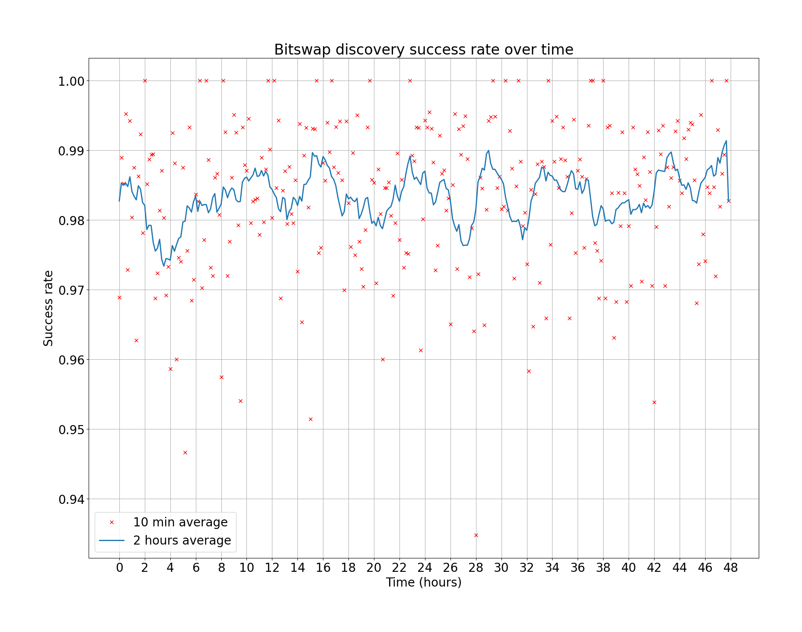
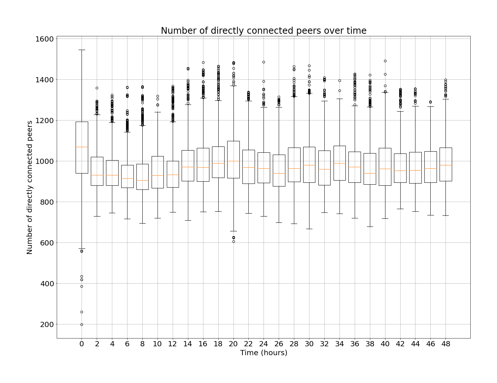
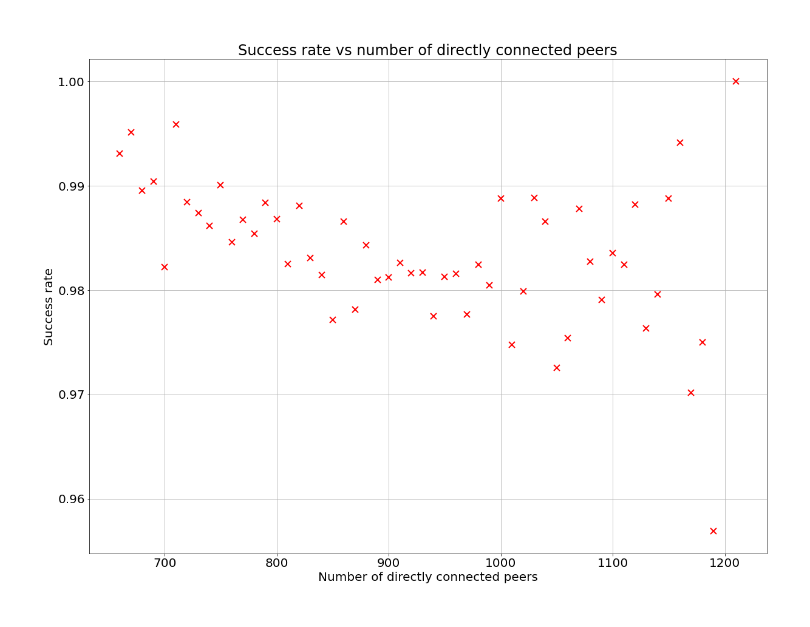
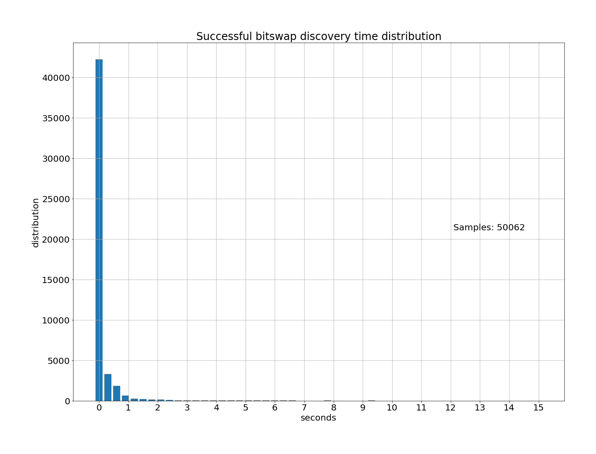
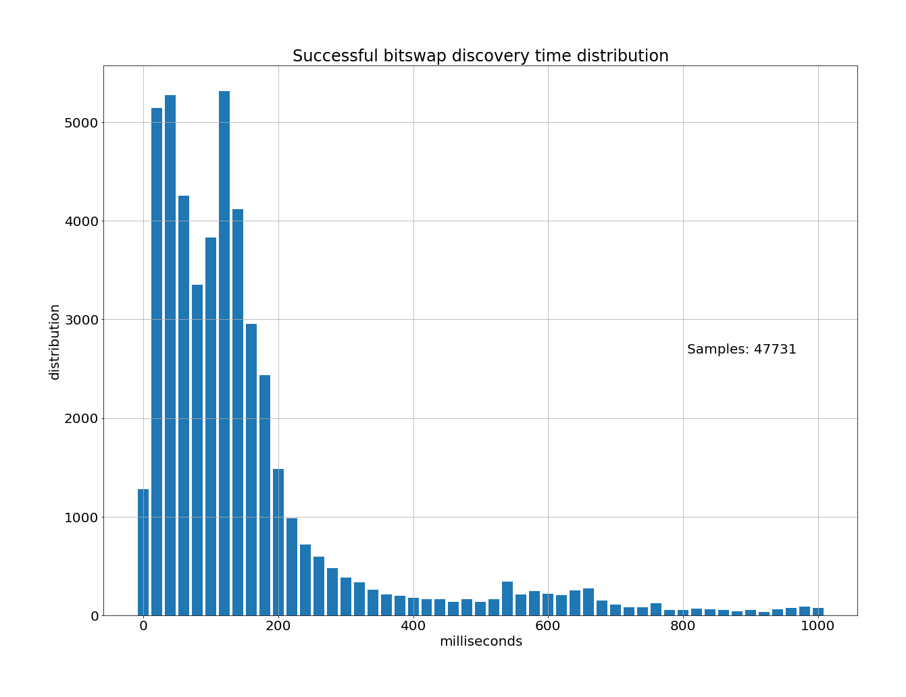
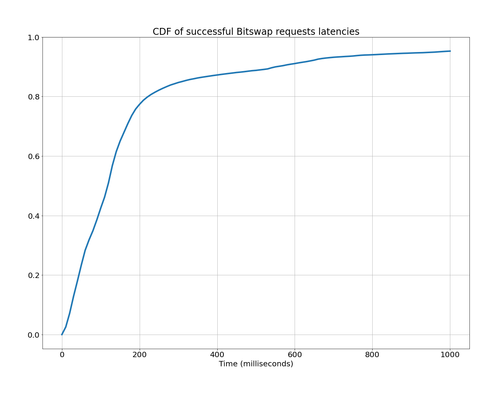
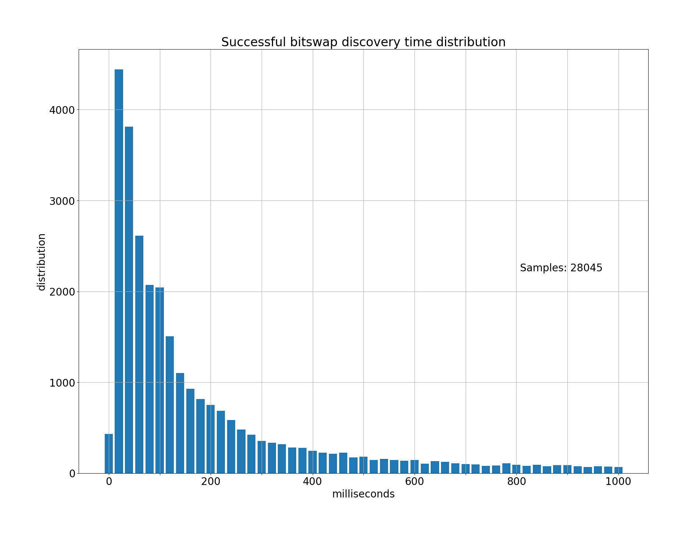

# RFM-16: Effectiveness of Bitswap Discovery Process

Author: [Guillaume Michel](https://github.com/guillaumemichel)

Date: 2022-12-13

## Table of contents

1. [Motivation](#motivation)
2. [Measurement Methodology](#measurement-methodology)
3. [Results and Analysis](#results-and-analysis)
4. [Improvement suggestions](#improvement-suggestions)
5. [Conclusion](#conclusion)

<!---
2. [Measurement Methodology](#measurement-methodology)
    - [CIDs selection](#cids-selection)
    - [Kubo](#kubo)
    - [go-bitswap](#go-bitswap)
    - [Logs](#logs)
    - [Running measurements](#running-measurements)
    - [Technical Limitations](#technical-limitations)
--->

## Motivation

Bitswap is the data exchange protocol for IPFS. Whenever a new CID is requested to [`kubo`](https://github.com/ipfs/kubo), a new Bitswap session will start, and the node will broadcast requests for the CID to its directly connected peers. If the file isn’t discovered in `ProviderSearchDelay` seconds, Bitswap starts a DHT walk to discover the providers of the file identified by the CID. If the DHT walk returns some providers, Bitswap will connect to them and ask them to transfer the file identified by the CID.

At the time of writing, Bitswap has a `ProviderSearchDelay` variable set to [1 second by default](https://github.com/ipfs/go-bitswap/blob/82ac8b359cb0960e1c190e944bfecf354493d7f1/internal/defaults/defaults.go#L10). This means that, unless the node is already directly connected to the content provider, the request to discover and fetch the content will be delayed by a second, which is far from ideal as IPFS targets sub-second data delivery. We would like to provide a better value for the `ProviderSearchDelay` whose value has been arbitrarily selected until now.

This study aims at measuring the effectiveness of the Bitswap discovery process, or in other words how efficient is Bitswap as a content discovery protocol. The performance of Bitswap discovery is the ratio of requests succeeding before the DHT walk starts. We also measure the time distribution of the successful Bitswap requests, and the number of packets sent by Bitswap for each requested CID. 

Assuming that content in the IPFS network is uniformly distributed among the ~20’000 peers participating in the DHT, and given that each node broadcasts requests to its ~1’000 directly connected peers, we would expect a success rate of approximately $\frac{1'000}{20'000} = 5\%$.

## Measurement Methodology

The Bitswap measurements mainly consist in requesting various CIDs to `kubo` and to monitor whether the Bitswap requests succeed without a DHT walk, recording the time distribution of successful Bitswap requests, and log incoming and outgoing Bitswap packets. In order to get this information, we had to modify both `kubo` and `go-bitswap` implementations.

### CIDs selection

We want the requests to be a realistic set of CIDs that is actually being requested from the network. Hence, we selected CIDs from two different sources, in order to be able to compare if there were any differences in the success rate. It is important that all requested CIDs are independent from each other. For instance, if the root CID of a large file is requested, we don’t want to measure the resolution of all pieces of the file. Instead, we are only interested in the initially requested CID (i.e., the root CID). This is because it is very likely for the rest of the CIDs of the DAG to be available through the same peer as the root CID was, i.e., the peer is very likely to have all of the file if it has its root CID.

The first source of CIDs is passive Bitswap sniffing. [Leo Balduf](https://github.com/mrd0ll4r) from the Weizenbaum Institute has been running a `kubo` node, recording all Bitswap requests. Out of the list of all requests, we only kept the CIDs, removed duplicates and randomized the list, in order to avoid any correlation between successive CIDs in the list (i.e., CIDs belonging to the same DAG/file). The Bitswap sniffing logs were captured on 2022-08-16.

The second source of CIDs is the logs from the IPFS Gateways gathered using [Thunderdome](https://github.com/ipfs-shipyard/thunderdome/tree/main/cmd/logtool). The logs contain all CIDs that were requested to the IPFS Gateways over HTTP(S). The list of CIDs is also randomized in order to avoid any correlation between successive requests, and invalid CIDs were filtered out from the logs. The Gateways logs were captured on 2022-12-05.

### Kubo

Normally, the `ipfs get <CID>` command will first resolve the provided CID, and in the case where this CID has children, the children CIDs will be resolved too before returning. We want to avoid this behavior, as it will give a bias to the measurements. For instance, in the case where the root CID of a large file is requested, if all blocks of the file are requested through Bitswap we would certainly measure a very good performance, as all blocks are most likely stored on the same content provider. Hence, finding the first block can be considered to be content discovery, but fetching all the blocks from the content providers don’t provide a good metric on content discovery.

As there is no easy way to identify which CIDs from our sample are root CIDs and which are not, we slightly modified `kubo` to prevent it to follow up after a root CID request. The implementation can be found TODO:

### go-bitswap

#### Blocking `FindProvidersAsync`

[`FindProvidersAsync`](https://github.com/ipfs/go-bitswap/blob/82ac8b359cb0960e1c190e944bfecf354493d7f1/network/ipfs_impl.go#L377) is the function that is called by Bitswap client `sessions` after the `ProviderSearchDelay` in order to discover content providers for a CID from the DHT. We want to give Bitswap more time than `ProviderSearchDelay = 1 second` to discover the content, so that we can have a better analysis of the successful content discovery time distribution, even if that’s not a realistic delay to wait for. In other words, we want to have an overall picture of the Bitswap discovery latency for all successful requests (not only those that respond within 1s). Hence, all calls to `FindProvidersAsync` have been blocked from the Bitswap client code. If the Bitswap client is able to find the content associated with the CID, the request will be considered as `SUCCESS`.

#### Timeout

After a timeout value, set to `15` seconds, we interrupt the Bitswap request, simply because we have to stop the request after some time. We selected 15 seconds, as this delay seems more than enough for Bitswap to find content without the help of the DHT, and more than 15 seconds would slow down our measurement experiments too much.

#### DHT lookup

Once the timeout is reached and the Bitswap request is cancelled, we need to try to fetch the file. If the file wasn’t found by Bitswap and isn’t discoverable by the DHT, then it is probably not available anymore in the network. This case shouldn’t be considered as a failure from Bitswap. A Bitswap request is considered to be a failure only if Bitswap didn’t manage to discover the content in 15 seconds, and at the same time the DHT walk returned at least one provider from which the content could actually be fetched.

Therefore, a DHT walk will start after the timeout. All providers returned by the DHT lookup will be queried by the [Selfish Bitswap Client](https://github.com/guillaumemichel/go-selfish-bitswap-client). The Selfish Bitswap Client is a simple Bitswap client that will request a CID to a specific PeerID using the Bitswap protocol. It doesn't implement Bitswap sessions nor peer manager, like the standard Bitswap client. It doesn't contain a Bitswap server, and thus won't serve blocks.

If the Bitswap client isn’t able to discover the content associated with the CID within 15 seconds, and the content was later fetched by the selfish Bitswap client after the DHT walk, the request is considered as a `FAILURE`. If the DHT walk doesn’t yield any providers for the content, the request is considered as `NO_PROVS`, and if a provider record is found but the file couldn’t be fetched by the selfish Bitswap client, the request is categorized as `FETCH_FAILED`.

### Logs

Our measurement tool generates two distinct log files. The first log file logs the following information for each IPFS request:
- The timestamp corresponding to the time the request was made.
- The requested CID.
- The number of directly connected peers at the time the request returns.
- `NO_PROV` OR `FETCH_FAILED` to notify that the file wasn't fetched OR the duration of the successful request in milliseconds and the block provider OR only the block provider if the block was discovered using the DHT.

The second log file contains one entry for each outgoing and incoming messages:
- The timestamp of the message
- Message type, among the following: `WANT_HAVE`, `HAVE`, `DONT_HAVE`, `WANT_BLOCK`, `BLOCK`, `CANCEL_WANT_BLOCK`.
- The CID associated with the message.
- The PeerID receiving or sending the message.

All the results that are presented below are derived from these log files.

### Running measurements

A shell script is [available](../implementations/rfm16-bitswap-discovery-effectiveness/) to start the measurements. It basically starts a modified `kubo` daemon, and calls a python script. The [python script](../implementations/rfm16-bitswap-discovery-effectiveness/requests.py) reads a list of CIDs and concurrently requests CIDs (10 threads by default) by calling `ipfs get <CID>`. All results are logged to files as the experiment goes.

The experiments were run on a `e2-custom-6-16384` Debian 11 Virtual Machine from Google Cloud, located in `europe-west-b`.

### Technical limitations

The duration we measure for successful Bitswap content discoveries is the Time To First Block, and not the Time To First Byte (TTFB). Ideally, it would be better to measure the TTFB, as the size of the block doesn’t matter when measuring content discovery. However, as only one block is fetched, we can assume that all fetched blocks have the same size. We also measure the Time To First HAVE, so that we have the knowledge of when the content was discovered.

## Results and Analysis

Our experiment started on Monday 2022-11-28 at 11:37:44 GMT and ran for 50 hours. The list of CIDs used for this experiment was provided from Bitswap sniffing as described in [CIDs selections](#cids-selection).

### Request categorization

As described in [DHT lookup](#dht-lookup), each Bitswap request is given a category depending on the availability of the block in the network.

| Statistics | |
| --- | --- |
| Overall success rate | 98.37% (within 15 seconds) |
| Available content rate | 70.91% |

| Request Categorization | Count |
|---|---|
| TOTAL | 71769 |
| SUCESS | 50062 |
| FAILURE | 831 |
| NO_PROV | 20779 |
| FETCH_FAILED | 97 |

The overall success rate is defined as the number of queried CIDs found by Bitswap within 15 seconds divided by the number of queried CIDs available in the network. This value was measured at 98.37% for 50893 requests of available CIDs, which is a lot larger than we expected. We will explain this number later in the report using additional data and plots. 

It is also notable that the available content rate, defined as the number of available requested CIDs in the network divided by the total number of requests, is relatively low. This means that roughly 30% of the CIDs we requested weren't found by Bitswap nor the DHT. This number can be explained because the Bitswap traffic used to generate the list of requested CIDs was sniffed back in August 2022, and the measurements were run in November 2022. This shows content churn over time.

### Top 10 block providers

We counted the number of blocks served by each PeerID, and list the 10 PeerIDs providing the most blocks.

| | PeerID | Number of blocks served | Operator |
|---|---|---|---|
| 1. | 12D3KooWGtRcWvihm4hX2gT6bQu3uyjb78rgyQR3hPhkxMwivscY | 5398 |
| 2. | 12D3KooWLsSWaRsoCejZ6RMsGqdftpKbohczNqs3jvNfPgRwrMp2 | 4113 | nft.storage |
| 3. | 12D3KooWGRJo1vLDBtfS8a4cVss2QVqvbCaPgtmwwgpUtW675QRa | 3543 | nft.storage |
| 4. | 12D3KooWAuBxG5uMBkeyFwHD9JyHaJGTqn7NhJbmmukNDPHSLKts | 3167 | nft.storage |
| 5. | 12D3KooWJc7GbwkjVg9voPNxdRnmEDS3i8NXNwRXD6kLattaMnE4 | 3085 | nft.storage |
| 6. | 12D3KooWEGeZ19Q79NdzS6CJBoCwFZwujqi5hoK8BtRcLa48fJdu | 2357 |
| 7. | 12D3KooWJ59N9z5CyLTtcUTnuTKnRTEVxiztijiEAYbP16aZjQ3D | 2287 | nft.storage |
| 8. | 12D3KooWENiDwDCPnbEQKHHsDnSsE5Y3oLyXnxuyhjcCEBK9TvkU | 2051 |
| 9. | 12D3KooWC9L4RjPGgqpzBUBkcVpKjJYofCkC5i5QdQftg1LdsFb2 | 1826 |
| 10. | 12D3KooWKd92H37a8gCDZPDAAGTYvEGAq7CNk1TcaCkcZedkTwFG | 1750 | nft.storage |

Out of the 10 top blocks providers, 6 of them are listed in the nft.storage [peer list](https://github.com/nftstorage/nft.storage/blob/main/PEERS). As this list may not be up-to-date, it is very likely that all peers in this list are actually operated by nft.storage. The PeerIDs have been tested against the [list of content providers](https://docs.ipfs.tech/how-to/peering-with-content-providers/#content-provider-list), but no PeerID was matched.

### Content Provider distribution for successful bitswap requests

We measured the share of the content being served by the top blocks providers.

| Top N providers | Percentage of blocks served |
|---|---|
| Top 1 | 10.61% |
| Top 3 | 25.65% |
| Top 5 | 37.93% |
| Top 10 | 58.12% |
| Top 20 | 75.41% |
| Top 50 | 84.39% |
| Top 361 | 98.49% |
| Top 723 | 100.0% |

Given that the public DHT contains approximately 15'000 hosts at the time of writing, it is surprising to observe that only 10 peers serve almost 60% of all our 50893 requests. This means that if all peers sent Bitswap requests to the top 20 blocks providers only, they would still get a success rate of $98.37\% \times 75.41\% = 74.18\%$. Also note that there were only 723 distinct providers for the 50893 requested CIDs. Hence, it would be possible to be connected to all of them at once, to get a success rate of 100%, as an IPFS node usually has around 1000 open direct connections.

### Success rate over time

The observed success rate over time appears to be roughly constant. We would expect to see an increase in the success rate over time, as the IPFS node would have failed some requests, made DHT lookups, learned about new providers and kept them in its directly connected peers.

### Number of open connections over time

The number of open connections over time seems roughly constant too, which is expected as libp2p is configured to keep around 1000 open connections. Note that the number of open connections has been exported using the libp2p `host.Network().Peers()` method. 

### Success rate vs number of open connection

We can see no evident correlation between the success rate and the number of directly connected peers. The success rate on this plot will be more accurate between 900 and 1000 open connections that in the extreme low and high values, because there are much more samples of requests with 900-1000 open connections than request with less than 700 or more than 1200 connections.

### Bitswap latency

The following plot displays the time distribution of successful bitswap requests. 

We see that an overwhelming majority of requests succeed within the first second. The following plot zooms in the first second of the bitswap requests time distribution.

We see that a majority of Bitswap requests (75.98%) succeed within the first 200 ms, which demonstrates that Bitswap is very fast to discover content. It is important to note that the experiments were run from a data center located in central europe. Hence, other nodes may observe a significant shift of this graph depending on their distance to the content they are trying to access.

The following plots show the cumulative density function of the bitswap requests duration.

The following plot is the zoomed version of the cumulative density function between 0 and 1 second.

Again, we observe that the CDF curve is very steep before 215 milliseconds.

Percentage of requests completing under a given time.
| Time | Successful requests | All requests |
|---|---|---|
| < 100 ms | 38.94% | 38.31% |
| < 150 ms | 61.88% | 60.87% |
| < 200 ms | 75.98% | 74.74% |
| < 500 ms | 88.69% | 87.24% |
| < 1 s | 95.20% | 93.65% |
| < 5 s | 98.54% | 96.93% |
| < 15s | 100.0% | 98.37% |

The Bitswap discovery and fetch under 1 second success rate is 93.65%. 

### Gateway CIDs comparison

In order to double check whether the CIDs obtained by sniffing Bitswap traffic are representative to the traffic in the IPFS network, we have done the same measurements with a list of CIDs originating from the IPFS Gateways logs. The experiment started on 2022-12-05 at 15:23:43 GMT and ran for 1 hour and 45 minutes. We will only include relevant results.

| Statistics | |
| --- | --- |
| Overall success rate | 99.83% (within 15 seconds) |
| Available content rate | 95.64% |

| Request Categorization | Count |
|---|---|
| TOTAL | 32404 |
| SUCESS | 30936 |
| FAILURE | 54 |
| NO_PROV | 1134 |
| FETCH_FAILED | 280 |

We observed a larger overall success rate (99.83% vs 98.37% for the first experiment). We also observe that the ratio of `FETCH_FAILED` is more important in the second experiment, which could explain why the success rate is higher. Maybe the content was available, but the Selfish Bitswap Client failed to retrieve it, which boosted the success rate. The available content rate is also much higher (95.64% vs 70.91% for the first experiment). This can be explained because the CIDs for the Gateway experiment were collected a few days before the experiments. The CIDs collected by sniffing Bitswap were collected multiple months before running the experiment.

We observe a similar distribution for the Bitswap discovery time. Confirming that most of the successful Bitswap requests succeed in less than 200 milliseconds.

Percentage of requests completing under a given time.
| Time | Successful requests | All requests |
|---|---|---|
| < 100 ms | 43.59% | 43.51% |
| < 150 ms | 56.82% | 56.72% |
| < 200 ms | 64.02% | 63.91% |
| < 500 ms | 81.94% | 81.80 |
| < 1 s | 90.44% | 90.29% |
| < 5 s | 98.69% | 98.52% |
| < 15s | 100.0% | 99.83% |

### Messages count

The following statistics are the average numbers over all successful Bitswap requests.

| | Count of messages per Bitswap request |
|---|---|
| Total | 1719.98 |
| Sent | 1714.11 |
| Received | 5.87 |

| | Number of solicited peers per Bitswap request |
|---|---|
| Count | 853.32 |

| | Number of exchange messages per message type per Bitswap request |
|---|---|
| WANT_HAVE | 856.07 |
| WANT_BLOCK | 8.30 |
| CANCEL | 849.74 |
| HAVE | 3.95 |
| DONT_HAVE | 0.18 |
| BLOCK | 1.74 |

We can clearly see that Bitswap has a large content discovery success rate because it simply broadcast its requests to its directly connected peers. Each Bitswap request first broadcast a `WANT_HAVE` message to more than 800 directly connected peers. Once the block is fetched, the node must send `CANCEL_WANT_BLOCK` messages to all peers it sent the `WANT_HAVE` request, which makes a total of more than 1700 messages per Bitswap request.

In comparison, the DHT roughly find content in 3-5 hops and has a concurrency parameter [$\alpha$](https://github.com/libp2p/specs/tree/master/kad-dht#alpha-concurrency-parameter-%CE%B1) set to 3, meaning that it is expected to send at most ~15 messages. However, the average latency of finding content through the DHT is much higher than using a Bitswap broadcast.

## Improvement suggestions

Modifying the value of `ProviderSearchDelay` seems to have a limited global impact, as it concerns only 1%-2% of all Bitswap requests. However, we believe that it is worth improving the current setting to accelerate content fetching, even if only for when the IPFS network gains wider user and application adoption. Another obvious avenue for improvement, is to reduce the overhead caused by Bitswap flooding.

### Removing the `ProviderSearchDelay`
From our measurements, we observed that Bitswap content discovery is very efficient, however, every Bitswap request on average generates more than 1700 messages, which is substential. For specific content that isn't found by Bitswap discovery 1%-2% of the observed traffic, the DHT lookup for this content is currently delayed for 1 second, a significant overhead. From the results of this study, we propose to set the `ProviderSearchDelay` to `0` for standard `kubo` nodes, or in other words, to start the DHT lookup concurrently with the Bitswap discovery process.

Starting the DHT walk concurrently to the Bitswap request would imply initially sending [$\alpha=3$](https://github.com/libp2p/specs/tree/master/kad-dht#alpha-concurrency-parameter-%CE%B1) additional messages. If we get the block from Bitswap before we hear back from the DHT, the DHT walk is aborted, so the overhead is limited to 3 messages. In the case we hear back from the DHT before getting a block from Bitswap, the DHT walk continues, one additional message is sent to the DHT for each response we get from the DHT. Note that the number of inflight DHT requests is limited to 3. Therefore, we expect between 3 and 6 additional messages, in the case the Bitswap request is successful, which represents an overhead of $\frac{4.5}{1720}=0.262\%$. In the case the Bitswap request doesn't succeed in the first second, no additional messages are sent and the node doesn't wait one full second in vain.

We expect to gain 1 second on 1%-2% of the requests, which corresponds to an average gain of 10-20 ms for each request, at the cost of a network overhead of $0.262\%\times98.5\%=0.258\%$, equal to ~4.5 additional messages. The tail latency is expected to be lowered from one second.

This technique allows us to get rid of the `ProviderSearchDelay` magic number.

### Reducing the `ProviderSearchDelay`
If setting the `ProviderSearchDelay` to `0` isn't an option, decreasing it to 500 ms, or even 200 ms would make sense for the experiment settings. From the measurements, we know that roughly 89% of the successful Bitswap requests finish in less than 500 ms, and roughly 76% of them finish in less than 200 ms. However, the `ProviderSearchDelay` shouldn't be a static value. As the Bitswap requests latency depend on the RTT between the requester and the content providers, the `ProviderSearchDelay` should reflect the network topology of the requester. Hence, we suggest the `ProviderSearchDelay` to be the average latency of the `p50`, `p75` or `p90` of the Bitswap requests latency of the target node.

A default value has to be provided to `kubo` for the initial configuration, suggested value: 500 ms. Once started, the IPFS node will keep track of all Bitswap requests latency for a specific time window e.g 2 hours. It will periodically compute the `p75` of the Bitswap requests latency of the past time window, and update its `ProviderSearchDelay` to this value. Ideally, on node shutdown, the `ProviderSearchDelay` can be stored on disk in order keep the current value when the node is restarted.

This technique allows us to get rid of the `ProviderSearchDelay` magic number.

### Smarter broadcast
Broadcasting every request to all directly connected peers is efficient to discover content fast, but is disastrous from a resources usage perspective. Our measurements showed that roughly 60% of the content is served by 10 peers only, and roughly 85% of the content is served by 50 peers. The tradeoff here is reducing the number of solicited peers vs keeping a fast and accurate content discovery with Bitswap.

#### Limited broadcast
IPFS nodes could keep track of which other nodes provided them content within a specific time window e.g 2h, and only broadcast the request to peers that served content within that time period. On node shutdown, the list of providers can be stored on disk, so that when the node restarts it already remembers some providers. New providers would be discovered through the DHT. During the first run of the IPFS node, it can either 1) start with no peers to broadcast to, and discover them all through the DHT, or 2) flood the network like it does now, and limit broadcasting after 2 hours.

In order to limit the number of broadcast further, it would be possible to keep track of how many blocks the remote peers provided, and only ask the top blocks providers e.g the top 100 providers, or peers that provided at least a threshold of blocks in the past time window e.g peers that provided at least 1000 blocks in the past 2 hours.

#### Step-by-step broadcast
To limit the number of messages sent, while keeping the same success rate and slightly increasing the request latency, it is possible to break down the broadcast step-by-step. The first broadcast could be directed at the 10 top block providers providing 60% of all requested blocks. If they don't reply within a timeout, send the request to the 40 next providers, reaching 85% of the content and repeat until the content is discovered by Bitswap or the DHT. Statistically, the content will be found within the first steps, hence the latency isn't expected to significantly increase. On the other hand, the number of messages sent is reduced by 10x to 100x.

The steps can be defined either by setting a fixed number of peers to contact for each step, or by setting a percentage of block coverage that should be served by the contacted peers. The number of peers contacted in each step should start small and follow an exponential growth. Ideally, a score for each provider for the past time period should be saved on disk on node shutdown.

#### Request Context
Another possibility is to use Contexts in Content Routing. A CID could be bundled with additional information, such as a prefix to provide more information about the content type, or where it might be stored. For instance, if the requested content is a NFT, it is likely to be served by a nft.storage peer, so we want the node to broadcast the request to nft.storage peers only. Each node could maintain a list of potential providers for each context, and request the peers associated with the request's context in priority. Other systems, such as the Indexers and DHTs could benefit from context routing too. However, this idea goes against the principle of flat namespace that IPFS is using.

## Conclusion

This study showed Bitswap to be a fast and accurate means of finding content in the IPFS network, with an discovery success rate of 98%, and 75% of the content being fetched within 200 ms. However, we measured that Bitswap literally floods the network by soliciting 853 peers per request on average, sending a total of 1714 messages. The high success rate can be explained by the fact that most content is served by a very small number of peers. 10 peers roughly serve 60% of the content requested in our study. Over time, nodes will eventually discover these super providers, and hence requesting content to these peers only is likely to result in a successful fetch, making Bitswap discovery smarter and reducing overhead significantly at the same time. We cannot be certain that the list of CIDs we used for our measurements is totally representative of the IPFS traffic, but we double checked by taking 2 different sources of CIDs, and the results were very similar.

In order to accelerate Bitswap, we suggest to remove the `ProviderSearchDelay` and start the DHT lookup concurrently to the Bitswap broadcast. The network overhead is minimal (~0.258%), and the tail latency decreases from 1 second. If removing the `ProviderSearchDelay` isn't an option, decreasing its value would help. Limiting the query broadcasts from Bitswap would help reduce the traffic in the network. A significant improvement would be to carefully select the peers from which we request content, rather than flooding the network with a broadcast.
