# RFM 17 | Provider Record Liveness

_DRI/Team_: [`Mikel Cortes-Goicoechea`](https://github.com/cortze) & [`Leonardo Bautista-Gomez`](https://github.com/leobago) ([`Barcelona Supercomputing Center`](https://bsc.es/))

_Date_: 18/08/2022

_Talk_: [IPFS Thing - Provider Record Liveness](https://www.youtube.com/watch?v=gg1jSVAG2Gw&t=1611s)

## Table of contents

1. [Motivation](#1-Motivation)
2. [Methodology](#2-Methodology)
    
    2.1. [Generation and publication of random CIDs](#21-Generation-and-publication-of-random-CIDs)
    
    2.2. [The periodic dial of the CID and PR Holders](#22-the-periodic-dial-of-the-cid-and-pr-holders) 
3. [Analysis of the Results](#3-Analysis-of-the-Results)
    
    3.1. [Actual IPFS DHT specifications, K=20](#31-Actual-IPFS-DHT-specifications-K20)
    
    3.2. [Alternative K values and their performance comparison](#32-Alternative-K-values-and-their-performance-comparison)
   
    3.3. [Avoiding Hydras in the IPFS Network](#33-Avoiding-Hydras-in-the-IPFS-Network)
    
    3.4. [State of _PR Holders_ over time](#34-State-of-PR-Holders-over-time)
4. [Conclusion](#4-Conclusion)
5. [References](#5-References)
6. [Appendix](#6-Appendix)
   
    6.1. [K=15 data](#61-K15)
   
    6.2. [K=25 data](#62-K25)
   
    6.3. [K=40 data](#63-K40) 

## 1. Motivation

In the context of content-sharing platforms, data availability and retrievability are the key points to success. Although there are other factors to consider, e.g., data loss or data recovery, centralized infrastructures such as Google Drive or One Box can easily control the data (which data is stored where). In an evolving decentralized ecosystem, a few alternatives, such as Gnutella, BitTorrent, or the IPFS network, have emerged since the early 2000s to compete with closed-source centralized platforms in a decentralized manner. However, networks like the previously mentioned ones were forced to find new solutions to improve efficiency of content discovery and downloading.

Kademlia DHT [1](https://www.scs.stanford.edu/~dm/home/papers/kpos.pdf) appeared in 2002 with a novel approach to publish and address content in a distributed peer-to-peer network. In that proposal, the authors present a distributed hash table (DHT) where peers can publish content, search for it or even find other peers based on the binary XOR distance between their respective hashes. 

In the Kademlia protocol, each content block we want to share gets identified with its hash composing a content ID (CID) instead of replicating the content over the network (which would mean a considerable overhead for the network). Instead, the content provider replicates what is known as provider record (PR), to facilitate the mapping between the CID and the Multiaddres of the content provider. 

The current implementation of IPFS uses the Kademlia protocol (aside from Bitswap and other content routing subsystems) to publish, retrieve, and discover content in the network. Publishing content to the network implies replicating the _PR_ over the _K_ peers whose `PeerID` is closest (in XOR space) to the CID being published. In this case, _K_ is the replication constant which ensures that the content retrieval is resilient to the elastically changing network size and to the number of nodes that leave the network after a certain number of hours, or as we will refer to it in this report, node churn or churn rate.

When looking for the closest peers in the network, each client starts looking for the closest peers inside its routing table. Once they are identified, the client starts an iterative process where we request to each of those peers if they know someone closer to the given key until we are no longer finding anyone closer. We refer to each of those iterations as a hop while walking the DHT. 

At the moment, a previous analysis of the IPFS Network [2] showed a churn rate of 50% of peers disconnecting the network after ~2 hours. Although these results are not surprising (a certain level of churn rate is always expected in distributed networks), the impact of churn rate on the provider records liveness (PRL) has not been really measured yet. In fact, in IPFS _K_ was set to 20 peers to prevent the _PR_ from disappearing from the network before the _PR_ is republished. By definition, _PRs_ are only meant to be online for 24 hours. After this, if the content provider does not republish again to the new _K_ closest peers, the _PRs_ will not longer be shared, i.e., they expire. Therefore, if a content provider wants to keep the content accessible, the IPFS specification suggests republishing the _PRs_ every 12 hours. This way, we also ensure that records stay in the closest peers to the content, dynamically adapting the content routing to changes in the network. From now on, we will refer to _PR Holders_ as those peers close to the content who have been chosen to hold a _PR_.

Although the network has shown a steady performance, there are still a few questions that have not been answered yet:

1. Which is the actual PRL in the IPFS network? Are PR Holders still active over the 24 hours after receiving the PRs? Do they still keep the records during that time?
2. There have been some community reports about the content being unretrievable after a few hours of the publication. Therefore, is K=20 the proper replication value for the current IPFS network size and node churn? If not, which would be the most optimal K value?
4. Are initial PR Holders for content still the closest ones to it after 12, 24, or 36 hours? Does the suggested republish time need to be tuned?
5. Although Hydra-Boosters were introduced to increase the network's overall performance, they still represent a certain level of centralization in the network. What is the real impact of Hydra-Boosters in the IPFS Network? Did they become the core of the IPFS Network topology?
   

With this report, we seek to provide a better understanding of the current state of the PRL, replying with a scientific study of all the questions mentioned above.

## 2. Methodology

In such a complex project as the IPFS one, some continuous improvements and protocols keep evolving and maturing the platform. Many in-depth studies have focused on measuring the actual network's performance beyond the theoretical one. For example:
- the DHT routing table health analysis [3] 
- the node churn analysis over time [2]

As data is essential to perform those complementary studies, the community developed remarkable open-sourced tools such as [4] or [5] to provide insights about the network status. This report seeks to contribute to the healthy evolution of the IPFS network by presenting an empirical study of the Provider Records Liveness. We developed the CID Hoarder, an open-source tool [6] that can replicate this study in the future. During our study, we configured the CID Hoarder to evaluate IPFS specifications and values. We complemented it with an in-depth comparison of the performance impact that different _K_ replication values would have in the network from a _PR_ liveness perspective. 

#### 2.1. Generation and publication of random CIDs

The CID Hoarder is a simple tool that spawns a Libp2p host with a slightly modified IPFS DHT client. As a regular IPFS DHT client, the _Hoarder_ initializes its routing table via the official Libp2p bootnodes. Once the routing table process is done, and its `k-buckets` are filled, the CID Hoarder starts generating random CIDs (from random 1KB content) to cover the entire SHA256 space homogeneously. Following the content creation, the tool uses the DHT method `IpfsDHT.Provide()` to publish the _PRs_ to the _K_ closest peers to the CID. In the process of getting the _K_-closest peers, the `go-libp2p-kad-dht` fork can perform two different operations:

- The tool can reconstruct a binary tree of which peer reports which closest peers during the `GetClosestPeers()` process. This allows us to track both: the total number of hops to calculate the _K_-closest peers and the minimum number of hops where we already discovered all the closest peers.
- The tool can avoid a given set of blacklisted peers during the `IpfsDHT.GetClosestPeers()` method. The tool provides a light-crawler that can crawl the network in 5-7mins generating a list of peerIDs with a specific `UserAgent`. This is later used to list the peerIDs of the Hydra-Booster peers in the network so that the tool can avoid walking the DHT through Hydras and achieve a total of _K_-closest peers that are not Hydras. 

During the `IpfsDHT.Provide()` operation, the _Hoarder_ filters all the messages sent by the `Libp2p.Host` involved in the process and retrieves the _PR Holders_ by storing the remote peers that got sent an `ADD_PROVIDE` message. 

After the publication of the CIDs, the tool keeps the following information about each of the CIDs in a PostgreSQL database (DB):
- `cid_hash` Base58 representation of the _CID_
- `gen-time` Time when the CID was published to the network
- `provide-time` Time it took to perform the `IpfsDHT.Provide()` operation
- `req-interval` The request interval or frequency at which the _CID_ is going/was pinged
- `k` Kademlia DHT _K_ replication value.

At the same time, the tool also keeps the information about the selected _PR Holders_ storing in the DB the following information:
- `peer-id` _Peer ID_ of the _PR Holder_ 
- `multi-addrs` Multi-addresses advertised by the _PR Holder_
- `user-agent` _User Agent_ of the peer in the network
- `client` Filtered client from the _User Agent_
- `version` Filtered version from the _User Agent_

The _Hoarder_ also fills out a separate table in the DB linking _CIDs_ with the tracked _PR Holders_.

#### 2.2. The periodic dial of the CID and PR Holders
After the CID publication to the IPFS network, the tool follows up the study by tracking the activity of each _CID_ and _PR Holder_.

In this second function of the tool, the _CID Hoarder_ has a scheduler that organizes and sends _ping tasks_ for each _CID_ to a pool of workers every _request frequency interval_ until the end of the study time.

The different runs were performed over 36 hours. The current specification of the IPFS network describes that any content's _PR_ that were not republished within 24 hours should not be provided or shared in the network. Therefore, by setting the measurements beyond the base of 24 hours, the tool could record when the abrupt drop of the _PR_ retrievability takes place.

Furthermore, the dial attempt frequency was defined as ~30mins (under 1 hour). This way, we ensure that the tool can measure the direct impact of the node churn on the traceability of the _PR_. Each _pinger worker_ in the _pinger pool_ performs a set of calls concurrently for each of the _CID tasks_. 

In the first place, the _Hoarder_ attempts to retrieve the content through the IPFS DHT. 

We have already introduced the high rate of churn present in the IPFS network, which directly impacts the routing table for the IPFS network participants. But what exactly is the term churn?
We understand node churn as the ratio of peers rotating peer IDs, leaving the network after some hours, or suffering unexpected performance drops (from now on, referred to as slow peers), which makes them unavailable for the rest of the network.

While the PR Holders may still keep the _PR_, the previously mentioned network effects might cause the content to be unreachable. Therefore, by performing a DHT lookup for the given CID on the defined dial attempt frequency, we check whether the content is retrievable from the network or not.

In the first place, the _Hoarder_ attempts to retrieve the content through the IPFS DHT. While the PR Holders may still keep the _PR_, the previously mentioned network effects might cause the content to be unreachable. Therefore, by performing a DHT lookup for the given CID on the defined dial attempt frequency, we check whether the content is retrievable from the network or not.

In the second concurrent call, the _CID Hoarder_ identifies the new _K_-closest peers to each CID under the same dial attempt frequency and the number of hops involved during the process. Currently, the _PR's_ republish time is set to 12 hours. This study aims to determine whether the value is high or low over those 12 hours. If the initial PR Holders are not inside the set _K_-closest peers after a few hours, it would mean that the republish time should be shortened to ensure that the _PR_ stay on the new closest peers. On the other hand, if the closest peers keep having the shortest distance to the CID for over 24 hours, this value could be increased to reduce the overload of performing the `Provide()` operation that often.

In the last call, the tool will attempt to dial the _K_ PR Holders, tracking if they are active in the network and whether they have the _PR_ or not. 

The results of the three concurrent queries are also stored in the DB under the following table schema:

- `cid-hash` Base58 representation of the _CID_ 
- `ping-round` The integer representation of the round inside the run
- `fetch-time` Unix time when the _CID ping task_ was started 
- `fetch-duration` Time in `ms` that took the entire ping process
- `holders-ping-duration` Time in `ms` that took to ping each of the _PR Holders_ individually
- `find-prov-duration` Time in `ms` that took to walk the DHT finding the _PRs_ for the _CID_
- `get-closest-peer-duration` Time in `ms` that took to compute the new _k closest peers_ to the _CID_
- `total_hops` total number of hops during the DHT walk needed to find out the _K_-closest peers
- `hops_for_closest` number of hops needed to discover the K closest peers
- `k` Replication constant value for the CID 
- `success-att` Number of successful connections in the _CID ping task_
- `fail-att` Number of failed connections in the _CID ping task_
- `is-retrievable` bool representation of whether the content is retrievable or not

In addition to the table described above, the tool also keeps track of the individual _PR Holder_ CID ping results in the following table:
- `cid-hash` Base58 representation of the _CID_ 
- `ping-round` The integer representation of the round inside the run
- `peer-id` String representation of the _Peer ID_
- `ping-time` Unix time of pinging the _PR Holder_ 
- `ping-duration` Time in `ms` that took to ping the individual peer
- `is-active` Bool representation of whether the peer was active or not in that ping round
- `has-records` Bool representation of whether the peer kept the _PRs_ or not in that ping round
- `conn-error` String-short representation of the error reported by the `Libp2p.Host.Connect()` method	 

The Hoarder also fills out a separate table in the DB linking CIDs with the tracked _K closest peers_ in each round.

## 3. Analysis of the Results

As previously introduced, the measurements taken by the _CID Hoarder_ were used to generate this report. All of the measurements were gathered under the following conditions:

- took place from `Mon Jul 25 2022` to `Wed Jul 27 2022`
- ran under the same hardware: AWS instance with 4 cores, 8GB of memory, 50GB SSD
- published a total of 10.000 CIDs in each run 
- had a request frequency of `30m`
- had a study duration of `36h`
- NO PR republish
 
Each run was configured with a different DHT _K_ replication value so that, apart from the current Kademlia DHT configuration in IPFS, we could also observe how different K values would impact the PRL in the actual IPFS Network.

The following subsections are organized as follows: 
- Section 3.1 compiles the complete analysis of the current IPFS PRL for the current DHT configuration (k=20)
- Section 3.2 includes the impact of different _K_ replication values for the current IPFS Network  (k=15, K=25)
- Section 3.3 compares the collected measurements for the three different _K_ values.  

### 3.1. Actual IPFS DHT specifications, K=20
Like the first step in the _CID Hoarder_, the analysis starts with a closer look at the CID generation and publishing process.

**CID distribution in the SHA256 Hash space**

As previously mentioned, the _CID Hoarder_ generates _CIDs_ from 1KB random content in order to cover the entire _SHA256_ space. In the following figures, we can observe the cumulative distribution function (CDF) and probability density function (PDF) of the generated CIDs in the normalized _SHA256_ space. 

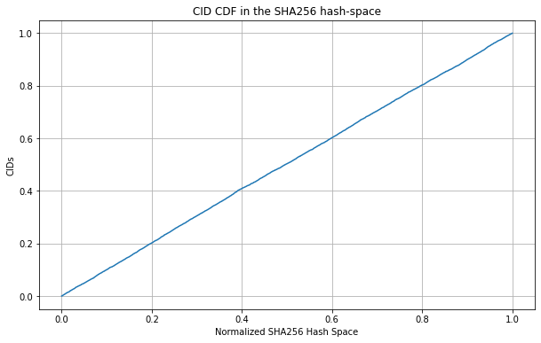

Figure 1. Normalized CDF of the CID set in the SHA256 hash space

In Figure 1, we can observe that the CDF follows a linear pattern, with an average of 39.06 CIDs (shown below) in each of the normalized 256 bins displayed. Although the distribution is fairly homogeneous, we can still appreciate in Figure 2 that the PDF's max and min values are, 58 CIDs at 0.38 and 22 CIDs at 0.82, respectively.

Despite the randomness of the bytes used to generate the _CIDs_ and the homogeneousness that the _SHA256_ encoding function provides might be affected by the relatively short size of the _CID_ dataset (10.000 CIDs). 

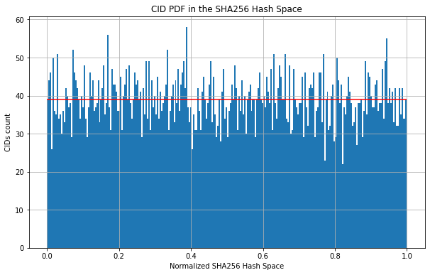

Figure 2. Normalized PDF of the CID set in the SHA256 hash space

**Successful initial PR Holders from the DHT Provide method**

Moving into the actual _CID_ publication process, the following Figure 3 represents the CDF of the _PR Holders_ successfully contacted to store the PRs for the whole set of _CIDs_.

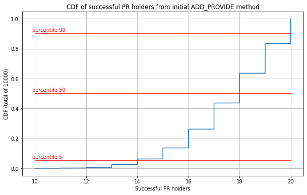

Figure 3. CDF of the successful PR Holders at the `Provide()` method

In Figure 3, we can appreciate that the 5th, 50th, and 90th percentiles are placed over the 14, 18, 20 successful _PR Holders_ respectively. It showcases an overall healthy performance where 95% of the _CIDs_ have above 14 successful _PR Holders_. However, it also means that from the 20 closest peers, by the median, at least 2 of them are offline or unreachable.

We have seen something similar results in previous studies like [7]. In the study, the author identifies a similar active _PR Holder_ distribution while performing the `IpfsDHT.Provide()` method, showcasing that those 2 unreachable peers (by median) suppose the biggest slice of the time to perform the `Provide()` method. In those cases where the peers are unreachable, the whole operation waits until the connections are timed out.

During the entire _CID_ publication time, the _Hoarder_ elected a total of 15380 unique peers as PR Holders for the $10.000$ _CIDs_. Note that this number matches with the total daily active DHT server peers in the IPFS Network, also described in the weekly reports [8] generated from the Nebula Crawler [4], meaning that the randomness of the CIDs over the SHA256 hash space covers most of the DHT servers in the network.

**PR Publish time for the set of CIDs**

The _CID_ publication chapter gets analyzed more in-depth by tracking the time that the entire process took to finish (from the publisher's peer side). In the next Figures 4 5 and 6, we can observe the CDF, PDF and Quartile distributions of the `IpfsDHT.Provide()` method. In the Table 1, we can observe that the median of the method calls were done in under 12.64 secs, with Q1 and Q3 defined at 7.01 and 23.33 secs respectively, with the 90th percentile set at 48.98 secs.

| 
CDF
 |
| ---- |
| 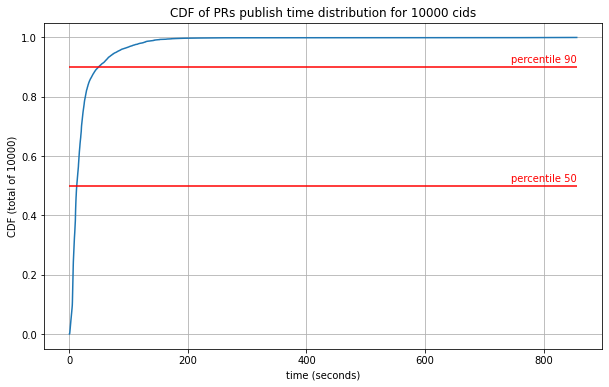 |
| 
Figure 4. `Provide()` method's duration CDF for the CID set
 |

| 
PDF
 | 
QUARTILE DIST
 | 
|----|----|
| 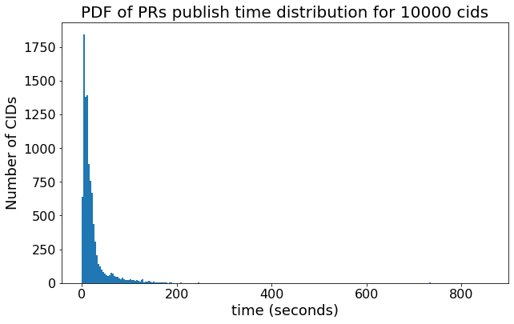 | 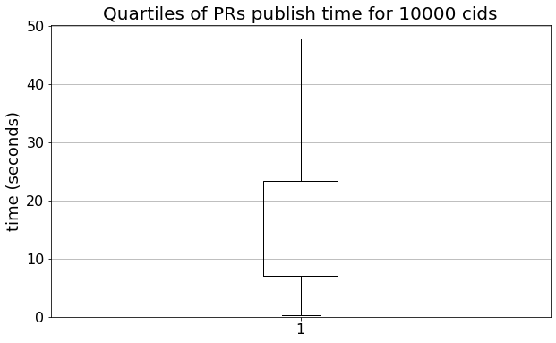 |
| 
Figure 5. `Provide()` method's duration PDF for the CID set
 | 
Figure 6. `Provide()` method's duration quartiles for the CID set
 |

| Percentile | Provide Time (secs) |
|----|---|
|0.05 |  2.97 |
|0.25 |  7.01 |
|0.50 | 12.64 |
|0.75 | 23.33 |
|0.90 | 48.98 |

Table 1. Percentile table for the `Provide()` method's duration

By tracking each _CID_ and its _PR Holders_ periodically, we made a clear distinction between being able to retrieve the _PRs_ from the IPFS Network (important for the network users), the ratio of _PR Holders_ that remain active and the _PR Holders_ that actually keep and share the _PRs_ over the study time.

**DHT-walk looking for closest peers**

We have previously mentioned that the `IpfsDHT.GetClosestPeers()` method is crucial when providing or retrieving content in the IPFS network. In that process, the DHT-walk selects the K peers whose `hash(peerID)` are the closest to `hash(CID)` in the node's routing table, and requests them the peers whose `hash(peerID)` are the closest to `hash(CID)` in their respective routing tables. The process includes several recursive calls for those peers reported by the previously contacted ones, and we will refer to each iteration as _Hop_. 

In terms of Hops, the report differentiates:
- In Figure 7, the total number of hops that the DHT walk needed to know that there weren't any other closest peers to the key. We can see that the 50% of the DHT-walks are done in 4 hops, and 90% of the walks are done in 6 or fewer hops. 

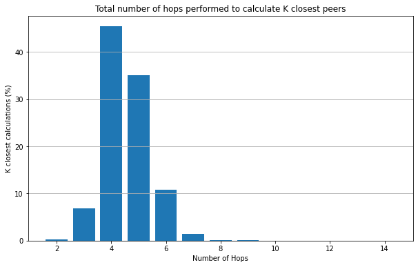

Firgure 7. Total number of hops to get the closest peers to a key

- In Figure 8, the minimum hops the DHT-walk needed to discover for first the time the _K_-closest peers. In the figure, we can observe that the 95% of the closest peers were discovered in 4 hops or less, which means that almost 40% of the time, we need 2 extra hops to determine which are the closest peers. 

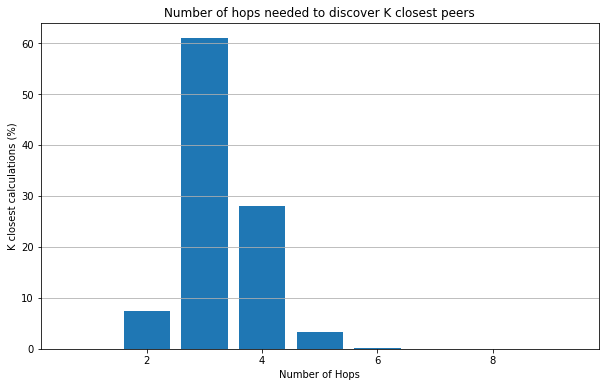

Figure 8. Minimum number of hops to discover the closest peers

Measuring the total number of _hops_ for protocol optimizations such as the Optimistic-Provide [7]. _Optimistic-Provide_ aims to speed up the process of publishing the _PR_ by starting the _PR_ publication as soon as a `hash(PeerID)` is close enough to the `hash(CID)` without waiting for the whole `GetClosestPeers()` to finish.

**Activity of PR Holders over the study**

To analyze the retrievability of the _PR_, we took a closer look at the individual pings to each of the _PR Holders_. 

In Figure 10 we can observe the quartile distributions of the _PR Holders_ that were active/online in the network at those specific ping rounds. For a clearer representation, the figure is expressed in hours since the publication of the _CIDs_, and it shows that the Q1, Q2 and Q3 quartiles remain stable over the 40 hours of study between 16 and 13 active holders. There are some outliers beyond the bottom whiskers sometimes reaching a minimum of only 5 active holders. Although, we don't see any outlier with 0 active peers until hours 35-36. 

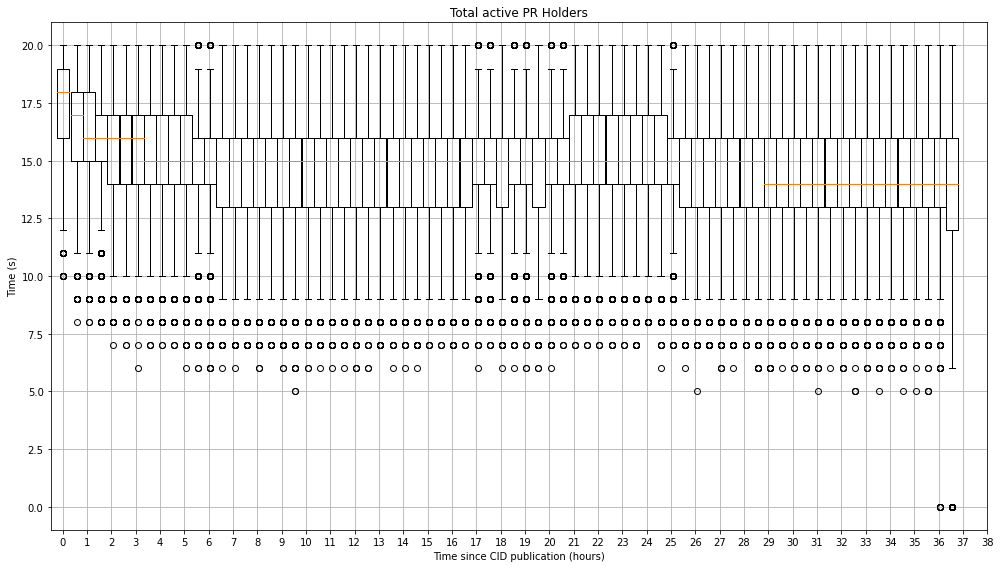

Figure 10. Active CID's PR Holders over the study

With the intention to measure the impact of Hydra-Booster peers in those results, the next two figures differentiate Hydra nodes from the rest and displaying them in two separate graphs (figures 11 and 12).

On one side, in Figure 11, we have the non-hydra peers of the network in the following figure. The _Hoarder_ recorded 198 different user agents for over 10 different projects, but this is something that we will discuss further in the report (see section 3.3 - User agents of PR Holders). Although non-hydra peers have a larger variance in the quartile distributions, these ones show a surprising steadiness over the entire study. The median stays at 12 active peers, with Q1 and Q3 set at ~10 and ~13 respectively. There are some minor changes over the time distribution. At the beginning, we can observe how the peers find the wider distribution at hour 4.5, where both whiskers find the bottom and upper values of 4 and 19 peers respectively. On the other hand, we can also distinguish a remarkable compression in the distribution between hours 22 and 24. We won't enter much in detail at this precise moment because itis  something that will be easier to appreciate when comparing the different _K_ values in Section 3.2 .

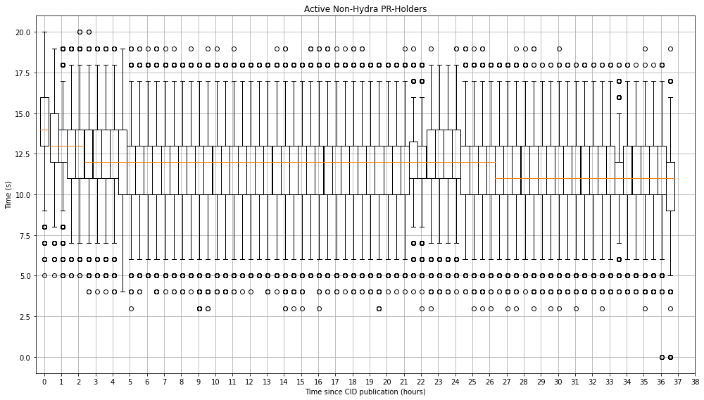

Figure 11. Active non-hydra PR Holders over the study

On the other hand, Figure 12 displays hydra nodes' activity. We can observe a severe steadiness of the nodes over the entire run. With a median of 3 active nodes for the entire run, we can see that they barely go offline over daily shifts as we saw in the rest of the peers.

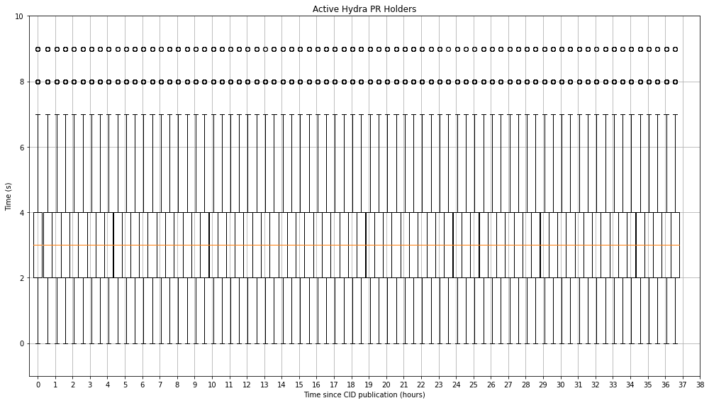

Figure 12. Active hydra PR Holders over the study

**Distribution of PR Holders keeping the PRs over the study**

As previously mentioned, we make a difference between being active in the network, and actually keeping and sharing the _PRs_ over the default 24 hours. Figure 12 shows the quartile distribution of those _PR Holders_ that actively shared the _PRs_ with the hoarder on each ping round.

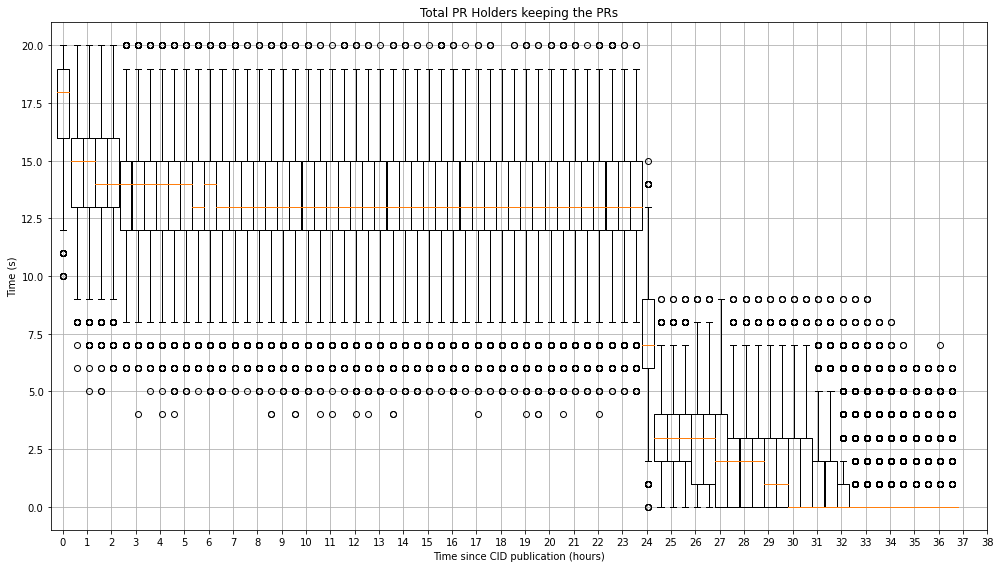

Figure 13. Total number of PR Holders keeping the records

In Figure 13, we perceive the abrupt drop at hour 24 that was expected and that we previously introduced. As with the activity of the peers, during those first 24 hours, we can find certain stability with the lower Q1 quartile set at 12 peers sharing the _PRs_. The disposition of the outliers also shows that none of the _CIDs_ reached a point where _PRs_ weren't retrievable.

This last statement is a bit trivial. Although we can assume that if the _PR Holders_ keep the records over the 24 hours the _CIDs_ are reachable, adversary events on the peer-to-peer network, like high sudden node churn, could leave this node isolated from the rest. The bigger impact of this isolation is, in fact, that a given _PR Holder_ could not be included in the rest of the peers' routing table. Therefore, no one would reach out to that isolated peer asking for the _CID_. 

As seen in the retrievability graph (Figure 9), the _PRs_, which weren't supposed to be shared after the first 24 hours (the tool doesn't make the republish) are being shared over the 40 hours of study. 

In order to make the exact same division as the one presented on the _PR Holders_' activity, we split the set of _PR Holders_ between non-Hydra peers, and the Hydra ones. In the following Figure 14, we can appreciate the same level of stability marked by a lower Q1 of ~9 peers sharing the _PRs_. To this stability period follows a sudden drop of _PR_ sharing at hour 24.

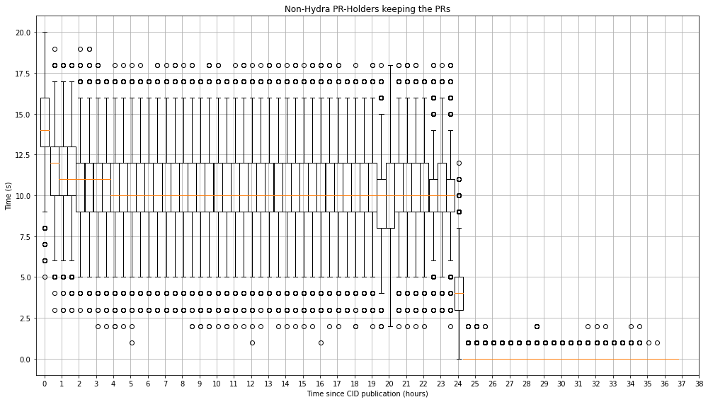

Figure 14. Total number of non-hydra PR Holders keeping the records

On the other hand, while measuring the Hydra peers (see Figure 15), we can see the same steadiness that slowly vanishes after hour 24, reaching the expected result at the 33rd hour. Let's remember how Hydra-Booster peers work in the network. Hydra nodes represent a centralized set of IPFS servers that share a common pool or database of _PR_. This way, Hydra nodes can speed up the process of finding the content provider of a specific CID. In its nature of a shared _PR_ pool, Hydras host a wider set of _PR_ if we compare them with a single `kubo` instance, for example. For this reason, the periodical iteration to check the status of each _PR_, delayed the process of pruning the _PR_ from the internal database.

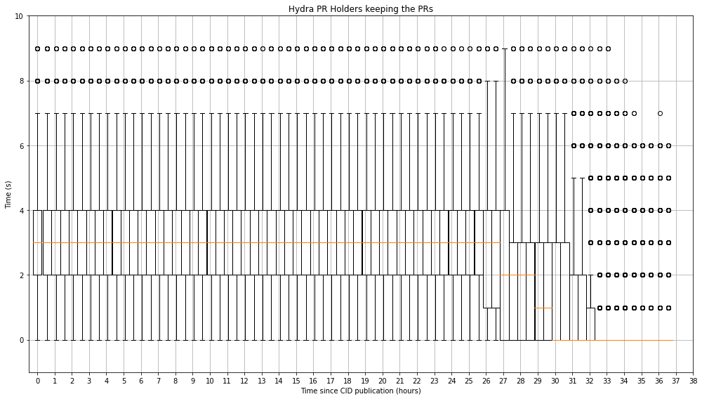

Figure 15. Total number of hydra PR Holders keeping the records

There is a relevant point to highlight. In the Kademlia DHT paper [1], the authors define the probability for a _PR_ of being reachable with the following equation $1 - C^K$, where `C` is the node churn of the network after the time (in hours) of joining the network, and `K` is the Kademlia DHT replication value. Coming back to previous studies of the IPFS network, the weekly nebula crawl results [8] measure that 90% of peers leave before hour 12, making the equation look like this: `1-(0.9)^20 = 0.878`. 
For a network using a standard Kademlia DHT implementation, there would be an 87,8% probability that _PRs_ are retrievable after 12 hours. In the set of these three graphs, we can appreciate that the probability of finding the records in the IPFS Network is higher than the one described by the theoretical formula. 

These measurements can demonstrate that the value of the _K_ replication constant, and the preference for a stable peer to compose the routing table, are successful design choices to reduce the impact of node churn in a Kademlia-based DHT. However, we might be hesitant on the aggressiveness of other studies measuring the node churn in the network. In comparison to those previous analyses ([2] and [8]), the steady results brought by the _CID Hoarder_ might be caused by the addition of a maximum of 3 dial attempts while the connection is rejected or refused by the remote peer while the other studies might not have not done more than one connection attempt and then wrongly defined the node as "offline". This aligns with the results shown in [9], where the authors associate the high churn in the IPFS network with the connection churn rather than with nodes joining and leaving the network.

**In-Degree ratio of initial PR Holders inside K closest peers over time**
In the previous chapter, we focused on analyzing the stability and commitment of the original elected _PR Holders_ for each _CID_. Although the results show a positive performance for the overall PRL, we don't have the certainty of whether those _K_ initial closest peers are still the _K_ closest peers over the next 12 or 24 hours. 

Figure 16. Total number of PR Holders keeping the records

For this reason, Figure 16 showcases a slowly decreasing in-degree ratio during the first 10 hours, going from a median of 17 original _PR Holders_ inside the _K_-closest peers in the first hour to a median of 15 peers after 10 hours. The distribution that follows, on the other hand, shows that the entire in-degree ratio's median doesn't go below those 14 peers. 

### 3.2. Alternative K values and their performance comparison

The purpose of the study beyond measuring the actual PRL in the IPFS network was to replicate the same exact study for different _K_ replication values. _K_ was originally set to 20 to fight node churn in IPFS. It has proved to be a working value, although there haven't been many studies analyzing its performance and which would be the consequences in the PRL of increasing it or decreasing it. 

For this study, we have decided to run several _Hoards_ with _K_ values, `K=15`, `K=25`, and `K=40` to be more precise.

**Distinct K replication value comparison**

Finding an optimal _K_ replication value has been largely discussed for a long time in the IPFS Community. There are several discussion lines in favor of decreasing the _K_ replication value. 

From one side, it would reduce the overload of the network's participants by reducing the overall number of _PR_ that each of the DHT Servers would have to store locally. Theoretically, having to connect and store the _PR_ in fewer peers, also reduces the number of messages and connections that needs to be established, which should be reflected in the `IpfsDHT.Provide()`'s methods time.

On the other hand, with the available node churn measurements, reducing the _K_ replication value would reduce the chances of finding the _PR_ of a given CID. Let's remember the previously introduced formula $1 - C^K$ that would look like this `1 - (0.9)^15 = 0.79`. The probability of finding the PR for a given CID drops from 87.8% (K=20) to 79% (K=15). 

As part of the present report, we have performed the same study with some other _K_ replication values of 15 and 25 peers. This way, we would show the preview of the impact that different K values would have on the PRL.

For this comparison, the four experiments were run under the same configuration introduced at the beginning of this chapter.

**Successful initial PR Holders from the DHT Provide method**

The comparison starts by analyzing the total number of successful _PR Holders_ from the `IpfsDHT.Provide()` method. Figure 17 shows that the time to complete the `Provide()` method follows a similar distribution among the different _K_ values. This pattern is clearer when looking at figure 18, where the distributions achieve the 95% of the times a +70% of successful contacts, and the 50% of the times a +85% successful contact to _PR Holders_. If we take a closer look at the first 1%, we can appreciate that lower _K_ values achieve lower percentages of success ratios. In this case, K=15 achieves a 40% success ratio at that lowest 1%, while K=40 stays at 60%. However, it is hard to determine whether it's something occasional or a regular pattern since the data set doesn't include enough samples.

| Total Successful PR Holders | Percentage of Successful PR Holders |
|----|----|
|  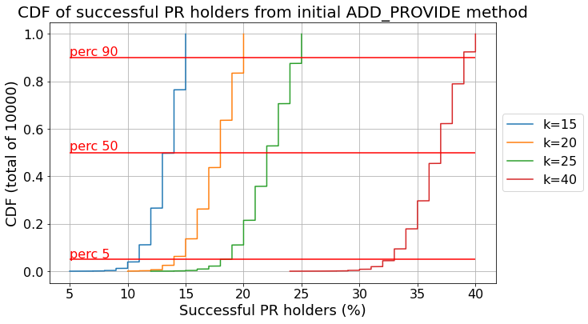 |  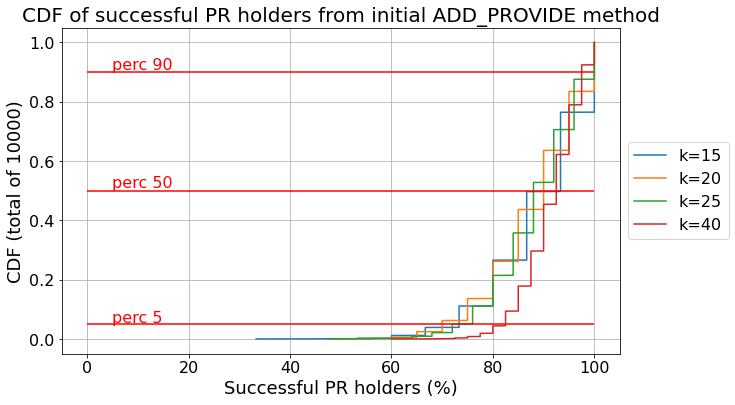  | 
|  
Figure 17. Successful PR Holders comparison at `Provide()` method
 | 
Figure 18. Percentage comparison of successful of PR Holders at `Provide()` method 
  |

**Provide method times**

As previously introduced, the entire `Provide()` method is one of the most time-consuming operations when interacting with the IPFS Network. Figure 19 shows the `Provide()` method time quartile distributions for the different tested _K_ values. We can observe how lower _K_ values achieve lower _Provide_ times. While the different values of K=15, K=20, and K=25 result in a gradual increase, almost 2 seconds for the median, we see a huge difference with the K=40 test, which registers a _PR provide_ time of two times longer in the best cases in comparison with K=15.

 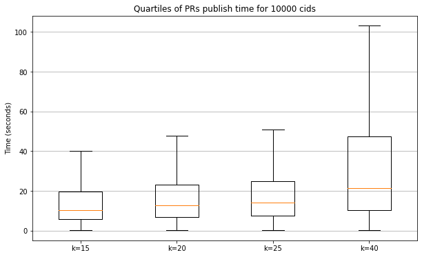
 
Figure 19. Quartile comparison of the `Provide()` method for different K values

Table 2, on the other hand, summarizes the percentiles for the `Provide()` method's duration time. The table showcases that reducing the _K_ value does have a meaningful impact in the `Provide()` time. However, these _PR provide_ times are still far from what we would consider as ideal (<5 secs 90% of the cases?) in any of the values. For this reason, we would consider as non-ideal reducing the _K_ value to improve the providing times.

| Percentile | k=15 | k=20 | k=25 | k=40 |
| ---|--- | ---| --- | ---|
| 5 |   1.85 s | 2.97 s | 3.38 s | 4.69 s |
| 25 |  5.90 s | 7.01 s | 7.66 s | 10.41 s |
| 50 | 10.45 s | 12.64 s | 14.21 s | 21.27 s |
| 75 | 19.65 s | 23.33 s | 25.02 s | 47.58 s |
| 90 | 38.03 s | 48.98 s | 53.44 s | 167.74 s |

Table 2. Percentile comparison for the `Provide()` method's durations

**DHT-walk looking for closest peers**

Finding the closest peers in the network whenever we want to publish or retrieve content-records in/to the network is not an easy task. Kademlia DHT is one of the most popular approaches to optimize this process by making each of the nodes have the same number of peer representants for a logarithmic-scaling range of distance. Kademlia's _K Buckets_ present in each of the IPFS clients serves as an entrypoint to discover the closest peers to a given key (`hash(CID)`, `hash(PeerID)`). 

Figure 20 shows the number of hops that the `IpfsDHT` client had to perform to discover for the first time the whole set of _K_-closest peers. The graph can be read in the following way: 50% of the times the _k_-closest peers were discovered in a total of 3 hops for a whole set of _K_ value studies. With only a <5% percent of the times needing 5 hops or more.  

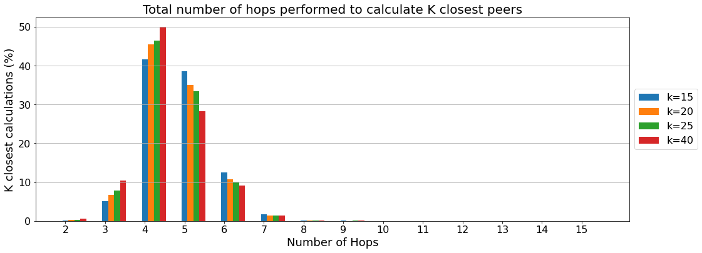

Figure 20. Total number of hops performed to get the closest peers

However, this metric doesn't include the number of extra hops the DHT performed to reach the conclusion that there weren't closest peers to the given key. The following graphs shows the number of max hops performed to finalize the DHT walk. In Figure 21 we can observe that only around 50% of the time, the client performed 4 hops or less. We can see a shift towards 1 extra hop from the previous figure showing that most of the time it only needs one extra hop to conclude which are the closest peers. 

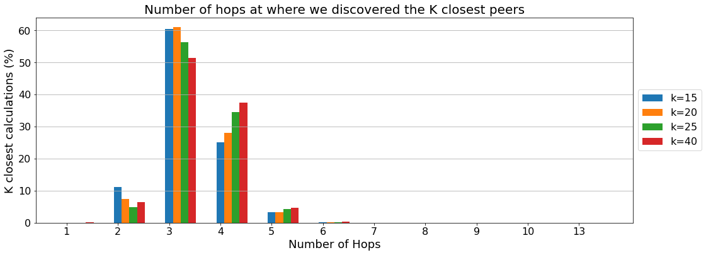

Figure 21. Minimum number of hops performed to discover for the first time the closest peers

We can also observe that the difference between looking for 15 or 40 peers close to a Key is not that big in comparison to the Provide times graph. At this point, one might be wondering, how can K=40 take much longer to perform the Provide method when in average it takes less hops to know the closest peers?
In line with the Optimistic Provide study [7], the biggest time limiting factor in the IPFS network is the timeout on actively initialized connections. By default, the TPC transport protocol has a 5 seconds timeout, 5 seconds that the DHT client needs to wait until catalog the peer as unreachable. But this is only for the initial or first approach to a peer, after that, the `Libp2p.Host` needs to exchange the set of protocols supported to finally agree on a successful connection. Measuring these timeouts and the performance of the entire handshake process will have enough content of its own RFM, but it clearly affects the time that it takes to put the PR in a set of peers. 
When the difference on the number of peers that we have to contact is more than x2, the chances of finding more unsuccessful connections increases as well. Leading the DHT Client to hang for the timeouts to arrive to go to the next step in the process. This is why higher _K_ values have a bigger impact on the Provide times. 

**Active PR Holders**

When comparing the active _PR Holders_ for the different K values, in the next figure, we can observe that all of them follow the same pattern. The fact that all of the studies were run on the same exact time range adds an extra layer of fairness to the PRL study. All the datasets were under the same p2p-network conditions and node churn. 

Figure 22 shows the median and average of the active nodes for each of the _K_ value datasets. We can observe that they follow a similar pattern where the median achieves a slight decrease over the first 10 hours after the PR publication and an upturn after 20 and 25 hours of the publication.  

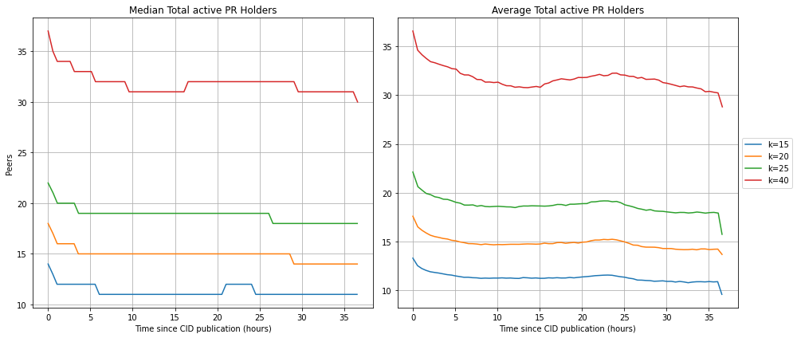

Figure 22. Comparison of the active PR Holders' for the different K values (median on the left, average on the right)

This pattern gets even more evident when displaying the percentage of the active _PR Holders_ (see Figure 23). Here we can clearly see that the difference between K=15 and K=40 's median is in order of a 5% of more active peers when we increase the _K_ value to 40 peers. In the graph displaying the averages, we can distinguish with a higher resolution the initial drop (first 10 hours) and the following catch-up (hours 20 to 25) previously mentioned. The spotted pattern has been observed over all the different K values and we address it to a specific set of users in the same time zone that disconnect over a set of hours in a daily period (it could be users shutting down their PCs during the night).

Figure 23. Comparison of the active PR Holders' percentages for the different K values (median on the left, average on the right)

**PR Holders keeping the records**

Results are slightly different when talking about _PR Holders_ keeping the records. The median and average distributions among the _K_ values (see Figure 24) suffer from the same initial drop during the first 10 hours. After that, the distribution stays stable over the expected 24 hours.

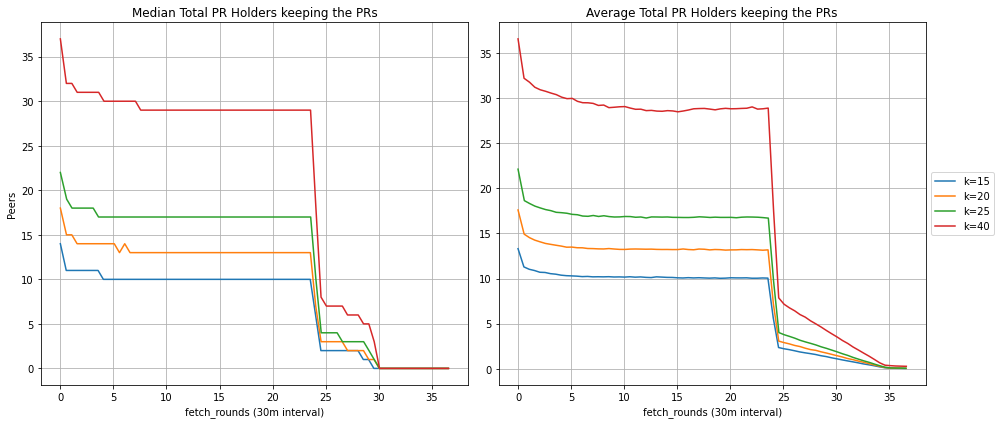

Figure 24. Comparison of the PR Holders keeping the records for the different K values (median on the left, average on the right)

The percentages displayed in Figure 25 also match the ~5% difference between k=15 and K=40, with the clearer no-difference between K=15, K=20, and K=25.

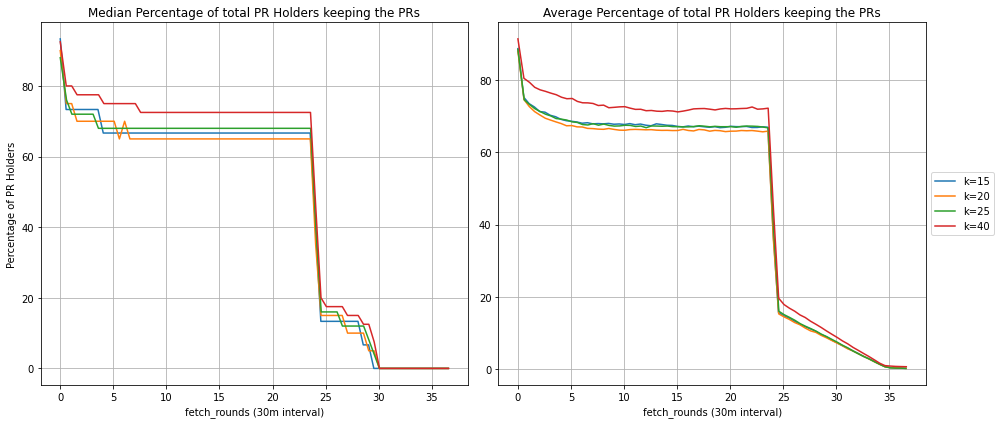

Figure 25. Comparison of the PR Holders keeping the records' percentages for the different K values (median on the left, average on the right)

**In-degree**

For some reason, the initial _PR Holders_ are no longer the closest peers to the given CID after an hour. The best part is that this phenomena occurs over all the set of _k_ values with the same pattern.

Figure 26 shows the sharp drop of the in-degree ratio after the first hour, which stabilizes over the following 23 hours. 

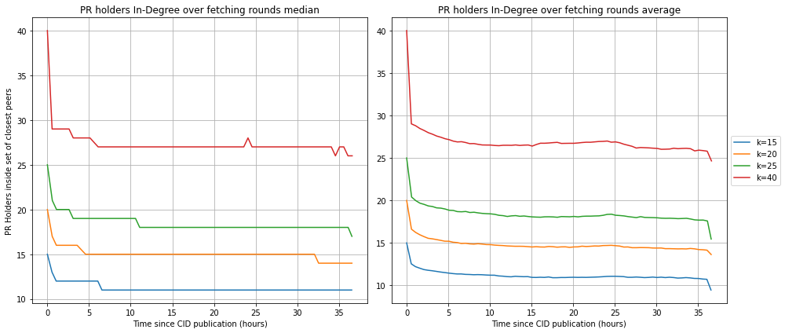

Figure 26. In-degree ratio comparison (median on the left, average on the right)

Taking a closer look at that initial drop, in Figure 27, we can see how the ratio decreases by 25% uniformly for most of the K values (clear exception of K=40 which drops to ~65%). Furthermore, we can also appreciate that the ~75% in-degree ratio remains over the following hours.

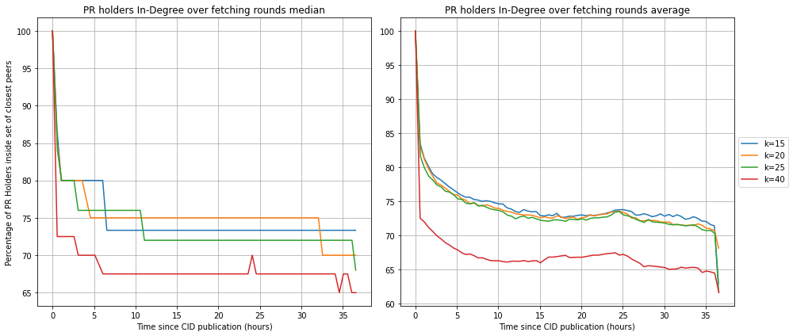

Figure 27. In-degree ratio's percentage comparison (median on the left, average on the right)

### 3.3. Avoiding Hydras in the IPFS Network
Many people in the IPFS Ecosystem have mixed arguments about the presence of Hydra-Booster nodes in the IPFS network. Although they were included in the network in an attempt to bring a higher range of stability and improving performance, they still represent a certain centralization degree in what is supposed to be a decentralized network.

With the intention of simulating a Hydra-free PRL study, we have included in the `go-libp2p-kad-dht` fork a modification that can blacklist a whole set of PeerIDs from being elected as _K_-closest peers, and blacklist a given `UserAgent` to close any opened stream with any peer in the network identified with the former. 

**User agents of PR Holders**

The following graphs show the client diversity achieved in the initial _PR Holders_ before and after applying the `hydra-booster` filter to the _CID Hoarder_ run. In Figure 28, we can observe that hydra nodes were the 13.06% of the total contacted peers, while it gets reduced to 0.06% of the total as shown in Figure 29 after applying the filter.

| Hydra-Filter OFF | Hydra-Filter ON | 
|----|----|
| 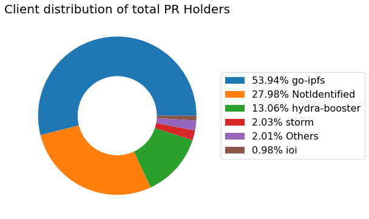 | 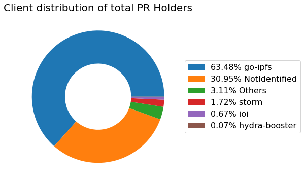 | 
| Figure 28. Total client distribution of the contacted peers (without hydra filter) | Figure 29. Total client distribution of the contacted peers (with hydra filter) |

The initial light-crawler takes 5 to 7 mins to crawl the network, and finds around 1950 of the ~2000 hydra peers in the network. The remaining 0.06% of the elected hydras as _PR Holders_, are just the outliers that managed to skip the process of getting the closest peers to a key. 

Following the discussion, in Figure 31 we can observe the quartile distribution of the different DHT clients elected as _PR Holders_ when providing the records of the set of CIDs with the hydra filter on. We can observe how drastic drops the hydra nodes' count in comparison to Figure 30, which get replaced by `others` and `go-ipfs` (please note that the `others` is the aggregation of the remaining `UserAgents` that helps making the graph more visible, `kubo` release gets included here).

| Hydra-Filter OFF | Hydra-Filter ON | 
|----|----|
| 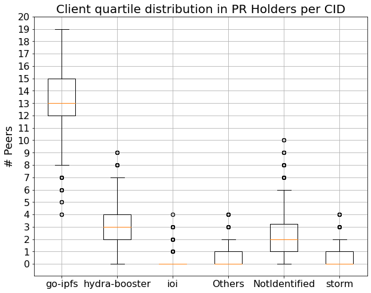 | 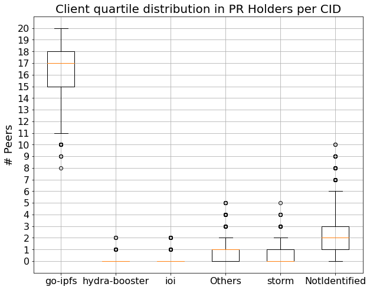 |
| Figure 30. PR Holders' client type (without hydra filter) | Figure 31. PR Holders' client type (with hydra filter) |

**Successful initial PR Holders from the DHT Provide method**

In terms of successful initial _PR Holders_, the measurements displayed in Figure 32 don't show any difference. The 95% of the time, the tool achieves more than 14 successful provides, with a median of 18 successful _PR Holders_.

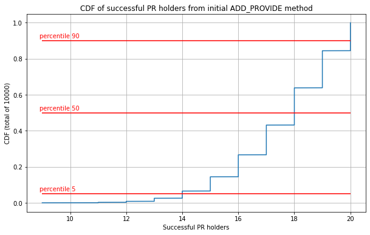

Figure 32. CDF of successful PR Holders during the `Provide()` method

**PR Publish time for the set of CIDs**

When it comes to compare the total duration of the`Provide()` method (see Figure 33), things also don't change much. The DHT client could Provide the PRs in 13.91 seconds by the median. 

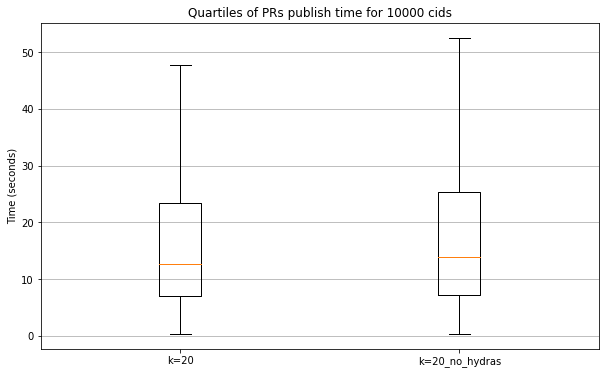

Figure 33. Quartile distribution of the `Provide()` method's duration

If we compare the results in Table 3, we can see slightly higher times above the 25th percentile, which would be expected. Let's not leave aside the fact that the first 5th percentile is faster without hydra nodes than with hydra nodes. This could be explained by the low chances that a provider has of geographical closeness between it and the K closest peers, ending up in a lower latency than the alternative with hydras. 

| Percentile | WITH Hydras Provide Time (secs) | WITHOUT Hydras Provide Time (secs) |
|----|---| ---|
|0.05 |  2.97 | 2.50 |
|0.25 |  7.01 | 7.25 |
|0.50 | 12.64 | 13.91 |
|0.75 | 23.33 | 25.39 |
|0.90 | 48.98 | 55.09 |

Table 3. Percentile comparison for the `Provide()` method's durations

Hydra nodes were introduced to the network with the idea of covering the entire hash space homogeneously. Figure 30 showed that there are at least 2 hydra peers by median inside the _PR Holders_ for a CID, which means that the maximum latency to the _PR Holders_ is at least the latency between the Provider and the cluster of Hydras. Let's remember here that Hydras are just different logic hosts (with different PeerIDs) on top of a shared Database. 

**DHT walk looking for closest peers**

Looking at Figure 34, the number of hops it is needed to discover for the first time the closest peers doesn't differ much between both data sets. In both cases, 90% of the lookups stay at or under 4 hops.

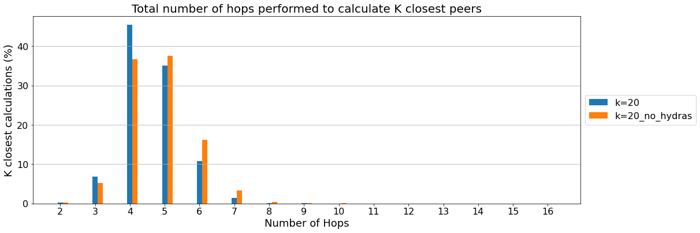

Figure 34. Minimum number of hops to discover the closest peers

On the other hand, Figure 35 shows that the number of hops performed gets slightly increased, accumulating 5% more cases that needed 6 hops to be sure of the closest peers.

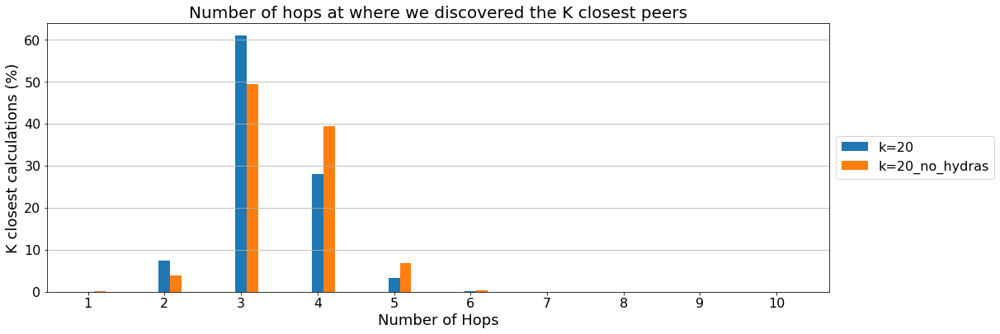

Figure 35. Total number of hops to get the closest peers to a key

**Active PR Holders**

In the following figures (36, 37 and 38), we can observe the activity of the _PR Holders_ over the 36 hours of study. Figure 36 shows the aggregated activity over all the different `UserAgents` claimed by the _PR Holders_. Figure 37 shows the DHT servers that were identified as `hydras-booster`. And Figure 38 the rest of the `UserAgents` aggregated for an easier visualization.

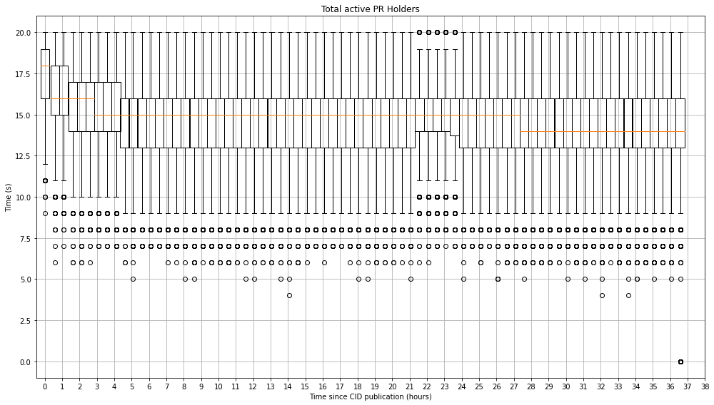

Figure 36. Active number of PR Holders over the study

| Hydras | Non-Hydras | 
|----|----|
| 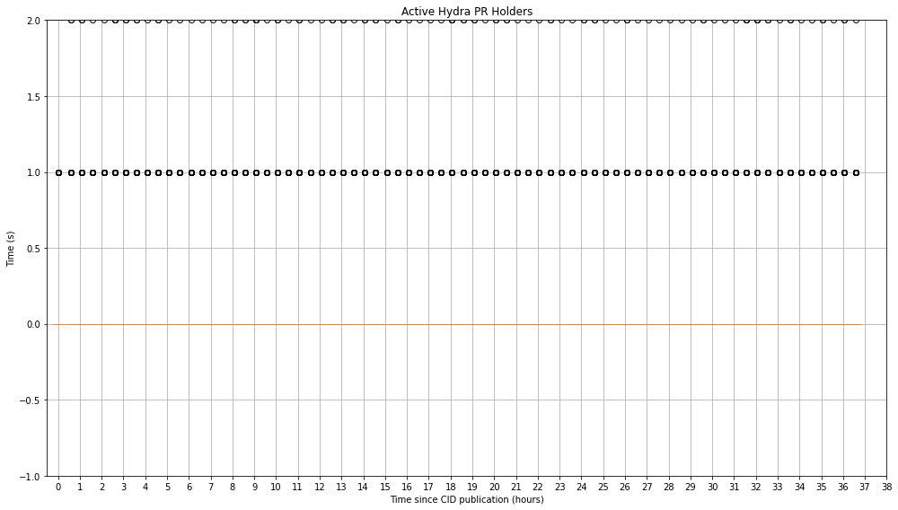 | 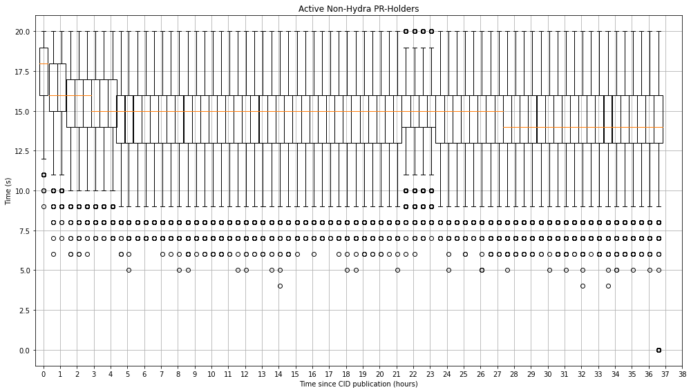 |
| 
Figure 37. Number of hydra PR Holders over the study
 | 
Figure 38. Number of non-hydra PR Holders over the study
 |

Figure 38 showcases that there are barely Hydras. This consequently means that the filter works! On the non hydra nodes graph, we can't see much difference when comparing it with the "including Hydras" version (see Figure 10). The median stabilizes at 15 active peers after ~3 hours, showing steadiness over the 36 hours of study.

**PR Holders keeping the records**

In terms of Peers keeping the PRs, we see a similar pattern. After the first 3 initial hours, in Figure 39, we see a clear drop of the median to 13 peers keeping the PRs, which lasts until the 24 described hours. This time, we can clearly see the sharp drop of peers keeping the records defined in the specs, which matches with the non-hydra peers shown in Figure 41.  

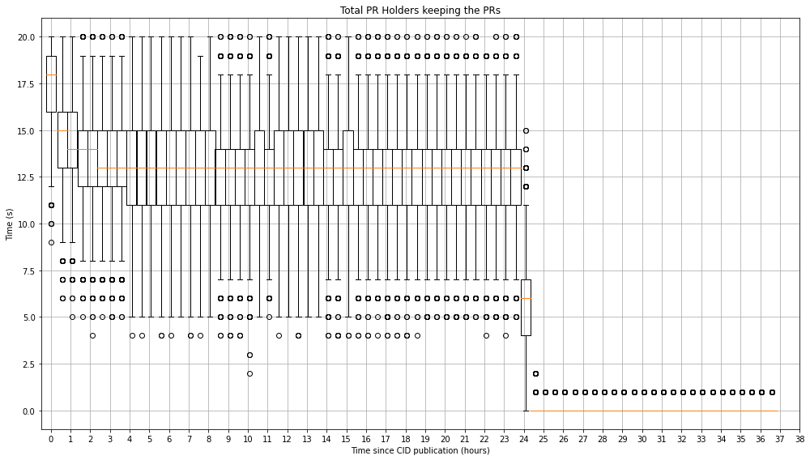

Figure 39. Number of PR Holders keeping the records over the study

| Hydras | Non-Hydras | 
|----|----|
| 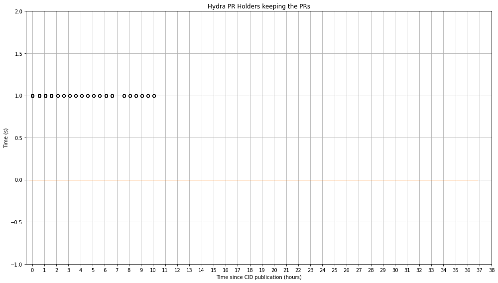 | 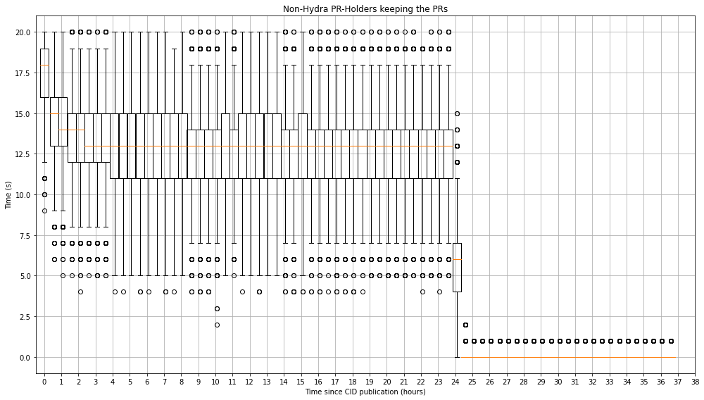 |
| 
Figure 40. Number of hydra PR Holders keeping the records over the study
 | 
Figure 41. Number of non-hydra PR Holders keeping the records over the study
 |

When taking a closer look at the hydra distribution (in Figure 40), we can see that there are some outliers that only keep the records for at most 10 hours. This phenomenon remains unknown, but it could be linked to a non-yet-covered case where we contact the hydra peer to store the records.

**In-degree ratio**

Following the same track of the comparison between K=20 with hydras and the current k=20 without hydras, Figure 42 shows the comparison between the in-degree ratio's percentage of the _PR Holders_ when the hydra filter is on and off. In the figure, we can appreciate that the participation follows a similar distribution, where the data set that includes the hydras has a slightly 5% more in-degree ratio. In both cases, the median never drops below 70%, which is achieved later on by the "with-hydras" dataset after ~32 hours.

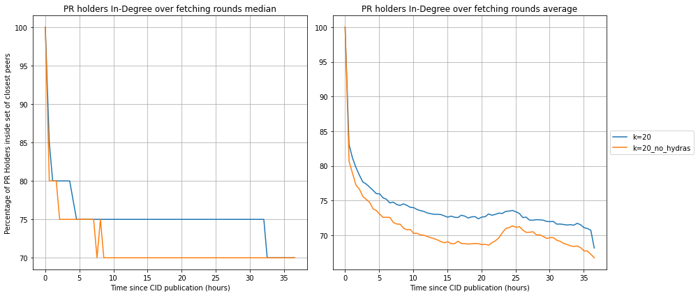

Figure 42. In-degree ratio of PR Holders over the study

### 3.4 State of _PR Holders_ over time
As a bonus chapter in the report, we have performed a _CID Hoarder_ run with the same configuration, 10k CIDs, K=20, with Hydra nodes, 30 mins of ping interval, but with a total study duration of 80 hours. 

**Active PR Holders**

Over this long-run study, as shown in Figure 43, the activity of the DHT servers is relatively stable over +80 hours. With a median established at 15 active _PR Holders_, there are just a few occasions where it drops to 14.

Figure 43. Total active PR Holders over 80 hours

We have already mentioned that the results presented in Section 3.1 (`Quartile distribution of PR Holders fetching time over rounds`) do not match with the ones presented in [2] and [8]. However, analyzing the peers' activity in this study is laxer than in the previously mentioned ones. 

In the _CID Hoarder_, when the connection attempt to a peer in the network returns a `connection refused` or a `connection reset by peer`, we perform 2 additional attempts to check their activity. This is also why we need to be generous when selecting the number of workers for the _Hoarder_. These extra retries significantly reduce the number of offline peers in the network, leading us to see a stable 17% of the peers leaving the network after ~7 hours of being contacted (check the comparison figure of the Average percentage of total active PR Holders (the one below)).

**In-degree ratio**

The same happens with the In-Degree ratio of the initial _PR Holders_ over the +80 hours of the run. The following graph shows the quartile distribution of that in-degree ratio, where we can observe that the median stays stable in the 15 peers. 

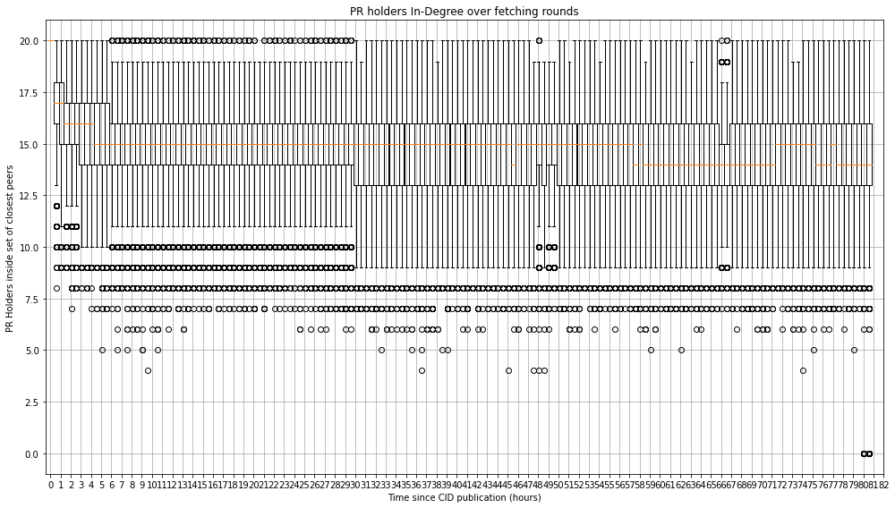

Figure 44. In-degree ratio of PR Holders over 80 hours

 
## 4. Conclusion

The presented report compiles a whole set of measurements that analyzes the provider records liveness in the IPFS network. The report shows a healthy PRL with the present IPFS Kademlia DHT implementation, where by the median, 15 of the _PR Holders_ stay active for +80 hours after contacting them to store the _PR_, dropìng to 14 peers in some specific moments. Of those 15 active peers, 13 by median keep and share the records for the requested CIDs, which drop after the 24 hours defined by the specs.

Over the whole study, none of the published CIDs was found unreachable during the ~36 hours of study. This study showcases that 20 remains a suitable value for the _K_ replication value. However, there are some discussions opened after going through the comparison between the different _K_ values.

From one side, reducing _K_ to 15 would reduce by 25% the overhead in the network while decreasing the median CID publication time by a few seconds. It would imply assuming a higher chance of not being able to retrieve sporadic CIDs if the network suffers from a sudden high node churn. Although hydra peers have shown an incredible steadiness supporting the CID retrieval of those peers that got at least a Hydra node inside the _PR Holders_, it would just mean relying more on a centralized part of the network. 

On the other hand, increasing _K_ to 25 would give us a higher margin of safety. Its major drawback is that it would increase the network's overhead by 25%, while adding extra seconds to the whole `Provide()` method. There have already been a few [reports](https://github.com/ipfs/kubo/issues/9045#issuecomment-1196293473) about the current high overhead in the IPFS network for IPFS DHT Servers. Therefore, increasing the _K_ value is not a feasible option.

The steady in-degree ratio measured for k=20 over +80 hours showed that the initial closest peers keep being the closest ones for more than 48 hours. This measurement dismisses any existing doubt about the healthiness of any existing _PR_, and it opens the possibility of decreasing the overhead of the network by increasing the _PR republish interval_.

In a currently over-saturated network, where running a DHT Server is way more CPU and bandwidth consuming than a single DHT Client, any window of improvement has to be taken. Although reducing the _K_ value to 15 would imply a 25% overhead reduction, it implies a performance risk that should be considered more carefully. However, increasing the _PR republish interval_ seems a far more reasonable action to reduce the overhead without interfering with the performance and reliability.

In the highly popular discussion about Hydra nodes in the network, we have seen that they add a steady backup when keeping the _PR_. As anyone would expect from a centralized infrastructure, hydra peers showed remarkable stability in being active and sharing the _PR_. However, we also demonstrated that there is hope in a fully decentralized network beyond Hydra nodes, achieving a similar performance when avoiding them. Without taking this conclusion as an argument for removing all the Hydra nodes from the network, we would suggest starting by halving the total number of Hydra nodes.

To summarize, this study can conclude by reporting a healthy state of the PRL in the IPFS Network, where k=20 might not be the most optimal value but remains a suitable balance between overhead, performance, and retrievability. With this report, we have demosntrated that the network does not entirely rely on the Hydra-Nodes, although they help balance the load while slightly increasing the performance. 

## 5. References
- [1] Maymounkov, Petar, and David Mazieres. "Kademlia: A peer-to-peer information system based on the xor metric." International Workshop on Peer-to-Peer Systems. Springer, Berlin, Heidelberg, 2002.
- [2] [RFM 2 - Node Uptime and Churn in IPFS](https://github.com/protocol/network-measurements/blob/84a14b0d793498bd8e4ccb309d0a7971967ae7c7/results/rfm2-uptime-and-churn.md)
- [3] [RFM 19 - DHT Routing Table Health](https://github.com/protocol/network-measurements/blob/84a14b0d793498bd8e4ccb309d0a7971967ae7c7/results/rfm19-dht-routing-table-health.md)
- [4] [Nebula Crawler](https://github.com/dennis-tra/nebula-crawler)
- [5] [IPFS Metric Exporter](https://github.com/trudi-group/ipfs-metric-exporter)
- [6] [CID-Hoarder](https://github.com/cortze/ipfs-cid-hoarder)
- [7] [Optimistic Provide](https://github.com/dennis-tra/optimistic-provide)
- [8] [IPFS Network status reports](https://stats.ipfs.network/nebula-22-07-28/)
- [9] Daniel, Erik, and Florian Tschorsch. "Passively Measuring IPFS Churn and Network Size." arXiv preprint arXiv:2205.14927 (2022).

## 6. Appendix 
The appendix of this report includes some more-detailed graphs of the Active _PR Holders_, PR Keeping _PR Holders_, and In-degree ratio distributions of the K=15, k=25, and K=40 studies displayed in the _K_ value comparison in Section 3.2 .

### 6.1. K=15

**Active PR Holders**

| Total | Non-Hydras | Hydras |
|----|----|----|
| 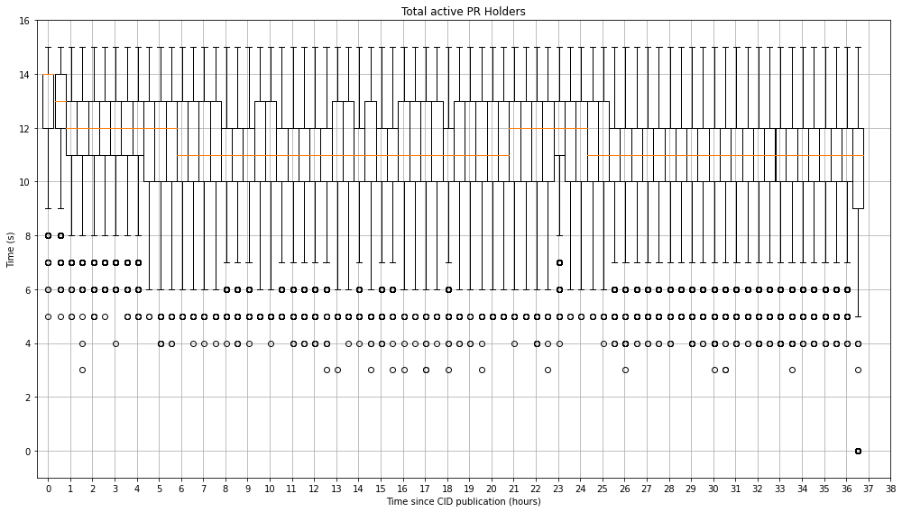 | 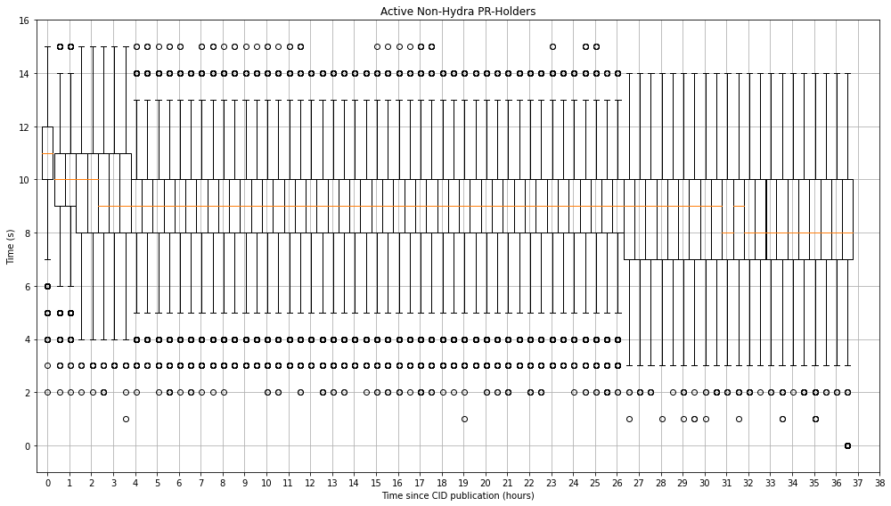 | 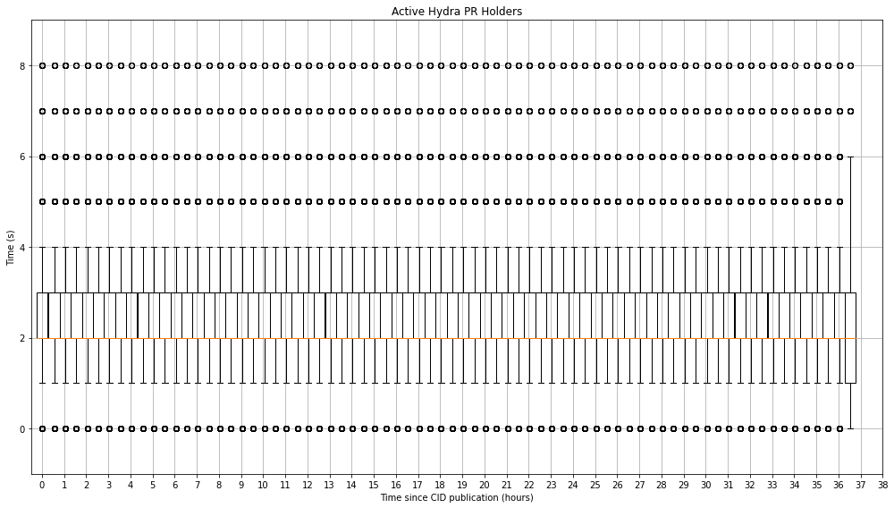 |
|  Figure 45. Active PR Holders over the study | Figure 46. Active non-hydra PR Holders over the study | Figure 47. Active hydra PR Holders over the study |

**PR Holders keeping the records**

| Total | Non-Hydras | Hydras |
|----|----|----|
| 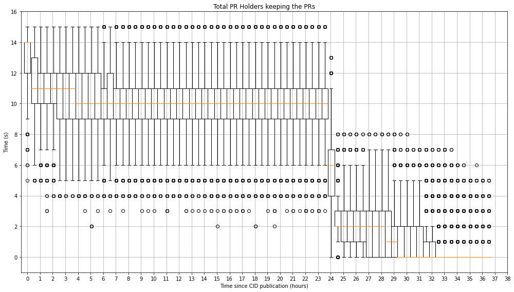  | 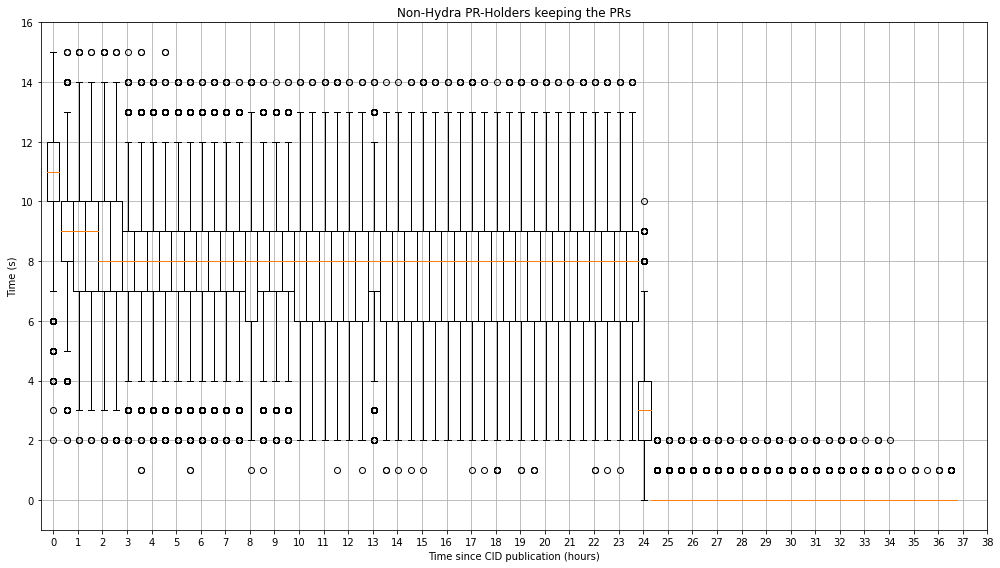 | 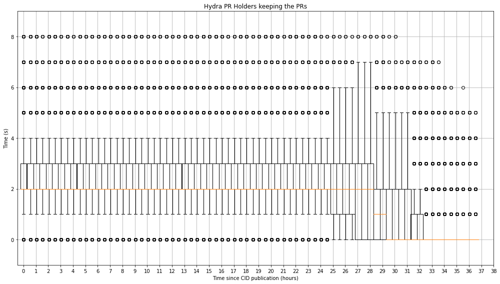 |
|  Figure 48. Total number of PR Holders keeping the records | Figure 49. Number of non-hydra PR Holders keeping the records | Figure 50. Number of hydra PR Holders keeping the records |

**In-degree**

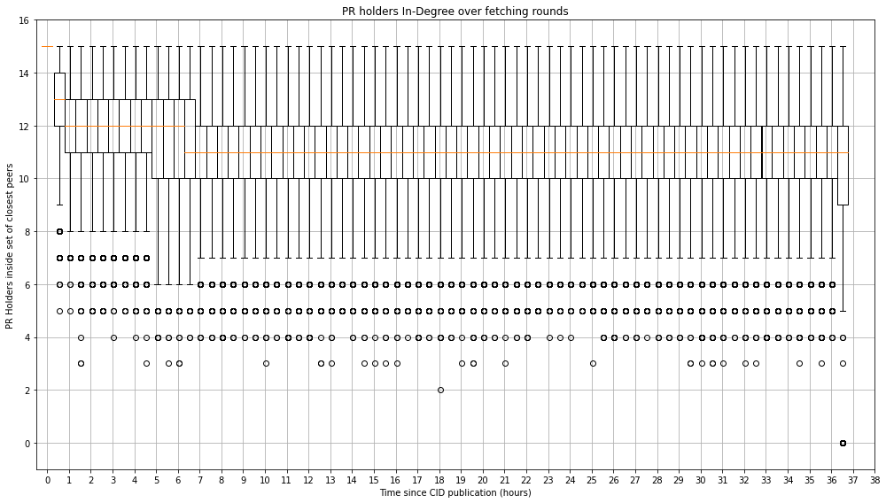

Figure 51. In-degree ratio of PR Holders over the study

### 6.2. K=25

**Active PR Holders**

| Total | Non-Hydras | Hydras | 
|----|----|----|
| 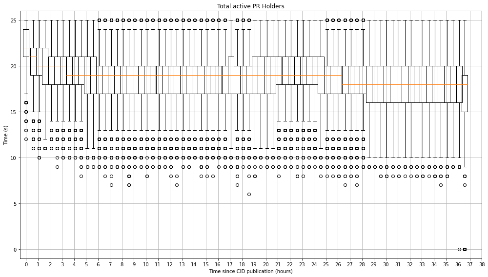 | 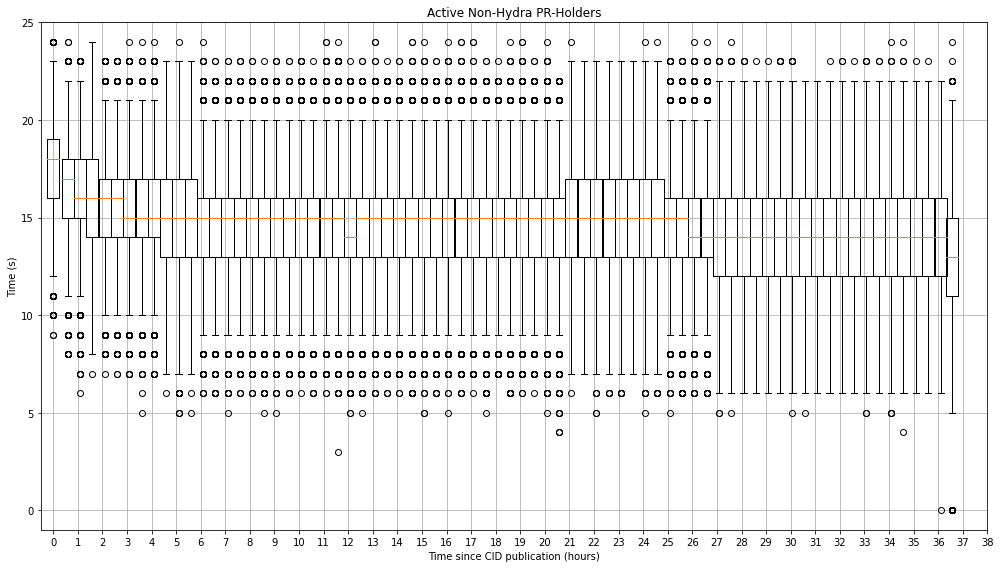 | 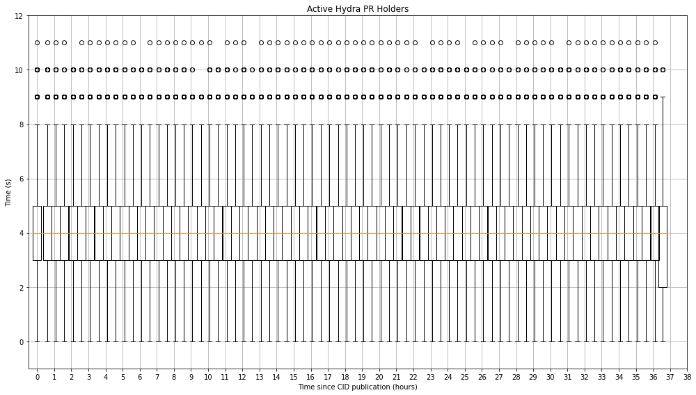 |
|  Figure 52. Active PR Holders over the study | Figure 53. Active non-hydra PR Holders over the study  | Figure 54. Active hydra PR Holders over the study |

**PR Holders keeping the records**

| Total | Non-Hydras | Hydras |
|----|----|----|
|   |  |  |
|  Figure 55. Total number of PR Holders keeping the records | Figure 56. Number of non-hydra PR Holders keeping the records | Figure 57. Number of hydra PR Holders keeping the records |

**In-degree**

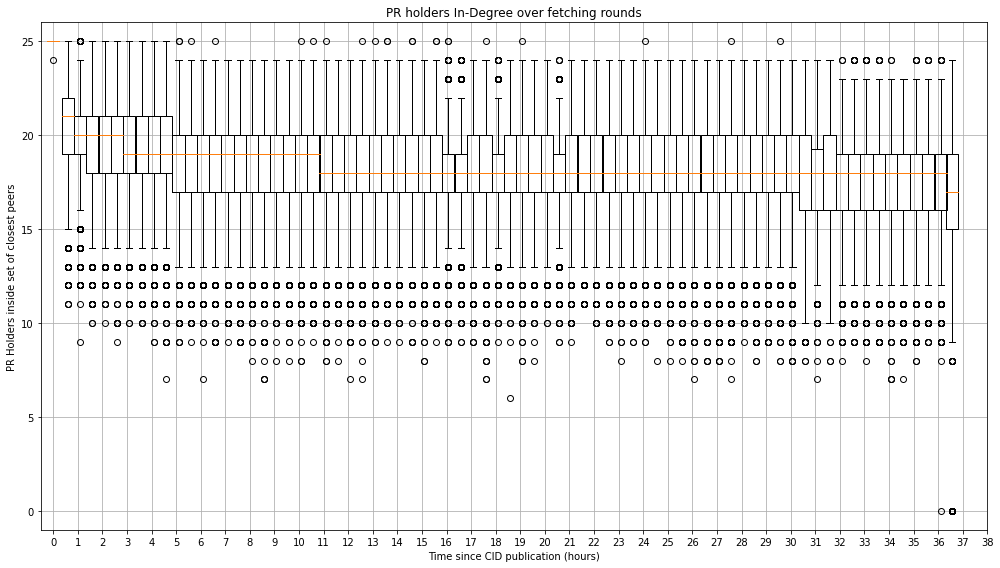

Figure 58. In-degree ratio of PR Holders over the study

### 6.3. K=40

**Active PR Holders**

| Total | Non-Hydras | Hydras | 
|----|----|----|
| 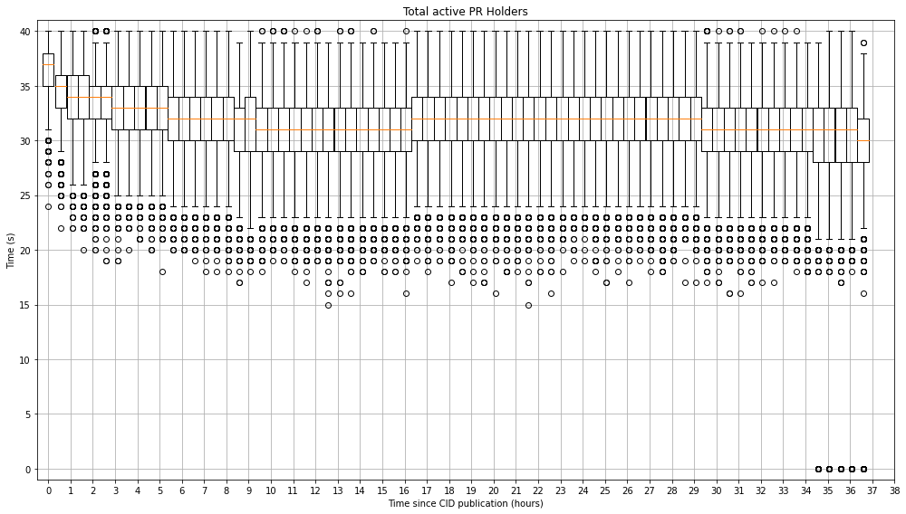 | 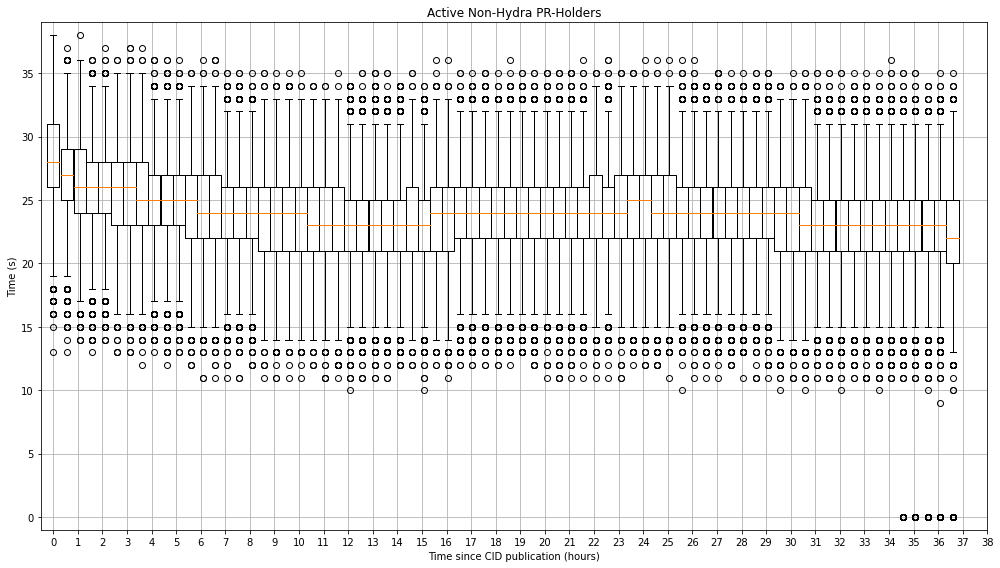 | 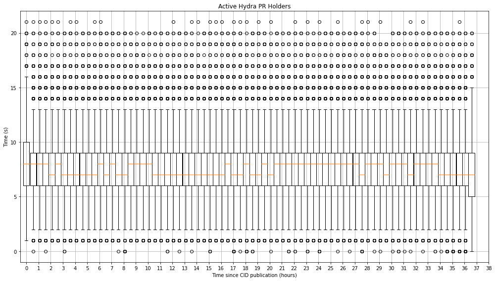 |
|  Figure 59. Active PR Holders over the study | Figure 60. Active non-hydra PR Holders over the study  | Figure 61. Active hydra PR Holders over the study |

**PR Holders keeping the records**

| Total | Non-Hydras | Hydras | 
|----|----|----|
| 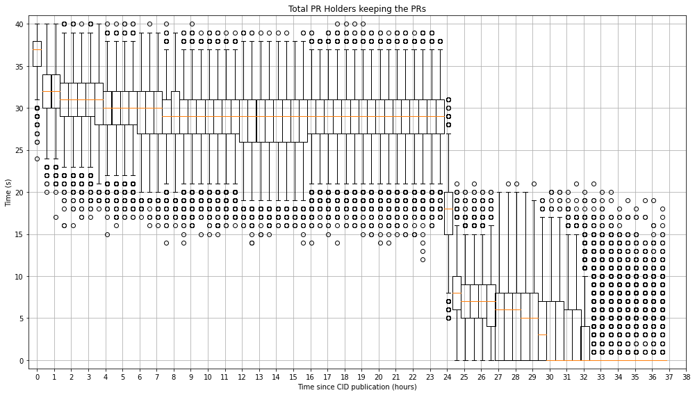  | 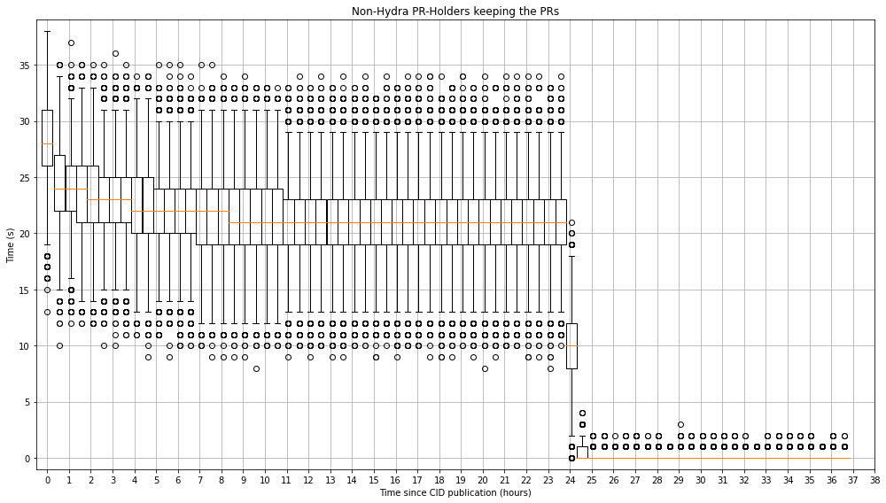 | 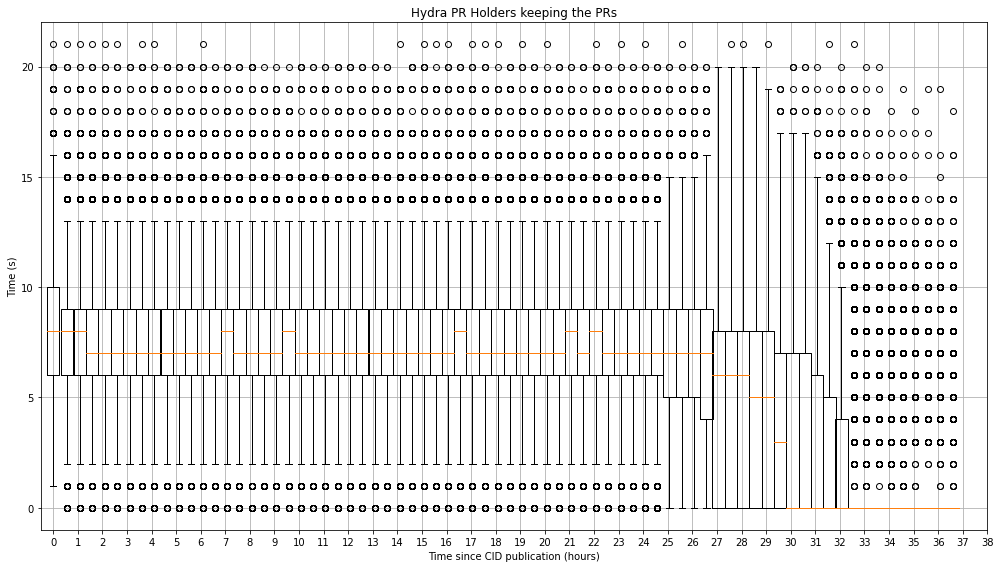 |
|  Figure 62. Total number of PR Holders keeping the records | Figure 63. Number of non-hydra PR Holders keeping the records | Figure 64. Number of hydra PR Holders keeping the records |

**In-degree**

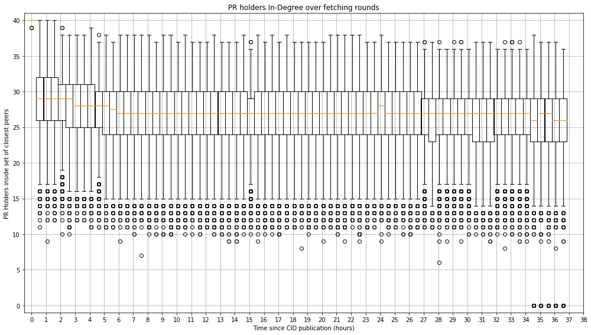

Figure 65. In-degree ratio of PR Holders over the study

