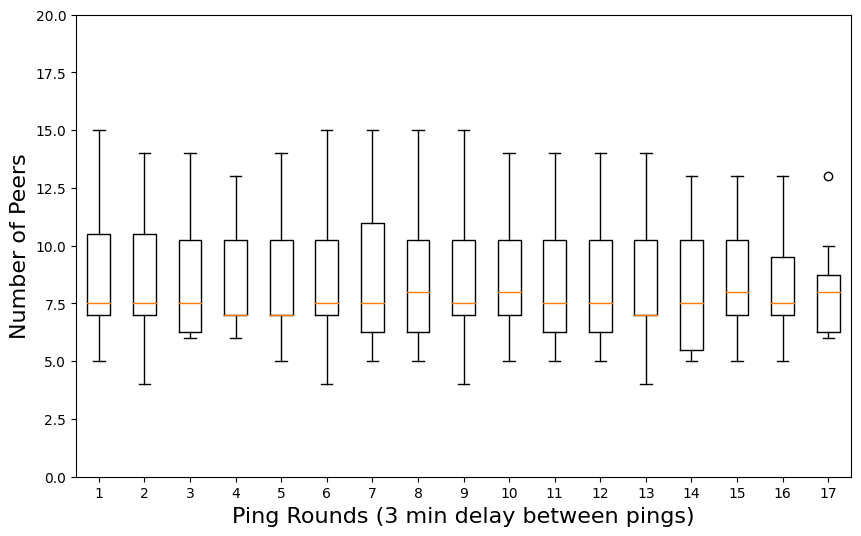
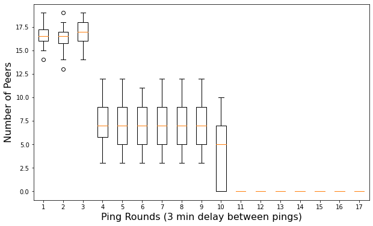
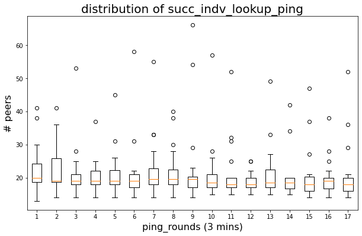
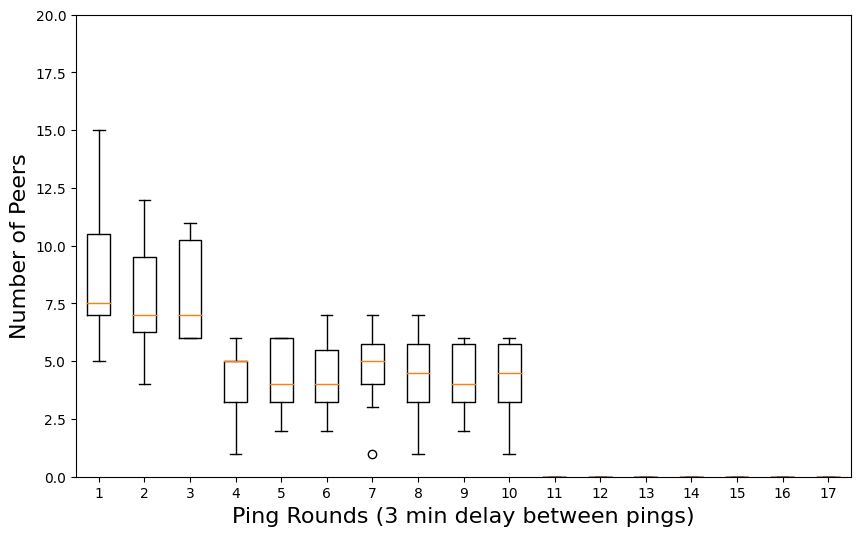
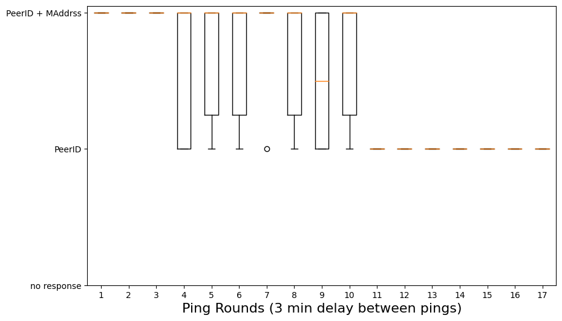

# RFM 17.1 | Sharing Provider Records with Multiaddresses

_DRI/Team_: [`Mikel Cortes-Goicoechea`](https://github.com/cortze) & [`Leonardo Bautista-Gomez`](https://github.com/leobago) ([`Barcelona Supercomputing Center`](https://bsc.es/))
_Date_: 04/11/2022

## Table of contents

1. [Introduction](#1-Introduction)
2. [Findings](#2-Findings)
3. [Methodology](#3-Methodology)
4. [Discussion](#4-Discussion)
5. [Conclusion](#5-Conclusion)
6. [References](#6-References)

## 1-Introduction
**_Context_**: [Slack Discussion](https://filecoinproject.slack.com/archives/C03FFEVK30F/p1662995123912119) & [GitHub Issue](https://github.com/ipfs/kubo/issues/9264) 

Currently, content routing through DHT lookups in IPFS involves two different steps:

1. Routing the CID to nodes hosting the content - find the Provider Records (PR) in the public Provider Records DHT
2. Mapping the ID of the nodes hosting the content to their public multiaddress  - find the multiaddress of a peer in the Public Address DHT

In this context, we understand the PR as the link between a CID and a Peer ID of the content provider, which is how the PR are stored in the public DHT. However, in the networking layer, when a host request or looks for the Providers of a given CID, the method [`dht.FindProviders()`](https://github.com/libp2p/go-libp2p-kad-dht/blob/dae5a9a5bd9c7cc8cfb5073c711bc308efad0ada/routing.go#L445) returns two arrays of `peer.AddrInfo`:

- The first array relates to the `[]AddrInfo` of content providers that the remote host is aware of.
- The second array relates to peers that are closer to the CID from the remote peer's perspective (form it's routing table).

Given that the structure of the `peer.AddrInfo` is:

```go
type AddrInfo struct {
	ID    ID
	Addrs []Multiaddr
}
```

One could think: Why do we split the retrieval process into two different steps or lookups when we could simply return the `ID` and `[]Multiaddr` of the peer in the same response?

- The simple answer is, it actually already happens (sometimes).

Each node in the network keeps a list of the peers that they are connected to with the information of the same ones. In this local peerstore, nodes generally keep items like the `UserAgent`, `Latency`, `Multiaddresses`, and so on from the remote peer. But most importantly, hosts keep locally an expiration time or Time To Live (TTL) for those `Multiaddresses` associated to that peer. This TTL gets updated or extended each time that the local hosts interacts with that remote peer, which generally happens when the local host refreshes it's routing table, or when a Provider publishes or republishes the PR.   

In the current IPFS network, the TTL of those `Multiaddresses` is between 10 and 30 mins (depending on the `go-libp2p` [version](https://github.com/libp2p/go-libp2p/commit/c2821791bac7d638890accc98798bf4cbfe122e7)), while the TTL for the PR is ~24 hours (still pending to be re-adjusted after the submission of [RFM17](https://github.com/protocol/network-measurements/blob/master/results/rfm17-provider-record-liveness.md)).

So, when some node requests the PR of a given CID to a node that has them, it will only reply the `[]Multiaddr` together with the `PeerID` of the content provider if the TTL for the `Multiaddr` didn't expire yet. This prevents sharing non-updated records for any peer in the network. 

However, since the PR have a TTL of 24 hours, and we intend to extend it up to 48h, is it worth shorten the current process that perform 2 lookups to a single one? In other words: 
- Should we extend the TTL of the `ID` - `Multiaddr` mapping? (30-10 mins VS 24 hours matching the PR TTL)
- Should we always share the `Multiaddr` with the `ID` if any peer asks for a PR that we know?

This extension of RFM17 aims to prove that the mapping between `ProviderID` and `[]Multiaddr` is actually shared for those 10 to 30 mins after the connection with a PR Holder to store the records. Proving that extending that TTL to match the new expiration time of the PR, would remove the need to make a second DHT lookup to map the provider's `ID` and its `Multiaddress`.

## 2-Findings
- As we were expecting, peers no longer share the provider’s `ID` + `Multiaddress` after 30 mins (some of them still share them after the expected 10 mins depending of the ipfs client that they are using. The TTL increase was included in `go-libp2p@v0.22.0` August 18, 2022)
- Even the lookup process can find the `Multaddress` for the provider over those 10-30 mins, the lookup process sometimes returns an empty `Multaddress` field in the `peer.AddrInfo`. The problem? The `dht.FindProviders()` method only reports once each content provider, so if the first peer that reports the PR only includes the content provider's `PeerID`, later coming `PeerID` + `Multiaddress` mapping won't longer be notified. 


## 3-Methodology

The study uses as basis the CID-Hoarder from RFM17. It includes some complementary modifications that can keep track more in detail the retrieval side of the DHT lookup.

The tool uses two different hosts, one for publishing the content (gets closed after the publication process) and the second one for pinging the PR Holders individually asking for the PRs and for performing a public DHT lookup for the content.

The result of each individual ping for the PR holders and the result of the lookup for the PRs are written in the `stdout` as logs. The logs contain both the peer reporting the PR, and the content of the received `AddrInfo` response. And this logs are then parsed in a Python script to produce the plots analyzed in Section [4](#4-Discussion).

**_Notes_**: *Holder: Peers elected to store the PR in the publication process for the CIDs.*

## 4-Discussion
As previously introduced, this RFM aims to measure how PR are shared when someone tries to find the content provider for a given CID. To do so, we will divide this section in three different chapters, i) the result when we ask the PR directly to the PR holders, ii) the reply from those peers that share the PR during the lookup process iii) the final result of the `dht.FindProviders()` method form the `kubo` implementation. 

The experiment was done for a total of 100 CIDs for over 50 minutes on the 23st of September, 2022.

### 4.1-PR holder's direct reply

Taking a closer look at the ratio of PR holders that reply back the PR from Figure [1], we see a stable 16 to 17 PR holders sharing them over the entire study. Please keep in mind that there is a delay of 3 mins between ping rounds. 



_Figure 1: Number of PR holders replying with the PR._

However, if we check the actual content of the `AddrInfo` that we receive back from the remote peers as it is displayed in Figure [2], we can observe that those 16 to 17 stable PR holders only share both `PeerID` + `Multiaddress` for around 3 ping rounds or 9 to 12 minutes. Afterwards, the median drops to 7 stable peers sharing the combo until ping round 10 or 30 mins, followed by a period of only `PeerID` reply period. 



_Figure 2: Number or PR Holders replying with the `PeerID` + `Multiaddress` combo._

### 4.2-Reply of peers reporting the PR during the DHT lookup

Results are quite similar when we analyze the replies of the peers that report us back the PR from the DHT lookup process. We increased the number of content providers that we were looking for to track the multiple remote peers. Figure [3] represents the number of remote peers reporting the PR for the CIDs we were looking for, where we can see an stable 20 peers by median over the entire study. 

For those ones wondering why are there more than 20 peers (k replication value when publishing the CIDs) reporting the PR, we have to remind you that Hydra-Boosters share the PR database among different peerID heads. Which ultimately means that if one hydra hears about a PR, all the heads of that common database will also share it.  



_Figure 3: Number of remote peers replying with the PR during the DHT lookup._

We spotted no difference when comparing the number of PR that contained the `Multiaddress` of the content's provider. Figure [4] shows the exact same drop of peers sharing the combo after ~9-12 mins, with a sudden drop after round 10 (~30 mins). It is clear from this results that the network is quite segmented in terms of client versions, where the TTL of the `Multiaddress` records varies from 10 to 30 mins. 



_Figure 4: Number or remote peers replying with the `PeerID` + `Multiaddress` combo during the DHT lookup process._


### 4.3-Result from the DHT lookup

It is important to notice that despite being able to show empirically what we already knew, the combo of `PeerID` + `Multiaddress` gets shared only over the TTL of the `Multiaddress` records, the result that we got from the DHT lookup process doesn't fully match the previous results. 

We would expect to retrieve the combo over the current TTL of the multiaddress records. However, the fragmentation between IPFS nodes in the network makes some of the nodes to only reply with the `PeerID` of the content's provider, and in the current [`libp2p/go-libp2p-kad-dht`](https://github.com/libp2p/go-libp2p-kad-dht) implementation, the reply of the lookup only gets the `AddrInfo` of the first PR that we get from that provider (code [here](https://github.com/libp2p/go-libp2p-kad-dht/blob/e33a4be6e9a3a8fb603d21126e2d8a42c5e37d1b/routing.go#L490)). This means that if at the 20 mins of publishing a content, some client wants to retrieve it through a DHT lookup, and the first peer that replies with only the `PeerID` of the provider, that client will have to perform a second DHT lookup to map the `PeerID` with the `Multiaddress`, independently of receiving a second reply with the entire combo 20ms later. Figure [5] displays the final result of the `dht.FindProviders()` method, distinguishing the content of the received PR.



_Figure 5: Result of the `dht.FindProviders` method, together with the filtered content of the received provider's `AddrInfo`._

## 5-Conclusion

With this study, we have demonstrated empirically that the combo of `PeerID` + `Multiaddress` are in fact shared as long as the TTL of the `Multiaddress` records don't expire. 

This means that if we increase this TTL to match the PR expiration time, we could be reducing to a single DHT lookup the process of retrieving a CID's content using the public DHT.

On the other hand, we have identified some code limitations that could affect the impact of such improvements as far as the network keeps fragmented based on client versions and mismatches between configurations.

## 6-References

* [RFM17](https://github.com/protocol/network-measurements/blob/master/results/rfm17-provider-record-liveness.md)
* [CID-Hoarder](https://github.com/cortze/ipfs-cid-hoarder)


