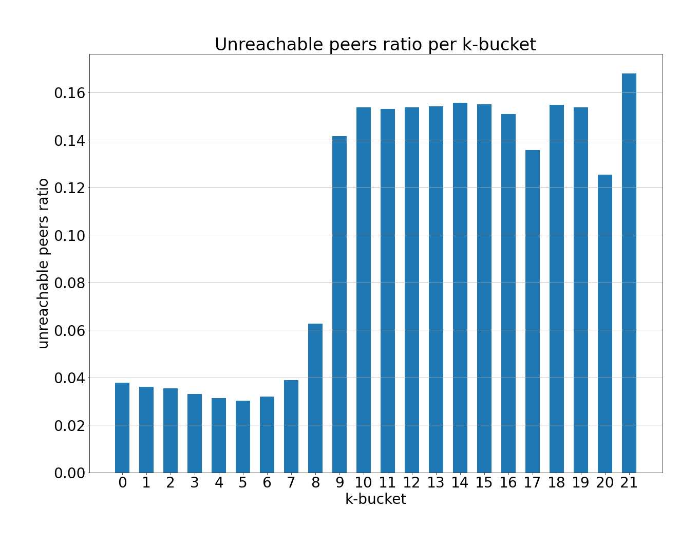
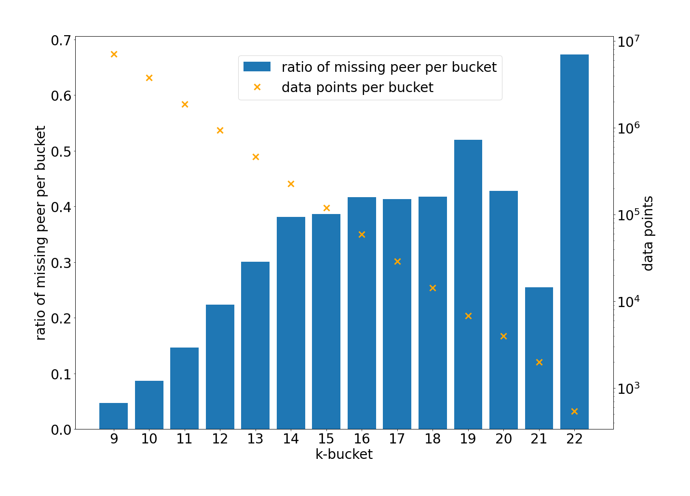

# RFM19 Report: DHT Routing Table Health

Author: [Guillaume Michel](https://github.com/guillaumemichel)\
Date: 2022-07-01

## Table of Contents

- [Motivation](#motivation)
- [Measurement Methodology](#measurement-methodology)
  - [Nebula Crawler](#nebula-crawler)
  - [Binary Trie](#binary-trie)
  - [Building the k-buckets](#building-the-k-buckets)
  - [Finding k-bucket missing peers](#finding-k-buckets-missing-peers)
- [Measurement Results](#measurement-results)
  - [Unreachable peers](#unreachable-peers)
  - [Peers distribution in the k-buckets](#peers-distribution-in-the-k-buckets)
  - [Incomplete k-buckets](#incomplete-k-buckets)
  - [20 closest peers awareness](#20-closest-peers-awareness)
  - [Closest peers distribution in the k-buckets](#closest-peers-distribution-in-k-buckets)
- [Conclusion](#conclusion)
- [Future Work](#future-work)
- [References](#references)

## Motivation

Measuring the performance of decentralized peer-to-peer systems is often not as straightforward as for centrally operated systems, for they contain no central monitoring tools. However, it is crucial for these systems to set up measurements and metrics, to understand how they can be improved. The goal of this Request For Measurement (RFM) is to study the Kademlia DHT Routing Table Health in the IPFS network. The measurements described in this report help us understand better the state of the routing table in practice as well as provide hints on libp2p and IPFS routing improvements.

Our study focuses in particular on:
- the percentage of stale entries in the routing tables
- the peer distribution in Kademila k-buckets
- the number of missing peers in the k-buckets
- whether IPFS nodes have their 20 closest peers in their routing tables

These metrics will help us evaluate the state of the DHT Routing Table in practice, its strengths and its weaknesses. We will be able to detect problems or propose improvements from the results of this study.

## Measurement Methodology

Kademlia's [1] routing table is composed of `k-buckets`, sorting remote peers according to the XOR distance between the peer's own 256-bits ID and the remote peer ID. Peer `P0` will have peer `P1` in its bucket `i` only if `P0`'s ID and `P1`'s ID share a common `i-bit` prefix, the Common Prefix Length (CPL). Each bucket is capped at a maximum of `k=20` peers by design. The probability for a random node to fall in bucket `i` is $2^{-(i+1)}$, thus it is expected for buckets with a low ID to be full and the ones with a high ID to be totally empty. Note that in theory, the routing table should contain 256 buckets, with most of them being totally empty. `libp2p`'s implementation of Kademlia contains optimizations and doesn't actually create the 256 buckets for the routing table, it only creates the populated ones. The `libp2p` bucket with the highest ID `i` will contain at most 20 peers, that don't necessarily share the same CPL but whose CPL is $\geq i$. The logic is described in the [source code](https://github.com/libp2p/go-libp2p-kbucket/blob/f0be035294ac4f5e939af13ddc1dd24273b7d881/table.go#L192). In this report, the _k-bucket_ term is used to refer to the k-buckets as described in the Kademlia paper, represented by the CPL, and not as implemented in practice in `libp2p`. 

### Nebula Crawler

We used the [Nebula Crawler](https://github.com/dennis-tra/nebula-crawler) [2] to get the content of the routing table of peers in the IPFS network. The Nebula Crawler starts a `libp2p` node with bootstrap peers and asks them for random handcrafted CIDs in order to discover all peers in the network. To fetch the routing table of a specific peer, the crawler will request to that peer multiple handcrafted CIDs matching the Common Prefix Length (CPL) of each k-bucket of this peer. The queried peer will then return the closest peers to the requested CID in their routing table. The crawler will eventually collect the complete routing table, by querying the routing table of every discovered peer.

The Nebula Crawler provides us the peer IDs of the peers in the IPFS network, as well as the routing tables of these peers at each crawl. Once the Nebula Crawler returns all the routing tables, we are able to reconstruct the k-buckets for all peers using the peer IDs. Given all the alive nodes in the network at the time of the crawl, we can have a _global_ snapshot of the network, and all the required information to derive the health of the peers' routing table.

#### Technical limitations

The Nebula Crawler may be unaware of nodes that are not well connected to the IPFS network, or in a split network. Hence, we will only discuss the DHT routing table health of the largest partition, as provided by the Nebula Crawler.

### Binary Trie

Kademlia XOR distance is non linear [4]. Hence, it is computationally expensive to sort a large number of peers by XOR distance to build the k-buckets. The Binary Trie structure is a good data representation for this purpose. We built a simple python [Binary Trie](https://github.com/guillaumemichel/py-binary-trie) script to efficiently compute and represent the XOR distance in an `n-bit` keyspace, such as `libp2p`'s implementation of Kademlia. The Binary Trie provides a function to get the `n` closest keys to a specific key. It is helpful to determine the XOR _closeness_ of the IPFS peers. This function is used to compute which peers fit in each of the routing table's k-buckets.

### Building the k-buckets

The Nebula Crawler provides a list of peers, and for each one of them, a list of all of the peers inside its routing table, referred to as _neighbors_. For all peers, we go through the list of neighbors, and order them in buckets. The buckets are identified by the Common Prefix Length that all the `peerID`s of the neighbors inside this bucket share with the peer's `peerID`, or in other words the XOR distance between the neighbor's `peerID` and the peer's `peerID`.

### Finding k-buckets missing peers

With the peers list provided by the Nebula Crawler, we construct a global binary trie using the `peerID`s as keys. For each peer $p_i$ for $0 \leq i \lt n$, `n` being the number of peers in the network, we create a list of all other peers $[p_0, p_1, ..., p_{n-1}] \setminus p_i$, sorted according to the XOR distance between $p_i$'s `peerID` and the other peer's `peerID`. In other words, we sort all the peers in the network using the trie according to their XOR distance to every other peer, which produces `n` ordered lists of `n` peers, assuming there are `n` peers in the network.
Having this information, it is easy to build the expected k-buckets from these sorted lists of peers.
Comparing the expected k-buckets with the actual ones allows us to observe any peer missing from the actual routing table, and provides us information on the health of the routing table.

### Reproducing the Measurements

The python scripts used to produce the following plots and instructions to reproduce the results are located in the [`implementations/rfm19-dht-routing-table-health/`](https://github.com/protocol/network-measurements/tree/master/implementations/rfm19-dht-routing-table-health) folder.

The data used for the measurements is available [here](../implementations/rfm19-dht-routing-table-health/data/).

## Measurement Results

For the measurements, we used data from 28 crawls of the Nebula Crawler, obtained 4 times a day (`03:00`, `09:00`, `15:00`, `21:00` UTC) for 7 days from `2022-04-19` until `2022-04-26`. On average on the 28 crawls, 20'811 peers were discovered per crawl, among which 15'371 were reachable. Unreachable peers are discovered because they are present in some other reachable peer's routing table. They could be either stale entries e.g the peer has gone offline, or online and active nodes that are unreachable because they are behind a NAT or firewall.

### Unreachable peers

This first plot shows the average ratio of unreachable peers per k-bucket, or stale entries. Buckets `0` to `8` usually contain 20 peers, which is the maximum. For instance, bucket `0` has on average 3.78% of unreachable peers, which corresponds to an average of 0.75 unreachable peers out of the 20. The ratio of unreachable peers rises to around 15% for non-full buckets, with ID `9` to `21`. However, 15% of unreachable peers in the non-full buckets is quite low, and it means that nodes leaving the network after a short time period aren't affecting much the routing tables. Unstable peers may not stay online long enough to make it into the routing tables. Hence, even the buckets with a high ID aren't mostly filled by unreachable peers, which is positive.

The visible step around bucket `8-9` is certainly due to the k-bucket replacement policy. The routing table is fully refreshed every 10 minutes, each peer is queried and the peers failing to reply timely are evicted from the routing table. In addition, nodes failing to answer lookup requests are immediately evicted from the routing table. The number of stale entries in buckets `9+` is high because the nodes will be unlikely to request anything to peers in these buckets within the refresh interval, as it represent a tiny share of the keyspace. On the other hand, they will interact with nodes in buckets `0`-`8` and replace the stale entries right away, making the ratio of unresponsive peers lower in these buckets. We can observe an exponential growth between buckets `5-6` and `9-10`, that is because bucket `X` statistically contains 2x less keys compared with bucket `X-1`, and hence detects and evicts unresponsive peers 2x slower.

### Peers distribution in the k-buckets

These boxplots represent the filling status of Kademlia `k-bucket` in the IPFS network. We removed the outliers from the boxplots for the sake of readability because the high number of samples induces a high number of outliers. The yellow bar indicates the mean number of peers in each bucket. The bottom of the box represents the $25^{th}$ percentile, or `Q1` and the top of the box represents the $75^{th}$ percentile or `Q3`. The whiskers represent the $5^{th}$ and $95^{th}$ percentiles.

Statistically, bucket `i` is expected to have $N \times 2^{-(i+1)}$ candidates with `N` being the network size. Bucket `0` to `8` are full on the plot including unreachable peers for $N \times 2^{-(i+1)}>20$ with $0 \leq i \leq 8$. The non full buckets (`9` and above) contain on average slightly less reachable peers than the theoretical number of candidates, because we selected $N=20'811$ even though 5440 peers are unreachable. An unreachable node inside the routing table of an old and stable peer will not be detected and added to the routing table of a peer that recently joined the DHT.

If we exclude unreachable peers, because stale entries might not have been flushed in all routing tables, the theoretical number of candidates for bucket `9` is $N \times 2^{-(9+1)} = 15.01$ peers, with $N=15'371$. In practice, we measured an average of 14.16 peers. For bucket `13`, we measured 0.908 peers and the theoretical value is 0.938 peers. The bucket sizes we measured for non-full bucket is always slightly lower than the theoretical value, which is expected as nodes don't have a global knowledge of the network, and thus may miss some nodes in their k-buckets. 

From these numbers, we can say that the distribution of the peers in the k-buckets is very satisfactory.

### Incomplete k-buckets

A _missing_ peer is defined as a peer whose peer ID would fit a non-full k-bucket, but is not included in that bucket. We define the maximum number of missing peers per k-buckets to be $m=20-p$, with `p` being the number of peers in the bucket. The plot shows the average total number of peers per bucket compared with the average number of missing peers per bucket, and with the average number of missing peers per non-full k-bucket. 

The buckets that are almost always full (19.88 peers on average), IDs `0` to `8` have a very low number of missing peers, 0.12 on average. Among these buckets with IDs `0` to `8`, there are two categories: `98.06%` of the bucket are full and missing no peers, and `1.94%` of the buckets are not full and miss on average 6.82 peers. One possible explanation is that the peers recently joined the network, and their routing table isn't fully populated yet.

Concerning buckets with ID `9` and above, the number of missing peers per bucket almost always matches the number of missing peers per non-full bucket, for the buckets are rarely full. On average in buckets 9 to 14, 0.53 peers are missing for each bucket, which corresponds to 19.76%.

The ratio of missing peers per bucket is computed as $(1-\frac{p}{c})$, with `p` being the number of peers in the bucket and `c` the total number of peers with this CPL. When comparing the ratio of peers that are missing from bucket with high CPL, we notice that even though these buckets are not very populated, a non negligible ratio of peers is missing. However, in comparison with buckets with lower IDs, we have much less data points to rely on. Nodes in these buckets are rare, and thus the data we obtained may not be totally representative. As we will see later, the peers in buckets 14 and above are exclusively among the 4 closest peers. We will focus more on the 20 closest peers, that belong in the high CPL buckets in the next section.

### 20 Closest Peers Awareness

The plot displays the Probability Density Function (PDF) and Cumulative Distribution Function (CDF) of the number of peers, among the 20 closest to a node `N`, in `N`'s routing table, for all nodes `N`. It shows that 61.09% of the peers have all of their 20 closest peers in their routing table, which is expected in a network with no churn. Only 4.79% of the nodes know less than 18 of their 20 closest peers, which is surprisingly good given the high churn rate as studied in [RFM2](./rfm2-uptime-and-churn.md). 0.102% of the nodes know less than 5 of their 20 closest peers.
These results show how resilient the Kademlia routing table is, in the sense that nodes will always be reachable from the network. Even if the Nebula Crawler cannot detect unreachable nodes, it is very unlikely that many nodes are unreachable given the distribution above. 

### Closest Peers distribution in k-buckets

This plot shows the k-bucket distribution for the $n^{th}$ closest peer. The standard deviation is higher for the $1^{st}$ and $2^{nd}$ closest peers, then it gets smaller for other peers, which is expected for the peer distribution. One average, the closest peer lies in bucket `14`, and the $20^{th}$ closest peer in bucket `9`. As the minimum k-bucket ID for the closest peer is `10` it implies that any peer in the IPFS network shares a Common Prefix of Length of at least `10` with at least another node in the network. In other words, the most isolated nodes have their closest neighbor at a XOR distance of $2^{256-10} = 2^{246}$. This distance is on average the same as the $11^{th}$ closest peer. Note that the measurements apply to the largest partition of the IPFS network, as provided by the Nebula Crawler. Network splits and unreachable peers were not taken into consideration.

Distribution of the 10 closest peers in the k-buckets. Note that buckets `9` to `12` contain more peers that are not in the 10 closest ones.

## Future Work

### k-buckets diversity

Kademlia's k-bucket replacement policy is least-recently seen, but live nodes are never evicted. `libp2p` follows this replacement policy and hence fosters old and stable peers over new ones. As buckets with a low ID have a very large number of candidates, we would expect the diversity of the peers in all nodes bucket `0` and `1` to decrease over time, as many nodes eventually go offline, and converging to a set of very stable nodes fitting these buckets. Stable nodes staying online long enough will gradually replace disconnected peers from low ID buckets with stable nodes. At the beginning, nodes staying online only for a short duration are expected to have a good diversity in low ID buckets, because there is not enough time for a convergence. But as time goes, very stable nodes will exclusively contain other very stable nodes in their low ID buckets. New nodes join the DHT with the help of bootstrap nodes, which are expected to be stable, and hence, the new nodes will eventually inherit from the low diversity of the low ID k-buckets. 

We expect full bucket with the highest ID to be the most diverse, as there are less candidates for each bucket. Eventually, routing to content _far away_ from your peer ID is expected to be centralized on a small set of very stable peer, which is bad for load balancing and privacy.

### Routing tables evolution over time

Measuring how the churn in the IPFS network impacts the routing table will help evaluating the performance of the replacement policy. It may also reveal potential weaknesses in the routing process, and provide improvement approaches for the k-bucket replacement policy.

One possible experiment could be to add a new node in the network. Track in which peers' routing tables it gets added, and if it evicts any existing peers from these routing tables. We could then track over a time period (approximately 1 week) how the routing tables entries pointing to our peer evolve. Finally, we will disconnect the node from the network, and see how much time is needed for the nodes to replace this entry that has become stale. It would be interesting to observe if nodes in a close locality would keep this entry even though it is stale.

### Routing tables profile per groups

Another direction could be to define groups of peers, for instance based on geolocation, user-agent, uptime, etc. and to observe if there are any unusual routing table behaviors for specific groups.

### Routing tables and popular content

As not all the content in IPFS has the same demand, some `CID`s are going to be requested more than others. This implies that the nodes hosting the Provider Records associated with these popular `CID`s will appear in more nodes' routing table than the average (independently of its uptime), because they will interact with many peers. The nodes will be popular in the DHT routing table because they are hosting a content that is popular by the DHT users. The combination of a very stable node hosting a highly popular content would help nodes spread in the DHT routing table. This technique could be used with a large number of peer IDs to perform a variety of DHT attacks.

### Perfect routing table

Given all the Peer IDs of a network, it would be possible to build the _perfect_ routing table for a given point in time. The _perfect_ routing table is defined as the most efficient routing table to reach any identifier in a minimal number of hops, given a set of peers.
Computing the difference/statistical distance between the actual routing table and the perfect routing table would allow us to evaluate the performance of the actual DHT routing, and propose improvements. The [Jaccard index](https://en.wikipedia.org/wiki/Jaccard_index) could be used to quantify the performance of the current DHT compared with the perfect one.

The perfect routing table can be computed by filling the non-full buckets as much as possible, and cherry picking the peer IDs to be uniformly distributed over the keyspace of the full buckets. Distributing the peer IDs as uniformly as possible gives the lowest expected number of hops to reach all CIDs. However, the perfect routing table is expected to change a lot with churn, whereas the current routing table is more stable. If the statistical distance between the perfect routing table and the actual one turns out to be large, this measurement could lead to a k-bucket replacement policy improvement.

## Conclusion

Our measurements show that the Kademlia DHT Routing Table appears to be healthy on all measured aspects in the IPFS network. We showed in this RFM that 95.21% of the peers in the IPFS network know at least 18 of their 20 closest peers, which is surprisingly good given the high churn rate observed in the IPFS network. We observed that the number of peers in the k-buckets follows an exponential growth from bucket `14` to `9`, and is then capped at 20 peers for bucket `8` and lower, as expected. We found that on average 0.12 peers are missing per full k-bucket, and 19.76% per non-full k-bucket, which indicates great performance in terms of keeping routing tables up to date, given that the Kademlia DHT may miss some peers in the k-buckets by design.

## References

[1] Petar Maymounkov and David Mazières. Kademlia: A peer-to-peer information system based on the XOR metric. In Proceedings of the 1st International Workshop on Peer-to-Peer Systems (IPTPS '02), pages 53-65, March 2002. [paper](https://ipfs.io/ipfs/QmaVrnwZrnoG4YramcN75mbE5AUfCymiEErrHGXoQR968V)

[2] [Nebula Crawler](https://github.com/dennis-tra/nebula-crawler) from [Dennis Trautwein](https://github.com/dennis-tra)

[3] [Binary Trie](https://github.com/guillaumemichel/py-binary-trie) from [Guillaume Michel](https://github.com/guillaumemichel)

[4] [Blogpost](https://metaquestions.me/2014/08/01/shortest-distance-between-two-points-is-not-always-a-straight-line/) on the XOR distance from [Daniel Irvine](https://metaquestions.me/author/davidofirvine/)

[5] [DHT Routing Table Health Notion Page](https://www.notion.so/pl-strflt/DHT-Routing-Table-Health-f8e6836c4b09440baa909a4448a88fbf)

