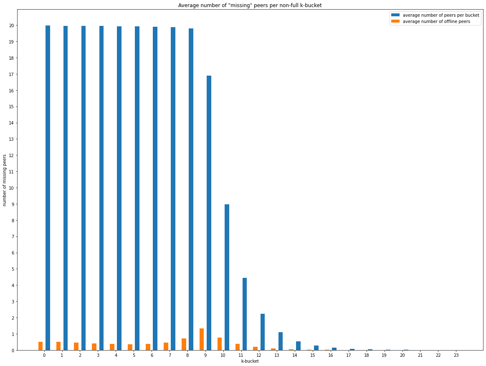

# RFM19 Report: DHT Routing Table Health

Author: [Guillaume Michel](https://github.com/guillaumemichel)\
Date: 2022-06-10

_[Suggested structure for the RFM results report]_

## Motivation

_[What was the need for this RFM and why is it important? What was the expected impact?]_

## Measurement Methodology

_[Provide details on the methodology used in a way that others can reproduce the experiments. Please reason about your choices and why your chosen methodology meets the needs of the RFM.]_

## Measurement Results

_[Summary of main results together with a description of what we see behind the plots. What do these results mean wrt your initial goal and how do they answer the motivation?]_

## Future Work

- Churn impact in routing tables
- Perfect routing table

## Conclusion

_[Please include the main take-home points. What are the 2-3 most important findings that someone should remember if they forgot about everything else in this report? If appropriate, include this short list as a TL;DR at the beginning of the report. This is a good place to point to any items that need further attention, or a separte RFM.]_

The DHT is healthy =D

## References

_[Pointers to related works, studies, papers, or repos]_

- [Nebula Crawler](https://github.com/dennis-tra/nebula-crawler)
- [DHT Routing Table Health Notion Page](https://www.notion.so/pl-strflt/DHT-Routing-Table-Health-f8e6836c4b09440baa909a4448a88fbf)

