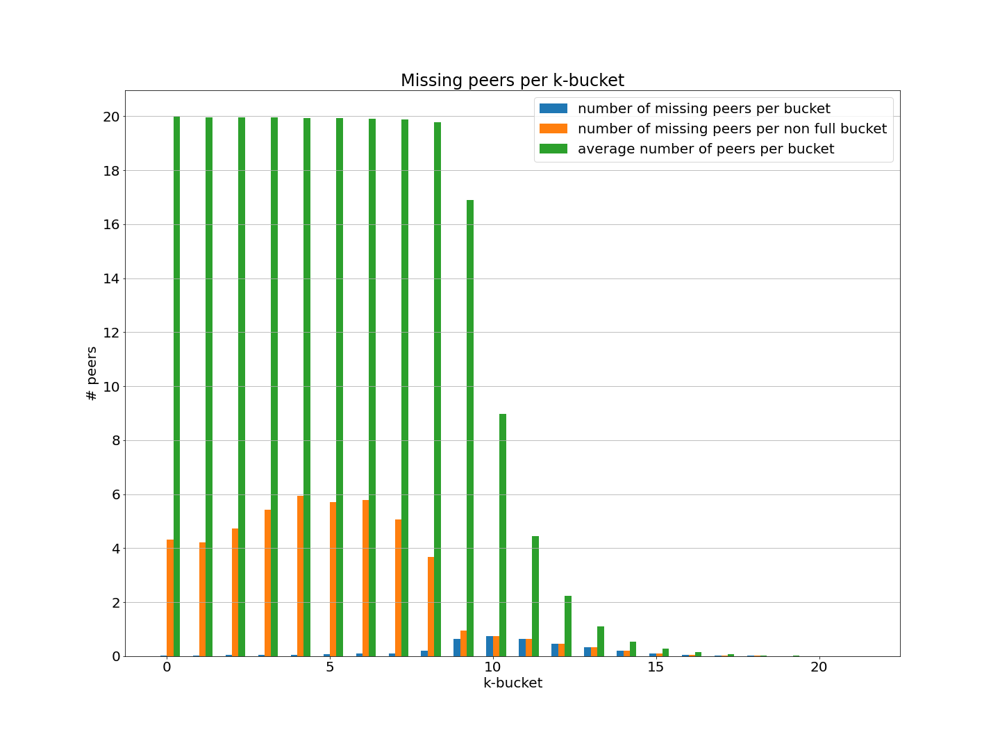
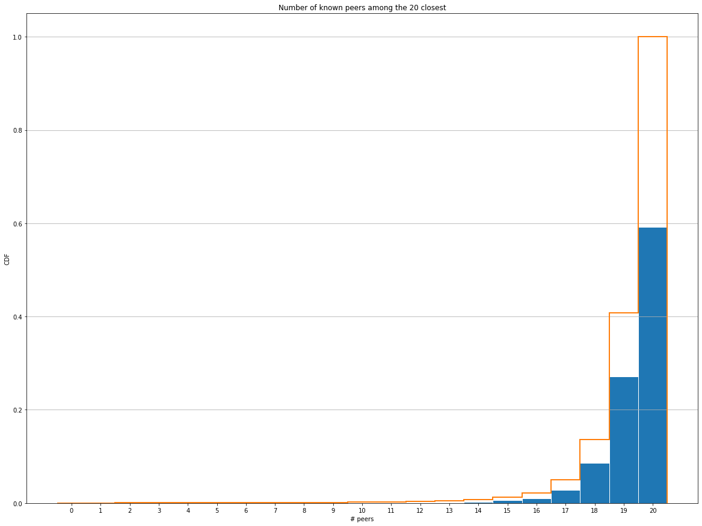
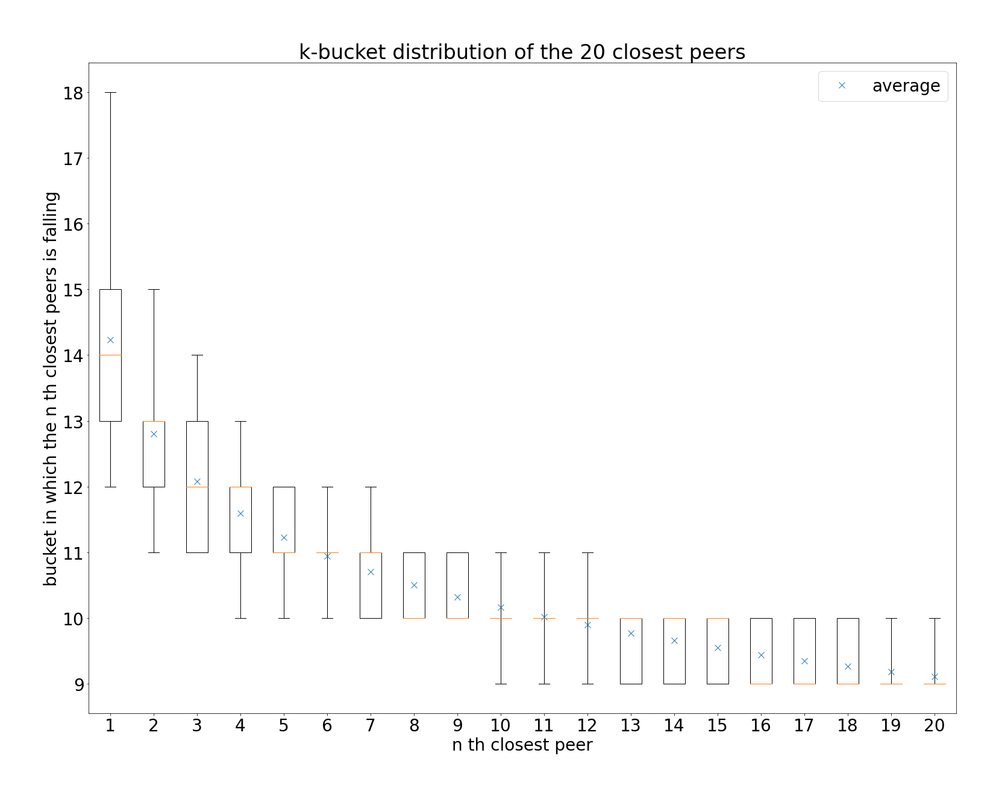
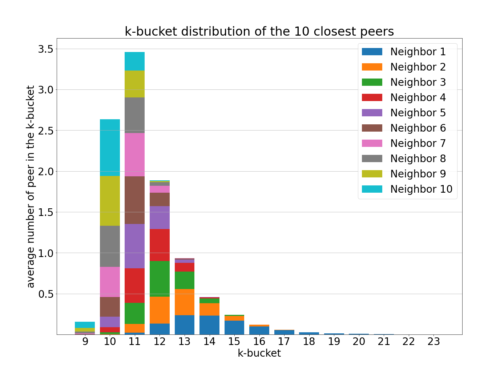
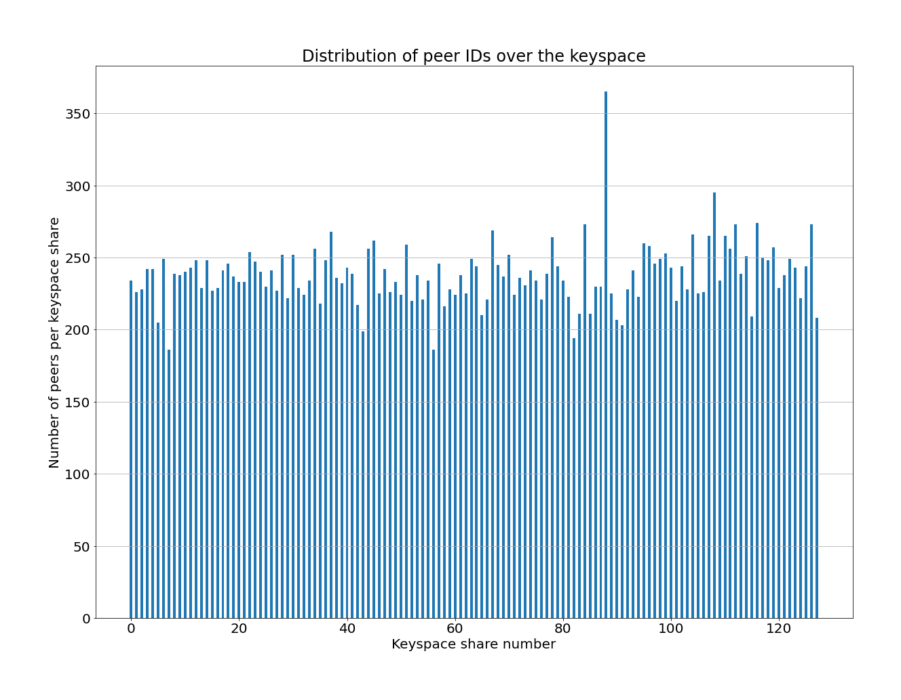

# RFM19 Report: DHT Routing Table Health

Author: [Guillaume Michel](https://github.com/guillaumemichel)\
Date: 2022-06-22

## Table of Contents

- [Motivation](#motivation)
- [Measurement Methodology](#measurement-methodology)
  - [Nebula Crawler](#nebula-crawler)
  - [Binary Trie](#binary-trie)
  - [Building the k-buckets](#building-the-k-buckets)
  - [Finding k-bucket missing peers](#finding-k-buckets-missing-peers)
- [Measurement Results](#measurement-results)
  - [Peers distribution in the k-buckets](#peers-distribution-in-the-k-buckets)
  - [Offline peers](#offline-peers)
  - [Incomplete k-buckets](#incomplete-k-buckets)
  - [20 closest peers awareness](#20-closest-peers-awareness)
  - [Closest peers distribution in the k-buckets](#closest-peers-distribution-in-k-buckets)
  - [PeerID distribution](#peer-id-distribution)
- [Conclusion](#conclusion)
- [Future Work](#future-work)
- [References](#references)

## Motivation

Measuring the performance of decentralized peer-to-peer systems is often not as straightforward as for centrally operated systems, for they contain no central monitoring. However, it is crucial for these systems to set up measurements and metrics, to understand what can be improved. The goal of this Request For Measurement (RFM) is to study Kademlia DHT Routing Table Health in the IPFS network. The measurements described in this report will help us understand better the state of the routing table in practice as well as provide hints on libp2p and IPFS routing improvements.

Our study focuses in particular on:
- the ratio of stale entries in the routing tables
- the peers distribution in Kademila k-buckets
- the measure of missing peers in the k-buckets
- whether IPFS nodes have their 20 closest peers in their routing tables

These metrics will help us evaluate the state of the DHT Routing Table in practice, its strengths and its weaknesses. We will be able to detect problems or propose improvements suggestions from the results of this study.

## Measurement Methodology

Kademlia [1] routing table is composed of `k-buckets`, sorting remote peers according to the XOR distance between the peer's own 256-bits ID and the remote peer ID. Peer `P0` will have peer `P1` in its bucket `i` if `P0`'s ID and `P1`'s ID share a common `i-bit` prefix. Each bucket is capped at a maximum of `k=20` peers by design. Note that in theory, the routing table should contain 256 buckets, with most of them being totally empty. `libp2p` implementation of Kademlia only creates the necessary buckets, and the bucket with the highest ID will contain up to 20 peers with the longest CPL, even though the peer IDs would theoretically belong to different buckets. **[TODO: add reference to implementation]** We will discuss only the theoretical buckets, represented by the CPL.

### Nebula Crawler

We used the [Nebula Crawler](https://github.com/dennis-tra/nebula-crawler) [2] to get the content of the routing table of peers in the IPFS network. The Nebula Crawler starts a `libp2p` node with bootstrap peers and ask them for random handcrafted CIDs in order to discover all peers in the network. To fetch the routing table from a peer, the crawler will request handcrafted CIDs matching the Common Prefix Length (CPL) of each k-bucket of this peer. The queried peer will then return the closest peers to the requested CID in their routing table, and the crawler will eventually collect the complete routing table.

The Nebula Crawler provides us the peer IDs of the peers in the IPFS networks, as well as the routing tables of these peers at each crawl. Once the Nebula Crawler returns all the routing tables, we are able to reconstruct the k-buckets for all peers using the peerIDs. Given all the alive nodes in the network at the time of the crawl, we can have a _global_ view on the network, and on the health of the peers' routing table.

#### Technical limitations

The Nebula Crawler may be unaware of nodes that are not well connected to the IPFS network, or in a split network. Hence, we will only discuss the DHT routing table health of the largest partition, as provided by the Nebula Crawler.

### Binary Trie

Kademlia XOR distance is non linear [4]. Hence, it is computationally expensive to sort a large number of peers by XOR distance to build the k-buckets. The Binary Trie structure is a good data representation for this purpose. We built a simple python [Binary Trie](https://github.com/guillaumemichel/py-binary-trie) to efficiently compute XOR distance in a `n-bit` keyspace, such as `libp2p` implementation of Kademlia. The Binary Trie provides a function to get the `n` closest keys to a specific key. It is helpful to determine the XOR _closeness_ of the IPFS peers. This function is used to compute which peers fit in the routing table k-buckets.

### Building the k-buckets

The Nebula Crawler provides a list of peers, and for each one of them, all of the peers inside its routing table, referred as _neighbors_. For all peers, we go through the list of neighbors, and order them in buckets. The buckets are identified by the Common Prefix Length that the `peerID`s of the neighbors inside this bucket share with the peer's `peerID`, or in other words the XOR distance between the neighbor's `peerID` and the peer's `peerID`.

### Finding k-buckets missing peers

With the peers list provided by the Nebula Crawler, we construct a global binary trie using the `peerID`s as keys. For each peer $p_i$ for $0 \leq i \leq n$, `n` being the number of peers in the network, we create a list of all other peers $[p_0, p_1, ..., p_n] \setminus p_i$, sorted according to the XOR distance between $p_i$'s `peerID` and the other's peer `peerID`. It is easy to build the expected k-buckets from these sorted lists of peers. Comparing the expected k-buckets with the actual ones allows us to observe any peer missing from the actual routing table, and provides us information on the health of the routing table. **[FEEDBACK WELCOME]**

**[TODO: alternative phrasing]**
Using this trie, we sort all the peers of the network according to the XOR distance to every peers, which produces `n` ordered lists of `n` peers if there are `n` peers in the network. We can then easily build the expected k-buckets from these sorted lists of peers. Comparing the expected k-buckets with the actual ones allows us to observe any peer missing from the actual routing table.

### Reproducing the Measurements

The python scripts used to produce the following plots and instruction to reproduce the results are located in the [`implementations/rfm19-dht-routing-table-health/`](https://github.com/protocol/network-measurements/tree/master/implementations/rfm19-dht-routing-table-health) folder.

The data **[TODO: will be]** available in the `data/` subfolder if not too large.

## Measurement Results

For the measurements, we used data from **X** crawls of the Nebula Crawler, obtained on **[TODO: ADD DATES]**

### Offline peers

**[TODO: add dead peers plot]**

### Peers distribution in the k-buckets

This boxplot represents the filling status of Kademlia `k-bucket` in the IPFS network. We removed the outliers from the boxplot for sake of readability because the high number of samples induce a high number of outliers. The yellow bar indicate the mean number of peers in each bucket. The bottom of the box represents the 25th percentile, or `Q1` and the top of the box represents the 75th percentile or `Q3`. **[TODO: outliers as Circle with various radius / whisker representing 95th percentile]**.

Statistically, bucket `i` is expected to have $\frac{N}{2+i}$ candidates with `N` being the network size. 

**[TODO: correct plot with online peers only]**
Buckets `0-8` are full, which is expected as $N=31'000$ **[TODO: verify numbers]** $N/10 >= 20$. Then we can see that the amount of peers in buckets `9` to `14` approximately halves at each bucket (**[TODO: add exact average]**). Buckets 15 and above contain no peers, with the exception of a few outliers.

From these numbers, we can say that the filling status of the `k-buckets` is as expected.

### Incomplete k-buckets

**[TODO: check if columns reordering is needed]**
**[TODO: shift columns to the center]**
**[TODO: add a "-" to non-full]**

A _missing_ peer is defined as a peer ID that would fit a non-full k-bucket, but is not included. We define the maximum number of missing peers per k-buckets to be $m=20-\#peers$. The plot shows the average number of missing peers per bucket, compared with the average number of missing peers per non-full k-bucket and with the average total number of peers per bucket. 

The buckets that are almost always full (19.XX peers on average **[TODO: INSERT NUMBER]**), IDs `0` to `8` have a very low number of missing peers, 0.XX **[TODO: INSERT NUMBER]** on average. However, the same buckets have a quite high number of missing peer per non-full bucket, 4.XX on average **[TODO: INSERT NUMBER]**. This implies that most of these buckets 9X.XX% **[TODO: INSERT NUMBER]** are full, but the non-full bucket are missing multiple peers on average **[TODO: INCLUDE ZOOM GRAPH ON THESE NON FULL BUCKETS?]**. One possible explanation is that the peers recently joined the network, and their routing table isn't fully populated yet. **[TODO: CHECK if it is the same peerIDs for which the different buckets are not full]**

Concerning buckets with ID `9` and above, the number of missing peers per bucket almost always matches the number of missing peers per non-full bucket, for the buckets are rarely full. Less than `0.X` **[TODO: INSERT NUMBER]** peer on average is missing for each bucket, meaning that the network is healthy. We will focus more on the 20 closest peers in the next section.

**[TODO: plot ratio of missing peers for buckets 9+]**

### 20 Closest Peers Awareness

The plot displays the Probability Density Function (PDF) and Cumulative Distribution Function (CDF) of the number of peers, among the 20 closest, in a node's routing table **[FEEDBACK WELCOME: IS IT CLEAR? REFORMULATION WELCOME]**. It shows that 59.XX% **[TODO: INSERT NUMBER]** of the peers have all of their 20 closest peers in their routing table, which is expected in a network with no churn. Only 5.XX% of the nodes **[TODO: INSERT NUMBER]** know 17 or less of their 20 closest peers, which is surprisingly good given the high churn rate studied in [RFM2](./rfm2-uptime-and-churn.md). These results show how resilient is the Kademlia routing table in the IPFS network. **[TODO: ADD SOMETHING CONCRETE TO UNDERLINE THE PERFORMANCE]**

### Closest Peers distribution in k-buckets

**[TODO: replace avg line with x's]**

This plot shows the k-bucket distribution for the $n^{th}$ closest peer. The standard deviation is higher for the $1^{st}$ to $3^{rd}$ closest peers, then it gets smaller for other peers, which is expected for the peer distribution. One average, the closest peer lies in bucket `14`, and the $20^{th}$ closest peer in bucket `9`. As the minimum k-bucket ID for the closest peer is `10` it implies that any peer in the IPFS network shares a Common Prefix of Length of at least `10` with at least another node in the network. In other words, the most isolated nodes have their closest neighbor at a XOR distance of $2^{256-10} = 2^{246}$. This distance is on average the same as the $11^{th}$ closest peer. Note that the measurements apply to the largest partition of the IPFS network, as provided by the Nebula Crawler. Network splits and unreachable peers were not taken into consideration.

**[TODO: CHANGE GRID DIRECTION]**

Distribution of the 10 closest peers in the k-buckets. Note that buckets `9` to `12` contain more peers that are not in the 10 closest ones.

### `PeerID` Distribution

The plot above shows the distribution of the Peer IDs over the keyspace. For a better visualization, the keyspace has been broken down to 128 (=$2^7$) keyspace chunks. `libp2p` uses a 256 bits keyspace $\{0, 1\}^{256}$, each chunk contains keys from $bin(i)+0^{249}$ to $bin(i) + 1^{249}$ for `i` in $[0, 127]$, $bin(i)$ being the binary representation of `i`, **[FEEDBACK WELCOME]** $X^n$ being the bitstring representation of bit `X` repeated `n` times (e.g $0^3=000$). All the keys falling in the same chunk share a common 7-bit prefix.

The represented data is the average number of alive peer over **[TODO: INSERT TIME PERIOD]** crawls falling in each keyspace chunk. We can see that the Peer IDs are almost evenly distributed in the 128 keyspace chunks. **[TODO: INSERT AVG AND STD]** We would have expected such a distribution **[TODO: order chunks to show a gaussian curve]**. There is a single peek high above the average at `360`, which is only `1.5x` the average `240` **[TODO: CHECK NUMBERS]**, which is too little to perform any eclipse attack. **[TODO: FIND REFERENCE FOR ECLIPSE ATTACK]**. **[TODO: ADD ZOOM IN PLOT FOR HIGH PEAK]**

**[TODO: plot of the peer ID distribution for the whole crawl duration + plot avg for the selected crawls + zoom on peak]**

## Future Work

### Routing tables evolution over time

The current k-bucket replacement policy fosters old and stable peers over new ones. Measuring how the churn in the IPFS network impacts the routing table will help evaluating the performance of the replacement policy. It may also reveal potential weaknesses in the routing process, and provide improvement approaches for the k-bucket replacement policy.

One possible experiment could be to add a new node in the network. Track in which peers' routing tables it gets added, and if it evicts any existing peers from these routing tables. Then we could track over a time period (approximately 1 week) how the routing tables entries pointing to our peer evolve. Finally, we will disconnect the node from the network, and see how much time is needed for the nodes to replace this entry that has become stale. It would be interesting to observe if nodes in a close locality would keep this entry even though it is stale.

### Routing tables profile per groups

Another direction could be to define groups of peers, for instance based on geolocation, user-agent, uptime, etc. and to observe if there are any unusual routing table behaviors for specific groups. 

### Perfect routing table

Given all the Peer IDs of a network, it would be possible to build the _perfect_ routing table for a given point in time. The _perfect_ routing table is defined as the most efficient routing table to reach any identifier in a minimal number of hops, given a set of peers.
Computing the difference/statistical distance between the actual routing table and the perfect routing table would allow us to evaluate the performance of the actual DHT routing, and propose improvements. The [Jaccard index](https://en.wikipedia.org/wiki/Jaccard_index) could be used to quantify the performance of the current DHT compared with the perfect one.

The perfect routing table can be computed by filling the non-full buckets as much as possible, and cherry picking the peer IDs to be uniformly distributed over the keyspace of the full buckets. Distributing the peer IDs as uniformly as possible gives the lowest expected hop number to reach all CIDs. However, the perfect routing table is expected to change a lot with churn, whereas the current routing table is more stable. If the statistical distance between the perfect routing table and the actual one turns out to be large, this measurement could lead to a k-bucket replacement policy improvement.

## Conclusion

Our measurements show that the Kademlia DHT Routing Table appears to be healthy on all measured aspects in the IPFS network. We showed in this RFM that 94.XX% **[TODO: INSERT NUMBER]** of the peers in the IPFS network know at least 18 of their 20 closest peers, which is surprisingly good given high churn rate. We observed that the number of peers in the k-buckets follows an exponential growth from bucket `14` to `9`, and is then capped at 20 peers for bucket `8` and lower, as expected. We found that on average 0.1 peers are missing per full k-bucket, and XX.XX% **[TODO: INSERT NUMBERS]** per non-full k-bucket, which is a great performance given that the Kademlia DHT may miss some peers in the k-buckets by design.

## References

[1] Petar Maymounkov and David Mazières. Kademlia: A peer-to-peer information system based on the XOR metric. In Proceedings of the 1st International Workshop on Peer-to-Peer Systems (IPTPS '02), pages 53-65, March 2002. [paper](https://ipfs.io/ipfs/QmaVrnwZrnoG4YramcN75mbE5AUfCymiEErrHGXoQR968V)

[2] [Nebula Crawler](https://github.com/dennis-tra/nebula-crawler) from [Dennis Trautwein](https://github.com/dennis-tra)

[3] [Binary Trie](https://github.com/guillaumemichel/py-binary-trie) from [Guillaume Michel](https://github.com/guillaumemichel)

[4] [Blogpost](https://metaquestions.me/2014/08/01/shortest-distance-between-two-points-is-not-always-a-straight-line/) from [Daniel Irvine](https://metaquestions.me/author/davidofirvine/)

[5] [DHT Routing Table Health Notion Page](https://www.notion.so/pl-strflt/DHT-Routing-Table-Health-f8e6836c4b09440baa909a4448a88fbf)

