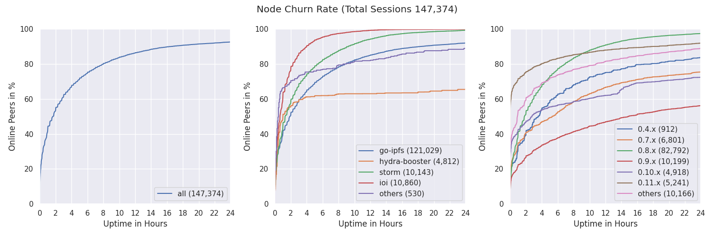
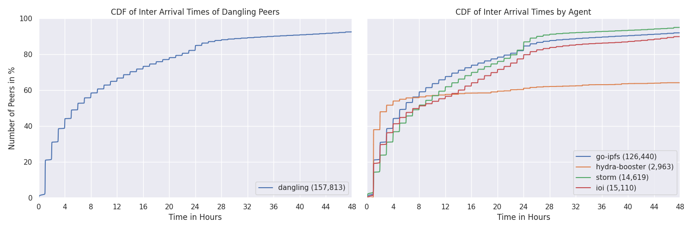

# RFM 2 | Uptime and Churn | Report

* _Status:_ **completed**
* _DRI/Team:_ [`@dennis-tra`](https://github.com/dennis-tra)
* _Effort Needed:_ **HIGH**
* _Prerequisite(s):_ NONE
* _Value:_ **HIGH**
* _Report:_ [`reports/rfm2-uptime-and-churn/README.md`](reports/rfm2-uptime-and-churn/README.md)

## Highlights

* Peer churn is quite high with 50% of new peers leaving after 2h.
* `go-ipfs` v0.9.x peers are constantly the most stable.
* The IPFS network has a very low cloud provider (AWS etc.) dependency.
* The country where most IPFS nodes are located is China followed by the US.
* The country where nodes stay online the longest is the US, followed by Germany.
* Churn rates per agent version can flag potential bugs of new releases.
* We developed [`Nebula`](https://github.com/dennis-tra/nebula-crawler), a DHT crawler and monitoring tool.
* All source code and analysis scripts are available in the [`nebula-crawler` repository](https://github.com/dennis-tra/nebula-crawler). The tool is comprehensively documented and set up so that the below results can be easily reproduced by anyone.

## Table of Contents

- [Highlights](#highlights)
- [Table of Contents](#table-of-contents)
- [Motivation](#motivation)
- [Measurement Methodology](#measurement-methodology)
  - [Identifying DHT server nodes](#identifying-dht-server-nodes)
  - [Track when DHT Server Nodes join and leave the Network](#track-when-dht-server-nodes-join-and-leave-the-network)
- [Measurement Results](#measurement-results)
  - [Node Classifications](#node-classifications)
  - [Node Churn](#node-churn)
  - [Node Inter Arrival Times](#node-inter-arrival-times)
- [Conclusion](#conclusion)
- [References](#references)

## Motivation

A major performance indicator for an unstructured peer-to-peer network is participant churn, meaning how long do peers stay in the network after joining before going offline again. Network-wide parameters, such as those that cover the number of record replication and request concurrency rely on an accurate understanding of this dynamic. The average session length of a peer-to-peer network is a global measure of the network's resiliency and therefore could also reveal (un)intentional misbehaviour of certain peers.

In the past, measurements on network churn have been conducted for networks like BitTorrent or Gnutella [^1] and only one team has briefly looked into churn of the Public IPFS Network [^2]. However, their data is dated by now as it was gathered before the release of DHT client vs. server node distinction in version `go-ipfs 0.5.0` and has coarser granularity than the results gathered through our methodology/crawler (presented next). In the scope of this RFM we seek to identify the participation and contribution of DHT server peers in the Public IPFS Network. More specifically, we want to learn:

* What is the average session length of DHT server nodes in the Public IPFS Network?
* What is their average uptime per day and month (and eventually per year)?

Going forward, we also want to have a dashboard or plots that are produced periodically (e.g., daily or weekly) for the above metrics.

The following sections cover an overview of the measurement tool, methodology and ideas behind it. Then, this document presents measurement results.

## Measurement Methodology

As stated above, we wanted to learn the average session length of DHT server nodes in the Public IPFS Network and track their uptime. To do so, we needed a way to:

1. Identify DHT server nodes in the Public IPFS Network
2. Track when DHT server nodes join and leave the network.

To identify DHT server nodes, we built the [Nebula Crawler](https://raw.githubusercontent.com/dennis-tra/nebula-crawler) that "enumerates" the DHT of the public IPFS network with emphasis on continuous node monitoring to allow for high accuracy session length measurements. We augmented the crawler with highly normalized, RDBMS-backed data persistence that on the one hand yields a low data footprint and on the other hand allows near-arbitrary retrospective analyses.

### Identifying DHT server nodes

There were already several crawlers available that we could use, but did not meet all our criteria. They were outdated ([`wiberlin/ipfs-crawler`](https://github.com/wiberlin/ipfs-crawler)), used a persistence backend unsuitable for complex data analysis ([`adlrocha/go-libp2p-crawler`](https://github.com/adlrocha/go-libp2p-crawler)), or did only provide the core crawling functionality without any additional features ([`libp2p/go-libp2p-kad-dht`](https://github.com/libp2p/go-libp2p-kad-dht/tree/master/crawler)). Nonetheless, the [Nebula Crawler](https://raw.githubusercontent.com/dennis-tra/nebula-crawler) draws a lot of inspiration from all of these projects and wouldn't have been possible without all of them.

To crawl the network Nebula starts by connecting to a set of bootstrap peers and constructing the routing tables (Kademlia k-buckets) of the remote peers based on their PeerIds. Then it builds random PeerIds with common prefix lengths (CPL) that fall in each of the remote peers' buckets, and asks them if they know any peers closer to the ones Nebula just constructed (XOR distance). This will effectively yield a list of all PeerIds that a peer has in its routing table. The process repeats recursively for all found peers until Nebula does not find any new PeerIds. This process is heavily inspired by the basic-crawler in [`libp2p/go-libp2p-kad-dht`](https://github.com/libp2p/go-libp2p-kad-dht/tree/master/crawler) from @aschmahmann and the descriptions in [^2].

Crawling the entire network takes around 5 minutes on commodity hardware with a current network size of around 20,000 peers. During and after each crawl procedure the outcome is recorded into a Postgres database. We call the attempt to crawl a remote peer a `visit`. A visit is recorded when Nebula successfully crawls a remote peer, or fails at any point in the process. A `visit` contains the following information:

* `crawl_id` - During which crawl did we visit this peer
* `visit_started_at` - Timestamp right before dialing the remote peer
* `visit_ended_at` - Timestamp after the remote peer has been successfully dialed or right after Nebula failed along the way
* `dial_duration` - The time it took to dial the peer or until an error occurred
* `connect_duration` - The time it took to connect with the peer or until an error occurred
* `crawl_duration` - The time it took to crawl the peer (requesting routing table entries) or until an error occurred
* `type` - The type of this visit (`crawl` or `monitor`)
* `agent_version` - Which agent version did this peer have
* `peer_multi_hash` - The peer ID multihash
* `protocols` - Which protocols does this peer support
* `multi_addresses` - All multi addresses for this peer
* `error_message` - The error; if one occurred
* `created_at` - Database timestamp when this entry was recorded

All this information is saved in a normalized way into the database to allow for comprehensive retrospective analyses.

### Track when DHT Server Nodes join and leave the Network

After we have identified all DHT server nodes, we want to track their uptime. To do so, we implemented a `monitoring` mode into Nebula that periodically _`visits`_ all  peers that were identified during one of the crawls and were online at that time. The `visits` are recorded in the same way as described above with a `type` of `monitor`. Further, Nebula updates a `session` object in the database that tracks the uptime of individual peers. A `session` object gets created when Nebula finds a new online peer in the DHT during a crawl and contains the following information:

* `peer_multi_hash` - The peer ID multihash
* `first_successful_dial` - When was the peer successfully dialed/crawled the first time
* `last_successful_dial` - When was the most recent successful dial/crawl to/of the peer
* `next_dial_attempt` - When should we try to dial the peer again
* `first_failed_dial` - When did we notice that this peer is not reachable
* `min_duration` - The duration that this peer was online due to multiple subsequent successful dials
* `max_duration` - The duration that from the first successful dial to the point were it was unreachable
* `successful_dials` - How many subsequent successful dials could we track
* `created_at` - Database timestamp when this entry was recorded

Nebula in monitoring mode polls every 10 seconds all sessions from the database that are due to be dialed in the next 10 seconds (based on the `next_dial_attempt` timestamp). It attempts to dial all peers using previously saved multi-addresses and updates their session instances accordingly if they're dialable or not. Note, that the monitoring mode only **dials** the peers to see if they are still online. It does not **crawl** them (request their routing table entries). The `next_dial_attempt` timestamp is calculated based on the uptime that Nebula has observed for that given peer. If the peer is up for a long time we assume that it stays up and thus decreases the dial frequency.

The `session` information is essential for the objectives mentioned above. We can track peer uptime with tunable accuracy. For example, we can increase the crawl frequency (currently every 30 minutes), and also increase the monitoring visit frequency to meet our needs.

## Measurement Results

Protocol Labs runs an instance of the Nebula Crawler in their infrastructure. This instance is augmented with a report script that periodically produces graphics and statistics about the IPFS DHT network. You can find a list of all reports at [https://stats.ipfs.network](https://stats.ipfs.network). The analysis code that produced those graphs is also publicly available and can be found [here](https://github.com/dennis-tra/nebula-crawler#analysis).

For completeness, we present a selected number of graphs from the recent results (2022-05-05) in this report as well. The data was collected from a Nebula instance running in Protocol Labs infrastructure on AWS. The graphs below show information from data aggregated over one week (`2022-04-28` to `2022-05-05`). Note, that the reports at [https://stats.ipfs.network](https://stats.ipfs.network) contain many more graphs, that cover e.g., agent version analysis, geo location distribution, or cloud provider coverage.

### Node Classifications

We define the following node classifications:

* `offline` - A peer that was never seen online during the measurement period (always offline) but found in the DHT
* `dangling` - A peer that was seen going offline and online multiple times during the measurement period
* `oneoff` - A peer that was seen coming online and then going offline **only once** during the measurement period
* `online` - A peer that was not seen offline at all during the measurement period (always online)
* `left` - A peer that was online at the beginning of the measurement period, did go offline and didn't come back online
* `entered` - A peer that was offline at the beginning of the measurement period but appeared online later and didn't go offline since then

### Node Churn

The above graphs show the CDF of the churn of DHT server nodes in the public IPFS network over the course of one week. The first graph shows the percentage of online peers over the number of hours they actually were online. There we can see that 80% of all peers that join the network stay online for 8 hours **or less**. Similarly, 50% of all peers stay only online for ~2 hours or less. The remaining two graphs show this information by different agent versions. There we can see that `ioi` peers are the most unstable while the `go-ipfs 0.9.0` peers are the most stable among the `go-ipfs` peers.

### Node Inter Arrival Times

The above graphs show the times between two session-start events of **the same peer**. Therefore, the CDFs only cover "dangling" peers (see above). However, this is not exactly the "inter-arrival" time but rather the time between the **start** of one session and the **start** of another session of the same peer. The inter-arrival time would track the time between the **end** of one session and the **start** of the next session of the same peer.

## Conclusion

This RFM had short term as well as long term benefits. On the one hand, it answered the aforementioned measurement questions and on the other hand it initiated the development of valuable measurement tooling that can be used for future research. By diving into the data, many more questions arose that led to other RFMs like [RFM5](https://github.com/protocol/network-measurements/blob/master/RFMs.md#_fld2sr9emn3m) or [RFM6](https://github.com/protocol/network-measurements/blob/master/RFMs.md#_1xjatm7vfujn). Both of which can be tackled with the software that was developed in the scope of this RFM2.

The measurement results themselves reveal a couple of interesting insights. For one, the churn rate in the IPFS network is quite high and does not differ much from previous peer-to-peer networks from over 20 years ago. Translating this finding in an evaluation for network wide parameters like record redundancy, or query concurrency is part of our future work.

Secondly, nodes that IPFS release v0.9.x are constantly the most stable nodes in terms of uptime, with nodes that run later releases being less stable and v0.8.x being the least stable.

Thirdly, the country where most IPFS nodes are located is by far China followed by the US, but the country where nodes stay online the longest is the US, followed by Germany.

Finally, the tool identifies and reports nodes that rotate their PeerIDs, which can be very useful to spot temporary malfunction, as has happened recently with [hydra-booster](https://github.com/libp2p/hydra-booster) peers (and was patched immediately).

## References

[^1] Stutzbach and Rejaie, 2006, Understanding Churn in Peer-to-Peer Networks

[^2] Henningsen et al., 2020, Mapping the Interplanetary Filesystem
