# RFM 7 | Distribution of DHT lookup times and Breakdown of Content Routing Latency

* _Status:_ **in progress**
* _DRI/Team:_ [`@gitaaron`](https://github.com/gitaaron)
* _Effort Needed:_
* _Prerequisite(s):_ NONE
* _Value:_ **HIGH**

## Table of Contents

- [Motivation](#motivation)
- [Methodology](#methodology)
  - [Experimental Runs](#experimental-runs)
  - [Experimental Controls](#experimental-controls)
  - [Analysis](#analysis)
  - [Problems with Results and Workarounds](#problems-with-results-and-workarounds)
- [Results](#results)
- [Conclusion](#conclusion)

## Motivation

Live IPFS network performance is hard to measure due to the unpredictable nature of actors in the network.

To get a better understanding of how the live network is performing under different circumstances, a set of probes in geographically distributed AWS regions running a forked version of Kubo (0.16.0-dev) with additional logs for benchmarking purposes were invoked leveraging the live network.

The following environmental variants were introduced to help improve confidence in the measurements as well as assist in understanding where improvements might effect network performance the most and for which scenarios.

  * regional

  * file size (0.05, 0.5, 5, 50 MB)

  * number of publishers (1 or 5)

  * delays between publication and retrieval

  * agent uptime

Protocol designers and client developers might leverage this information to help understand which phases in the content retrieval process might benefit the most for certain scenarios as well as how performance is effected at different snapshots in time.

## Methodology

### Experimental Runs

Each experiment has two different types of players as agents.

  1.  Publishers sharing (via `ipfs add`) randomly generated content to the network

  2.  Retrievers performing an `ipfs cat` request to download the prior shared content

Each run also involved a seperate node acting as controller instructing the publishers and retrievers accordingly.

The following is a sequence diagram illustrating how a typical run involving one controller and three agents might proceed.

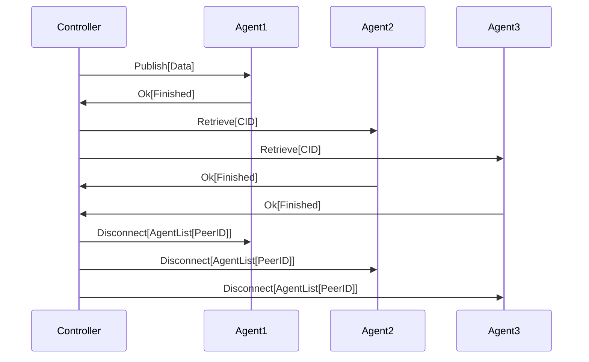

In this case, 'Agent1' would be considered the 'main player' in the run where they are the only agent performing the 'PUBLISH' action and the other agents are simply actors without any distinction acting as the other player type ('RETRIEVER').

This distinction between 'main players' was made to support [multi provider retrievals](#multi-provider-retrievals).

### Experimental Controls

Various controls were introduced to see if any trends in regions, file size, number of publishers, publish age and agent uptime might occur.

The following describes how each of these controls were introduced.

#### Regions

Following on earlier work, probes were geographically distributed across different AWS regions and runs with a main player acting as both 'PUBLISHER' and 'RETRIEVER' were invoked in a round robin fashion.

This means that approximately the same number of runs with agents acting as 'PUBLISHERS' and 'RETRIEVERS' should have occured for each region.

In practice, there were diverging results probably due to agents being restarted in the middle of runs or because retrieval events were discarded in certain regions more often than others.

The regions included were:

| Region Key       | Closest Approximate City   |
|------------------|----------------------------|
| `me_south_1`     | Bahrain                    |
| `ap_southeast_2` | Sydney                     |
| `af_south_1`     | Cape Town                  |
| `us_west_1`      | N. California / Sacramento |
| `eu_central_1`   | Frankfurt                  |
| `sa_east_1`      | Sao Paulo                  |

#### Multi Provider Retrievals

In previous work, runs were only performed where there was a main player acting as a "PUBLISHER" and all other agents were acting as a "RETRIEVER" for each run.

In this study, runs were also performed where a main player acted as "RETRIEVER" and all other agents acted as a "PUBLISHER".

This enabled results to be analysed between single and multi provider retrievals and also enabled the study of "first provider nearest" effects.

#### First Provider Nearest

Multi provider retrievals were further classified as either "first provider nearest (fpn)" or "non first provider nearest (non-fpn)".

The "first provider" is the first bitswap content provider that the agent attempts to connect with in order to download the randomly generated content.

"Nearest" is defined as the closest geographic neighbor to the agent performing the retrieval (as approximated [here](https://github.com/gitaaron/ipfs-lookup-measurement/blob/main/analysis/models/model_region.py)) when compared with all other provider peers that the retriever found and is known to be an agent.

The rationale for comparing with other provider peers instead of the entire list of agents was to count for the fact that some agents may fail to publish the content.

Retrievals that included providers that were unknown as agents (either due to an error in the experiment or possibly given an altruistic provider in the network) were discarded.

#### File Size

Runs with a main player type of both `PUBLISHER` and `RETRIEVER` were invoked for different file sizes that differed by an order of magnitude of power 10 (0.05MB, 0.5MB, 5.0MB and 50.0MB).

#### Publish Age

To gain a diverse set of publish age times, the experimental run was split up in to two different parts.

The first part involved the publisher(s) sharing content to the network.

The second part involved retrievers subsequently downloading the content from the first part.

Since only a single run should be performed at any given time, the second part was delayed by allowing other runs to occur first.

As seen in the figure below, the results used with publish age had an immediate spike followed by an uneven distribution between 2000-12000 seconds.

This is due to the requirements that only one run should be happening at any given time.  More control over the distribution of publish age is possible if delays were run in isolation although it would take longer to obtain an adequate sample size over time.

#### Agent Uptime

To acquire a diverse set of results for agent uptime, a crontab script was executed to 'restart agents' every 6 hours.

Restarting each agent involved instructing terraform to terminate each AWS agent instance and recreate / reinstall it from scratch.

### Analysis

As in prior work, the Kubo logs (with patches for more logging) were parsed for events related to benchmarking.

The following provides more details on phase calculations for [retrieval](https://github.com/gitaaron/ipfs-lookup-measurement/blob/main/analysis/retrieval-events.md) and [publication](https://github.com/gitaaron/ipfs-lookup-measurement/blob/main/analysis/publish-events.md) events.

Each run contains a unique CID so that publish and retrieval events could be combined to generate a publish age metric (based on time from first publish finish to time of the start of retrieval).

In addition to the Kubo logs, agent logs were also parsed for getting agent health, uptime and retrieval end times.

#### How Performance was Measured

The analysis used two different metrics to evaluate performance: "average duration" and "percent slow".

"Average duration" was used to determine how fast retrievals generally occured and "percent slow" was used to determine the likelihood that a problem might occur under various conditions.

In order to normalize the metrics over different file sizes, "average duration" was plotted for a specific file size and "percent slow" was calculated as the number of retrievals that took more than one standard deviation greater than the mean for each file size.

The following tables include what would be considered "slow" for each phase and file size.

**File Size: 52429 B**

| Phase                 | Mean (sec.) | Standard Deviation (sec.) | Slow (> sec.) |
|-----------------------|-------------|---------------------------|---------------|
| TOTAL                 | 2.661       | 1.318                     | 3.979         |
| INITIATED             | 1.009       | 0.073                     | 1.082         |
| GETTING_CLOSEST_PEERS | 0.62        | 0.641                     | 1.261         |
| DIALING               | 0.551       | 0.479                     | 1.03          |
| FETCHING              | 0.481       | 0.625                     | 1.106         |

**File Size: 524290 B**

| Phase                 | Mean (sec.) | Standard Deviation (sec.) | Slow (> sec.) |
|-----------------------|-------------|---------------------------|---------------|
| TOTAL                 | 4.032       | 2.828                     | 6.86          |
| INITIATED             | 1.01        | 0.064                     | 1.074         |
| GETTING CLOSEST PEERS | 0.657       | 0.683                     | 1.34          |
| DIALING               | 0.65        | 0.659                     | 1.309         |
| FETCHING              | 1.714       | 2.154                     | 3.868         |

**File Size: 5242900 B**

| Phase                 | Mean (sec.) | Standard Deviation (sec.) | Slow (> sec.) |
|-----------------------|-------------|---------------------------|---------------|
| TOTAL                 | 7.107       | 4.643                     | 11.75         |
| INITIATED             | 1.003       | 0.027                     | 1.03          |
| GETTING CLOSEST PEERS | 0.577       | 0.46                      | 1.037         |
| DIALING               | 0.584       | 0.476                     | 1.06          |
| FETCHING              | 4.942       | 4.502                     | 9.444         |

**File Size: 52429000 B**

| Phase                 | Mean (sec.) | Standard Deviation (sec.) | Slow (> sec.) |
|-----------------------|-------------|---------------------------|---------------|
| TOTAL                 | 20.072      | 5.981                     | 26.053        |
| INITIATED             | 1.001       | 0.002                     | 1.003         |
| GETTING CLOSEST PEERS | 0.556       | 0.361                     | 0.917         |
| DIALING               | 0.499       | 0.312                     | 0.811         |
| FETCHING              | 18.015      | 5.985                     | 24            |

### Problems with Results and Workarounds

Unfortunately, due to the nature of running the experiment under many different environmental variants and other problems with the setup, small sample sizes and other problems effecting the utility of measurements occurred for certain scenarios.

#### File Size

While the experiment was running, it was discovered that the timeout was too low for the largest file size (50.0 MB with 20 sec. timeout) for the `CAT` request and most retrievals (average total duration of 20.072 sec.) were discarded.

The error was fixed (by increasing the timeout to 35 sec.) during the run, however, there are two problems with the largest file size.

  1.  The sample size is too low (as seen in the CDFs)

  2.  Performance metrics are skewed by the erroneous timeout (eg/ the average duration for the largest file size was ~17-18 sec. before the correction).

For this reason, the largest file size was mostly ignored except when used to corrobate trends from the three smaller sizes.

#### Many Providers

Naturally, since there is only one 'RETRIEVER' for the main player 'PUBLISHER' runs, there were fewer retrievals that had many providers. (25906 single vs 3676 multi)

The problem was exascerbated while looking at first provider nearest results as some results were discarded because they contained unknown agents in their provider list.

For this reason, it's hard to draw any solid conclusions about relation between first provider nearest regions and performance since likelihood should be ignored for the 'sa-east-1' and 'af-south-1' regions.

Also, the 'nearest' metric tells us about how the overall network is behaving geographically, however, it does not give the best picture of how the DHT is performing in the sense of providing the most advantageous content provider.

To get a better understanding of this, 'nearest' should be calculated based on RTT or some other metric for quality of network connections between each agent.

Lastly, an assumption is made that the first provider is also generally the content provider.

This is most likely the case, however, the effects of first provider might be minimized if the second provider is found quickly after the first and if the client attempts to download the content from both.

#### Fetch Phase Estimation

As seen in [retrieval events](https://github.com/gitaaron/ipfs-lookup-measurement/blob/main/analysis/retrieval-events.md), the fetch phase was calculated from when the retriever connected to a provider to when the retrieval (`CAT` request) finished.

Thus, the `FETCHING` phase calculation is also probably including other steps unrelated to the content being retrieved over the network via bitswap (in particular, the 'content verification' step).

Chances are these steps can be considered negligible compared to the time it takes to fetch the content over the network, however, file size duration trends can only be concluded as directional (increasing, decreasing or staying the same).

However, since the time it takes to perform the other non network related steps should generally be constant, the percent slow calculations can still be used.

Further, file sizes can still be used to see if other trends occur more dramatically for certain environmental variables (eg/ how does `FETCH` perform for larger file sizes when comparing single and multi provider retrievals)

## Results

The following results are based on a specific snapshot from `29-10-2022 17:34` to `09-11-2022 21:02`.

Here is the CID for a complete list of figures generated: ipfs://bafybeibbp4nchhrt5nkzoajzgzkbeummprgf52lu75qinim7dfj37m5r7a/

You can open the link above in an IPFS compatible browser to see each graph rendered in a single page.

1.  Certain regions have a high likelihood that their first provider is also the closest geographically.

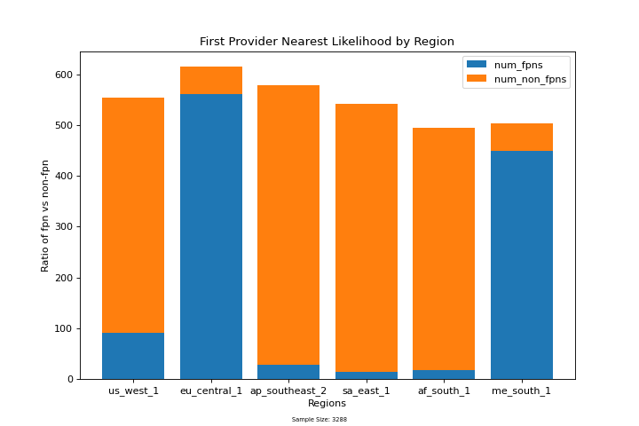

2.  There is an uneven distribution of first providers for all regions implying the DHT response is favoring certain more advantageous providers over others.

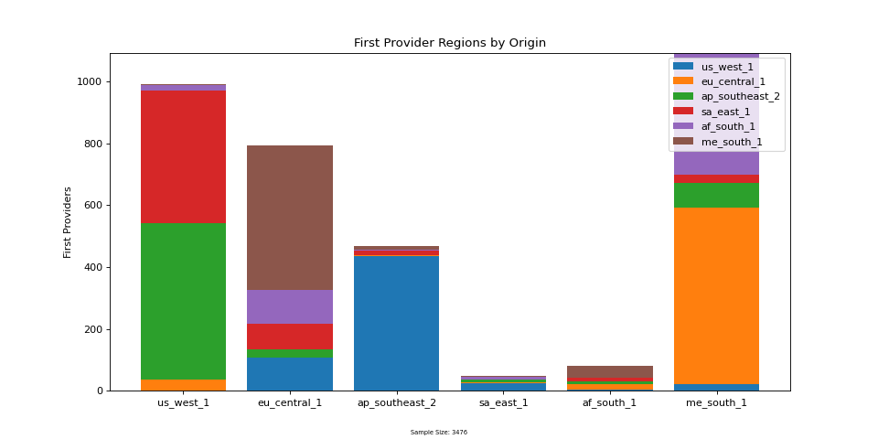

3.  First provider nearest(FPN) retrievals generally also have a better performance for the `GETTING_CLOSEST_PEERS`, `DIALING` and `FETCHING` phases.

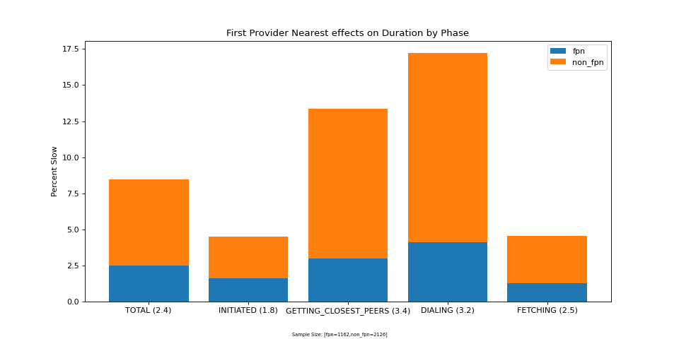

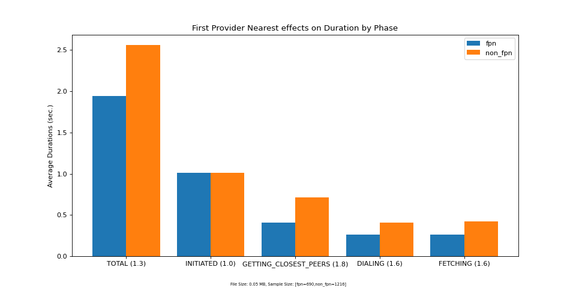

4.  Regions that more consistently have FPNs are not necessarily the best performing.

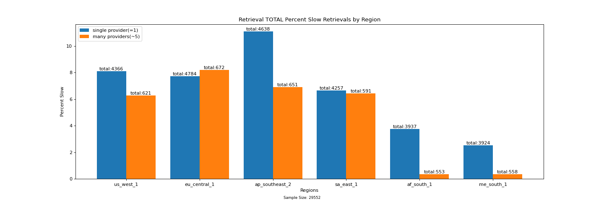

5.  Multi provider retrievals tend to perform the same as single provider retrievals during the `GETTING_CLOSEST_PEERS` phase and they tend to perform worse for the `DIALING` phase.

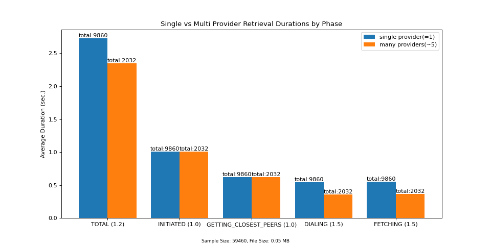

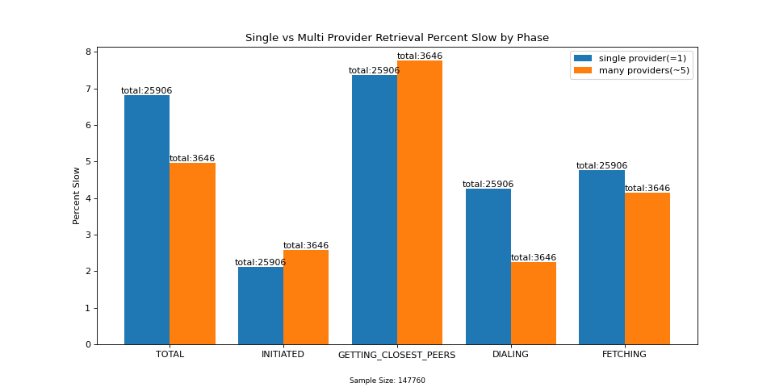

6.  Speeds do increase for multi provider `FETCH` but not as much as one would expect if the content were downloaded in parallel from equally fast connections between the retriever and each publisher.

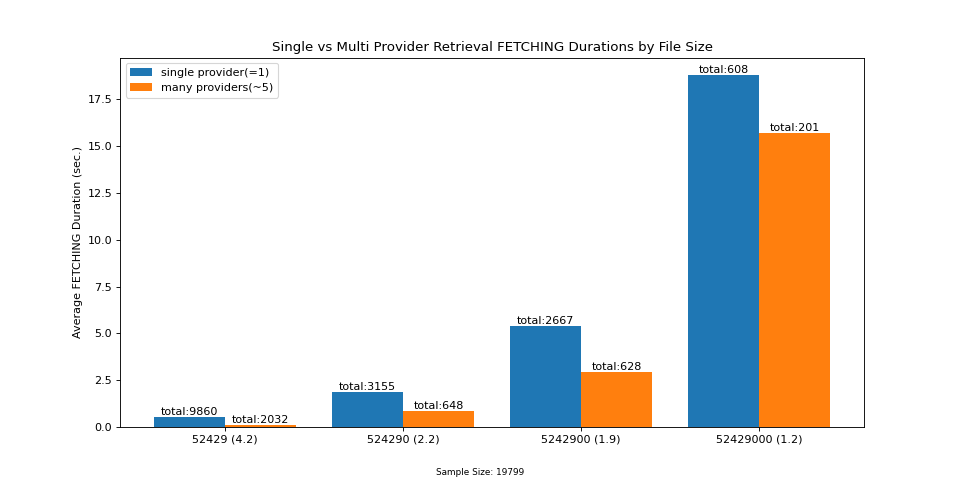

7.  File size did not effect performance in the `GETTING_CLOSEST_PEERS` phase between 0.05 and 0.5 Mb.  However, there was a noteworthy decrease in success rate between 0.5 and 5.0 MB size files.

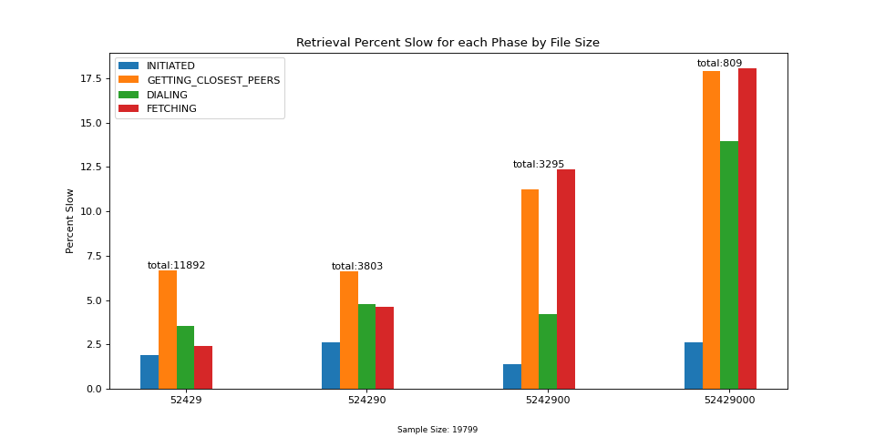

8.  There are most likely several different causes for poor performance and some are probably local to the agent that is doing the lookup while others are not.

  a) Performance seems to degrade with agent uptime.

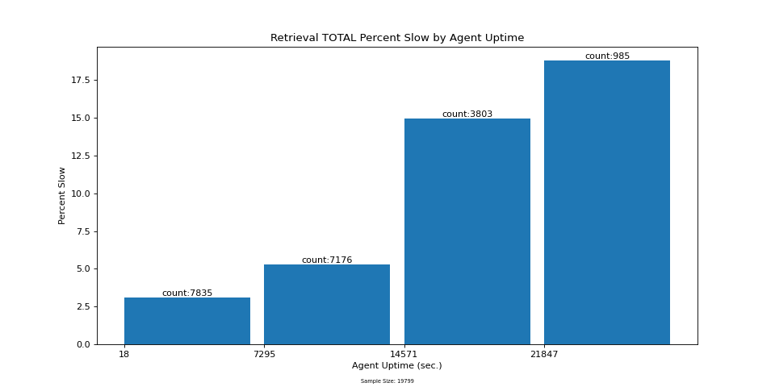

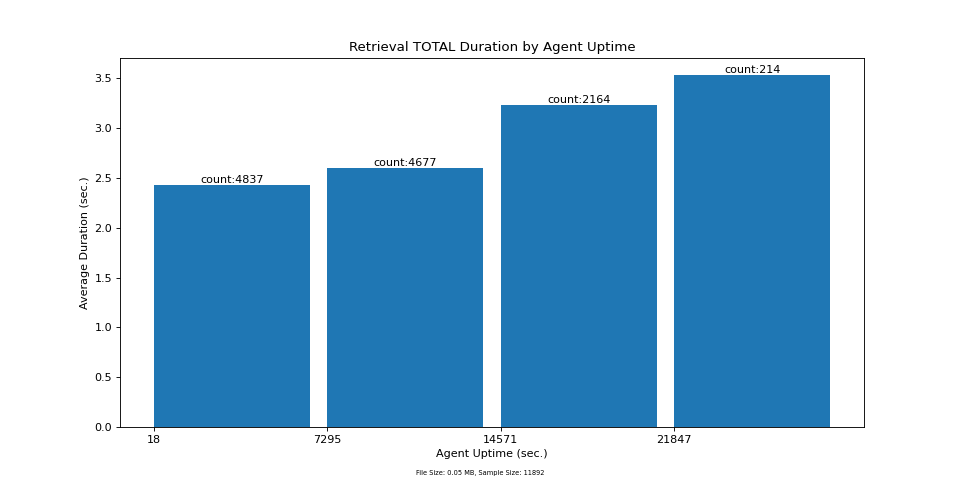

  b) Performance seems to degrade with publish age.

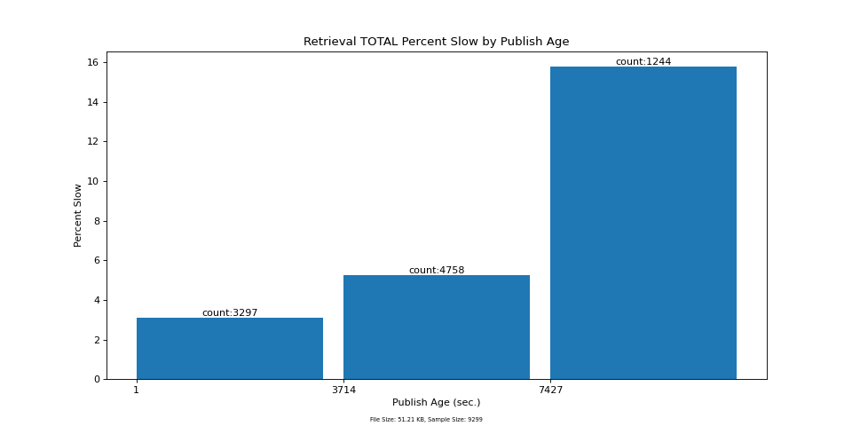

  c) There is no strong correlation in durations between the `GETTING_CLOSEST_PEERS`, `DIALING` and `FETCHING` phases (which would be the case if factors effecting performance were only local)

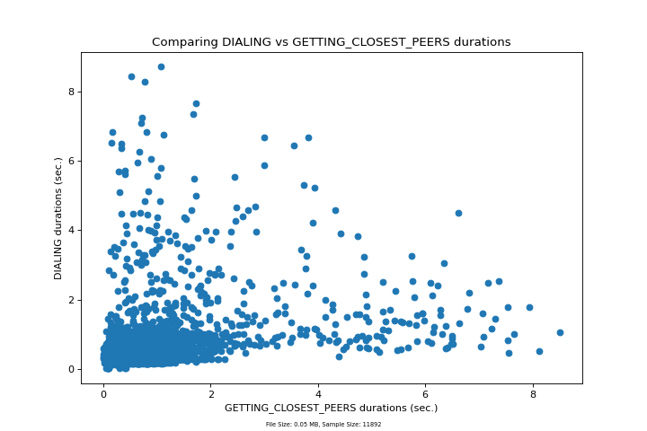

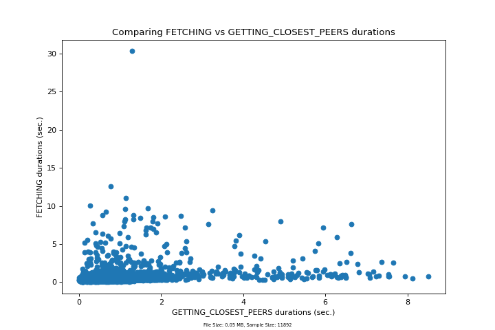

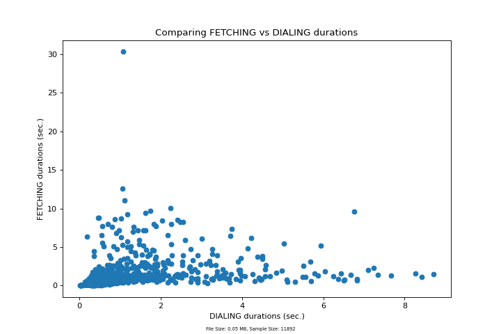

## Conclusion

Although these measurements were performed against the live IPFS network, an endless amount of permutations can be manufactured and drilled down into that might reflect real world scenarios.

In combination with other real world measurements, these types of metrics might also be utilized for more informed real time decisions behind fine tuning of various knobs or hard constants (eg/ various phase timeouts based on file size or prefering certain lookup strategies based on topology).

As a result of this, their utility would probably increase if provided in conjunction with other real world stats (eg/ average uptime of mobile clients, a frequency distribution of file size or number of providers / retrieval).

Nonetheless, there are still many simple improvements that could be included to make the results of this study more useful and accurate.

  * filter out performance impacts local to the agent (will reduce noise on other results and should be lower hanging fruit)

    * investigate if there is a correlation between agent cpu/memory usage and agent uptime

    * profile memory usage for both the IPFS and agent tasks

  * investigate discarded first provider nearest results because the provider was not in the other agents list

  * use round trip time between peers instead of geographic proximity as a definition for 'nearest' to see how likely content is routed to the most ideal provider from a network perspective

  * modify the experiment to run different scenarios (file size, publish delay, multi provider) to gain more control over the sample size and distribution for different evironmental variables (especially publish age)

  * make `CAT` timeout based on file size (this should increase the rate of runs performed)

  * assuming that the "first provider" is also generally the actual "content provider" may not necessarily be the case

    * introduce finer grained tracking of bitswap block messages to track when each provider is found and where content is actually fetched from

  * include another method to 'restart agents' by restarting the Kubo daemon instead of reprovisioning the entire instance from scratch

    * this might help determine if any negative consequences from cacheing have occured and could also result in more frequent restarts (since it takes a farily long time to provision each instance)
